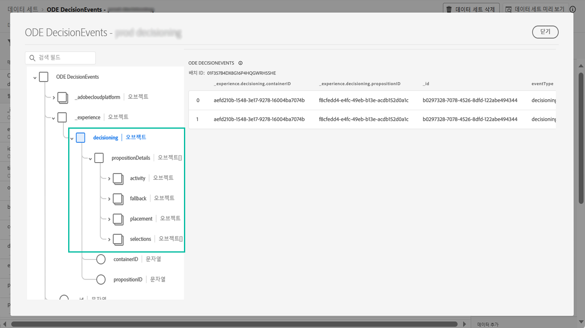

# 의사 결정 관리 이벤트 주요 정보 {#events-key-information}

결정이 내려질 때 전송되는 각 이벤트에는 분석 및 보고 용도로 활용할 수 있는 4개의 키 데이터 포인트가 포함되어 있습니다.

* **[!UICONTROL Fallback]**:개인화된 오퍼를 선택하지 않은 경우, 대체 오퍼의 이름 및 ID
* **[!UICONTROL Placement]**: 오퍼를 게재하는 데 사용되는 배치의 이름, ID 및 채널,
* **[!UICONTROL Selections]**: 프로필에 대해 선택한 오퍼의 이름 및 ID,
* **[!UICONTROL Activity]**: 결정 이름 및 ID입니다.

또한 **[!UICONTROL identityMap]** 및 **[!UICONTROL Timestamp]** 필드를 활용하여 프로필의 정보와 오퍼가 게재된 시간을 검색할 수도 있습니다.

각 결정과 함께 전송되는 모든 XDM 필드에 대한 자세한 내용은 [이 섹션](xdm-fields.md)을 참조하십시오.
