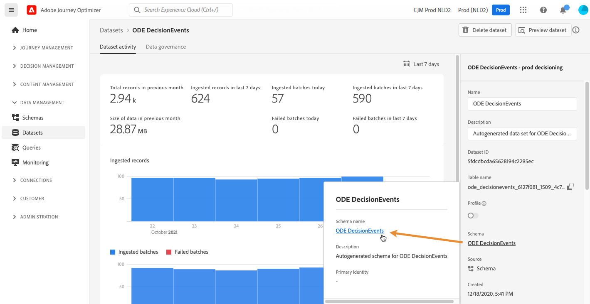

# 이벤트 XDM 필드 액세스 {#decisioningevents-xdm-schema}

>[!TIP]
>
>[!DNL Adobe Journey Optimizer]의 새로운 의사 결정 기능인 [결정]을 이제 코드 기반 경험 및 이메일 채널을 통해 사용할 수 있습니다. [자세히 알아보기](../../experience-decisioning/gs-experience-decisioning.md)

의사 결정 관리 이벤트가 포함된 데이터 세트에서 직접 DecisioningEvents XDM 스키마에 액세스할 수 있습니다.

스키마에는 의사 결정 관리에서 Adobe Experience Platform으로 정보를 보내는 데 필요한 모든 필드가 포함되어 있습니다.

특정 필드에 대한 자세한 내용을 보려면 해당 필드를 선택하여 필드 속성이 있는 정보 창을 표시합니다.

XDM 스키마 및 필드를 사용하여 작업하는 방법에 대한 자세한 내용은 Experience 데이터 모델 설명서를 참조하십시오.

* [XDM 시스템 개요](https://experienceleague.adobe.com/docs/experience-platform/xdm/home.html?lang=ko-KR)
* [XDM 리소스 살펴보기](https://experienceleague.adobe.com/docs/experience-platform/xdm/ui/explore.html?lang=ko)
