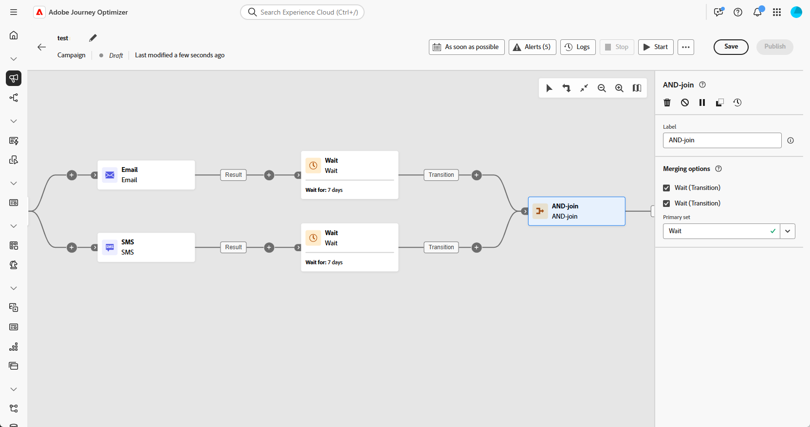

# AND-결합 {#join}

>[!CONTEXTUALHELP]
>id="ajo_orchestration_and-join"
>title="AND-결합 활동"
>abstract="**AND-결합** 활동을 사용하면 오케스트레이션된 캠페인의 여러 실행 분기를 동기화할 수 있습니다. 이전 활동이 모두 완료되면 트리거됩니다. 이로써 오케스트레이션된 캠페인을 계속 실행하기 전에 특정 활동이 완료되었는지 확인할 수 있습니다."

+++ 목차

| 오케스트레이션된 캠페인 시작 | 첫 오케스트레이션된 캠페인 시작 | 데이터베이스 쿼리 | 오케스트레이션된 캠페인 활동 |
|---|---|---|---|
| [오케스트레이션된 캠페인 시작](../gs-orchestrated-campaigns.md)  [구성 단계](../configuration-steps.md)  [오케스트레이션된 캠페인 만들기에 대한 주요 단계](../gs-campaign-creation.md) | [오케스트레이션된 캠페인 만들기](../create-orchestrated-campaign.md)  [활동 오케스트레이션](../orchestrate-activities.md)  [오케스트레이션된 캠페인으로 메시지 보내기](../send-messages.md)  [캠페인 시작 및 모니터링](../start-monitor-campaigns.md)  [보고](../reporting-campaigns.md) | [쿼리 Modeler 작업](../orchestrated-rule-builder.md)  [첫 번째 쿼리 작성](../build-query.md)  [표현식 편집](../edit-expressions.md) | [활동 시작](about-activities.md)  활동: [및 가입](and-join.md) - [대상 작성](build-audience.md) - [차원 변경](change-dimension.md) - [결합](combine.md) - [중복 제거](deduplication.md) - [데이터 보강](enrichment.md) - [포크](fork.md) - [조정](reconciliation.md) - [분할](split.md) - [대기](wait.md) |

{style="table-layout:fixed"}

+++

 

**AND-결합** 활동은 **흐름 제어** 활동입니다. 이를 통해 오케스트레이션된 캠페인의 여러 실행 분기를 동기화할 수 있습니다.

이 활동은 모든 인바운드 전환이 활성화되었을 때, 즉 앞선 활동이 모두 완료된 다음에만 아웃바운드 전환을 트리거합니다. 이렇게 하면 오케스트레이션된 캠페인을 계속 실행하기 전에 특정 활동이 완료되었는지 확인할 수 있습니다.

## AND-결합 활동 구성{#and-join-configuration}

>[!CONTEXTUALHELP]
>id="ajo_orchestration_and-join_merging"
>title="병합 옵션"
>abstract="참여하고자 하는 활동을 선택합니다. **기본 세트** 드롭다운에서 유지하고자 하는 인바운드 전환 모집단을 선택합니다."

**AND-결합** 활동을 구성하려면 다음 단계를 따르십시오.

1. 채널과 같은 여러 활동을 추가하여 두 개 이상의 서로 다른 실행 분기를 구성합니다.
1. 임의의 분기에 **AND-결합** 활동을 추가합니다.
1. **병합 옵션** 섹션에서 참여하려는 모든 이전 활동을 선택하십시오.
1. **기본 세트** 드롭다운에서 유지하고자 하는 인바운드 전환 모집단을 선택합니다. 아웃바운드 전환에는 인바운드 전환 모집단 중 하나만 포함될 수 있습니다.

## 예{#and-join-example}

다음 예는 이메일 및 SMS 게재를 통해 오케스트레이션된 두 개의 캠페인 분기를 보여줍니다. 두 인바운드 전환이 모두 활성화되면 AND-결합이 트리거됩니다. 푸시 알림은 두 게재가 모두 완료된 후에만 전송됩니다.

{zoomable="yes"}
