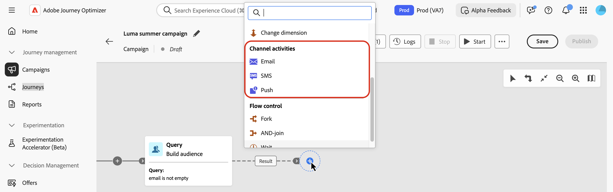
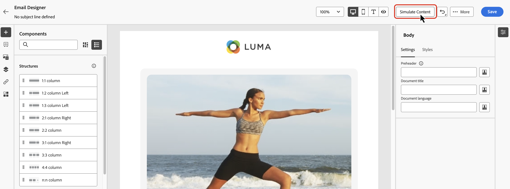
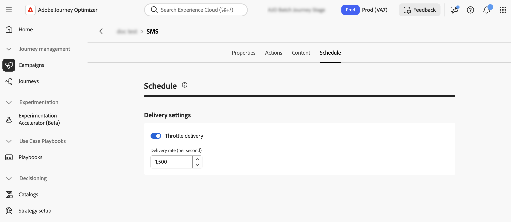

# 채널 활동 {#channel}

>[!CONTEXTUALHELP]
>id="ajo_orchestration_email"
>title="이메일 활동"
>abstract="이메일 활동을 사용하면 오케스트레이션된 캠페인 내에서 일회성 이메일과 반복 이메일을 전송할 수 있습니다. 이는 동일한 오케스트레이션된 캠페인 내에서 계산된 대상으로 이메일을 전송하는 프로세스를 자동화하는 역할을 합니다. 채널 활동을 다단계 캠페인 캔버스에 결합하여 고객 행동 및 데이터에 따라 액션을 트리거할 수 있는 크로스 채널 캠페인을 만들 수 있습니다."

>[!CONTEXTUALHELP]
>id="ajo_orchestration_sms"
>title="SMS 활동"
>abstract="SMS 활동을 사용하면 오케스트레이션된 캠페인 내에서 일회성 SMS와 반복 SMS를 모두 전송할 수 있습니다. 이는 동일한 오케스트레이션된 캠페인 내에서 계산된 대상으로 SMS를 전송하는 프로세스를 자동화하는 역할을 합니다. 채널 활동을 다단계 캠페인 캔버스에 결합하여 고객 행동 및 데이터에 따라 액션을 트리거할 수 있는 크로스 채널 캠페인을 만들 수 있습니다."

>[!CONTEXTUALHELP]
>id="ajo_orchestration_push"
>title="푸시 활동"
>abstract="푸시 활동을 사용하면 오케스트레이션된 캠페인의 일부로 푸시 알림을 전송할 수 있습니다. 일회성 메시지와 반복 오케스트레이션된 캠페인 모두를 게재할 수 있으며, 동일한 오케스트레이션된 캠페인 내에서 사전 정의된 대상으로 푸시 알림 전송 프로세스를 자동화합니다. 채널 활동을 캠페인 캔버스에 결합하여 고객 행동 및 데이터에 따라 액션을 트리거할 수 있는 크로스 채널 캠페인을 만들 수 있습니다."

>[!CONTEXTUALHELP]
>id="ajo_orchestration_target"
>title="Target"
>abstract="Target용 플레이스홀더 섹션"

<!--
UNUSED IDs in BJ

>[!CONTEXTUALHELP]
>id="ajo_orchestration_push_ios"
>title="Push iOS activity"
>abstract="The Push iOS activity lets you send iOS Push notifications as part of your Orchestrated campaign. It enables the delivery of both one-time and recurring Orchestrated campaigns, automating the sending of iOS Push notifications to a predefined target within the same workflow. You can combine channel activities into the campaign canvas to create cross-channel campaigns that can trigger actions based on customer behavior and data."

>[!CONTEXTUALHELP]
>id="ajo_orchestration_push_android"
>title="Push Android activity"
>abstract="The Push Android activity lets you send Android Push notifications as part of your Orchestrated campaign. It enables the delivery of both one-time and recurring messages, automating the sending of Android Push notifications to a predefined target within the same Orchestrated campaign. You can combine channel activities into the Orchestrated campaign canvas to create cross-channel campaigns that can trigger actions based on customer behavior and data."
-->

>[!CONTEXTUALHELP]
>id="ajo_orchestration_directmail"
>title="다이렉트 메일 활동"
>abstract="다이렉트 메일 활동은 오케스트레이션된 캠페인 내에서 다이렉트 메일 전송 과정을 원활하게 하며 일회성 메시지와 반복 메시지를 모두 전송할 수 있습니다. 이는 다이렉트 메일 제공업체에 필요한 추출 파일 생성 프로세스를 자동화하는 역할을 합니다. 채널 활동을 오케스트레이션된 캠페인 캔버스에 결합하여 고객 행동 및 데이터에 따라 액션을 트리거할 수 있는 크로스 채널 캠페인을 만들 수 있습니다."

[!DNL Adobe Journey Optimizer]을(를) 사용하면 마케팅 및 트랜잭션 메시지 모두에 대해 채널 간(이메일, SMS, 푸시 알림 및 DM) 캠페인을 자동화하고 실행할 수 있습니다. 이러한 채널 활동을 캠페인 캔버스에 결합하여 크로스채널 오케스트레이션된 캠페인을 만들 수 있습니다. 이러한 캠페인은 고객 행동 및 데이터를 기반으로 작업을 트리거할 수 있습니다.

예:

* 이메일, SMS, 푸시 및 DM을 통해 환영 시리즈를 보냅니다.
* 구매 후에 후속 이메일을 전달합니다.
* SMS를 통해 개인화된 생일 인사를 보냅니다.

채널 활동을 사용하여 여러 터치포인트에서 고객을 참여시키고 전환을 유도하는 포괄적인 맞춤형 캠페인을 만들 수 있습니다.

>[!CAUTION]
>
>오케스트레이션된 캠페인에서는 SMS, 푸시, 이메일 및 DM 채널만 지원됩니다.

## 채널 활동 추가 및 속성 정의 {#add}

>[!CONTEXTUALHELP]
>id="ajo_orchestration_category"
>title="카테고리"
>abstract="이 채널 활동에 대해 마케팅 또는 트랜잭션을 선택합니다. 마케팅 메시지는 마케팅 채널 구성을 사용하고 표준 비즈니스 규칙을 따릅니다. 트랜잭션 메시지는 종종 개인의 액션(예: 암호 재설정 또는 구매 확정)에 의해 트리거되는 작동 중인 커뮤니케이션 또는 중단이나 취소와 같이 시간에 민감한 알림을 위한 것입니다. 이 메시지는 트랜잭션 채널 구성을 사용하고, 비즈니스 규칙은 우회하며, 옵트인이 필요하지 않습니다."

>[!PREREQUISITES]
>
>채널 활동을 추가하기 전에 [대상 작성](build-audience.md) 또는 [대상 읽기](read-audience.md) 활동을 사용하여 대상 대상을 정의하십시오.

1. 캔버스에 채널 활동을 추가합니다. 사용 가능한 채널 활동은 **[!UICONTROL 이메일]**, **[!UICONTROL SMS]**, **[!UICONTROL 푸시]** 및 **[!UICONTROL 다이렉트 메일]**&#x200B;입니다.

   

1. 오른쪽 레일에서 **[!UICONTROL 카테고리]** 필드를 사용하여 이 메시지에 대해 **[!UICONTROL 마케팅]** 또는 **[!UICONTROL 트랜잭션]**&#x200B;을(를) 선택하십시오. 트랜잭션 메시지는 옵트인이 필요하지 않으며, 중단, 긴급 상황 또는 취소와 같이 시간에 민감한 커뮤니케이션에 적합합니다.

1. 선택한 채널에 따라 활동을 선택하고 **[!UICONTROL 전자 메일 편집]**, **[!UICONTROL SMS 편집]**, **[!UICONTROL 푸시 편집]** 또는 **[!UICONTROL DM 편집]**&#x200B;을 클릭합니다.

   

1. **[!UICONTROL 속성]** 탭에서 설명을 입력한 다음 **[!UICONTROL 액션]** 탭으로 전환하여 활동을 구성합니다.

## 채널 구성 및 설정 설정 {#configuration}

**[!UICONTROL 액션]** 탭을 사용하여 메시지의 채널 구성을 선택하고 추적, 콘텐츠 실험 또는 다국어 콘텐츠와 같은 추가 설정을 구성합니다.

1. **채널 구성 선택**

   구성은 [시스템 관리자](../../start/path/administrator.md)가 정의합니다. 여기에는 헤더 매개변수, 하위 도메인, 모바일 앱 등 메시지 전송을 위한 모든 기술적 매개변수가 포함되어 있습니다. [채널 구성을 설정하는 방법 알아보기](../../configuration/channel-surfaces.md)

   

1. **최대 가용량 규칙 적용**

   **[!UICONTROL 규칙 집합]** 드롭다운 목록에서 최대 가용량 규칙을 캠페인에 적용할 채널 규칙 집합을 선택하십시오. 채널 규칙 세트를 활용하면 통신 유형별로 빈도 상한을 설정하여 유사한 메시지가 있는 고객을 오버로드할 수 있습니다. [규칙 집합으로 작업하는 방법을 알아봅니다](../../conflict-prioritization/rule-sets.md).

1. **콘텐츠 실험 만들기**

   **[!UICONTROL 콘텐츠 실험]** 섹션을 사용하여 여러 가지 게재 방식을 정의하고, 어떤 방식이 타깃 대상자에게 가장 효과적인지 측정합니다. **[!UICONTROL 실험 만들기]** 버튼을 클릭한 다음 [콘텐츠 실험 만들기](../../content-management/content-experiment.md) 섹션에 자세히 설명된 단계를 따릅니다.

1. **다국어 콘텐츠 추가**

   **[!UICONTROL 언어]** 섹션을 사용하여 캠페인 내에서 여러 언어로 콘텐츠를 만듭니다. 이렇게 하려면 **[!UICONTROL 언어 추가]** 버튼을 클릭하고 원하는 **[!UICONTROL 언어 설정]**&#x200B;을 선택합니다. 다국어 기능 설정 및 사용 방법에 대한 자세한 정보는 이 섹션에서 확인할 수 있습니다. [다국어 콘텐츠 시작](../../content-management/multilingual-gs.md).

   

선택한 통신 채널에 따라 추가 설정을 사용할 수 있습니다. 자세한 내용을 보려면 아래 섹션을 확장하십시오.

+++**참여 추적**(전자 메일 및 SMS).

**[!UICONTROL 액션 추적]** 섹션을 사용하여 수신자가 이메일 또는 SMS 게재에 어떻게 반응하는지 추적할 수 있습니다. 캠페인이 실행되면 캠페인 보고서에서 추적 결과에 액세스할 수 있습니다. [캠페인 보고서에 대해 자세히 알아보기](../../reports/campaign-global-report-cja.md)

+++

+++**빠른 전송 모드를 사용**(푸시)합니다.

빠른 전송 모드는 캠페인을 통해 대량으로 매우 빠른 푸시 메시지를 전송할 수 있는 [!DNL Journey Optimizer] 추가 기능입니다. 신속한 전달은 메시지 전달 지연이 비즈니스에 중요한 경우 사용됩니다. 예를 들어 뉴스 채널 앱을 설치한 사용자에게 속보 등 휴대폰에 긴급 푸시 알림을 전송하려는 경우가 있습니다. 푸시 알림에 대해 빠른 전송 모드를 사용하는 방법을 알아봅니다. [&#x200B; 이 페이지](../../push/create-push.md#rapid-delivery).

빠른 전송 모드를 사용할 때의 성능에 대한 자세한 내용은 [Adobe Journey Optimizer 제품 설명](https://helpx.adobe.com/kr/legal/product-descriptions/adobe-journey-optimizer.html){target="_blank"}을 참조하세요.

+++

채널 활동이 구성되면 **[!UICONTROL 콘텐츠]** 탭을 선택하여 콘텐츠를 정의합니다.

## 콘텐츠 정의 {#content}

### 메시지 콘텐츠 만들기

메시지를 만들려면 **[!UICONTROL 콘텐츠]** 탭으로 전환합니다. 프로세스 단계는 선택한 채널에 따라 다릅니다. 다음 페이지에서 메시지 콘텐츠를 만드는 자세한 단계를 살펴봅니다.

<table style="table-layout:fixed"><tr style="border: 0; text-align: center;" >
<td> <a href="../../email/create-email.md"><strong>이메일 만들기</strong></a></td>
<td> <a href="../../sms/create-sms.md"><strong>SMS 만들기</strong></a></td>
<td><a href="../../push/create-push.md"><strong>푸시 알림 만들기</strong></a></td><td><a href="../../direct-mail/create-direct-mail.md"><strong>다이렉트 메일 만들기</strong></a></td>
</tr></table>

### 개인화 추가

오케스트레이션된 캠페인의 Personalization은 다른 [!DNL Journey Optimizer] 캠페인 또는 여정과 유사하게 작동하지만, 오케스트레이션된 캔버스와 관련된 몇 가지 주요 차이점이 있습니다.

오케스트레이션된 캠페인에서 개인화 편집기에 액세스하면 두 개의 기본 폴더에 아래에 설명된 개인화에 사용할 수 있는 속성이 포함됩니다.

* **[!UICONTROL 프로필 속성]**

  이 폴더에는 [!DNL Adobe Experience Platform]의 모든 프로필 관련 데이터가 포함되어 있습니다. 이름, 이메일 주소, 위치 또는 사용자 프로필에 캡처된 기타 트레이트와 같은 표준 속성입니다.

* **[!UICONTROL Target 특성]**(오케스트레이션된 캠페인에 해당)

  이 폴더는 오케스트레이션된 캠페인에 고유합니다. 여기에는 캠페인 캔버스 내에서 직접 계산된 속성이 포함됩니다. 여기에는 두 개의 하위 폴더가 있습니다.

   * **`<Targeting dimension>`**(예: &quot;수신자&quot;, &quot;구매&quot;): 캠페인에서 타겟팅한 차원과 관련된 모든 특성을 포함합니다.

   * **`Enrichment`**: 캔버스에 **[!UICONTROL 데이터 보강]** 활동을 통해 추가된 데이터를 포함합니다. 이렇게 하면 오케스트레이션 중에 통합된 외부 데이터 세트 또는 추가 논리를 기반으로 메시지를 개인화할 수 있습니다. [데이터 보강 활동을 사용하는 방법을 알아보세요](../activities/enrichment.md)

개인화 편집기 사용 방법에 대한 자세한 개요는 [개인화 시작](../../personalization/personalize.md)을 참조하세요.

### 콘텐츠 확인 및 테스트 {#simulate-content-test-profiles}

콘텐츠가 생성되면 **[!UICONTROL 콘텐츠 시뮬레이션]** 버튼을 사용하여 CSV/JSON 파일에서 업로드하거나 수동으로 추가한 테스트 프로필이나 샘플 입력 데이터로 콘텐츠를 미리 보고 테스트합니다. [자세히 알아보기](../../content-management/preview-test.md)

오케스트레이션된 캠페인에서 **테스트 프로필**&#x200B;을 사용하여 콘텐츠를 시뮬레이션하는 경우 두 가지 중요한 제한이 적용됩니다.

* **실행에서 테스트의 채널 활동에 도달해야 함** - **[!UICONTROL 시작]** 단추를 사용하여 테스트에서 캠페인을 실행하여 워크플로가 시뮬레이션할 채널 활동에 도달하도록 합니다. 테스트 모드에서는 워크플로가 채널 활동에서 일시 중지되므로, 다른 채널 활동 뒤에 오는 채널 활동에 도달하지 않습니다. 해당 다운스트림 채널 활동에는 **[!UICONTROL 콘텐츠 시뮬레이션]**&#x200B;을 사용할 수 없습니다. [게시하기 전에 캠페인 테스트](../start-monitor-campaigns.md#test)를 참조하십시오.

* **테스트 프로필은 채널 활동 대상과 일치해야 합니다** - 해당 채널 활동에서 타깃팅한 대상에 속하는 테스트 프로필을 사용하십시오. 프로필이 해당 대상에 없는 경우 이 항목을 선택하면 콘텐츠 미리보기가 렌더링되지 않습니다. [테스트 프로필 선택](../../content-management/test-profiles.md)을 참조하세요.

## 메시지 보내기 확인

반복되지 않는 오케스트레이션된 캠페인의 경우 기본적으로 전송을 명시적으로 승인할 때까지 메시지 게재가 일시 중지됩니다. 캠페인을 게시한 후 채널 활동의 속성 창에서 전송 요청을 확인합니다.

오케스트레이션된 캠페인을 게시하기 전에 확인 전송을 비활성화할 수 있습니다. 이렇게 하려면 캔버스에서 채널 활동을 선택하여 해당 속성을 표시한 다음 **[!UICONTROL 확인 없이 보내기]**&#x200B;를 켭니다.

## 속도 제어 설정 {#rate-control}

[!DNL Journey Optimizer]을(를) 사용하면 오케스트레이션된 캠페인의 아웃바운드 작업에 대한 비율 제어를 사용하도록 설정할 수 있습니다.

이 기능은 랜딩 페이지나 고객 지원 플랫폼과 같은 다운스트림 시스템의 오버로드를 방지하는 데 특히 유용합니다. 예를 들어, 속도가 초당 165개의 메시지로 제한하여 다운스트림 시스템을 압도하지 않고도 지속적인 전송을 보장할 수 있습니다.

비율 제어를 설정하려면 다음 단계를 수행합니다.

1. 캔버스에서 아웃바운드 채널 활동을 선택하고 선택한 채널에 따라 **[!UICONTROL 전자 메일 편집]**, **[!UICONTROL SMS 편집]** 또는 **[!UICONTROL 푸시 편집]**&#x200B;을 클릭합니다.

   

1. **[!UICONTROL 일정]** 탭으로 이동하여 **[!UICONTROL 배달 설정]** 섹션에서 **[!UICONTROL 배달 조절]** 옵션을 사용하도록 설정합니다.

   

1. 원하는 **[!UICONTROL 초당]** 배달 속도를 지정하십시오.

   * 지원되는 최소 게재 속도: 초당 1개.
   * 지원되는 최대 배달 속도: &quot;배달 스로틀&quot; 옵션이 활성화된 경우 초당 2000입니다.

>[!IMPORTANT]
>
>게재 속도를 설정할 때 캠페인 대상자가 실행할 수 있는 최대 기간은 12시간입니다. 게재 비율이 12시간 기간에 모든 대상자에게 메시지를 보낼 수 없는 값으로 설정된 경우 나머지 프로필은 캠페인에서 제외됩니다. 캠페인 보고서에서 제외된 이러한 프로필의 수를 볼 수 있습니다.

## 다음 단계 {#next}

메시지 콘텐츠가 준비되면 **[!UICONTROL 뒤로]** 화살표를 사용하여 오케스트레이션된 캠페인으로 다시 이동합니다. 그런 다음 캔버스에서 활동 오케스트레이션을 완료하고 캠페인을 게시하여 메시지 전송을 시작할 수 있습니다. [오케스트레이션된 캠페인을 시작 및 모니터링하는 방법 알아보기](../start-monitor-campaigns.md)

<!--
## Examples {#cross-channel-workflow-sample}

Here is a cross-channel Orchestrated campaign example with a segmentation and two deliveries. The Orchestrated campaign targets all customers who live in Paris and who are interested in coffee machines. Among this population, an email is sent to the regular customers and an SMS is sent to the VIP clients.

<!--
description, which use case you can perform (common other activities that you can link before of after the activity)

how to add and configure the activity

example of a configured activity within a workflow
The Email delivery activity allows you to configure the sending an email in a workflow. 
-->

<!--
You can also create a recurring Orchestrated campaign to send a personalized SMS every first day of the month at 8 PM to all customers living in Paris.

-->

<!--
 Scheduled emails available?

This can be a single send email and sent just once, or it can be a recurring email.
* Single send emails are standard emails, sent once.
* Recurring emails allow you to send the same email multiple times to different targets over a defined period. You can aggregate the deliveries per period in order to get reports that correspond to your needs.

When linked to a scheduler, you can define recurring emails.
Email recipients are defined upstream of the activity in the same workflow, via an Audience targeting activity.
-->

<!--The message preparation is triggered according to the workflow execution parameters. From the message dashboard, you can select whether to request or not a manual confirmation to send the message (required by default). You can start the workflow manually or place a scheduler activity in the workflow to automate execution.-->

