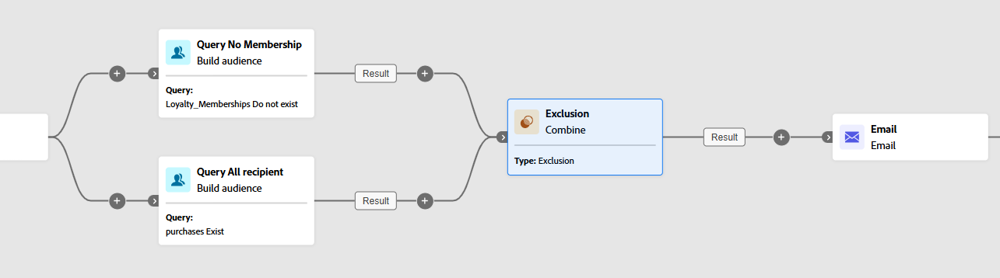

# 결합 {#combine}

>[!CONTEXTUALHELP]
>id="ajo_orchestration_combine"
>title="활동 결합"
>abstract="**결합** 활동을 통해 인바운드 모집단에 대한 세분화를 수행할 수 있습니다. 따라서 여러 모집단을 결합하거나, 일부를 제외하거나, 데이터를 여러 대상에 공통으로 유지할 수 있습니다."

+++ 목차

| 오케스트레이션된 캠페인 시작 | 첫 오케스트레이션된 캠페인 시작 | 데이터베이스 쿼리 | 오케스트레이션된 캠페인 활동 |
|---|---|---|---|
| [오케스트레이션된 캠페인 시작](../gs-orchestrated-campaigns.md)  관계형 스키마 및 데이터 세트 만들기 및 관리:  <ul><li>[스키마 및 데이터 세트 시작](../gs-schemas.md)</li><li>[수동 스키마](../manual-schema.md)</li><li>[파일 업로드 스키마](../file-upload-schema.md)</li><li>[데이터 수집](../ingest-data.md)</li></ul>[오케스트레이션된 캠페인 액세스 및 관리](../access-manage-orchestrated-campaigns.md) | [오케스트레이션된 캠페인을 만드는 주요 단계](../gs-campaign-creation.md)  [캠페인 만들기 및 예약](../create-orchestrated-campaign.md)  [활동 오케스트레이션](../orchestrate-activities.md)  [캠페인 시작 및 모니터링](../start-monitor-campaigns.md)  [보고](../reporting-campaigns.md) | [규칙 빌더로 작업](../orchestrated-rule-builder.md)  [첫 번째 쿼리 빌드](../build-query.md)  [표현식 편집](../edit-expressions.md)  [재타겟팅](../retarget.md) | [활동 시작](about-activities.md)  활동: [및 가입](and-join.md) - [대상 작성](build-audience.md) - [차원 변경](change-dimension.md) - [채널 활동](channels.md) - <b>[결합](combine.md)</b> - [중복 제거](deduplication.md) - [데이터 보강](enrichment.md) - [포크](fork.md) - [조정](reconciliation.md) - [대상 저장](save-audience.md) - [분할](split.md) - [대기](wait.md) |

{style="table-layout:fixed"}

+++

 

>[!BEGINSHADEBOX]

 

이 페이지의 컨텐츠는 최종본이 아니며, 변경될 수 있습니다.

>[!ENDSHADEBOX]

**[!UICONTROL Combine]** 활동은 인바운드 모집단을 효과적으로 세그먼트화할 수 있는 **[!UICONTROL Targeting]** 활동 유형입니다. 여러 모집단을 병합하거나, 특정 세그먼트를 제외하거나, 여러 대상에 걸쳐 공유된 데이터만 유지할 수 있습니다.

다음과 같은 세분화 옵션을 사용할 수 있습니다.

* **[!UICONTROL 유니온]**: 여러 활동의 결과를 하나의 통합 대상으로 병합합니다.

* **[!UICONTROL 교차]**: 모든 인바운드 모집단에서 공통되는 요소만 유지합니다.

* **[!UICONTROL 제외]**: 지정한 조건을 기준으로 한 모집단에서 요소를 제거합니다.

## 결합 활동 구성 {#combine-configuration}

>[!CONTEXTUALHELP]
>id="ajo_orchestration_intersection_merging_options"
>title="교차 병합 옵션"
>abstract="교집합 기능을 사용하면 활동에서 다른 인바운드 모집단에 공통되는 요소만 유지할 수 있습니다. 참여 설정 섹션에서 참여하려는 모든 이전 활동을 선택합니다."

>[!CONTEXTUALHELP]
>id="ajo_orchestration_exclusion_merging_options"
>title="제외 병합 옵션"
>abstract="제외 기능을 사용하면 특정 기준에 따라 하나의 모집단에서 요소를 제외할 수 있습니다. 참여 설정 섹션에서 참여하려는 모든 이전 활동을 선택합니다."

>[!CONTEXTUALHELP]
>id="ajo_orchestration_combine_options"
>title="세분화 유형 선택"
>abstract="대상자 결합 방법을 선택합니다. **합집합** 기능을 사용하면 여러 활동의 결과를 하나의 타깃으로 다시 그룹화할 수 있습니다. **교집합** 기능을 사용하면 활동에서 다른 인바운드 모집단에 공통되는 요소만 유지할 수 있습니다. **제외** 기능을 사용하면 특정 기준에 따라 하나의 모집단에서 요소를 제외할 수 있습니다. "

**[!UICONTROL 결합]** 활동 구성을 시작하려면 다음과 같은 일반적인 단계를 따르십시오.

1. **[!UICONTROL 대상자 빌드]** 활동과 같은 여러 활동을 추가하여 두 개 이상의 서로 다른 실행 분기를 구성합니다.
1. 이전 분기에 **[!UICONTROL 결합]** 활동을 추가합니다.
1. [합집합](#union), [교차](#intersection) 또는 [제외](#exclusion) 중에서 세분화 유형을 선택합니다.
1. **[!UICONTROL 계속을 클릭합니다]**.
1. **[!UICONTROL 참여 설정]** 섹션에서 참여하려는 모든 이전 활동을 선택하십시오.

## 합집합 {#combine-union}

>[!CONTEXTUALHELP]
>id="ajo_orchestration_combine_reconciliation"
>title="조정 옵션"
>abstract="중복 처리 방법을 정의하려면 **조정 유형**&#x200B;을 선택합니다. 기본적으로 **키** 옵션이 활성화되어 있는데, 이는 서로 다른 인바운드 전환의 요소가 동일한 키를 가질 때 활동이 하나의 요소만 유지한다는 것을 의미합니다. 데이터 조정을 적용할 열 목록을 정의하려면 **열 선택** 옵션을 사용합니다."

**[!UICONTROL 결합]** 활동 내에서 **[!UICONTROL 조정 유형]**&#x200B;을 선택하여 **[!UICONTROL 결합]**&#x200B;을 구성하여 중복 레코드를 관리하는 방법을 결정할 수 있습니다.

* **[!UICONTROL 키만]**(기본값): 여러 인바운드 전환이 동일한 키를 공유할 때 단일 레코드를 유지합니다. 이 옵션은 인바운드 모집단이 동질적일 경우에만 적용할 수 있습니다.

* **[!UICONTROL 선택한 열]**: 데이터 조정에 사용할 열을 지정할 수 있습니다. **[!UICONTROL 특성 추가]**&#x200B;를 선택합니다.

다음 예제에서는 **[!UICONTROL Combine]** 활동을 **[!UICONTROL Union]**&#x200B;과(와) 함께 사용하여 두 쿼리 **충성도 멤버** 및 **구매자**&#x200B;의 결과를 두 세그먼트의 모든 프로필을 포함하는 더 큰 단일 대상자로 병합합니다.

## 교집합 {#combine-intersection}

>[!CONTEXTUALHELP]
>id="ajo_orchestration_intersection_reconciliation_options"
>title="교집합 조정 옵션"
>abstract="중복 처리 방법을 정의하려면 **조정 유형**&#x200B;을 선택합니다. 기본적으로 **키** 옵션이 활성화되어 있는데, 이는 서로 다른 인바운드 전환의 요소가 동일한 키를 가질 때 활동이 하나의 요소만 유지한다는 것을 의미합니다. 데이터 조정을 적용할 열 목록을 정의하려면 **열 선택** 옵션을 사용합니다."

**[!UICONTROL 결합]** 활동에서 **[!UICONTROL 교차]**&#x200B;를 구성할 수 있습니다. 이를 위해 아래의 추가 단계를 수행해야 합니다.

1. 중복 처리 방법을 정의하려면 **[!UICONTROL 조정 유형]**&#x200B;을(를) 선택하십시오.

   * **[!UICONTROL 키만]**(기본값): 여러 인바운드 전환이 동일한 키를 공유할 때 단일 레코드를 유지합니다. 이 옵션은 인바운드 모집단이 동질적일 경우에만 적용할 수 있습니다.

   * **[!UICONTROL 선택한 열]**: 데이터 조정에 사용할 열을 지정할 수 있습니다. **[!UICONTROL 특성 추가]**&#x200B;를 선택합니다.

1. 나머지 모집단을 처리하려면 **[!UICONTROL 완료 생성]**&#x200B;을 사용하도록 설정하십시오. 보조 결과에는 교차를 제외한 모든 인바운드 활동 결과의 합집합도 포함됩니다. 활동에 아웃바운드 전환이 더 추가됩니다.

다음 예제에서는 두 쿼리 활동 간의 **[!UICONTROL Intersection]** 사용을 보여줍니다. **충성도 멤버**&#x200B;이고 지난 달 내에 구매한 프로필을 식별하는 데 사용됩니다.

## 제외 {#combine-exclusion}

>[!CONTEXTUALHELP]
>id="ajo_orchestration_exclusion_options"
>title="제외 규칙"
>abstract="필요한 경우 인바운드 테이블을 조작할 수 있습니다. 다른 차원에서 대상을 제외하려면 이 대상을 기본 대상과 동일한 타기팅 차원으로 반환해야 합니다. 이 작업을 수행하려면 제외 규칙 섹션에서 규칙 추가를 클릭하고 차원 변경 조건을 지정합니다. 데이터 조정은 속성 또는 참여를 통해 수행됩니다."

>[!CONTEXTUALHELP]
>id="ajo_orchestration_combine_sets"
>title="결합할 세트 선택"
>abstract="**참여 설정** 섹션에서 인바운드 전환의 **기본 세트**&#x200B;를 선택합니다. 요소가 제외되는 집합입니다. 다른 집합은 기본 집합에서 제외되기 전에 요소와 일치합니다."

>[!CONTEXTUALHELP]
>id="ajo_orchestration_combine_exclusion"
>title="제외 규칙"
>abstract="필요한 경우 인바운드 테이블을 조작할 수 있습니다. 다른 차원에서 대상을 제외하려면 이 대상을 기본 대상과 동일한 타기팅 차원으로 반환해야 합니다. 이 작업을 수행하려면 제외 규칙 섹션에서 규칙 추가를 클릭하고 차원 변경 조건을 지정합니다. 데이터 조정은 속성 또는 참여를 통해 수행됩니다."

>[!CONTEXTUALHELP]
>id="ajo_orchestration_combine_complement"
>title="결합 생성 여집합"
>abstract="추가 전환에서 나머지 집단을 처리하려면 ‘여집합 생성’ 옵션을 토글합니다."

**[!UICONTROL 결합]** 활동에서 **[!UICONTROL 제외]**&#x200B;를 구성할 수 있습니다. 이를 위해 아래의 추가 단계를 수행해야 합니다.

1. **[!UICONTROL 가입할 집합]** 섹션에서 기본 모집단을 나타내는 **[!UICONTROL 기본 집합]**&#x200B;을(를) 선택합니다. 다른 집합에서 발견된 레코드는 이 기본 집합에서 제외됩니다.

1. 필요한 경우 인바운드 테이블을 조정하여 다른 차원의 대상을 정렬할 수 있습니다. 다른 차원에서 대상을 제외하려면 먼저 기본 모집단과 동일한 타겟팅 차원으로 대상을 가져와야 합니다. 이렇게 하려면 **[!UICONTROL 규칙 추가]**&#x200B;를 클릭하고 차원을 변경하는 조건을 정의합니다. 그런 다음 속성 또는 조인을 사용하여 조정이 수행됩니다.

1. 나머지 모집단을 처리하려면 **[!UICONTROL 완료 생성]**&#x200B;을 사용하도록 설정하십시오. 보조 결과에는 교차를 제외한 모든 인바운드 활동 결과의 합집합도 포함됩니다. 활동에 아웃바운드 전환이 더 추가됩니다.

다음 **[!UICONTROL 제외]** 예제에서는 제품을 구매한 프로필을 필터링하도록 구성된 두 개의 쿼리를 보여 줍니다. 그러면 충성도 멤버십이 없는 프로필은 첫 번째 세트에서 제외됩니다.

