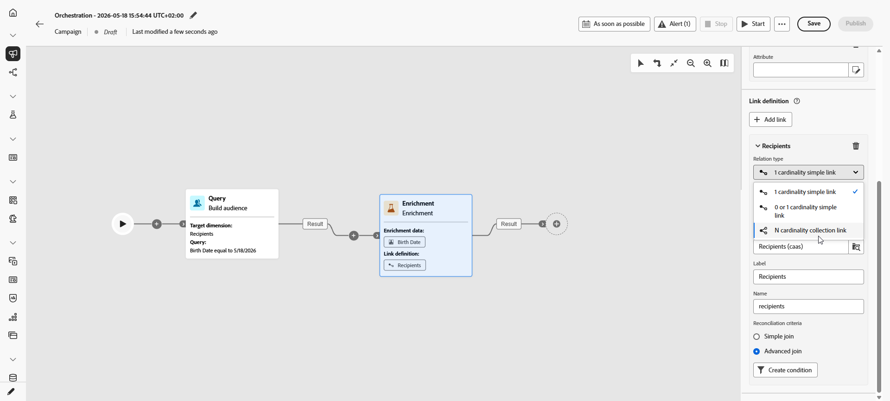
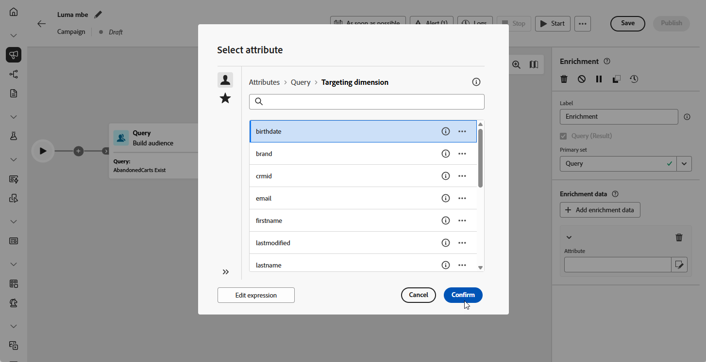
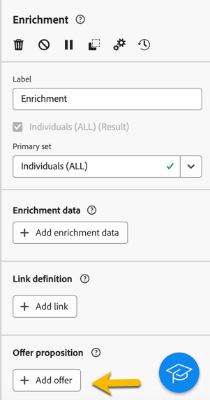
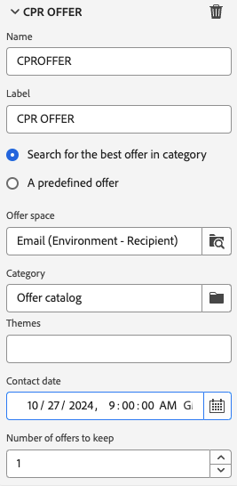
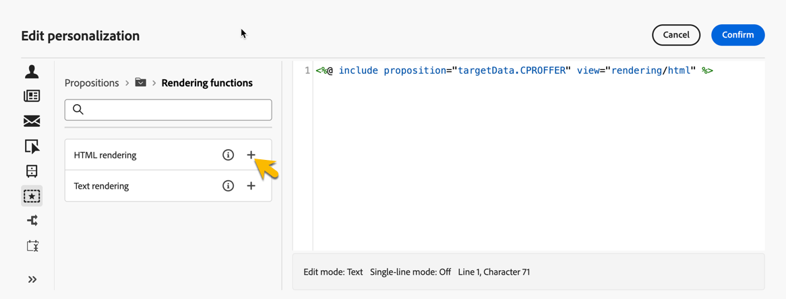

# 보강 {#enrichment}

>[!BEGINSHADEBOX]

**이 페이지에서:** 오케스트레이션된 캠페인에서 데이터 보강 타기팅 활동을 사용하여 더 정확한 타기팅 및 개인화를 위해 추가 특성, 연결된 테이블 데이터 및 오퍼를 통해 대상자를 향상시키는 방법을 알아봅니다.

>[!ENDSHADEBOX]

>[!CONTEXTUALHELP]
>id="ajo_orchestration_enrichment"
>title="보강 활동"
>abstract="**보강** 활동을 통해 데이터베이스의 추가 정보로 타기팅 데이터를 보강할 수 있습니다. 일반적으로 세분화 활동 이후에 워크플로에서 사용됩니다. 일반적으로 활동을 세분화한 후 캠페인에서 사용됩니다."

**[!UICONTROL 보강]** 활동은 추가 속성을 사용하여 대상자 데이터를 강화할 수 있는 **[!UICONTROL 타겟팅]** 활동입니다.

이 정보를 활용하여 행동, 환경 설정 또는 요구에 따라 대상자를 더욱 정확하게 세분화하고, 각 프로필과 더 잘 연결하는 개인화된 메시지를 만들 수 있습니다.

## 보강 활동 추가 {#enrichment-configuration}

>[!CONTEXTUALHELP]
>id="ajo_targetdata_personalization_enrichmentdata"
>title="보강 데이터"
>abstract="오케스트레이션된 캠페인을 강화하는 데 사용할 데이터를 선택합니다. 보강 데이터의 두 가지 유형, 즉 타기팅 차원의 단일 보강 속성 또는 테이블 간에 1-N 카디널리티가 있는 링크인 컬렉션 링크를 선택할 수 있습니다."

>[!CONTEXTUALHELP]
>id="ajo_orchestration_enrichment_data"
>title="보강 활동"
>abstract="보강 데이터가 오케스트레이션된 캠페인에 추가되면 보강 활동 후 추가된 활동에서 고객의 행동, 선호도, 필요에 따라 개별 그룹으로 세분화하거나 타깃 대상자에게 더 잘 전달될 수 있는 개인화된 마케팅 메시지와 캠페인을 만드는 데 사용할 수 있습니다."

**보강** 활동을 구성하려면 다음 단계를 따릅니다.

1. **보강** 활동을 추가합니다.

1. **보강 데이터 추가**&#x200B;를 클릭하고 데이터를 보강하는 데 사용할 속성을 선택합니다.

   두 가지 유형의 보강 데이터(대상 차원의 단일 보강 속성 또는 컬렉션 링크)를 선택할 수 있습니다. 이러한 각 유형은 아래 예에 자세히 설명되어 있습니다.

   * [단일 보강 속성](#single-attribute)
   * [컬렉션 링크](#collection-link)

   

1. 작업 테이블 데이터와 Adobe Journey Optimizer 간의 연결을 만들려면 **[!UICONTROL 링크 추가]**&#x200B;를 클릭하십시오. [자세히 알아보기](#create-links)

   예를 들어 고객 충성도 티어와 마지막 구매 날짜가 포함된 파일에서 데이터를 로드하는 경우 프로필 표에 대한 링크를 만들어 이러한 속성으로 수신자 레코드를 보강하고 개인화 또는 타깃팅에 사용해야 합니다.

   

## 테이블 간 링크 만들기 {#create-links}

>[!CONTEXTUALHELP]
>id="ajo_orchestration_enrichment_simplejoin"
>title="링크 정의"
>abstract="작업 테이블 데이터와 Adobe Journey Optimizer 간의 링크를 만듭니다. 예를 들어 수신자의 계정 번호, 국가 및 이메일이 포함된 파일에서 데이터를 로드하는 경우 해당 국가 테이블에 대한 링크를 생성해야 수신자의 프로필에서 이 정보를 업데이트할 수 있습니다."

**[!UICONTROL 링크 정의]** 섹션을 사용하여 작업 테이블과 다른 데이터 원본 간의 관계를 정의합니다. 예를 들어 고객 충성도 티어와 마지막 구매 날짜가 포함된 파일을 가져오는 경우 프로필 표에 대한 링크를 만들어 개인화 및 타깃팅에 이러한 속성을 사용할 수 있도록 할 수 있습니다.

링크를 만들려면 다음 작업을 수행하십시오.

1. **[!UICONTROL 링크 정의]** 섹션에서 **[!UICONTROL 링크 추가]**&#x200B;를 클릭합니다.

   

1. **[!UICONTROL 관계 유형]** 드롭다운에서 기본 집합과 연결된 데이터 간의 관계 유형을 선택합니다.

   * **[!UICONTROL 1 카디널리티 단순 링크]**: 기본 집합의 각 레코드는 연결된 데이터의 정확히 하나의 레코드에 매핑됩니다.
   * **[!UICONTROL 0 또는 1개의 카디널리티 단순 링크]**: 기본 집합의 각 레코드는 연결된 데이터의 0개 또는 1개의 레코드에 매핑됩니다.
   * **[!UICONTROL N 카디널리티 컬렉션 링크]**: 기본 집합의 각 레코드는 연결된 데이터의 여러 레코드에 매핑될 수 있습니다.

   

1. 기본 세트를 연결할 대상을 선택합니다.

   * **[!UICONTROL 데이터베이스 스키마]**: 데이터베이스의 기존 테이블에 연결합니다. **[!UICONTROL 대상 스키마]** 필드에서 테이블을 선택합니다.
   * **[!UICONTROL 임시 스키마]**: 입력 전환에서 도착하는 데이터에 대한 링크입니다. 목록에서 관련 전환을 선택합니다.

1. 기본 세트와 연결된 스키마 간의 레코드를 일치시키는 데 사용되는 조인 조건을 정의합니다.

   * **[!UICONTROL 단순 조인]**: 특정 특성 쌍의 레코드와 일치합니다. **[!UICONTROL 조인 추가]**&#x200B;를 클릭한 다음 일치하는 기준으로 사용할 **[!UICONTROL Source]** 및 **[!UICONTROL 대상]** 특성을 선택하십시오.
   * **[!UICONTROL 고급 조인]**: 규칙 빌더를 사용하여 사용자 지정 일치 논리를 빌드합니다. 시작하려면 **[!UICONTROL 조건 만들기]**&#x200B;를 클릭하세요.

## 예시 {#example}

### 단일 보강 속성 {#single-attribute}

이 예에서는 현재 대상 차원에서 생년월일과 같은 단일 속성을 사용하여 대상자를 보강합니다.

방법은 다음과 같습니다.

1. **[!UICONTROL 보강 데이터 추가]**&#x200B;를 클릭합니다.

1. 현재 차원에서 **[!UICONTROL 생년월일]**&#x200B;과 같은 간단한 필드를 선택합니다.

   

1. **[!UICONTROL 확인]**&#x200B;을 클릭합니다.

### 컬렉션 링크 {#collection-link}

이 사용 사례는 연결된 테이블의 데이터로 대상자를 보강합니다. 예를 들어 $100 미만의 최근 구매 3건을 검색하려는 경우,

다음과 같이 데이터 보강 기능을 구성합니다.

* **보강 속성**: **[!UICONTROL 가격]**

* **검색할 레코드 수**: 3

* **필터**: **[!UICONTROL 가격]**&#x200B;이 $100 미만인 구매만 포함

#### 속성 추가 {#add-attribute}

먼저 보강할 데이터가 포함된 컬렉션 링크를 선택합니다.

1. **[!UICONTROL 보강 데이터 추가]**&#x200B;를 클릭합니다.

1. **[!UICONTROL 구매]** 테이블에서 **[!UICONTROL 가격]** 필드를 선택합니다.

   

#### 컬렉션 설정 정의{#collection-settings}

그런 다음 데이터 수집 방법과 포함할 항목 수를 구성합니다.

1. **[!UICONTROL 데이터 수집 방법 선택]** 드롭다운에서 **[!UICONTROL 데이터 수집]**&#x200B;을 선택합니다.

   

1. **[!UICONTROL 검색할 줄(만들 열)]** 필드에 `3`을(를) 입력합니다.

1. 집계(예: 평균 구매 금액)를 수행하려면 **[!UICONTROL 집계된 데이터]**&#x200B;를 선택한 다음 **[!UICONTROL 집계 함수]** 드롭다운에서 **[!UICONTROL Average]**&#x200B;를 선택합니다.

   

1. **[!UICONTROL 레이블]** 및 **[!UICONTROL 별칭]** 필드를 사용하여 보강된 속성을 후속 활동에서 더 쉽게 식별할 수 있도록 합니다.

#### 필터 정의{#collection-filters}

마지막으로, 필터를 적용하여 관련 레코드만 포함되도록 합니다.

1. **[!UICONTROL 필터 만들기]**&#x200B;를 클릭합니다.

1. 다음 두 조건을 추가합니다.

   * **[!UICONTROL Price]** exists(NULL을 제외하기 위해)

   * **[!UICONTROL Price]** is less than 100

   

1. **[!UICONTROL 확인]**&#x200B;을 클릭합니다.

### 메시지 개인화에 컬렉션 데이터 사용 {#collection-personalization}

**[!UICONTROL 데이터 수집]**&#x200B;과(와) 함께 컬렉션 링크를 구성하고 **[!UICONTROL 검색할 행(만들 열)]**(예: `3`)을 설정하면 **[!UICONTROL 대상 특성] > [!UICONTROL 데이터 보강]** 아래의 메시지 편집기에서 데이터 보강 특성을 사용할 수 있습니다.

➡️ [개인화에서 데이터 보강 수집 데이터를 사용하는 방법에 대해 알아봅니다](../add-personalization.md#enrichment-collections)

<!--
#### Define the sorting{#collection-sorting}

We now need to apply sorting in order to retrieve the three **latest** purchases.

1. Activate the **Enable sorting** option.
1. Click inside the **Attribute** field.
1. Select the **Order date** field.
1. Click **Confirm**. 
1. Select **Descending** from the **Sort** drop-down.

## Data reconciliation {#reconciliation}

>[!CONTEXTUALHELP]
>id="ajo_orchestration_enrichment_reconciliation"
>title="Reconciliation"
>abstract="The **Enrichment** activity can be used to reconcile data from the Journey Optimizer schema with data from another schema, or with data coming from a temporary schema such as data uploaded using a Load file activity. This type of link defines a reconciliation towards a unique record. Journey Optimizer creates a link to a target table by adding a foreign key in it for storing a reference to the unique record."

The **Enrichment** activity can be used to reconcile data from the the Campaign database schema with data from another schema, or with data coming from a temporary schema such as data uploaded using a Load file activity. This type of link defines a reconciliation towards a unique record. Journey Optimizer creates a link to a target table by adding a foreign key in it for storing a reference to the unique record.

For example, you can use this option to reconcile a profile's country, specified in an uploaded file, with one of the countries available in the dedicated table of the Campaign database. 

Follow the steps to configure an **Enrichment** activity with a reconciliation link: 

1. Click the **Add link** button in the **Reconciliation** section.
1. Identify the data you want to create a reconciliation link with.

    * To create a reconciliation link with data from the Campaign database, select **Database schema** and choose the schema where the target is stored. 
    * To create a reconciliation link with data coming from the input transition, select **Temporary schema** and choose the Orchestrated campaign transition where the target data is stored. 

1. The **Label** and **Name** fields are automatically populated based on the selected target schema. You can change their values if necessary.

1. In the **Reconciliation criteria** section, specify how you want to reconcile data from the source and destination tables:

    * **Simple join**: Reconcile a specific field from the source table with another field in the destination table. To do this, click the **Add join** button and specify the **Source** and **Destination** fields to use for the reconciliation.

        >[!NOTE]
        >
        >You can use one or more **Simple join** criteria, in which case they must all be verified so that the data can be linked together.

    * **Advanced join**: Use the rule builder to configure the reconciliation criteria. To do this, click the **Create condition** button then define your reconciliation criteria by building your own rule using AND and OR operations.

The example below shows an Orchestrated campaign configured to create a link between Journey Optimizer profiles table and a temporary table generated a **Load file** activity. In this example, the **Enrichment** activity reconciliates both tables using the email address as reconciliation criteria.

### Enrichment with linked data {#link-example}

The example below shows an Orchestrated campaign configured to create a link between two transitions. The first transitions targets profile data using a **Query** activity, while the second transition includes purchase data stored into a file loaded through a Load file activity.

* The first **Enrichment** activity links the primary set (data from the **Query** activity) with the schema from the **Load file** activity. This allows us to match each profile targeted by the query with the corresponding purchase data.

    

* A second **Enrichment** activity is added in order to enrich data from the Orchestrated campaign table with the purchase data coming from the **Load file** activity. This allows us to use those data in further activities, for example, to personalize messages sent to the customers with information on their purchase.

    

## Add offers {#add-offers}

>[!CONTEXTUALHELP]
>id="ajo_orchestration_enrichment_offer_proposition"
>title="Offer proposition"
>abstract="The Enrichment activity allows you to add offers for each profile."

The **[!UICONTROL Enrichment]** activity allows you to add offers for each profile.

To do so, follow the steps to configure an **[!UICONTROL Enrichment]** activity with an offer: 

1. In the **[!UICONTROL Enrichment]** activity, at the **[!UICONTROL Offer proposition]** section, click on the **[!UICONTROL Add offer]** button

    

1. You have two choices for the offer selection :

    * **[!UICONTROL Search for the best offer in category]** : check this option and specify the offer engine call parameters (offer space, category or theme(s), contact date, number of offers to keep). The engine will calculate the best offer(s) to add according to these parameters. We recommend completing either the Category or the Theme field, rather than both at the same time.

        

    * **[!UICONTROL A predefined offer]** : check this option and specify an offer space, a specific offer, and a contact date to directly configure the offer that you would like to add, without calling the offer engine.

        

1. After selecting your offer, click on **[!UICONTROL Confirm]** button.

You can now use the offer in the delivery activity.

### Using the offers from Enrichment activity

Within an Orchestrated campaign, if you want to use the offers you get from an enrichment activity in your delivery, follow the steps below:

1. Open the delivery activity and go in the content edition. Click on **[!UICONTROL Offers settings]** button and select in the drop-down list the **[!UICONTROL Offers space]** corresponding to your offer. 
If you want to to view only offers from the enrichment activity, set the number of **[!UICONTROL Propositions]** to 0, and save the modifications.

     

1. In the Email Designer, when adding a personalization with offers, click on the **[!UICONTROL Propositions]** icon, it will display the offer(s) you get from the **[!UICONTROL Enrichment]** activity. Open the offer you want to choose by clicking on it.

     

    Go in **[!UICONTROL Rendering functions]** and choose **[!UICONTROL HTML rendering]** or **[!UICONTROL Text rendering]** according to your needs.

     

>[!NOTE]
>
>If you choose to have more than one offer in the **[!UICONTROL Enrichment]** activity at the **[!UICONTROL Number of offers to keep]** option, all the offers are displayed when clicking on the **[!UICONTROL Propositions]** icon.
-->