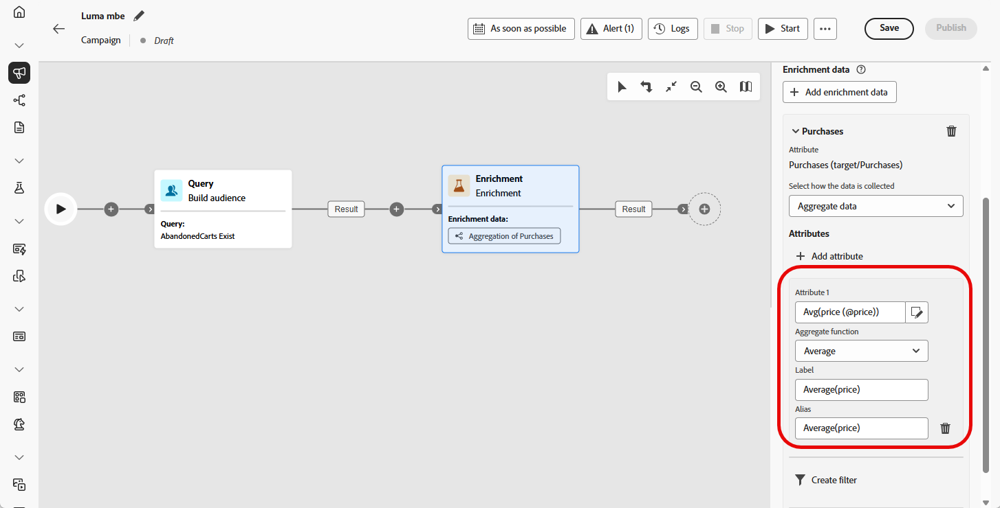
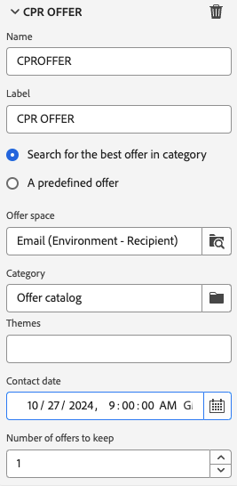

# 보강 {#enrichment}

>[!CONTEXTUALHELP]
>id="ajo_orchestration_enrichment"
>title="보강 활동"
>abstract="**보강** 활동을 통해 데이터베이스의 추가 정보로 타기팅 데이터를 보강할 수 있습니다. 일반적으로 세분화 활동 이후에 워크플로에서 사용됩니다. 일반적으로 활동을 세분화한 후 워크플로에서 사용됩니다."

+++ 목차

| 오케스트레이션된 캠페인 시작 | 첫 오케스트레이션된 캠페인 시작 | 데이터베이스 쿼리 | 오케스트레이션된 캠페인 활동 |
|---|---|---|---|
| [오케스트레이션된 캠페인 시작](gs-orchestrated-campaigns.md)  [구성 단계](configuration-steps.md)  [오케스트레이션된 캠페인 액세스 및 관리](access-manage-orchestrated-campaigns.md) | [오케스트레이션된 캠페인 만들기에 대한 주요 단계](gs-campaign-creation.md)  [캠페인 만들기 및 예약](create-orchestrated-campaign.md)  [활동 오케스트레이션](orchestrate-activities.md)  <b>[캠페인 시작 및 모니터링](start-monitor-campaigns.md)</b>  [보고](reporting-campaigns.md) | [규칙 빌더로 작업](orchestrated-rule-builder.md)  [첫 번째 쿼리 빌드](build-query.md)  [표현식 편집](edit-expressions.md)  [재타겟팅](retarget.md) | [활동 시작](activities/about-activities.md)  활동: [및 가입](activities/and-join.md) - [대상 작성](activities/build-audience.md) - [차원 변경](activities/change-dimension.md) - [채널 활동](activities/channels.md) - [결합](activities/combine.md) - [중복 제거](activities/deduplication.md) - [데이터 보강](activities/enrichment.md) - [포크](activities/fork.md) - [조정](activities/reconciliation.md) - [대상 저장](save-audience.md) - [분할](activities/split.md) - [대기](activities/wait.md) |

{style="table-layout:fixed"}

+++

 

**[!UICONTROL 데이터 보강]** 활동은 추가 특성으로 대상 데이터를 개선할 수 있는 **[!UICONTROL 타깃팅]** 활동입니다.

이 정보를 활용하여 행동, 환경 설정 또는 요구 사항에 따라 대상자를 보다 정확하게 세그먼트화하고, 각 프로필과 더 잘 연결할 수 있는 개인화된 메시지를 만들 수 있습니다.

## 보강 활동 추가 {#enrichment-configuration}

>[!CONTEXTUALHELP]
>id="ajo_targetdata_personalization_enrichmentdata"
>title="보강 데이터"
>abstract="오케스트레이션된 캠페인을 보강하는 데 사용할 데이터를 선택합니다. 보강 데이터의 두 가지 유형, 즉 타기팅 차원의 단일 보강 속성 또는 테이블 간에 1-N 카디널리티가 있는 링크인 컬렉션 링크를 선택할 수 있습니다."

>[!CONTEXTUALHELP]
>id="ajo_orchestration_enrichment_data"
>title="보강 활동"
>abstract="보강 데이터를 오케스트레이션된 캠페인에 추가한 다음에는 이를 보강 활동 다음에 추가된 활동에서 사용하여 고객을 행동, 선호도 및 요구 사항에 따라 고유한 그룹으로 세분화하거나, 타깃 대상자의 마음을 움직일 수 있는 개인화된 마케팅 메시지 및 캠페인을 만들 수 있습니다."

**보강** 활동을 구성하려면 다음 단계를 따르십시오.

1. **보강** 활동을 추가합니다.

1. **데이터 보강 추가**&#x200B;를 클릭하고 데이터를 보강하는 데 사용할 특성을 선택하십시오.

   데이터 보강 데이터의 두 가지 유형인 대상 차원의 단일 보강 속성이나 컬렉션 링크를 선택할 수 있습니다. 이러한 각 유형은 아래 예제에 자세히 설명되어 있습니다.

   * [단일 보강 속성](#single-attribute)
   * [컬렉션 링크](#collection-link)

   

## 예시 {#example}

### 단일 보강 속성 {#single-attribute}

이 예에서는 현재 타겟팅 차원에서 생년월일과 같은 단일 속성으로 대상자를 보강합니다.

방법은 다음과 같습니다.

1. **[!UICONTROL 보강 데이터 추가]**&#x200B;를 클릭합니다.

1. 현재 차원에서 **[!UICONTROL 생년월일]**&#x200B;과 같은 간단한 필드를 선택하십시오.

   

1. **[!UICONTROL 확인]**&#x200B;을 클릭합니다.

### 컬렉션 링크 {#collection-link}

이 사용 사례는 연결된 테이블의 데이터로 대상자를 강화합니다. 예를 들어 $100 미만의 최근 구매 3개를 검색하려는 경우,

이를 위해 다음과 같이 데이터 보강 기능을 구성합니다.

* **데이터 보강 특성**: **[!UICONTROL 가격]**

* **검색할 레코드 수**: 3

* **필터**: **[!UICONTROL 가격]**&#x200B;이 $100보다 작은 구매만 포함

#### 속성 추가 {#add-attribute}

먼저 보강할 데이터가 포함된 컬렉션 링크를 선택합니다.

1. **[!UICONTROL 보강 데이터 추가]**&#x200B;를 클릭합니다.

1. **[!UICONTROL 구매]** 테이블에서 **[!UICONTROL 가격]** 필드를 선택합니다.

   

#### 컬렉션 설정 정의{#collection-settings}

그런 다음 데이터 수집 방법과 포함할 항목 수를 구성합니다.

1. **[!UICONTROL 데이터 수집 방법 선택]** 드롭다운에서 **[!UICONTROL 데이터 수집]**&#x200B;을 선택합니다.

   

1. **[!UICONTROL 검색할 줄(만들 열)]** 필드에 `3`을(를) 입력합니다.

1. 집계(예: 평균 구매 금액)를 수행하려면 **[!UICONTROL 집계된 데이터]**&#x200B;을 선택한 다음 **[!UICONTROL 집계 함수]** 드롭다운에서 **[!UICONTROL 평균]**&#x200B;을 선택하십시오.

   

1. **[!UICONTROL Label]** 및 **[!UICONTROL Alias]** 필드를 사용하여 보강된 특성을 후속 활동에서 더 쉽게 식별할 수 있도록 하십시오.

#### 필터 정의{#collection-filters}

마지막으로 필터를 적용하여 관련 레코드만 포함되도록 합니다.

1. **[!UICONTROL 필터 만들기]**&#x200B;를 클릭합니다.

1. 다음 두 조건을 추가합니다.

   * **[!UICONTROL 가격]**&#x200B;이(가) 있음(NULL 제외)

   * **[!UICONTROL 가격]**&#x200B;이(가) 100보다 작음

   

1. **[!UICONTROL 확인]**&#x200B;을 클릭합니다.

<!--
#### Define the sorting{#collection-sorting}

We now need to apply sorting in order to retrieve the three **latest** purchases.

1. Activate the **Enable sorting** option.
1. Click inside the **Attribute** field.
1. Select the **Order date** field.
1. Click **Confirm**. 
1. Select **Descending** from the **Sort** drop-down.

## Data reconciliation {#reconciliation}

>[!CONTEXTUALHELP]
>id="ajo_orchestration_enrichment_reconciliation"
>title="Reconciliation"
>abstract="The **Enrichment** activity can be used to reconcile data from the Journey Optimizer schema with data from another schema, or with data coming from a temporary schema such as data uploaded using a Load file activity. This type of link defines a reconciliation towards a unique record. Journey Optimizer creates a link to a target table by adding a foreign key in it for storing a reference to the unique record."

The **Enrichment** activity can be used to reconcile data from the the Campaign database schema with data from another schema, or with data coming from a temporary schema such as data uploaded using a Load file activity. This type of link defines a reconciliation towards a unique record. Journey Optimizer creates a link to a target table by adding a foreign key in it for storing a reference to the unique record.

For example, you can use this option to reconcile a profile's country, specified in an uploaded file, with one of the countries available in the dedicated table of the Campaign database. 

Follow the steps to configure an **Enrichment** activity with a reconciliation link: 

1. Click the **Add link** button in the **Reconciliation** section.
1. Identify the data you want to create a reconciliation link with.

    * To create a reconciliation link with data from the Campaign database, select **Database schema** and choose the schema where the target is stored. 
    * To create a reconciliation link with data coming from the input transition, select **Temporary schema** and choose the orchestrated campaign transition where the target data is stored. 

1. The **Label** and **Name** fields are automatically populated based on the selected target schema. You can change their values if necessary.

1. In the **Reconciliation criteria** section, specify how you want to reconcile data from the source and destination tables:

    * **Simple join**: Reconcile a specific field from the source table with another field in the destination table. To do this, click the **Add join** button and specify the **Source** and **Destination** fields to use for the reconciliation.

        >[!NOTE]
        >
        >You can use one or more **Simple join** criteria, in which case they must all be verified so that the data can be linked together.

    * **Advanced join**: Use the query modeler to configure the reconciliation criteria. To do this, click the **Create condition** button then define your reconciliation criteria by building your own rule using AND and OR operations.

The example below shows an orchestrated campaign configured to create a link between Journey Optimizer profiles table and a temporary table generated a **Load file** activity. In this example, the **Enrichment** activity reconciliates both tables using the email address as reconciliation criteria.

### Enrichment with linked data {#link-example}

The example below shows an orchestrated campaign configured to create a link between two transitions. The first transitions targets profile data using a **Query** activity, while the second transition includes purchase data stored into a file loaded through a Load file activity.

* The first **Enrichment** activity links the primary set (data from the **Query** activity) with the schema from the **Load file** activity. This allows us to match each profile targeted by the query with the corresponding purchase data.

    

* A second **Enrichment** activity is added in order to enrich data from the orchestrated campaign table with the purchase data coming from the **Load file** activity. This allows us to use those data in further activities, for example, to personalize messages sent to the customers with information on their purchase.

    

## Create links between tables {#create-links}

>[!CONTEXTUALHELP]
>id="ajo_orchestration_enrichment_simplejoin"
>title="Link definition"
>abstract="Create a link between the working table data and Adobe Journey Optimizer. For example, if you load data from a file which contains the account number, country and email of recipients, you have to create a link towards the country table in order to update this information in their profiles."

The **[!UICONTROL Link definition]** section allows you to create a link between the working table data and Adobe Journey Optimizer. For example, if you load data from a file which contains the account number, country and email of recipients, you have to create a link towards the country table in order to update this information in their profiles.

There are several types of links available:

* **[!UICONTROL 1 cardinality simple link]**: Each record from the primary set can be associated with one and only one record from the linked data.
* **[!UICONTROL 0 or 1 cardinality simple link]**: Each record from the primary set can be associated with 0 or 1 record from the linked data, but not more than one.
* **[!UICONTROL N cardinality collection link]**: Each record from the primary set can be associated with 0, 1 or more (N) records from the linked data.

To create a link, follow these steps:

1. In the **[!UICONTROL Link definition]** section, click the **[!UICONTROL Add link]** button.

    

1. In the **Relation type** drop-down list, choose the type of link you want to create.

1. Identify the target you want to link the primary set to:

    * To link an existing table in the database, choose **[!UICONTROL Database schema]** and select the desired table from the **[!UICONTROL Target schema]** field.
    * To link with data from the input transition, choose **Temporary schema** and select the transition whose data you want to use.

1. Define the reconciliation criteria to match data from the primary set with the linked schema. There are two types of joins available:

    * **Simple join**: Select a specific attribute to match data from the two schemas. Click **Add join** and select the **Source** and **Destination** attributes to use as reconciliation criteria. 
    * **Advanced join**: Create a join using advanced conditions. Click **Add join** and click the **Create condition** button to open the query modeler.

A workflow example using links is available in the [Examples](#link-example) section.

## Add offers {#add-offers}

>[!CONTEXTUALHELP]
>id="ajo_orchestration_enrichment_offer_proposition"
>title="Offer proposition"
>abstract="The Enrichment activity allows you to add offers for each profile."

The **[!UICONTROL Enrichment]** activity allows you to add offers for each profile.

To do so, follow the steps to configure an **[!UICONTROL Enrichment]** activity with an offer: 

1. In the **[!UICONTROL Enrichment]** activity, at the **[!UICONTROL Offer proposition]** section, click on the **[!UICONTROL Add offer]** button

    

1. You have two choices for the offer selection :

    * **[!UICONTROL Search for the best offer in category]** : check this option and specify the offer engine call parameters (offer space, category or theme(s), contact date, number of offers to keep). The engine will calculate the best offer(s) to add according to these parameters. We recommend completing either the Category or the Theme field, rather than both at the same time.

        

    * **[!UICONTROL A predefined offer]** : check this option and specify an offer space, a specific offer, and a contact date to directly configure the offer that you would like to add, without calling the offer engine.

        

1. After selecting your offer, click on **[!UICONTROL Confirm]** button.

You can now use the offer in the delivery activity.

### Using the offers from Enrichment activity

Within an orchestrated campaign, if you want to use the offers you get from an enrichment activity in your delivery, follow the steps below:

1. Open the delivery activity and go in the content edition. Click on **[!UICONTROL Offers settings]** button and select in the drop-down list the **[!UICONTROL Offers space]** corresponding to your offer. 
If you want to to view only offers from the enrichment activity, set the number of **[!UICONTROL Propositions]** to 0, and save the modifications.

     

1. In the Email Designer, when adding a personalization with offers, click on the **[!UICONTROL Propositions]** icon, it will display the offer(s) you get from the **[!UICONTROL Enrichment]** activity. Open the offer you want to choose by clicking on it.

     

    Go in **[!UICONTROL Rendering functions]** and choose **[!UICONTROL HTML rendering]** or **[!UICONTROL Text rendering]** according to your needs.

     

>[!NOTE]
>
>If you choose to have more than one offer in the **[!UICONTROL Enrichment]** activity at the **[!UICONTROL Number of offers to keep]** option, all the offers are displayed when clicking on the **[!UICONTROL Propositions]** icon.

-->