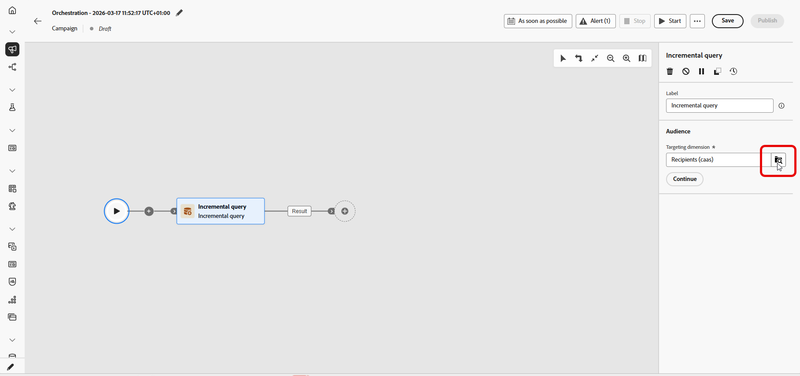

# 증분 쿼리 {#incremental-query}

>[!CONTEXTUALHELP]
>id="ajo_orchestration_incrementalquery"
>title="증분 쿼리"
>abstract="증분 쿼리는 오케스트레이션된 캠페인이 실행될 때마다 데이터베이스 쿼리를 실행하는 타깃팅 활동입니다. 새 레코드만 반환하고 이전 실행에 이미 포함된 모든 레코드는 제외하므로 동일한 사용자를 다시 타기팅하거나 동일한 행을 다시 내보내는 일은 방지할 수 있습니다."

>[!CONTEXTUALHELP]
>id="ajo_orchestration_incrementalquery_processeddata"
>title="처리된 데이터"
>abstract="처리된 데이터에서 이전 실행에서 레코드를 제외하는 방법을 선택합니다. 날짜 필드 사용 옵션을 사용하면 활동에서 개별 ID를 추적하는 대신 선택한 날짜 필드를 사용하며, 각 실행은 날짜가 마지막 실행 이후인 행만 반환합니다."

>[!CONTEXTUALHELP]
>id="ajo_orchestration_incrementalquery_history"
>title="기록(일)"
>abstract="이 설정은 해당 목록이 유지되는 기간을 제어합니다. 값이 0이면 무한한 보존을 의미하며 레코드가 제거되지 않습니다."

**[!UICONTROL 증분 쿼리]** 활동은 오케스트레이션된 캠페인이 실행될 때마다 데이터베이스 쿼리를 실행하는 **[!UICONTROL 타깃팅]** 활동입니다. 중요한 점은 **새** 레코드만 출력한다는 것입니다. 이전 실행에서 이미 선택된 모든 사용자는 제외되므로, 동일한 사용자를 다시 타겟팅하거나 동일한 행을 다시 내보내는 일은 피하십시오.

캠페인을 여러 번 실행할 수 있는 경우 또는 캠페인을 예약할 때(예: 주별) 또는 외부 신호 또는 API에 의해 트리거되는 경우 사용합니다. 각 실행은 이전 실행에서 반환되지 않은 레코드만 타겟팅하므로 중복을 방지합니다.

일반적인 사용:

* **메시지 및 대상**: 새 등록, 새 구매자 또는 기타 &quot;마지막 실행 이후 새로운&quot; 세그먼트만 다음 단계로 끌어옵니다(예: 이메일, SMS).
* **지속적인 내보내기**: 이미 내보낸 행을 복제하지 않고 새 행이나 업데이트된 행만 보고 또는 BI 도구용 파일로 보냅니다.

실행이 행을 반환하지 않으면 오케스트레이션된 캠페인이 **증분 쿼리**&#x200B;에서 중지됩니다. 증분 쿼리 이후의 활동은 데이터가 있을 때까지 실행되지 않으며 캠페인이 다시 실행됩니다.

## 증분 쿼리 활동 구성 {#incremental-query-configuration}

타겟팅 차원을 설정하고, 쿼리를 작성하고, 활동이 향후 실행에서 제외할 레코드를 결정하는 방법을 선택합니다.

1. **[!UICONTROL 증분 쿼리]** 활동을 오케스트레이션된 캠페인에 놓습니다.

1. **[!UICONTROL 대상]**&#x200B;에서 **[!UICONTROL 타겟팅 차원]**(예: 수신자, 구독자)을 선택하고 **[!UICONTROL 계속]**&#x200B;을(를) 클릭합니다. [타겟팅 차원](../target-dimension.md)에 대해 자세히 알아보세요.

   

1. 쿼리를 정의하려면 **[!UICONTROL 조건 추가]**&#x200B;를 클릭하십시오. [규칙 빌더를 사용하는 방법을 알아보세요](../orchestrated-rule-builder.md).

   

1. **[!UICONTROL 처리된 데이터]**&#x200B;에서 **[!UICONTROL 날짜 필드 경로]**&#x200B;를 선택합니다. 특성은 **날짜 시간** 형식을 사용해야 합니다. 각 실행은 날짜가 마지막 실행 이후인 행만 반환합니다.

   

<!--
   * **[!UICONTROL Exclude results of previous execution]**: The activity maintains a list of records returned in prior runs. Each run excludes those records and returns only new ones. **[!UICONTROL History in days]** controls the retention period for that list. 0 indicates indefinite retention, no records are removed.

   >[!IMPORTANT]
   >
   >This mode stores the primary key of each processed record. Personally identifiable information (PII) must not be used as the primary key.

-->

## 예 {#incremental-query-example}

다음 예제에서는 골드 회원이 된 프로필에 환영 이메일을 보냅니다. 캠페인은 매주, 매주 월요일로 예약할 수 있습니다. 각 실행은 이전 실행 이후 골드 멤버십에 적합한 프로필만 타겟팅하므로 각 수신자는 환영 이메일을 한 번 받습니다.

* **[!UICONTROL 증분 쿼리]**: 골드 멤버를 선택합니다. 첫 번째 실행: 현재 모든 골드 멤버입니다. 나중에 실행: 이전 실행 이후 골드 멤버가 된 프로필만 표시합니다.
* **[!UICONTROL 전자 메일 게재]**: 쿼리가 출력한 프로필에 환영 전자 메일을 보냅니다.

