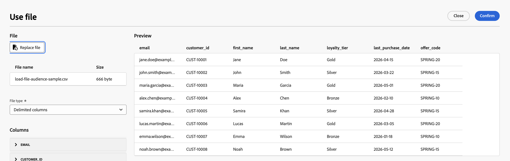
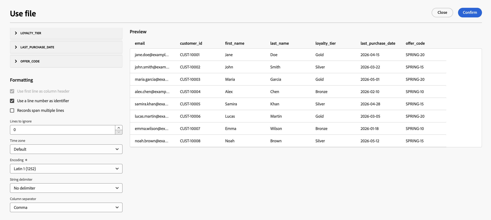

# 파일 로드 {#load-file}

>[!CONTEXTUALHELP]
>id="ajo_orchestration_load_file"
>title="파일 로드 활동"
>abstract="**파일 로드** 활동은 **데이터 관리** 활동입니다. 오케스트레이션된 캠페인 캔버스에서 외부 파일에 저장된 프로필 및 데이터로 작업하고 캠페인 대상자를 정의하는 데 사용합니다. 파일 데이터는 실행 시 사용되며 Adobe Experience Platform 데이터 세트로 지속되지 않습니다."

**[!UICONTROL 파일 로드]** 활동은 **[!UICONTROL 데이터 관리]** 활동입니다. 외부 파일에 저장된 프로필 및 데이터로 작업할 때 사용합니다. 받는 사람 목록이 외부 시스템(예: CRM 내보내기 또는 파트너 파일)에서 나오고 전체 Adobe Experience Platform 수집 파이프라인을 먼저 빌드하지 않고 캠페인을 실행하려는 경우 오케스트레이션된 캠페인에서 **파일 기반 타깃팅**&#x200B;을 지원합니다.

>[!AVAILABILITY]
>
>**파일 로드** 활동은 조직 집합에 대해 **제한된 가용성**&#x200B;에서 사용할 수 있습니다. 액세스 권한을 요청하려면 Adobe 담당자에게 문의하십시오. 가용성 단계는 [Journey Optimizer 릴리스 주기](../../rn/releases.md)를 참조하십시오.
>
>현재 **Healthcare Shield**&#x200B;에서 사용할 수 없는 활동입니다.

## 가드레일 및 제한 사항 {#limitations}

파일 로드 활동에는 다음 제한 사항이 적용됩니다.

* 파일당 최대 50MB를 업로드할 수 있습니다.
* 플랫 구조 CSV 및 TXT 파일만 지원됩니다.
* 업로드된 데이터는 캠페인이 실행될 때 사용되며 Adobe Experience Platform 데이터 세트로 저장되지 않습니다.

채널 및 캔버스 활동에 대한 제한 사항은 [보호 기능 및 제한 사항](../guardrails.md#activities-limitations)을 참조하세요.

## 파일 로드 활동 구성 {#load-file-configuration}

활동을 두 부분으로 구성합니다. 샘플 파일로 예상 파일 구조를 정의한 다음 캠페인 실행 시 로드할 파일을 지정합니다.

1. 오케스트레이션된 캠페인 캔버스에 **[!UICONTROL 파일 로드]** 활동을 추가합니다.

   

1. 활동에 대한 **[!UICONTROL 레이블]**&#x200B;을(를) 입력하십시오.

### 샘플 파일 정의 {#sample-file}

샘플 파일을 사용하여 **[!UICONTROL 열]** 및 **[!UICONTROL 서식]**&#x200B;을 구성하세요. 샘플 데이터는 캠페인 대상자로 가져오지 않습니다.

1. **[!UICONTROL 샘플 파일]** 섹션에서 필요한 구조를 정의하는 로컬 파일을 선택합니다.

   >[!NOTE]
   >
   > 샘플 파일은 열을 구성하고 형식만 지정하는 데 사용되며, 해당 데이터는 캠페인 대상자로 가져오지 않습니다. 이 형식은 캠페인 실행 시 로드할 파일과 일치해야 합니다.

1. **[!UICONTROL 파일 형식]** 드롭다운에서 파일에서 **구분된 열**&#x200B;을 사용할지 **고정 너비 열**&#x200B;을 사용할지 지정합니다.

   

1. **[!UICONTROL 열]** 섹션에서 각 열을 확장하고 해당 속성을 구성합니다.

   

   **[!UICONTROL 데이터 형식]**&#x200B;을(를) 선택하면 해당 형식에 대한 추가 옵션이 나타납니다. 모든 열에 공통되는 매개 변수와 유형별 옵션에 대해 아래 섹션을 확장합니다.

   +++일반 열 매개 변수

   * **[!UICONTROL 열 무시]** — 선택한 경우 가져오기에서 열을 제외합니다.
   * **[!UICONTROL 레이블]** — 열의 표시 이름(예: `email`).
   * **[!UICONTROL 내부 이름]** - 파일 헤더에서 파생된 열의 시스템 이름(읽기 전용).
   * **[!UICONTROL 데이터 형식]** — 열에 있는 데이터의 형식입니다.
   * **[!UICONTROL NULL 허용]** — 열에서 빈 값을 관리하는 방법을 지정합니다.

      * **[!UICONTROL Adobe Campaign 기본값]** — 숫자 필드에 대해서만 오류를 생성합니다. 그렇지 않으면 NULL 값을 삽입합니다.
      * **[!UICONTROL 빈 값이 허용됨]** — 빈 값을 허용합니다. 따라서 NULL 값이 삽입됩니다.
      * **[!UICONTROL 항상 채워짐]** — 값이 비어 있으면 오류를 생성합니다.

   * **[!UICONTROL 오류 처리]** — 열에 오류가 발생한 경우 동작을 정의합니다.

      * **[!UICONTROL 값 무시]** — 값이 무시됩니다.
      * **[!UICONTROL 줄 거부]** — 전체 줄이 처리되지 않습니다.
      * **[!UICONTROL 오류 발생 시 기본값 사용]** - 오류를 일으키는 값을 **[!UICONTROL 기본값]** 필드에 정의된 기본값으로 바꿉니다.
      * **[!UICONTROL 값이 다시 매핑되지 않은 경우 기본값을 사용합니다]** — 잘못된 값에 대한 매핑이 정의되어 있지 않은 경우 오류를 일으키는 값을 **[!UICONTROL 기본값]** 필드에 정의된 기본값으로 바꿉니다.
      * **[!UICONTROL 다시 매핑 값이 없는 경우 줄을 거부합니다]** — 잘못된 값에 대한 매핑이 정의되어 있지 않은 경우 전체 줄을 처리하지 않습니다.

   * **[!UICONTROL 기본값]** — **[!UICONTROL 오류 처리]**&#x200B;이(가) 기본값을 사용하도록 설정된 경우 사용할 기본값
   * **[!UICONTROL 값 다시 매핑]** - 특정 값을 새 값에 매핑합니다. **[!UICONTROL 매핑 추가]**&#x200B;를 클릭하여 각 매핑을 정의합니다(예: `True`/`False`을(를) `1`/`0`(으)로 바꾸기).

   +++

   +++문자열 열 매개 변수

   * **[!UICONTROL 너비]** — 최대 문자 수.
   * **[!UICONTROL 데이터 변환]** — 문자열 값에 적용된 대소문자 변환(예: none 또는 upper/lower case).
   * **[!UICONTROL 공백 관리]** — 문자열 값의 선행 또는 후행 공백을 처리하는 방법입니다.

   +++

   +++정수 및 부동수 열 매개 변수

   * **[!UICONTROL 형식]** — 파일의 숫자 값을 읽는 방법을 정의합니다.

      * **[!UICONTROL 기타]** — **[!UICONTROL 구분 기호]** 섹션에서 **[!UICONTROL 천 단위 구분 기호]** 및 **[!UICONTROL 소수점 구분 기호]**&#x200B;를 정의합니다.
      * **[!UICONTROL 1,000.00]** — 쉼표를 천 단위 구분 기호로, 마침표를 소수점 구분 기호로 사용합니다.
      * **[!UICONTROL 1 000,00]** — 공백을 천 단위 구분 기호로, 쉼표를 소수점 구분 기호로 사용합니다.

   * **[!UICONTROL 구분 기호]**(**[!UICONTROL 형식]**&#x200B;이(가) **[!UICONTROL 기타]**&#x200B;인 경우):

      * **[!UICONTROL 천 단위 구분 기호]** — 천 단위 숫자 값을 그룹화하는 문자입니다(사용하지 않을 경우 비워 둠).
      * **[!UICONTROL 소수점 구분 기호]** — 숫자 값의 소수 부분에 사용되는 문자입니다(예: `,` 또는 `.`).

   +++

   +++날짜 및 시간 열 매개 변수

   옵션은 **[!UICONTROL 데이터 형식]**&#x200B;이(가) **날짜**, **시간** 또는 **날짜 및 시간**&#x200B;인지에 따라 다릅니다.

   **날짜**

   * **[!UICONTROL 날짜 형식]** — 파일에 날짜가 표시되는 방식과 일치하는 패턴입니다(예: `yyyy/mm/dd`).
   * **[!UICONTROL 구분 기호]**:

      * **[!UICONTROL 년, 월, 일]** — 년, 월, 일 구성 요소 사이의 문자(예: `/`).

   **시간**

   * **[!UICONTROL 시간 형식]** — 파일에 표시되는 시간과 일치하는 패턴입니다(예: 24시간 및 분 동안 `13:30`).
   * **[!UICONTROL 구분 기호]**:

      * **[!UICONTROL 시간, 분, 초]** — 시간, 분, 초 구성 요소 사이의 문자(예: `:`).

   **날짜 및 시간**

   * **[!UICONTROL 날짜 형식]** — 날짜 부분이 파일에 표시되는 방식과 일치하는 패턴입니다.
   * **[!UICONTROL 시간 형식]** — 시간 부분이 파일에 나타나는 방식과 일치하는 패턴입니다.
   * **[!UICONTROL 구분 기호]** — 날짜 및 시간 구성 요소 사이의 문자입니다.

   +++

1. **[!UICONTROL 서식]** 섹션에서 캠페인 실행 시 행과 열을 올바르게 읽을 수 있도록 파일을 구조화하는 방법을 지정하십시오. 대상 파일은 샘플 파일과 동일한 서식을 사용해야 합니다.

   

   * **[!UICONTROL 첫 번째 줄을 열 머리글로 사용]** - 선택되면 파일의 첫 번째 줄이 열 이름으로 처리됩니다. 이 옵션은 일반적으로 헤더 행이 포함된 파일에서 샘플을 구성할 때 활성화됩니다.
   * **[!UICONTROL 줄 번호를 식별자로 사용]** — 이 옵션을 선택하면 파일에서 각 행이 줄 번호로 식별됩니다.
   * **[!UICONTROL 레코드가 여러 줄에 걸쳐 있음]** - 선택되면 단일 레코드가 파일의 여러 줄에 걸쳐 있을 수 있습니다(예: 필드에 줄 바꿈이 포함된 경우).
   * **[!UICONTROL 무시할 줄]** - 데이터를 읽기 전에 파일 시작 부분에서 건너뛸 줄 수(예: 주석 또는 메타데이터 줄).
   * **[!UICONTROL 시간대]** — 날짜 및 시간 값을 가져올 때 적용되는 시간대입니다.
   * **[!UICONTROL 인코딩]** — 파일의 문자 인코딩입니다. 소스 파일과 일치하는 인코딩을 선택합니다.
   * **[!UICONTROL 문자열 구분 기호]** — 파일에서 문자열 값을 묶는 데 사용되는 문자입니다.
   * **[!UICONTROL 열 구분 기호]** - 구분된 파일의 열을 구분하는 문자입니다.

1. **[!UICONTROL 확인]**&#x200B;을 클릭하여 샘플 파일 구성의 유효성을 검사합니다.

### 대상 파일 정의 {#target-file}

캠페인 실행 시 로드할 파일과 각 행이 기존 수신자와 일치하는 방식을 지정합니다.

1. **[!UICONTROL 대상 파일]** 섹션에서 대상을 포함하는 CSV 또는 TXT 파일을 선택합니다.

   

   >[!CAUTION]
   >
   > 대상 파일이 샘플 파일과 동일한 형식, 열 구조 및 열 수를 따르는지 확인합니다.

1. **[!UICONTROL 관리 거부]** 섹션에서 파일 처리 중 오류가 발생할 때 활동이 어떻게 작동하는지 정의합니다.

   * **[!UICONTROL 허용되는 오류 수]** — 활동이 실패하기 전에 허용되는 최대 오류 수입니다.
   * **[!UICONTROL 파일에 거부 유지]** — 활성화되면 로드할 수 없는 행은 실행 후 검토할 수 있도록 서버의 거부 파일에 기록됩니다.

1. 선택적으로 **[!UICONTROL 가져오기 후 파일 삭제]**&#x200B;를 활성화하여 캠페인이 실행된 후 서버에서 업로드된 파일을 제거합니다.

**[!UICONTROL 파일 로드]**&#x200B;에서 대상자를 확인한 후 아웃바운드 전환을 다운스트림 활동에 연결합니다. [캠페인 활동을 조율하는 방법 알아보기](../orchestrate-activities.md)
