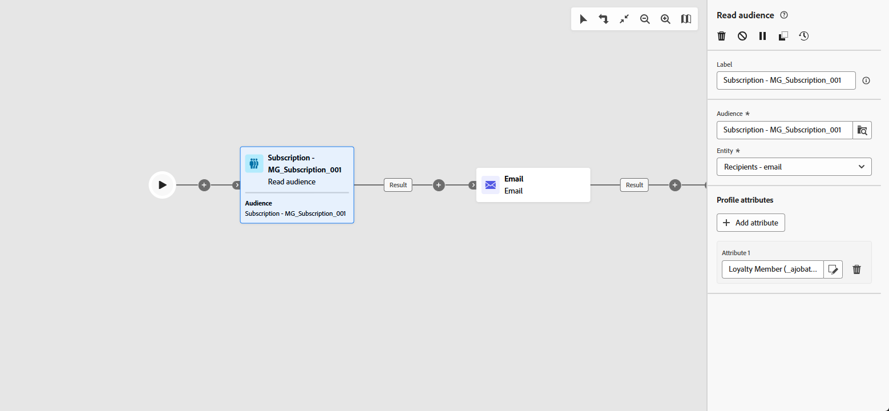

# 대상자 읽기 {#read-audience}

>[!CONTEXTUALHELP]
>id="ajo_orchestration_read_audience"
>title="대상자 빌드 활동"
>abstract="**대상자 읽기** 활동을 통해 오케스트레이션된 캠페인에 참여할 대상자를 선택할 수 있습니다. 이 대상자는 기존 Adobe Experience Platform 대상자이거나 CSV 파일에서 가져온 대상자일 수 있습니다. 오케스트레이션된 캠페인 컨텍스트에서 메시지를 전송할 때 메시지 대상자는 채널 활동에서 정의되지 않고 **대상자 읽기** 또는 **대상자 빌드** 활동에서 정의됩니다."

+++ 목차

| 오케스트레이션된 캠페인 시작 | 첫 오케스트레이션된 캠페인 시작 | 데이터베이스 쿼리 | 오케스트레이션된 캠페인 활동 |
|---|---|---|---|
| [오케스트레이션된 캠페인 시작](../gs-orchestrated-campaigns.md)  관계형 스키마 및 데이터 세트 만들기 및 관리:  <ul><li>[스키마 및 데이터 세트 시작](../gs-schemas.md)</li><li>[수동 스키마](../manual-schema.md)</li><li>[파일 업로드 스키마](../file-upload-schema.md)</li><li>[데이터 수집](../ingest-data.md)</li></ul>[오케스트레이션된 캠페인 액세스 및 관리](../access-manage-orchestrated-campaigns.md) | [오케스트레이션된 캠페인을 만드는 주요 단계](../gs-campaign-creation.md)  [캠페인 만들기 및 예약](../create-orchestrated-campaign.md)  [활동 오케스트레이션](../orchestrate-activities.md)  [캠페인 시작 및 모니터링](../start-monitor-campaigns.md)  [보고](../reporting-campaigns.md) | [규칙 빌더로 작업](../orchestrated-rule-builder.md)  [첫 번째 쿼리 빌드](../build-query.md)  [표현식 편집](../edit-expressions.md)  [재타겟팅](../retarget.md) | [활동 시작](about-activities.md)  활동: [및 가입](and-join.md) - [대상 작성](build-audience.md) - [차원 변경](change-dimension.md) - [채널 활동](channels.md) - [결합](combine.md) - [중복 제거](deduplication.md) - [데이터 보강](enrichment.md) - [포크](fork.md) - [조정](reconciliation.md) - [대상 저장](save-audience.md) - [분할](split.md) - [대기](wait.md) |

{style="table-layout:fixed"}

+++

 

>[!BEGINSHADEBOX]

 

이 페이지의 컨텐츠는 최종본이 아니며, 변경될 수 있습니다.

>[!ENDSHADEBOX]

**[!UICONTROL 대상자 읽기]** 활동을 사용하면 이전에 저장했거나 가져온 기존 대상자를 검색하고 오케스트레이션된 캠페인 내에서 재사용할 수 있습니다. 이 활동은 새로운 세분화 프로세스를 실행할 필요 없이 사전 정의된 프로필 세트를 타겟팅하는 데 특히 유용합니다.

대상자가 로드되면 선택적으로 고유한 ID 필드를 선택하고 타겟팅, 개인화 또는 보고 목적으로 추가 프로필 속성으로 대상자를 보강하여 세분화할 수 있습니다.

## 대상자 읽기 활동 구성 {#read-audience-configuration}

**[!UICONTROL 대상자 읽기]** 활동을 구성하려면 다음 단계를 따르십시오.

1. 오케스트레이션된 캠페인에 **[!UICONTROL 대상자 읽기]** 활동을 추가합니다.

   

1. 활동에 **[!UICONTROL 레이블]**&#x200B;을(를) 입력하십시오.

1. 오케스트레이션된 캠페인에 대해 타깃팅할 대상을 선택하려면 을 클릭하세요.

   

1. 대상의 프로필을 고유하게 식별하는 데 사용되는 **[!UICONTROL 엔터티]**&#x200B;를 선택하십시오.

   

1. **[!UICONTROL 프로필 특성 추가]**&#x200B;를 선택하여 선택한 대상자를 추가 데이터로 보강합니다. 결과 대상자에는 각각 선택한 프로필 속성으로 보강된 수신자 목록이 포함됩니다.

1. 대상자에 추가할 **[!UICONTROL 특성]**&#x200B;을(를) 선택하십시오.

   

## 예

아래 예제에서는 **[!UICONTROL 대상자 읽기]** 활동을 사용하여 뉴스레터를 구독한 프로필의 이전에 만들고 저장한 대상자를 검색합니다. 그러면 대상자가 **충성도 멤버십** 특성으로 보강되어 충성도 프로그램의 등록된 멤버인 사용자를 타깃팅할 수 있습니다.

