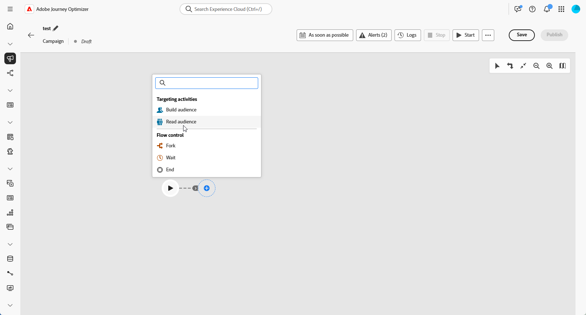

# 대상자 읽기 {#read-audience}

>[!CONTEXTUALHELP]
>id="ajo_orchestration_read_audience"
>title="대상자 빌드 활동"
>abstract="**대상자 읽기** 활동을 통해 오케스트레이션된 캠페인에 참여할 대상자를 선택할 수 있습니다. 이 대상자는 기존 Adobe Experience Platform 대상자이거나 CSV 파일에서 가져온 대상자일 수 있습니다. 오케스트레이션된 캠페인 컨텍스트에서 메시지를 전송할 때 메시지 대상자는 채널 활동에서 정의되지 않고 **대상자 읽기** 또는 **대상자 빌드** 활동에서 정의됩니다."

**[!UICONTROL 대상자 읽기]** 활동을 사용하면 이전에 저장했거나 가져온 기존 대상자를 검색하고 오케스트레이션된 캠페인 내에서 재사용할 수 있습니다. 이 활동은 새로운 세분화 프로세스를 실행할 필요 없이 사전 정의된 프로필 세트를 타겟팅하는 데 특히 유용합니다.

대상자가 로드되면 선택적으로 고유한 ID 필드를 선택하고 타겟팅, 개인화 또는 보고 목적으로 추가 프로필 속성으로 대상자를 보강하여 세분화할 수 있습니다.

## 대상자 캐시 읽기 {#cache}

오케스트레이션된 캠페인을 테스트할 때 **[!UICONTROL 대상자 읽기]** 활동은 일반적으로 데이터를 가져오는 데 시간이 걸리며, 이로 인해 테스트 실행이 더 오래 진행될 수 있습니다. 속도를 높이기 위해 **[!UICONTROL 대상자 읽기]** 캐시를 사용할 수 있습니다.

캐시는 **최대 2시간** 동안 선택한 특성과 함께 대상을 저장합니다. 이 시간 동안 후속 테스트 실행에서는 캐시된 결과를 사용할 수 있으므로 데이터를 다시 가져올 필요가 없습니다. **2시간 기간**&#x200B;이 지나면 데이터를 다시 검색해야 합니다.

캐시는 대상자 자체가 아니라 오케스트레이션된 각 캠페인에 대해 저장됩니다. 오케스트레이션된 다른 캠페인 내의 **[!UICONTROL 대상자 읽기]** 활동에서 동일한 대상자를 사용하는 경우 시스템은 여전히 데이터를 다시 가져와야 합니다.

캐시는 다음과 같은 경우에 유지되지 않습니다.

* **[!UICONTROL 대상자 읽기]** 활동이 새 특성으로 업데이트되면 캐시가 새 특성 데이터로 새로 고쳐집니다. 따라서 데이터를 다시 검색해야 하므로 업데이트 후 첫 번째 테스트 실행이 오래 걸립니다.

* 오케스트레이션된 캠페인이 게시되면 라이브 오케스트레이션된 캠페인을 실행할 때 최신 데이터를 가져옵니다.

## 대상자 읽기 활동 구성 {#read-audience-configuration}

**[!UICONTROL 대상자 읽기]** 활동을 구성하려면 다음 단계를 따르십시오.

1. **[!UICONTROL 대상자 읽기]** 활동을 추가하기 전에 캠페인 설정에서 **[!UICONTROL 병합 정책]**&#x200B;을 선택하십시오.

   

1. 오케스트레이션된 캠페인에 **[!UICONTROL 대상자 읽기]** 활동을 추가합니다.

   

1. 활동에 **[!UICONTROL 레이블]**&#x200B;을(를) 입력하십시오. 이 레이블은 대상자의 이름으로 사용됩니다.

1. 오케스트레이션된 캠페인에 대해 타깃팅할 대상을 선택하려면 을 클릭하세요. [Journey Optimizer에서 대상자를 생성하고 타깃팅하는 방법에 대해 자세히 알아보세요](../audience/about-audiences.md).

   

1. 캠페인 타깃팅 차원에서 **[!UICONTROL &#x200B;엔터티]**&#x200B;를 선택하십시오. 이 설정은 대상을 대상 차원으로 조정하는 데 사용되는 대상 엔티티 및 속성을 정의합니다.

   ➡️ [이 페이지에 설명된 단계에 따라 캠페인 타깃팅 차원을 만드십시오](../target-dimension.md)

   

1. **[!UICONTROL 특성 추가]**&#x200B;를 선택하여 선택한 대상자를 추가 데이터로 보강합니다. 이 단계에서는 프로필 속성을 대상에 추가할 수 있으므로 수신자의 목록이 해당 속성으로 향상됩니다.

1. 대상자에 추가할 **[!UICONTROL 특성]**&#x200B;을(를) 선택하십시오. 특성 선택기에 **유니온 프로필 스키마**&#x200B;의 필드가 표시됩니다.

   * CSV 기반 대상의 경우 **프로필** 특성과 사용자 지정 대상 수준 특성이 모두 포함됩니다. 이러한 속성은 다음 스키마 경로에서 찾을 수 있습니다.

     `<audienceid> > _ajobatchjourneystage > audienceEnrichment > CustomerAudienceUpload > <audienceid>`

   * 표준 AEP 대상의 경우 **프로필** 특성만 사용할 수 있습니다. 이러한 특성에는 포함된 대상별 필드가 없기 때문입니다.

   >[!NOTE]
   >
   > 일부 특성이 선택기에 표시될 수 있지만, 런타임 시 해당 특성을 사용할 수 있는지 여부는 대상 데이터가 성공적으로 조정되고 **Adobe Experience Platform 프로필**&#x200B;과(와) 병합되었는지 여부에 따라 달라집니다.

   

대상이 만들어지면 읽기 전용으로 사용할 수 있으며 더 이상 편집할 수 없습니다. 작성 프로세스가 완전히 완료된 후에만 사용할 수 있습니다.

## 예

아래 예제에서는 **[!UICONTROL 대상자 읽기]** 활동을 사용하여 뉴스레터를 구독한 프로필의 이전에 만들고 저장한 대상자를 검색합니다. 그러면 대상자가 **충성도 멤버십** 특성으로 보강되어 충성도 프로그램의 등록된 멤버인 사용자를 타깃팅할 수 있습니다.

