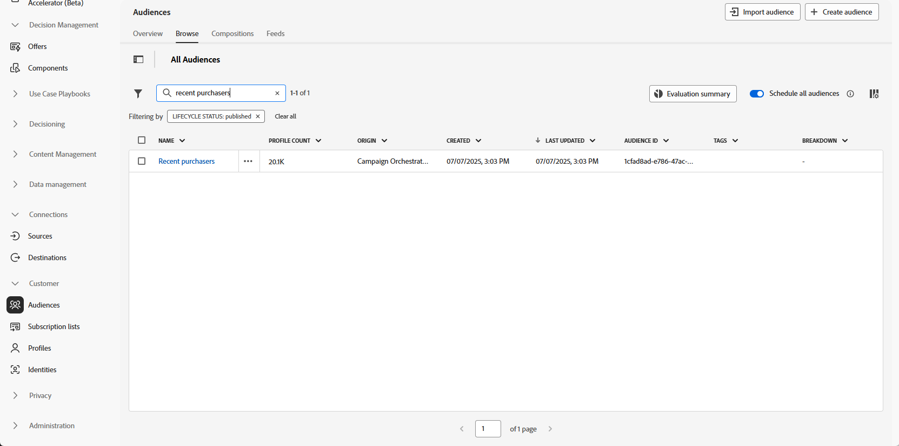

# 대상자 저장 {#save-audience}

>[!CONTEXTUALHELP]
>id="ajo_orchestration_save_audience"
>title="대상자 저장 활동"
>abstract="**대상자 저장** 활동은 오케스트레이션된 캠페인에서 이전에 생성된 모집단에서 기존 대상자를 업데이트하거나 새 대상자를 만들 수 있는 **타깃팅** 활동입니다. 이 대상자를 만들면 애플리케이션 대상자 목록에 추가되며 **대상자** 메뉴에서 액세스할 수 있습니다."

**[!UICONTROL 대상자 저장]** 활동은 오케스트레이션된 캠페인에서 이전에 생성된 모집단을 기반으로 새 대상자를 만들거나 기존 대상자를 업데이트하는 데 사용되는 **[!UICONTROL 타깃팅]** 활동입니다. 저장하면 응용 프로그램 대상자 목록에 대상자가 추가되고 **[!UICONTROL 대상자]** 메뉴에서 액세스할 수 있습니다.

일반적으로 동일한 캠페인 워크플로우 내에 구축된 대상 세그먼트를 캡처하여 향후 캠페인에서 재사용할 수 있도록 하는 데 사용됩니다. 일반적으로 최종 타깃팅된 모집단을 저장하기 위해 **[!UICONTROL 대상 만들기]** 또는 **[!UICONTROL 결합]**&#x200B;과 같은 다른 타깃팅 활동과 연결됩니다.
**[!UICONTROL 대상자 저장]** 활동을 사용하면 기존 대상자를 업데이트할 수 없습니다. 새 대상자를 만들거나 기존 대상자를 새 정의로 덮어쓸 수만 있습니다.

## 대상자 저장 활동 구성 {#save-audience-configuration}

**[!UICONTROL 대상자 저장]** 활동을 구성하려면 다음 단계를 따릅니다.

1. 오케스트레이션된 캠페인에 **[!UICONTROL 대상자 저장]** 활동을 추가합니다.

1. 저장된 대상자를 식별하는 **[!UICONTROL 대상자 레이블]**&#x200B;을 입력합니다.

   >[!NOTE]
   >
   >대상 **[!UICONTROL 레이블]**&#x200B;은(는) 모든 캠페인에서 고유해야 합니다. 다른 캠페인의 **[!UICONTROL 대상자 저장]** 활동에서 이미 사용된 대상자 이름은 다시 사용할 수 없습니다.

1. 캠페인 타깃팅 차원에서 **[!UICONTROL 프로필 매핑 필드&#x200B;]**&#x200B;을(를) 선택하십시오. 이 매핑은 실행 중에 **저장된 대상자**&#x200B;의 프로필이 캠페인의 대상 차원에 연결되는 방식을 정의합니다.

   현재 대상 차원, 즉 들어오는 전환에서 가져온 차원과 호환되는 매핑만 드롭다운 목록에서 사용하여 대상과 캠페인 컨텍스트 간에 적절한 조정을 수행할 수 있습니다.

   ➡️ [이 페이지에 설명된 단계에 따라 캠페인 타깃팅 차원을 만드십시오](../target-dimension.md)

   

1. **[!UICONTROL 대상 매핑 추가]**&#x200B;를 클릭하여 **[!UICONTROL 대상 차원]**&#x200B;의 특성 또는 보강된 **[!UICONTROL 프로필 특성]**&#x200B;의 추가 데이터를 포함하십시오.

   이를 통해 기본 프로필 매핑 외에 더 많은 정보를 **[!UICONTROL 저장된 대상자]** 활동과 연결하여 타깃팅 및 개인화 옵션을 향상시킬 수 있습니다.

   

1. 오케스트레이션된 캠페인을 저장하고 게시하여 설정을 완료합니다. 이렇게 하면 대상자가 생성되고 저장됩니다.

1. 캠페인이 **[!UICONTROL 초안 모드]**&#x200B;에 있는 동안 **[!UICONTROL 대상자 저장]** 활동이 실행되지 않으므로 대상을 만들거나 바꿀 캠페인을 게시하십시오.

저장한 대상자의 콘텐츠는 대상자의 세부 사항 보기에서 사용할 수 있습니다. 이 뷰는 **[!UICONTROL 대상자]** 메뉴에서 액세스하거나 대상자를 타깃팅할 때 선택할 수 있습니다(예: **[!UICONTROL 대상자 읽기]** 활동).

## 예 {#save-audience-example}

다음 예에서는 타겟팅을 사용하여 간단한 대상자를 만드는 방법을 보여 줍니다. 쿼리는 오케스트레이션된 캠페인 내에서 이 모집단을 필터링하여 지난 30일 동안 여행을 예약한 모든 수신자를 식별합니다. **타깃팅 차원**(으)로 **수신자 - CRMID**&#x200B;를 선택하면 대상자가 전체 수신자가 아닌 각 개별 예약 이벤트를 타깃팅합니다. 그런 다음 **[!UICONTROL 대상자 저장]** 활동은 이러한 프로필을 캡처하여 최근 구매자의 재사용 가능한 대상자를 만듭니다.

