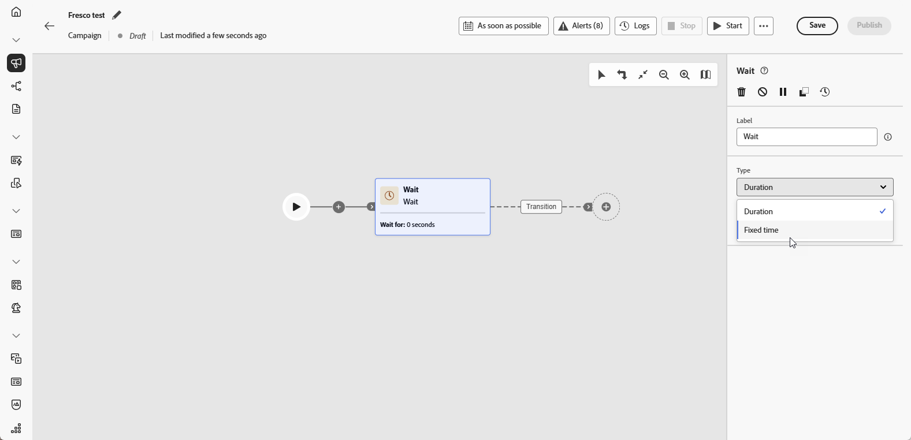

# 대기 {#wait}

>[!CONTEXTUALHELP]
>id="ajo_orchestration_wait"
>title="대기 활동"
>abstract="**대기** 활동을 사용하면 한 활동이 다른 활동으로 전환되는 것을 늦출 수 있습니다."

**[!UICONTROL 대기]** 활동은 오케스트레이션된 캠페인에서 두 활동 간의 지연을 유도하는 데 사용되는 **[!UICONTROL 흐름 제어]** 구성 요소입니다. 이 활동을 사용하면 후속 활동을 보다 적절한 타이밍에, 사용자 참여와 더 관련 있는 방식으로 제시하는 데 도움이 됩니다.

예를 들어 이메일 게재 후 후속 메시지를 보내기 전에 열기 및 클릭을 추적하기 위해 며칠 동안 기다릴 수 있습니다.

## 구성{#wait-configuration}

**[!UICONTROL 대기]** 활동을 구성하려면 다음 단계를 따르십시오.

1. 오케스트레이션된 캠페인에 **[!UICONTROL 대기]** 활동을 추가합니다.

1. 요구 사항에 가장 적합한 대기 유형을 선택합니다.

   * **[!UICONTROL 기간]**: 다음 활동으로 진행하기 전에 설정할 지연 시간을 초, 분, 시간 또는 일 단위로 지정합니다.

   * **[!UICONTROL 고정 시간]**: 다음 활동을 시작할 특정 날짜와 시간을 설정합니다.

   

## 예{#wait-example}

다음 예제는 일반적인 사용 사례 속 **[!UICONTROL 대기]** 활동을 보여 줍니다.  프로필에 생일을 축하하는 프로모션 코드가 포함된 이메일이 전송됩니다. 29일 후 동일한 그룹에 생일 프로모션 코드가 곧 만료된다는 알림이 포함된 SMS가 전송됩니다.

