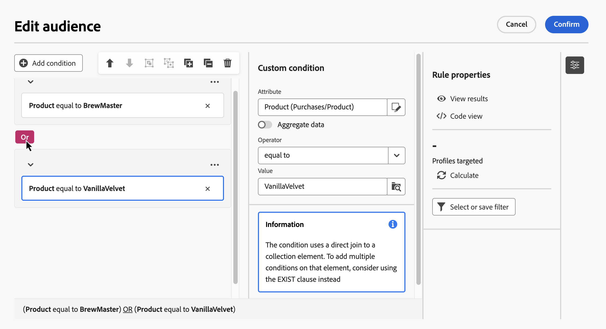
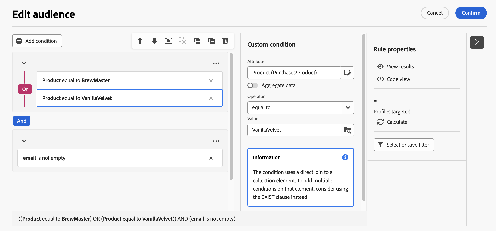

# 첫 번째 규칙 작성 {#build-query}

오케스트레이션된 캠페인에 대한 규칙을 작성하는 주요 단계는 다음과 같습니다.

1. **조건 추가** - 데이터베이스 및 고급 표현식의 속성으로 자신만의 조건을 작성하여 사용자 정의 조건을 만들고 쿼리를 필터링합니다.
1. **조건 결합** - 그룹 및 논리 연산자를 사용하여 캔버스에 조건을 정렬합니다.
1. **규칙 확인 및 유효성 검사** - 저장하기 전에 규칙의 결과 데이터를 확인합니다.

## 조건 추가 {#conditions}

>[!CONTEXTUALHELP]
>id="ajo_orchestration_querymodeler_customcondition"
>title="사용자 정의 조건"
>abstract="사용자 정의 조건은 데이터베이스 및 고급 표현식의 속성으로 고유한 조건을 빌드하여 쿼리를 필터링할 수 있는 필터링 구성 요소입니다."

쿼리에 조건을 추가하려면 다음 단계를 수행합니다.

1. **[!UICONTROL 대상자 작성]** 활동에서 규칙 빌더에 액세스합니다.

1. 쿼리에 대한 첫 번째 조건을 만들려면 **조건 추가** 버튼을 클릭합니다.

   사전 정의된 필터를 사용하여 쿼리를 시작할 수도 있습니다. 이렇게 하려면 **[!UICONTROL 필터 선택 또는 저장]** 버튼을 클릭하고 **[!UICONTROL 미리 정의된 필터 선택]**&#x200B;을 선택합니다.

   

1. 데이터베이스에서 조건의 기준으로 사용할 속성을 식별합니다. 속성 옆에 있는 “i” 아이콘은 속성이 저장된 테이블과 속성의 데이터 유형에 대한 정보를 제공합니다.

   

   >[!NOTE]
   >
   >**표현식 편집** 버튼을 클릭하면 표현식 편집기를 통해 데이터베이스 및 도우미 함수의 필드를 사용하여 표현식을 수동으로 정의할 수 있습니다. [표현식을 편집하는 방법 알아보기](../orchestrated/edit-expressions.md)

1. 속성 옆에 있는  버튼을 클릭하여 다음 추가 옵션에 액세스합니다.

   +++ 값 분포

   테이블 내에서 주어진 속성에 대한 값 분포를 분석합니다. 이 기능은 사용 가능한 값, 그 개수, 백분율을 이해하는 데 유용합니다. 또한 쿼리를 작성하거나 표현식을 만들 때 대문자 사용이나 맞춤법이 일관되지 않은 것과 같은 문제를 방지하는 데도 도움이 됩니다.

   값이 많은 속성의 경우 도구에는 처음 20개만 표시됩니다. 이 경우 이러한 제한을 나타내는 **[!UICONTROL 부분 로드]** 알림이 표시됩니다. 고급 필터를 적용하면 표시되는 결과 내에서 상세 검색하고 특정 값이나 데이터 하위 집합에 초점을 맞출 수 있습니다.

   

   +++

   +++ 즐겨찾기에 추가

   즐겨찾기 메뉴에 속성을 추가하면 가장 자주 사용하는 속성으로 바로 갈 수 있습니다. 최대 20개의 속성을 즐겨찾기에 추가할 수 있습니다. 즐겨 찾는 속성과 최근 속성은 조직 내 각 사용자와 연결되어 다양한 기기 간 접근성을 보장하고 여러 장치에 걸쳐 원활한 경험을 제공합니다.

   즐겨찾기에 추가한 속성에 액세스하려면 **[!UICONTROL 즐겨찾기 및 최근 항목]** 메뉴를 사용합니다. 즐겨찾기 속성이 먼저 나타나고, 최근에 사용한 속성이 차례로 나타나 필요한 속성을 쉽게 찾을 수 있습니다. 즐겨찾기에서 속성을 제거하려면 별표 아이콘을 다시 선택합니다.

   

   +++

1. 선택한 속성을 조건에 추가하려면 **[!UICONTROL 확인]**&#x200B;을 클릭합니다.

1. 속성에 대해 원하는 값을 구성할 수 있는 속성 창이 표시됩니다.

   

1. 드롭다운 목록에서 적용할 **[!UICONTROL 연산자]**&#x200B;를 선택합니다. 다양한 연산자를 사용할 수 있습니다. 드롭다운 목록에서 사용할 수 있는 연산자는 속성의 데이터 유형에 따라 다릅니다.

   +++사용 가능한 연산자 목록

   | 연산자 | 용도 | 예 |
   |---|---|---|
   | 다음과 같음 | 두 번째 Value 열에 입력한 데이터와 동일한 결과를 반환합니다. | Last name (@lastName) equal to &#39;Jones&#39;를 사용하면 성이 Jones인 수신자만 반환합니다. |
   | 다음과 같지 않음 | 입력한 값과 동일하지 않은 모든 값을 반환합니다. | Language (@language) not equal to &#39;English&#39;. |
   | 다음보다 큼 | 입력한 값보다 큰 값을 반환합니다. | Age (@age) greater than 50을 사용하면 &#39;51&#39;, &#39;52&#39;와 같이 &#39;50&#39;보다 큰 모든 값이 반환됩니다. |
   | 다음보다 작음 | 입력한 값보다 작은 값을 반환합니다. | &#39;DaysAgo(100)&#39; 전의 생성 날짜(@created)를 입력하면 100일 이내에 생성된 모든 수신자가 반환됩니다. |
   | 다음보다 크거나 같음 | 입력한 값보다 크거나 같은 모든 값을 반환합니다. | Age(@age)가 &#39;30&#39;보다 크거나 같으면 30세 이상의 모든 수신자가 반환됩니다. |
   | 다음보다 작거나 같음 | 입력한 값과 같거나 낮은 값을 모두 반환합니다. | &#39;60&#39; 이하의 Age(@age)를 입력하면 60세 이하의 모든 수신자가 반환됩니다. |
   | Included in | 지정한 값에 포함된 결과를 반환합니다. 이 값은 쉼표로 구분해야 합니다. | Birth date (@birthDate) is included in &#39;12/10/1979,12/10/1984&#39; 사용 시 이 날짜 사이에 태어난 수신자를 반환합니다. |
   | 다음에 없음 | Is included in 연산자처럼 작동합니다. 여기서는 입력한 값을 기준으로 수신자가 제외됩니다. | Birth date (@birthDate) is not included in &#39;12/10/1979,12/10/1984&#39;. 이 날짜 범위 내에 태어난 수신자는 반환되지 않습니다. |
   | 비어 있음 | 두 번째 값 열에서 빈 값과 일치하는 결과를 반환합니다. | Mobile (@mobilePhone) is empty는 휴대폰 번호가 없는 모든 수신자를 반환합니다. |
   | 비어 있지 않음 | Is empty 연산자와 반대로 작동합니다. 두 번째 Value 열에는 데이터를 입력할 필요가 없습니다. | Email (@email) is not empty. |
   | 다음으로 시작 | 입력한 값으로 시작하는 결과를 반환합니다. | Account # (@account) starts with &#39;32010&#39;. |
   | 다음으로 시작하지 않음 | 입력한 값으로 시작하지 않는 결과를 반환합니다. | Account # (@account) does not start with &#39;20&#39;. |
   | 다음을 포함 | 입력한 값 이상의 값이 포함된 결과를 반환합니다. | Email domain (@domain) contains &#39;mail&#39; 사용 시 &#39;mail&#39;이 포함된 모든 도메인 이름(예: &#39;gmail.com&#39;)이 반환됩니다. |
   | 다음을 포함하지 않음 | 입력한 값이 포함되지 않은 결과를 반환합니다. | Email domain (@domain) does not contain &#39;vo&#39;. &#39;vo&#39;가 포함된 도메인 이름(예: &#39;voila.fr&#39;)은 결과에 표시되지 않습니다. |
   | 다음과 유사 | Contains 연산자와 유사하게 값에 % 와일드카드 문자를 삽입할 수 있습니다. | Last name (@lastName) like &#39;Jon%s&#39;. 와일드카드 문자가 “joker”로 작동하여 “Jones”와 같은 이름을 찾습니다. |
   | Not like | Contains 연산자와 유사하게 값에 % 와일드카드 문자를 삽입할 수 있습니다. | Last name (@lastName) not like &#39;Smi%h&#39;. 성이 ‘Smith’인 수신자는 반환되지 않습니다. |

   +++

1. **Value** 필드에서 예상 값을 정의합니다. 표현식 편집기를 통해 데이터베이스 및 도우미 함수의 필드를 사용하여 표현식을 수동으로 정의할 수도 있습니다. 이렇게 하려면  아이콘을 클릭합니다. [표현식을 편집하는 방법 알아보기](../orchestrated/edit-expressions.md)

   날짜 유형 속성의 경우 **[!UICONTROL 사전 설정]** 옵션을 사용하여 사전 정의된 값을 사용할 수 있습니다.

   +++예제 참조

   

   +++

### 연결된 테이블에 대한 사용자 정의 조건(1-1 및 1-N 링크){#links}

사용자 정의 조건을 사용하면 규칙에서 현재 사용하는 테이블에 연결된 테이블을 쿼리할 수 있습니다. 여기에는 1-1 카디널리티 링크가 있는 테이블 또는 컬렉션 테이블(1-N 링크)이 포함됩니다.

**1-1 링크**&#x200B;의 경우 연결된 테이블로 이동하여 원하는 속성을 선택하고 예상 값을 정의합니다.

**Value** 선택기에서 테이블 링크를 직접 선택하고 확인할 수도 있습니다. 이 경우 아래 예제와 같이 전용 선택기를 사용하여 선택한 테이블에 사용할 수 있는 값을 선택해야 합니다.

+++쿼리 예제

여기에서 쿼리는 레이블이 “running”인 브랜드를 타기팅합니다.

1. **Brand** 테이블 내부로 이동하여 **Label** 속성을 선택합니다.

   

1. 속성에 대한 예상 값을 정의합니다.

   

다음은 테이블 링크가 직접 선택된 쿼리 샘플입니다. 이 테이블에 사용할 수 있는 값은 전용 선택기에서 선택해야 합니다.

+++ 

**1-N 링크**&#x200B;의 경우 아래 예와 같이 쿼리를 구체화하기 위한 하위 조건을 정의할 수 있습니다.

+++쿼리 예제

여기서 쿼리는 Brewmsaster 제품과 관련된 구매를 $100 넘게 수행한 수신자를 타기팅합니다.

1. **Purchases** 테이블을 선택하고 확인합니다.

1. **[!UICONTROL 조건 추가]**&#x200B;를 클릭하여 선택한 테이블에 적용할 하위 조건을 정의합니다.

   

1. 필요에 따라 하위 조건을 추가합니다.

   

+++ 

### 데이터 집계를 사용한 사용자 정의 조건 {#aggregate}

사용자 정의 조건을 사용하여 집계 작업을 수행할 수 있습니다. 이렇게 하려면 컬렉션 테이블에서 속성을 직접 선택해야 합니다.

1. 원하는 컬렉션 테이블 내부로 이동하여 집계 작업을 수행할 속성을 선택합니다.

1. 속성 창에서 **데이터 집계** 옵션을 토글하고 원하는 집계 함수를 선택합니다.

   

## 연산자를 사용하여 조건 결합 {#operators}

규칙에 새 조건을 추가할 때마다 **AND** 연산자에 의해 기존 조건에 자동으로 연결됩니다. 이는 두 조건에서 나온 결과가 결합된다는 뜻입니다.

조건 사이의 연산자를 변경하려면 클릭하고 원하는 연산자를 선택합니다.

사용 가능한 연산자는 다음과 같습니다.

* **AND(교집합)**: 아웃바운드 전환의 모든 필터링 구성 요소와 일치하는 결과를 결합합니다.
* **OR(합집합)**: 아웃바운드 전환의 필터링 구성 요소 중 하나 이상과 일치하는 결과를 포함합니다.
* **EXCEPT(제외)**: 아웃바운드 전환에서 모든 필터링 구성 요소와 일치하는 결과를 제외합니다.

## 조건 조작 {#manipulate}

규칙 빌더 캔버스 도구 모음에서는 규칙 내의 조건을 쉽게 조작할 수 있는 옵션을 제공합니다.

| 도구 모음 아이콘 | 설명 |
|--- |--- |
|  | 구성 요소를 한 행 위로 이동합니다. |
|  | 구성 요소를 한 행 아래로 이동합니다. |
|  | 두 구성 요소를 한 그룹에 넣습니다. |
|  | 단일 그룹의 구성 요소를 분리합니다. |
|  | 모든 그룹을 확장합니다. |
|  | 모든 그룹을 축소합니다. |
|  | 모든 그룹 및 구성 요소를 제거합니다. |

필요에 따라 구성 요소를 동일한 그룹으로 그룹화하고 함께 연결하여 구성 요소로 이루어진 중간 그룹을 만들어야 할 수도 있습니다.

* 두 개의 기존 조건을 그룹화하려면 두 조건 중 하나를 선택하고  또는  버튼을 클릭하여 위 또는 아래 조건과 그룹화합니다.

* 기존 조건을 새 조건으로 그룹화하려면 조건을 선택하고  버튼을 클릭한 다음 **[!UICONTROL 그룹 추가]**&#x200B;를 선택합니다. 그룹에 추가할 새 속성을 선택한 다음 확인합니다.

  

아래 예에서는 BrewMaster 또는 VanillaVelvet 제품을 구매한 고객을 타기팅하는 중간 그룹을 만들었습니다.

## 쿼리 확인 및 유효성 검사

>[!CONTEXTUALHELP]
>id="ajo_orchestration_querymodeler_ruleproperties"
>title="규칙 속성"
>abstract="캔버스에 쿼리를 작성한 후에는 오른쪽에 있는 **규칙 속성** 창을 사용하여 확인할 수 있습니다. 이 창에서는 결과 데이터를 표시하고, 쿼리의 SQL 코드 버전을 검색하고, 타기팅된 레코드 수를 확인할 수 있습니다. **필터 선택 또는 저장** 버튼을 사용하여 쿼리를 미리 정의된 필터로 저장하거나 캔버스 콘텐츠를 기존 필터로 바꿀 수 있습니다."

캔버스에 쿼리를 작성한 후에는 **규칙 속성** 창을 사용하여 확인할 수 있습니다. 사용 가능한 작업은 다음과 같습니다.

* **결과 보기:** 쿼리의 결과 데이터를 표시합니다.
* **코드 보기**: SQL에 쿼리의 코드 기반 버전을 표시합니다.
* **계산**: 규칙에서 타기팅한 레코드 수를 업데이트하고 표시합니다.
* **필터 선택 또는 저장**: 캔버스에서 사용할 미리 정의된 기존 필터를 선택하거나, 쿼리를 나중에 다시 사용할 수 있도록 미리 정의된 필터로 저장합니다.

 

규칙이 준비되면 **[!UICONTROL 확인]** 버튼을 클릭하여 저장합니다.

>[!IMPORTANT]
>
>규칙 속성 창에서 사전 정의된 필터를 선택하면 캔버스에 내장된 규칙이 선택한 필터로 바뀝니다.

