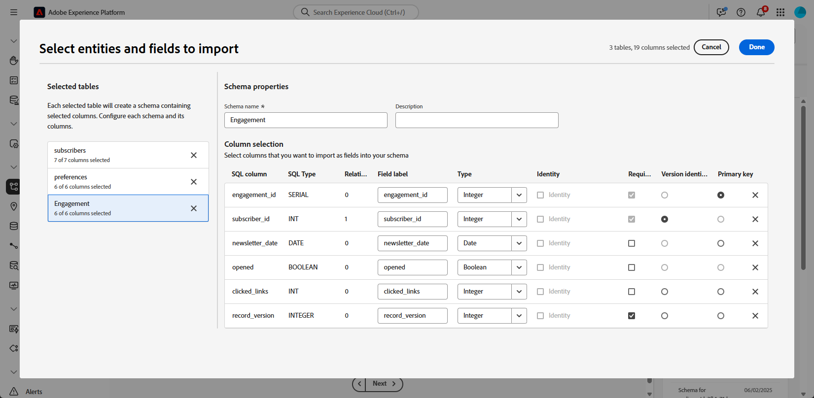
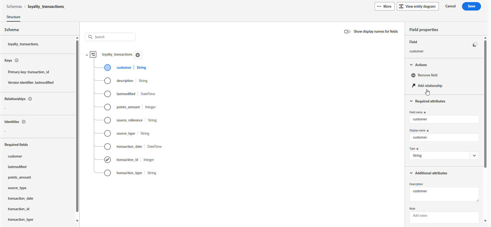

# 구성 단계 {#configuration-steps}

+++ 목차

| 오케스트레이션된 캠페인 시작 | 첫 오케스트레이션된 캠페인 시작 | 데이터베이스 쿼리 | 오케스트레이션된 캠페인 활동 |
|---|---|---|---|
| [오케스트레이션된 캠페인 시작](gs-orchestrated-campaigns.md)<br/><br/><b>[구성 단계](configuration-steps.md)</b><br/><br/>[오케스트레이션된 캠페인 액세스 및 관리](access-manage-orchestrated-campaigns.md) | [오케스트레이션된 캠페인 만들기에 대한 주요 단계](gs-campaign-creation.md)<br/><br/>[캠페인 만들기 및 예약](create-orchestrated-campaign.md)<br/><br/>[활동 오케스트레이션](orchestrate-activities.md)<br/><br/>[오케스트레이션된 캠페인으로 메시지 보내기](send-messages.md)<br/><br/>[캠페인 시작 및 모니터링](start-monitor-campaigns.md)<br/><br/>[보고](reporting-campaigns.md) | [규칙 빌더로 작업](orchestrated-rule-builder.md)<br/><br/>[첫 번째 쿼리 작성](build-query.md)<br/><br/>[표현식 편집](edit-expressions.md) | [활동 시작](activities/about-activities.md)<br/><br/>활동:<br/>[및 가입](activities/and-join.md) - [대상 작성](activities/build-audience.md) - [차원 변경](activities/change-dimension.md) - [결합](activities/combine.md) - [중복 제거](activities/deduplication.md) - [데이터 보강](activities/enrichment.md) - [포크](activities/fork.md) - [조정](activities/reconciliation.md) - [분할](activities/split.md) - [대기](activities/wait.md) |

{style="table-layout:fixed"}

+++

</br>

>[!BEGINSHADEBOX]

설명서 진행 중

>[!ENDSHADEBOX]

이 안내서에서는 관계형 스키마를 생성하고, 오케스트레이션된 캠페인에 대한 데이터 세트를 구성하고, S3 소스를 통해 데이터를 수집하고, 수집된 데이터를 AP 플랫폼에서 쿼리하는 프로세스를 안내합니다.

이 예제에서 설정에는 두 개의 주요 엔터티 **충성도 트랜잭션** 및 **충성도 보상**&#x200B;을(를) 통합하고 기존 핵심 엔터티 **수신자** 및 **브랜드**&#x200B;에 연결합니다.

1. [DDL 파일 업로드](#upload-ddl)

   필수 키 및 버전 관리 특성과 함께 **충성도 트랜잭션** 및 **충성도 보상** 엔터티를 포함하여 오케스트레이션된 캠페인에 대한 관계형 데이터 모델을 정의합니다.

1. [엔티티 선택](#entities)

   스키마의 테이블 간에 의미 있는 관계를 설정하여 서로 연결되고 일관된 데이터 모델을 만들 수 있습니다.

1. [링크 스키마](#link-schema)

   **충성도 트랜잭션** 엔터티를 **수신자**&#x200B;에 연결하고 **충성도 보상**&#x200B;을 **브랜드**&#x200B;에 연결하여 개인화된 고객 여정을 지원하는 연결된 데이터 모델을 구축합니다.

1. [데이터 수집](#ingest)

   SFTP, 클라우드 스토리지 또는 데이터베이스와 같이 지원되는 소스에서 Adobe Experience Platform으로 데이터를 가져옵니다.

## DDL 파일 업로드 {#upload-ddl}

이 섹션에서는 DDL(데이터 정의 언어) 파일을 업로드하여 Adobe Experience Platform 내에서 관계형 스키마를 생성하는 방법에 대한 단계별 지침을 제공합니다. DDL 파일을 사용하면 테이블, 속성, 키 및 관계를 포함하여 데이터 모델의 구조를 미리 정의할 수 있습니다.

1. AP 플랫폼에 로그인합니다.

1. **데이터 관리** > **스키마**&#x200B;로 이동합니다.

1. **스키마 만들기**&#x200B;를 클릭합니다.

1. 다음 두 스키마 유형 중에서 하나를 선택하라는 메시지가 표시됩니다.

   * **표준**
   * 오케스트레이션된 캠페인에 특히 사용되는 **Relational**

   

1. 엔터티 관계 다이어그램을 정의하고 스키마를 만들려면 **DDL 파일 업로드**&#x200B;를 선택하십시오.

   테이블 구조에는 다음이 포함되어야 합니다.
   * 하나 이상의 기본 키
   * `datetime` 또는 `number` 형식의 `lastmodified` 필드와 같은 버전 식별자입니다.

1. DDL 파일을 끌어다 놓고 **[!UICONTROL 다음]**&#x200B;을(를) 클릭합니다.

1. **[!UICONTROL 스키마 이름]**&#x200B;을(를) 입력하십시오.

1. 기본 키가 지정되도록 각 스키마와 해당 열을 설정합니다.

   `lastmodified`과(와) 같은 특성 하나를 버전 설명자로 지정해야 합니다. 일반적으로 `datetime`, `long` 또는 `int` 유형의 이 특성은 데이터 집합이 최신 데이터 버전으로 업데이트되도록 수집 프로세스에 필수적입니다.

   

1. 완료되면 **[!UICONTROL 완료]**&#x200B;를 클릭하세요.

이제 캔버스 내에서 테이블 및 필드 정의를 확인할 수 있습니다. [아래 섹션에서 자세히 알아보기](#entities)

## 엔티티 선택 {#entities}

스키마 내의 테이블 간에 논리적 연결을 정의하려면 아래 단계를 따르십시오.

1. 데이터 모델의 캔버스 보기에 액세스하고 연결할 두 테이블을 선택합니다

1. Source 조인 옆에 있는  단추를 클릭한 다음 화살표를 드래그하여 Target 조인 방향으로 안내하여 연결을 설정합니다.

   

1. 지정된 양식을 입력하여 링크를 정의하고 구성된 후 **적용**&#x200B;을 클릭합니다.

   

   **카디널리티**:

   * **1-N**: 원본 테이블의 발생 항목 하나는 대상 테이블의 여러 발생 항목을 가질 수 있지만, 대상 테이블의 발생 항목 하나는 원본 테이블의 해당 발생 항목을 최대 한 개까지 가질 수 있습니다.

   * **N-1**: 대상 테이블의 발생 항목 하나는 원본 테이블의 여러 발생 항목을 가질 수 있지만, 원본 테이블의 발생 항목 하나는 대상 테이블의 해당 발생 항목을 최대 한 개까지 가질 수 있습니다.

   * **1-1**: 원본 테이블의 발생 항목 하나는 대상 테이블의 해당 발생 항목을 최대 한 개까지 가질 수 있습니다.

1. 데이터 모델에 정의된 모든 링크는 캔버스 보기에서 화살표로 표시됩니다. 세부 정보를 보거나, 편집하거나, 필요에 따라 링크를 제거하려면 두 테이블 사이의 화살표를 클릭합니다.

   

1. 도구 모음을 사용하여 캔버스를 사용자 정의하고 조정합니다.

   

   * **확대**: 데이터 모델의 세부 정보를 더 명확하게 보려면 캔버스를 확대하십시오.

   * **축소**: 데이터 모델을 더 넓게 보려면 캔버스 크기를 줄이십시오.

   * **보기 맞춤**: 표시 영역 내의 모든 스키마에 맞게 확대/축소를 조정합니다.

   * **필터**: 캔버스 내에 표시할 스키마를 선택합니다.

   * **자동 레이아웃 강제 적용**: 더 나은 조직을 위해 스키마를 자동으로 정렬합니다.

   * **맵 표시**: 미니맵 오버레이를 전환하여 크거나 복잡한 스키마 레이아웃을 보다 쉽게 탐색할 수 있도록 합니다.

1. 완료되면 **저장**&#x200B;을 클릭하세요. 이 작업은 스키마 및 관련 데이터 세트를 만들고 오케스트레이션된 캠페인에서 사용할 데이터 세트를 활성화합니다.

1. **[!UICONTROL 작업 열기]**&#x200B;를 클릭하여 만들기 작업의 진행 상황을 모니터링합니다. 이 프로세스는 DDL 파일에 정의된 테이블 수에 따라 몇 분 정도 걸릴 수 있습니다.

   

## 링크 스키마 {#link-schema}

**충성도 트랜잭션** 스키마와 **수신자** 스키마 간의 관계를 설정하여 각 트랜잭션을 올바른 고객 레코드와 연결합니다.

1. **[!UICONTROL 스키마]**(으)로 이동하여 이전에 만든 **충성도 트랜잭션**&#x200B;을(를) 엽니다.

1. 고객 **[!UICONTROL 필드 속성]**&#x200B;에서 **[!UICONTROL 관계 추가]**&#x200B;를 클릭합니다.

   

1. **[!UICONTROL 다대일]**&#x200B;을(를) 관계 **[!UICONTROL 유형]**(으)로 선택합니다.

1. 기존 **수신자** 스키마에 대한 링크입니다.

   

1. **[!UICONTROL 현재 스키마의 관계 이름]** 및 **[!UICONTROL 참조 스키마의 관계 이름]**&#x200B;을 입력하십시오.

1. 변경 내용을 저장하려면 **[!UICONTROL 적용]**&#x200B;을 클릭하세요.

계속해서 **충성도 보상** 스키마와 **브랜드** 스키마 간의 관계를 만들어 각 보상 항목을 적절한 브랜드와 연결합니다.


## 데이터 수집 {#ingest}

Adobe Experience Platform을 사용하면 외부 소스에서 데이터를 수집할 수 있으며 Experience Platform 서비스를 사용하여 들어오는 데이터를 구조화하고, 레이블을 지정하고, 향상시킬 수 있습니다. Adobe 애플리케이션, 클라우드 기반 저장소, 데이터베이스 및 기타 여러 소스와 같은 다양한 소스에서 데이터를 수집할 수 있습니다.

1. **[!UICONTROL 연결]** 메뉴에서 **[!UICONTROL 원본]** 메뉴에 액세스합니다.

1. **[!UICONTROL 클라우드 저장소]** 범주를 선택한 다음 Amazon S3을 선택하고 **[!UICONTROL 데이터 추가]**&#x200B;를 클릭합니다.

   

1. S3 계정 연결:

   * 기존 계정 사용

   * 새 계정 사용

   [Adobe Experience Platform 설명서에서 자세히 알아보기](https://experienceleague.adobe.com/ko/docs/experience-platform/destinations/catalog/cloud-storage/amazon-s3#connect)

   

1. 이전에 만든 두 개의 폴더(예: **충성도 보상** 및 **충성도 거래**)를 찾을 때까지 연결된 S3 원본을 탐색합니다.

1. 폴더를 클릭합니다.

   폴더를 선택하면 동일한 구조의 현재 및 향후 모든 파일이 자동으로 처리되지만 파일을 선택하려면 새로운 데이터 증가마다 수동으로 업데이트해야 합니다.

   

1. 데이터 포맷을 선택하고 다음을 클릭합니다.


<!--manual
## Create a relational schema manual


1. Log in to the AP Platform.
1. Navigate to the **Schema Management** section.
1. Click on **Create Schema**.

1. You will be prompted to select between two schema types:
    * **Standard**
    * **Relational** (used specifically for AGO campaigns)

1. Click on **Create Manual**.
1. Provide a **Schema Name** (e.g., `test_demo_ck001`).
1. Choose **Schema Type**:
    - **Record Type** (required for AGO campaigns)
    - **Time Series** (not applicable here)
1. Click **Finish** to proceed to the schema design canvas.

## Select entities and fields to import

1. In the canvas, add attributes (fields) to your schema.
1. Add a **Primary Key** (mandatory).
1. Add a **Version Descriptor** attribute (for CDC support):
    - This must be of type **DateTime** or **Numeric** (Integer, Long, Short, Byte).
    - Common example: `last_modified`

> **Why?** The **Primary Key** uniquely identifies each record, and the **Version Descriptor** tracks changes, supporting CDC (Change Data Capture) and data mirroring.

1. Mark the appropriate fields as **Primary Key** and **Version Descriptor**.
1. Click **Save**.

---


## 5. Creating a Dataset

1. Navigate to **Datasets**.
1. Click on **Create Dataset**.
1. Select the schema you just created.
1. Assign a **Dataset Name** (same as schema is fine).
1. Optionally, add tags (e.g., `AGO_campaigns`).
6. Ensure the checkbox **"Relational Schema"** is checked.
7. Click **Finish**.

> **Note:** Only one dataset can be created per relational schema.


## 6. Enabling the Dataset

1. Click **Enable** for the dataset.
1. Wait a few moments for the status to show **Enabled**.

> **Why?** Without enabling, the dataset cannot be used in orchestrated campaigns or ingest data.

## 7. Creating a Data Source (S3)

1. Navigate to **Sources**.
1. Click **Create Source**.
1. Choose the source type (e.g., **S3 Bucket**).
1. Provide connection details:
    - Bucket Path (optionally include subfolder path)
1. Save the source.

## 8. Preparing and Uploading Data

1. Prepare your CSV file with:
    - Column headers matching your schema attributes
    - `last_modified` column
    - `change_type` column (`U`/`DU` for upsert, `D` for delete)

> **Important:** `change_type` is required but does not need to be defined in the schema.

1. Save the file as `.csv`.

1. Upload the file to the specified folder in your S3 bucket.


## 9. Ingesting Data from S3

1. Go to **Sources** and find your S3 source.
1. Click **Add Data**.
1. Select the uploaded file.
1. Specify the file format as **CSV** and any compression type if applicable.
1. Review the data preview (ensure `change_type`, `last_modified`, and primary key are visible).
1. Click **Next**.

### Enable Change Data Capture (CDC)

- Check **Enable Change Data Capture**.
- Select the dataset enabled for AGO campaigns.

### Field Mapping

- Fields are auto-mapped (note that `change_type` is not mapped and that's expected).
- Click **Next**.

### Scheduling

- Schedule ingestion frequency (minute, hour, day, week).
- Set start time (immediate or future).
- Click **Finish** to create the data flow.

## 10. Monitoring Data Flow

1. Navigate back to **Sources > Data Flows**.
1. Wait 4–5 minutes for the first run (initial overhead).
1. Monitor:
    - Status (Started, Completed)
    - Number of records ingested
    - Errors (if any)

> **Tip:** Ingested data first lands in the **Data Lake**.

## 11. Data Replication to Data Store

The **Data Store** is updated:

- Every **15 minutes**, or

- If **Data Lake size exceeds 5MB**

This is a background replication process.


## 12. Querying the Dataset

1. Navigate to **Query Services**.
1. Click **Create Query**.
1. Example query:

   ```sql
   SELECT * FROM test_demo_ck001;
   ```

1. Run the query.

> **Note:** If ingestion is incomplete, query will return an error. Check data flow status.

-->