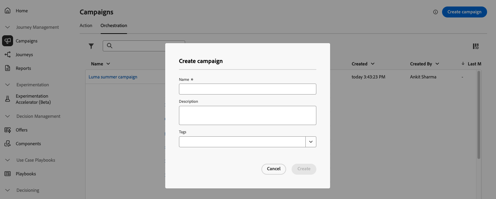

# 오케스트레이션된 캠페인 만들기 및 예약 {#create-first-campaign}

[!DNL Adobe Journey Optimizer]에서 오케스트레이션된 캠페인을 만들고 실행 일정을 구성하여 시작 시기와 실행 빈도를 제어합니다. 캠페인을 즉시 시작하거나, 특정 일시에 시작하거나, 되풀이 주기에 따라 시작하도록 일일, 주별 또는 월별 빈도 등 유연한 예약 옵션을 통해 선택합니다.

## 캠페인 만들기 {#create}

>[!CONTEXTUALHELP]
>id="ajo_campaign_creation_workflow"
>title="오케스트레이션된 캠페인 목록"
>abstract="**오케스트레이션** 탭에 오케스트레이션된 모든 캠페인이 나열됩니다. 오케스트레이션된 캠페인의 이름을 클릭하여 편집합니다. **오케스트레이션된 캠페인 만들기** 단추를 사용하여 새 오케스트레이션된 캠페인을 추가합니다."

오케스트레이션된 캠페인을 만들려면 다음 단계를 수행합니다.

1. **[!UICONTROL 캠페인]** 메뉴로 이동한 다음 **[!UICONTROL 오케스트레이션]** 탭을 선택합니다.

1. **[!UICONTROL 캠페인 만들기]** 단추를 클릭하고 **[!UICONTROL 오케스트레이션 - 마케팅]** 캠페인 유형을 선택합니다.

   

1. 캠페인 속성을 정의합니다. 이렇게 하려면 캠페인 이름 옆에 있는  단추를 클릭합니다.

   

   1. 캠페인에 대한 **[!UICONTROL 이름]** 및 **[!UICONTROL 설명]**&#x200B;을 입력하십시오.

   1. 캠페인에 대한 **[!UICONTROL 병합 정책]**&#x200B;을(를) 선택하십시오.

      [!DNL Adobe Experience Platform]에서 각 대상자는 프로필 정보를 결합하여 병합된 프로필을 형성하는 방법을 정의하는 특정 병합 정책에 연결됩니다. 대상 읽기 활동에서 병합 정책을 선택하면 동일한 병합 정책을 기반으로 하는 대상만 사용할 수 있습니다. 기본적으로 시스템은 기본 병합 정책을 사용하지만 필요한 경우 변경할 수 있습니다. 병합 정책에 대한 자세한 내용은 [Adobe Experience Platform 설명서](https://experienceleague.adobe.com/ko/docs/experience-platform/profile/merge-policies/overview){target="_blank"}를 참조하세요.

   1. **[!UICONTROL 태그]** 필드를 사용하여 Adobe Experience Platform 통합 태그를 캠페인에 지정하십시오. 이를 통해 오케스트레이션된 캠페인 목록에서 쉽게 분류하고 검색을 개선할 수 있습니다. [태그 작업 방법에 대해 알아보십시오](../start/search-filter-categorize.md#tags).

   1. **[!UICONTROL 저장]**&#x200B;을 클릭합니다.

## 캠페인 예약 {#schedule}

>[!CONTEXTUALHELP]
>id="ajo_orchestration_scheduler"
>title="스케줄러"
>abstract="캠페인 관리자는 특정 시간에 자동으로 캠페인이 시작되도록 일정을 예약하여 마케팅 커뮤니케이션을 위한 정확한 타이밍과 정확한 타기팅 데이터를 확보할 수 있습니다."

>[!CONTEXTUALHELP]
>id="ajo_orchestration_schedule_validity"
>title="스케줄러 유효성"
>abstract="스케줄러의 유효 기간을 정의할 수 있습니다. 영구적(기본값)이거나 특정 날짜까지 유효할 수 있습니다."

>[!CONTEXTUALHELP]
>id="ajo_orchestration_schedule_options"
>title="스케줄러 옵션"
>abstract="스케줄러의 빈도를 정의합니다. 특정 순간, 하루에 한 번 또는 여러 번, 일주일 또는 한 달로 실행할 수 있습니다."

기본적으로 오케스트레이션된 캠페인은 수동으로 활성화될 때 시작되고 관련 활동이 실행되면 종료됩니다. 실행을 지연하거나 반복적으로 캠페인을 실행하려는 경우 캠페인에 대한 일정을 정의할 수 있습니다.

최적의 성능과 예상 동작을 보장하기 위해 오케스트레이션된 캠페인을 예약할 때 다음 모범 사례를 고려하십시오.

* 오케스트레이션된 캠페인이 전체 시스템 성능을 저해하고 데이터베이스에 블록을 생성할 수 있으므로 15분 간격으로 실행되도록 예약하지 마십시오.
* 오케스트레이션된 캠페인에서 일회성 메시지를 보내려면 **한 번**&#x200B;을 실행하도록 설정할 수 있습니다.
* 오케스트레이션된 캠페인에서 반복 메시지를 보내려면 **예약** 옵션을 사용하고 실행 빈도를 설정해야 합니다. 반복 게재 활동에서는 일정을 정의할 수 없습니다.

캠페인 일정을 구성하려면 다음 단계를 수행합니다.

1. 캠페인을 열고 **[!UICONTROL 빠른 시일 내에]** 버튼을 클릭합니다.

   

1. 캠페인의 실행 빈도를 선택한 다음 사용 가능한 옵션을 구성합니다. 설정은 선택한 빈도에 따라 다릅니다.

   +++한 번

   지정한 일시에 캠페인을 한 번 실행합니다.

   * **[!UICONTROL 날짜]**: 캠페인을 실행할 날짜를 선택합니다.
   * **[!UICONTROL 시간]**: 캠페인을 실행할 특정 시간을 선택합니다.

   +++

   +++일별

   매일 또는 선택한 날에 캠페인을 실행합니다.

   * **[!UICONTROL 매일 반복]**: 캠페인의 실행 빈도를 선택합니다.
      * **[!UICONTROL 매일]**: 주말을 포함하여 매일 캠페인을 실행합니다.
      * **[!UICONTROL 평일]**: 월요일부터 금요일까지만 캠페인을 실행합니다.
      * **[!UICONTROL 특정 기간 동안]**: 정의한 날짜 범위(예: 7월 1일부터 7월 15일까지) 내에 매일 캠페인을 실행합니다. 이 범위 밖에서는 캠페인이 실행되지 않습니다.
      * **[!UICONTROL 선택한 요일]**: 지정한 요일(예: 월요일, 수요일, 금요일)에만 캠페인을 실행합니다.

   * **[!UICONTROL 시작 시간]**: 매일 캠페인을 실행할 시간을 정의합니다.

   +++

   +++일별 몇 회

   같은 날 캠페인을 여러 번 실행합니다. 특정 시간을 선택하거나 주기에 따른 빈도를 설정할 수 있습니다.

   * **[!UICONTROL 선택한 시간]**: 캠페인을 실행할 특정 시간을 선택하고 일별 반복을 구성합니다(매일 또는 특정 요일에 실행).
   * **[!UICONTROL 주기별]**: 매 n분 또는 시간마다 캠페인을 실행하도록 선택합니다. 실행이 허용된 날짜 내에서 시간 범위를 정의할 수도 있습니다.

   +++

   +++주별

   캠페인을 매주 실행합니다. 특정 날짜에 대한 옵션을 사용할 수 있습니다.

   * **[!UICONTROL 빈도]**: 캠페인을 실행할 빈도(예: 매주, 2주마다)를 선택합니다.
   * **[!UICONTROL 다음 날짜부터 시작]**: 반복을 시작할 날짜를 선택합니다.
   * **[!UICONTROL 매일 반복]**: 실행할 특정 요일(예: 매주 월요일 및 목요일)을 선택합니다.
   * **[!UICONTROL 시작 시간]**: 선택한 날짜에 캠페인을 실행할 시간을 설정합니다.

   +++

   +++월별

   캠페인을 매월 실행합니다. 특정 날짜에 대한 옵션을 사용할 수 있습니다.

   * **[!UICONTROL 월별 반복]**: 캠페인을 매월 실행할지 또는 특정 달에만 실행할지 선택합니다.
   * **[!UICONTROL 일별 반복]**:
      * **[!UICONTROL 매일]**: 주말을 포함하여 해당 월의 모든 날에 캠페인을 실행합니다.
      * **[!UICONTROL 매월 마지막 날]**: 매월 마지막 날(예: 1월 31일, 2월 28/29일)에만 캠페인을 실행합니다.
      * **[!UICONTROL 특정 날짜(예: 15일)]**: 지정한 날(예: 매월 15일)에 캠페인을 실행합니다.
      * **[!UICONTROL 첫 번째/마지막 또는 n번째 요일]**(예: 첫 번째 월요일):      지정된 요일(예: 매주 15일)에 캠페인을 실행합니다.
      * **[!UICONTROL 선택한 요일]**: 지정한 날짜에 캠페인을 실행합니다.

   * **[!UICONTROL 시작 시간]**: 캠페인을 실행할 시간을 설정합니다.

   +++

1. 특정 시작 및 종료 날짜를 정의하고 한정된 기간 동안 캠페인 실행을 제한하려면 **[!UICONTROL 유효 기간]** 설정을 사용합니다.

1. 되풀이 일정의 경우 **[!UICONTROL 시작 시간 미리 보기]** 버튼을 클릭하여 현재 구성을 기반으로 정확한 예정 실행 날짜 및 시간을 미리 볼 수 있습니다. 이렇게 하면 활성화 전에 일정을 확인하여 캠페인이 예상대로 실행되도록 할 수 있습니다.

>[!NOTE]
>
>[!DNL Adobe Journey Optimizer]에서 캠페인을 예약할 때는 시작 날짜/시간이 원하는 첫 번째 게재에 맞춰졌는지 확인합니다. 반복 캠페인의 경우 초기 예약 시간이 이미 경과했을 때는 캠페인이 반복 규칙에 따라 다음 사용 가능한 시간 슬롯으로 넘어갑니다.

다음 예에서는 오케스트레이션된 캠페인이 2025년 10월 1일부터 2026년 1월 1일까지 매주 오전 9시와 12시에 하루에 두 번 실행되도록 활동이 구성됩니다.

{width="50%" align="left"}

## 다음 단계 {#next}

캠페인 설정과 일정이 구성되면 수행할 다양한 작업의 오케스트레이션을 시작할 수 있습니다. [캠페인 활동을 조율하는 방법 알아보기](../orchestrated/orchestrate-activities.md)
