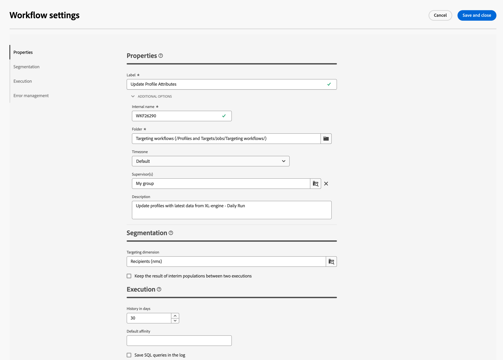

# 오케스트레이션된 캠페인 만들기 {#create-first-campaign}

>[!CONTEXTUALHELP]
>id="ajo_campaign_creation_workflow"
>title="오케스트레이션된 캠페인 목록"
>abstract="**다단계** 탭에는 모든 오케스트레이션된 캠페인이 나열됩니다. 오케스트레이션된 캠페인의 이름을 클릭하여 편집할 수 있습니다. 오케스트레이션된 새 캠페인을 추가하려면 **오케스트레이션된 캠페인 만들기** 버튼을 사용합니다."

+++ 목차

| 오케스트레이션된 캠페인 시작 | 오케스트레이션된 첫 번째 캠페인 시작 | 데이터베이스 쿼리 | 오케스트레이션된 캠페인 활동 |
|---|---|---|---|
| [오케스트레이션된 캠페인 시작](gs-orchestrated-campaigns.md)  [구성 단계](configuration-steps.md)  [오케스트레이션된 캠페인 액세스 및 관리](access-manage-orchestrated-campaigns.md) | [오케스트레이션된 캠페인 만들기에 대한 주요 단계](gs-campaign-creation.md)  <b>[캠페인 만들기 및 구성](create-orchestrated-campaign.md)</b>  [활동 오케스트레이션](orchestrate-activities.md)  [오케스트레이션된 캠페인으로 메시지 보내기](send-messages.md)  [캠페인 시작 및 모니터링](start-monitor-campaigns.md)  [보고](reporting-campaigns.md) | [규칙 빌더로 작업](orchestrated-rule-builder.md)  [첫 번째 쿼리 작성](build-query.md)  [표현식 편집](edit-expressions.md) | [활동 시작](activities/about-activities.md)  활동: [및 가입](activities/and-join.md) - [대상 작성](activities/build-audience.md) - [차원 변경](activities/change-dimension.md) - [결합](activities/combine.md) - [중복 제거](activities/deduplication.md) - [데이터 보강](activities/enrichment.md) - [포크](activities/fork.md) - [조정](activities/reconciliation.md) - [분할](activities/split.md) - [대기](activities/wait.md) |

{style="table-layout:fixed"}

+++

 

## 캠페인 만들기 {#create}

오케스트레이션된 캠페인을 만들려면 다음 단계를 수행합니다.

1. **캠페인** 메뉴로 이동합니다.

1. 화면 오른쪽 상단의 **[!UICONTROL 오케스트레이션된 캠페인 만들기]** 단추를 클릭합니다.

1. 오케스트레이션된 캠페인 **속성** 대화 상자에서 오케스트레이션된 캠페인을 만드는 데 사용할 템플릿을 선택합니다(기본 제공 템플릿을 사용할 수도 있음). [오케스트레이션된 캠페인 템플릿에 대해 자세히 알아보세요](#campaign-templates).

1. 오케스트레이션된 캠페인의 레이블을 입력합니다. 또한 오케스트레이션된 캠페인에 화면 **[!UICONTROL 추가 옵션]** 섹션의 전용 필드에 설명을 추가하는 것이 좋습니다.

1. 오케스트레이션된 캠페인에 대한 추가 설정을 구성하려면 **[!UICONTROL 추가 옵션]** 섹션을 확장합니다.

1. **[!UICONTROL 오케스트레이션된 캠페인 만들기]** 단추를 클릭하여 오케스트레이션된 캠페인 만들기를 확인합니다.

이제 오케스트레이션된 캠페인이 생성되어 워크플로 목록에서 사용할 수 있습니다. 이제 해당 시각적 캔버스에 액세스하여 수행할 작업을 추가, 구성 및 오케스트레이션할 수 있습니다. [오케스트레이션된 캠페인 활동을 오케스트레이션하는 방법을 알아보세요](orchestrate-activities.md).

## 캠페인 설정 구성 {#settings}

<!--Overview of new admin settings> schemas, execution fields, merge policy. [Learn more](configuration-steps.md)-->

캔버스에서 오케스트레이션된 캠페인을 만들거나 오케스트레이션된 캠페인 활동을 오케스트레이션할 때 오케스트레이션된 캠페인과 관련된 고급 설정에 액세스할 수 있습니다. 예를 들어 오케스트레이션된 캠페인에 대한 특정 시간대를 설정하거나, 오류 발생 시 오케스트레이션된 캠페인이 작동하는 방식을 관리하거나, 오케스트레이션된 캠페인 내역을 삭제해야 하는 지연을 관리할 수 있습니다.

이러한 설정은 오케스트레이션된 캠페인을 만들 때 선택한 템플릿에 사전 구성되어 있지만, 필요에 따라 특정 오케스트레이션된 캠페인에 대해 편집할 수 있습니다.

{zoomable="yes"}{width="70%" align="left"}

### 오케스트레이션된 캠페인 속성 {#properties}

>[!CONTEXTUALHELP]
>id="ajo_workflow_settings_properties"
>title="오케스트레이션된 캠페인 속성"
>abstract="이 섹션에서는 오케스트레이션된 캠페인을 만들 때에도 액세스할 수 있는 오케스트레이션된 일반 캠페인 속성을 제공합니다. 오케스트레이션된 캠페인을 만들고 레이블을 지정하는 데 사용할 템플릿을 선택할 수 있습니다. 폴더 또는 시간대를 저장하는 오케스트레이션된 캠페인과 같은 특정 설정을 구성하려면 추가 옵션 섹션을 확장합니다."

**[!UICONTROL 속성]** 섹션은 오케스트레이션된 캠페인을 만들 때 구성할 수 있는 일반 설정을 제공합니다. 오케스트레이션된 기존 캠페인의 속성에 액세스하려면 오케스트레이션된 캠페인 캔버스 위의 작업 표시줄에서 사용할 수 있는 **[!UICONTROL 설정]** 단추를 클릭하십시오.

{zoomable="yes"}{width="70%" align="left"}

이러한 속성은 다음과 같습니다.

* 목록에 표시되는 오케스트레이션된 캠페인의 **[!UICONTROL 레이블]**.
* 오케스트레이션된 캠페인의 **[!UICONTROL 내부 이름]**&#x200B;입니다.
* 오케스트레이션된 캠페인을 저장할 **[!UICONTROL 폴더]**&#x200B;입니다.
* 오케스트레이션된 모든 캠페인의 활동에서 사용할 기본 **[!UICONTROL 시간대]**입니다. 기본적으로 오케스트레이션된 캠페인의 시간대는 현재 캠페인 연산자에 대해 정의된 시간대입니다.
가능한 값:
   * Adobe Experience Platform 조직의 시간대를 사용할 **서버 시간대**
   * 오케스트레이션된 캠페인을 실행하는 연산자의 시간대를 사용하는 **연산자 시간대**
   * 데이터베이스 서버의 시간대를 사용하려면 **데이터베이스의 시간대**
   * 특정 시간대
* 오케스트레이션된 캠페인이 실패하면 **[!UICONTROL 감독자]** 필드에서 선택한 운영자 그룹에 속하는 운영자에게 전자 메일로 알림이 전송됩니다.
* 오케스트레이션된 캠페인의 **[!UICONTROL 설명]**&#x200B;을 입력할 수도 있습니다.

### 세분화 설정  {#segmentation-settings}

>[!CONTEXTUALHELP]
>id="ajo_workflow_settings_segmentation"
>title="세분화 설정"
>abstract="이 섹션에서는 오케스트레이션된 캠페인에서 프로필을 타기팅할 타기팅 차원을 선택하고 두 실행 간에 워크플로 결과를 유지하도록 선택할 수 있습니다. 이 옵션은 테스트 목적으로만 사용해야 하며 오케스트레이션된 프로덕션 캠페인에서 활성화해서는 안 됩니다."

* **[!UICONTROL 타겟팅 차원]**: 프로필 타겟팅에 사용할 타겟팅 차원(수신자, 계약 수혜자, 운영자, 구독자 등)을 선택하십시오.

* **[!UICONTROL 두 실행 사이의 중간 모집단 결과를 유지합니다]**: 기본적으로 오케스트레이션된 캠페인의 마지막 실행에 대한 작업 테이블만 유지됩니다. 이전 실행의 작업 테이블은 매일 실행되는 기술 오케스트레이션된 캠페인에 의해 삭제됩니다.

  이 옵션을 활성화하면 오케스트레이션된 캠페인이 실행된 후에도 작업 테이블이 유지됩니다. 테스트 목적으로 사용할 수 있으므로 개발 또는 스테이징 환경에서 **전용**&#x200B;을 사용해야 합니다. 프로덕션 오케스트레이션된 캠페인에서는 확인하지 않아야 합니다.

### 실행 설정  {#exec-settings}

>[!CONTEXTUALHELP]
>id="ajo_workflow_settings_execution"
>title="실행 설정"
>abstract="이 섹션에서는 오케스트레이션된 캠페인 기록이 유지되는 일수와 같이 워크플로 실행과 관련된 설정을 구성할 수 있습니다."

* **[!UICONTROL 일 단위 기록]**: 기록을 제거해야 하는 일 수를 지정합니다. 기록에는 오케스트레이션된 캠페인과 관련된 요소, 즉 로그, 작업, 이벤트(오케스트레이션된 캠페인 작업에 연결된 기술 개체)가 포함되어 있습니다. 기본 값은 즉시 사용 가능한 오케스트레이션된 캠페인 템플릿의 30일입니다. 기록 제거는 기본적으로 매일 실행되는 데이터베이스 정리 기술 오케스트레이션 캠페인에 의해 수행됩니다

  >[!IMPORTANT]
  >
  >**[!UICONTROL 일별 기록]** 필드를 비워두면 해당 값이 “1”로 간주되어 1일 후에 기록이 제거됩니다.

* **[!UICONTROL 기본 선호도]**: 설치에 오케스트레이션된 캠페인 서버가 여러 개 포함된 경우 이 필드를 사용하여 오케스트레이션된 캠페인이 실행될 서버를 지정합니다. 이렇게 하면 특정 서버에서 오케스트레이션된 캠페인을 강제 실행합니다. 기존 선호도 이름을 선택할 수 있지만 공백이나 구두점을 사용하지 않아야 합니다. 다른 서버를 사용하는 경우 쉼표로 구분하여 다른 이름을 지정합니다.

  >[!IMPORTANT]
  >
  >이 필드에 정의된 값이 서버에 없는 경우 오케스트레이션된 캠페인은 보류 상태로 유지됩니다.

* **[!UICONTROL 로그에 SQL 쿼리 저장]**: workflmulti-step campaignow의 SQL 쿼리를 로그에 저장하려면 이 옵션을 선택하십시오. 이 기능은 고급 사용자용으로 예약되어 있습니다. **[!UICONTROL 대상자 작성]**&#x200B;과 같은 타깃팅 활동을 포함하는 오케스트레이션된 캠페인에 적용됩니다. 이 옵션을 활성화하면 오케스트레이션된 캠페인 실행 중 데이터베이스로 전송된 SQL 쿼리가 오케스트레이션된 캠페인 로그에 표시되므로 이를 분석하여 쿼리를 최적화하거나 문제를 진단할 수 있습니다.

### 오류 관리 설정  {#error-settings}

>[!CONTEXTUALHELP]
>id="ajo_workflow_settings_error"
>title="오류 관리 설정"
>abstract="이 섹션에서는 오케스트레이션된 캠페인을 통해 실행 중 오류를 관리하는 방법을 정의할 수 있습니다. 프로세스를 일시 중지하거나, 특정 수의 오류를 무시하거나, 오케스트레이션된 캠페인 실행을 중지하도록 선택할 수 있습니다."

* **[!UICONTROL 오류 관리]**: 이 필드를 사용하면 오케스트레이션된 캠페인 작업에 오류가 있는 경우 수행할 작업을 정의할 수 있습니다. 다음과 같은 세 가지 옵션이 있습니다.

   * **[!UICONTROL 프로세스 일시 중단]**: 오케스트레이션된 캠페인이 자동으로 일시 중지되고 상태가 **[!UICONTROL 실패]**(으)로 변경됩니다. 문제가 해결되면 **[!UICONTROL 다시 시작]** 단추를 사용하여 오케스트레이션된 캠페인을 다시 시작합니다.
   * **[!UICONTROL 무시]**: 오류를 트리거한 작업의 상태가 **[!UICONTROL 실패]**(으)로 변경되지만 오케스트레이션된 캠페인은 **[!UICONTROL 시작됨]** 상태를 유지합니다. <!-- TO ADD ONCE SCHEUDLER IS AVAILABLE This configuration is relevant for recurring tasks: if the branch includes a scheduler, it will start normally next time the workflow is executed.-->
   * **[!UICONTROL 프로세스 중단]**: 오케스트레이션된 캠페인이 자동으로 중지되고 상태가 **[!UICONTROL 실패]**(으)로 변경됩니다. 문제가 해결되면 **[!UICONTROL 시작]** 단추를 사용하여 오케스트레이션된 캠페인을 다시 시작하십시오.

* **[!UICONTROL 연속 오류]**: **[!UICONTROL 오류의 경우]** 필드에서 **[!UICONTROL 무시]** 값을 선택하면 이 필드를 사용할 수 있습니다. 프로세스가 중지되기 전에 무시할 수 있는 오류 수를 지정할 수 있습니다. 이 수에 도달하면 오케스트레이션된 캠페인 상태가 **[!UICONTROL 실패]**(으)로 변경됩니다. 이 필드의 값이 0이면 오류 수에 관계없이 오케스트레이션된 캠페인은 중지되지 않습니다.

## 오케스트레이션된 캠페인 템플릿 작업 {#campaign-templates}

>[!CONTEXTUALHELP]
>id="ajo_workflow_template_for_campaign"
>title="오케스트레이션된 캠페인 템플릿"
>abstract="오케스트레이션된 캠페인 템플릿에는 오케스트레이션된 새 캠페인을 만드는 데 재사용할 수 있는 사전 구성된 설정과 활동이 포함되어 있습니다."

>[!CONTEXTUALHELP]
>id="ajo_workflow_template_creation_properties"
>title="오케스트레이션된 캠페인 속성"
>abstract="오케스트레이션된 캠페인 템플릿에는 오케스트레이션된 새 캠페인을 만드는 데 재사용할 수 있는 사전 구성된 설정과 활동이 포함되어 있습니다. 이 화면에서는 오케스트레이션된 캠페인 템플릿의 레이블을 입력하고 내부 이름, 폴더 및 실행 폴더, 시간대, 감독자 그룹 등의 설정을 구성합니다."

오케스트레이션된 캠페인 템플릿에는 오케스트레이션된 새 캠페인을 만드는 데 재사용할 수 있는 사전 구성된 설정과 활동이 포함되어 있습니다. 오케스트레이션된 캠페인을 생성할 때 오케스트레이션된 캠페인 속성에서 오케스트레이션된 캠페인의 템플릿을 선택할 수 있습니다. 기본적으로 빈 템플릿이 제공됩니다.

오케스트레이션된 기존 캠페인으로 템플릿을 만들거나 처음부터 새 템플릿을 만들 수 있습니다. 두 방법 모두 아래에 자세히 설명되어 있습니다.

>[!BEGINTABS]

>[!TAB 오케스트레이션된 기존 캠페인에서 템플릿을 만듭니다]

기존의 오케스트레이션된 캠페인으로 오케스트레이션된 캠페인 템플릿을 만들려면 다음 단계를 수행합니다.

1. **Campaign** 메뉴를 열고 조정된 캠페인으로 이동하여 템플릿으로 저장합니다.
1. 오케스트레이션된 캠페인의 이름 오른쪽에 있는 세 점을 클릭하고 **템플릿으로 복사**&#x200B;를 선택합니다.
1. 팝업 창에서 템플릿 만들기를 확인합니다.
1. 오케스트레이션된 캠페인 템플릿 캔버스에서 필요에 따라 활동을 확인, 추가 및 구성합니다.
1. **설정** 단추에서 설정으로 이동하여 오케스트레이션된 캠페인 템플릿의 이름을 변경하고 설명을 입력하십시오.
1. 템플릿의 **폴더** 및 **실행 폴더**&#x200B;를 선택하십시오. 폴더는 오케스트레이션된 캠페인 템플릿이 저장된 위치입니다. 실행 폴더는 이 템플릿을 기반으로 생성된 오케스트레이션된 캠페인이 저장되는 폴더입니다.
1. 변경 내용을 저장합니다.

이제 오케스트레이션된 캠페인 템플릿을 템플릿 목록에서 사용할 수 있습니다. 이 템플릿을 기반으로 오케스트레이션된 캠페인을 만들 수 있습니다. 이 오케스트레이션된 캠페인은 템플릿에 정의된 설정 및 활동으로 사전 구성됩니다.

>[!TAB 처음부터 템플릿을 만듭니다]

오케스트레이션된 캠페인 템플릿을 처음부터 만들려면 다음 단계를 수행하십시오.

1. **캠페인** 메뉴를 열고 **템플릿** 탭으로 이동합니다. 사용 가능한 오케스트레이션된 캠페인 템플릿 목록을 볼 수 있습니다.
1. 화면 오른쪽 상단의 **[!UICONTROL 템플릿 만들기]** 단추를 클릭합니다.
1. 레이블을 입력하고 추가 옵션을 열어 오케스트레이션된 캠페인 템플릿에 대한 설명을 입력합니다.
1. 템플릿의 폴더 및 실행 폴더를 선택합니다. 폴더는 오케스트레이션된 캠페인 템플릿이 저장된 위치입니다. 실행 폴더는 이 템플릿을 기반으로 생성된 오케스트레이션된 캠페인이 저장되는 폴더입니다.
1. **만들기** 단추를 클릭하여 설정을 확인합니다.
1. 오케스트레이션된 캠페인 템플릿 캔버스에서 필요에 따라 활동을 추가하고 구성합니다.

   {zoomable="yes"}

1. 변경 내용을 저장합니다.

이제 오케스트레이션된 캠페인 템플릿을 템플릿 목록에서 사용할 수 있습니다. 이 템플릿을 기반으로 오케스트레이션된 캠페인을 만들 수 있습니다. 이 오케스트레이션된 캠페인은 템플릿에 정의된 설정 및 활동으로 사전 구성됩니다.

>[!ENDTABS]
