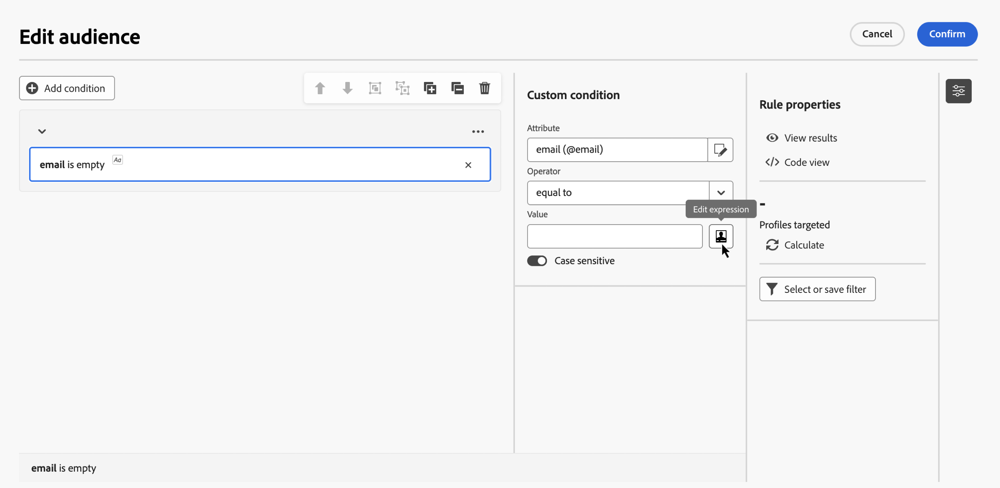

# 표현식 편집 {#edit-expressions}

+++ 목차

| 오케스트레이션된 캠페인 시작 | 첫 오케스트레이션된 캠페인 시작 | 데이터베이스 쿼리 | 오케스트레이션된 캠페인 활동 |
|---|---|---|---|
| [오케스트레이션된 캠페인 시작](gs-orchestrated-campaigns.md)  관계형 스키마 및 데이터 세트 만들기 및 관리:  <ul><li>[스키마 및 데이터 세트 시작](gs-schemas.md)</li><li>[수동 스키마](manual-schema.md)</li><li>[파일 업로드 스키마](file-upload-schema.md)</li><li>[데이터 수집](ingest-data.md)</li></ul>[오케스트레이션된 캠페인 액세스 및 관리](access-manage-orchestrated-campaigns.md)  [오케스트레이션된 캠페인을 만드는 주요 단계](gs-campaign-creation.md) | [캠페인 만들기 및 예약](create-orchestrated-campaign.md)  [활동 오케스트레이션](orchestrate-activities.md)  [캠페인 시작 및 모니터링](start-monitor-campaigns.md)  [보고](reporting-campaigns.md) | [규칙 빌더로 작업](orchestrated-rule-builder.md)  [첫 번째 쿼리 빌드](build-query.md)  <b>[표현식 편집](edit-expressions.md)</b>  [재타겟팅](retarget.md) | [활동 시작](activities/about-activities.md)  활동: [및 가입](activities/and-join.md) - [대상 작성](activities/build-audience.md) - [차원 변경](activities/change-dimension.md) - [채널 활동](activities/channels.md) - [결합](activities/combine.md) - [중복 제거](activities/deduplication.md) - [데이터 보강](activities/enrichment.md) - [포크](activities/fork.md) - [조정](activities/reconciliation.md) - [대상 저장](activities/save-audience.md) - [분할](activities/split.md) - [대기](activities/wait.md) |

{style="table-layout:fixed"}

+++
 

>[!BEGINSHADEBOX]

 

콘텐츠

이 페이지의 컨텐츠는 최종본이 아니며, 변경될 수 있습니다.

>[!ENDSHADEBOX]

>[!NOTE]
>
>아래 섹션에서는 표현식 편집기를 사용하여 규칙을 작성하는 방법에 대한 정보를 제공합니다. 규칙을 만드는 데 사용되는 구문은 개인화를 추가하는 데 사용되는 구문과 다릅니다.

## 표현식 편집기 작업 {#edit}

표현식을 편집하려면 수동으로 조건을 입력하여 규칙을 만듭니다. 이 모드에서는 날짜, 문자열, 숫자 필드 및 정렬과 같은 특정 쿼리를 수행하는 데 사용되는 값을 조작할 수 있는 고급 함수를 사용할 수 있습니다.

표현식 편집기는 규칙 빌더 **[!UICONTROL 표현식 편집]** 단추에서 사용할 수 있으며, 사용자 지정 조건을 구성할 때 **[!UICONTROL 특성]** 및 **[!UICONTROL 값]** 필드에 사용할 수 있습니다.

| **특성** 필드에서 액세스 | **값** 필드에서 액세스 |
| --- | --- |
| {zoomable="yes"}{width="200" align="center" zoomable="yes"} | {zoomable="yes"}{width="200" align="center" zoomable="yes"} |

표현식 편집기에서 제공하는 사항:

* 식이 정의된 **입력 필드(1)**.
* 식에 사용할 수 있고 쿼리의 타겟팅 차원에 해당하는 사용 가능한 **필드(2)**&#x200B;의 목록입니다.
* 범주별로 정렬된 **도우미 함수(3)**.

입력 필드에 직접 표현식을 입력하여 표현식을 편집합니다. 필드나 도우미 함수를 추가하려면 추가할 식에 커서를 놓고 + 단추를 클릭합니다.

{zoomable="yes"}

## 도우미 기능

쿼리 편집 도구를 사용하면 고급 함수를 사용하여 원하는 결과와 조작된 데이터 유형에 따라 복잡한 필터링을 수행할 수 있습니다. 다음 기능을 사용할 수 있습니다.

### 집계

집계 함수는 값 집합에 대해 계산을 수행합니다.

<table>
<tbody>
<tr>
<td><strong>이름</strong></td>
<td><strong>설명</strong></td>
<td><strong>구문</strong></td>
</tr>
<tr>
<td><strong>평균</strong></td>
<td>숫자 유형 열의 평균 반환</td>
<td>Avg(&lt;값&gt;)</td>
</tr>
<tr>
<td><strong>계수</strong></td>
<td>열의 null이 아닌 값 계산</td>
<td>Count(&lt;값&gt;)</td>
</tr>
<tr>
<td><strong>CountAll</strong></td>
<td>반환된 값 계산(모든 필드)</td>
<td>CountAll()</td>
</tr>
<tr>
<td><strong>Countdistinct</strong></td>
<td>열의 null이 아닌 개별 값 계산</td>
<td>Countdistinct(&lt;값&gt;)</td>
</tr>
<tr>
<td><strong>최대</strong></td>
<td>숫자, 문자열 또는 날짜 유형 열의 최대값 반환</td>
<td>Max(&lt;값&gt;)</td>
</tr>
<tr>
<td><strong>최소</strong></td>
<td>숫자, 문자열 또는 날짜 유형 열의 최소값 반환</td>
<td>Min(&lt;값&gt;)</td>
</tr>
<tr>
<td><strong>표준 개발</strong></td>
<td>숫자, 문자열 또는 날짜 열의 표준 편차 반환</td>
<td>StdDev(&lt;값&gt;)</td>
</tr>
<tr>
<td><strong>문자열 집계</strong></td>
<td>두 번째 인수의 문자로 구분된 문자열 형식 열의 값 연결을 반환합니다.</td>
<td>StringAgg(&lt;값&gt;, &lt;문자열&gt;)</td>
</tr>
<tr>
<td><strong>합계</strong></td>
<td>숫자, 문자열 또는 날짜 유형 열 값의 합계 반환</td>
<td>Sum(&lt;값&gt;)</td>
</tr>
</tbody>
</table>

### 일자

날짜 함수는 날짜 또는 시간 값을 조작합니다.

<table>
<tbody>
<tr>
<td><strong>이름</strong></td>
<td><strong>설명</strong></td>
<td><strong>구문</strong></td>
</tr>
<tr>
<td><strong>AddDays</strong></td>
<td>날짜에 일자 숫자 추가</td>
<td>AddDays(&lt;날짜&gt;, &lt;숫자&gt;)</td>
</tr>
<tr>
<td><strong>AddHour</strong></td>
<td>날짜에 시간(시) 숫자 추가</td>
<td>AddHours(&lt;날짜&gt;, &lt;숫자&gt;)</td>
</tr>
<tr>
<td><strong>AddMinutes</strong></td>
<td>날짜에 시간(분) 숫자 추가</td>
<td>AddMinutes(&lt;날짜&gt;, &lt;숫자&gt;)</td>
</tr>
<tr>
<td><strong>AddMonth</strong></td>
<td>날짜에 개월 숫자 추가</td>
<td>AddMonths(&lt;날짜&gt;, &lt;숫자&gt;)</td>
</tr>
<tr>
<td><strong>AddSeconds</strong></td>
<td>날짜에 시간(초) 숫자 추가</td>
<td>AddSeconds(&lt;날짜&gt;, &lt;숫자&gt;)</td>
</tr>
<tr>
<td><strong>AddYears</strong></td>
<td>날짜에 연도 숫자 추가</td>
<td>AddYears(&lt;날짜&gt;, &lt;숫자&gt;)</td>
</tr>
<tr>
<td><strong>변환 NTZ</strong></td>
<td>타임스탬프 NTZ(timestamp without timezone)를 정의된 세션 TZ가 적용된 TZ(timestamp with timezone)로 변환</td>
<td>ConvertNTZ(&lt;날짜+시간&gt;)</td>
</tr>
<tr>
<td><strong>DateCmp</strong></td>
<td>두 날짜 비교</td>
<td>DateCmp(&lt;날짜&gt;, &lt;날짜&gt;)</td>
</tr>
<tr>
<td><strong>DateOnly</strong></td>
<td>날짜만 반환(00:00 시간 포함)</td>
<td>DateOnly(&lt;날짜&gt;)</td>
</tr>
<tr>
<td><strong>일</strong></td>
<td>날짜의 일자를 나타내는 숫자 반환</td>
<td>Day(&lt;날짜&gt;)</td>
</tr>
<tr>
<td><strong>DayOfYear</strong></td>
<td>날짜의 연도를 반환합니다.</td>
<td>DayOfYear(&lt;날짜&gt;)</td>
</tr>
<tr>
<td><strong>일 전</strong></td>
<td>현재 날짜에서 n일을 뺀 날짜 반환</td>
<td>DaysAgo(&lt;숫자&gt;)</td>
</tr>
<tr>
<td><strong>DaysAgoInt</strong></td>
<td>현재 날짜에서 n일을 뺀 날짜(정수 yymmdd) 반환</td>
<td>DaysAgoInt(&lt;숫자&gt;)</td>
</tr>
<tr>
<td><strong>DaysDiff</strong></td>
<td>두 날짜 사이의 일자 수를 반환합니다.</td>
<td>DaysDiff(&lt;종료 날짜&gt;, &lt;시작 날짜&gt;)</td>
</tr>
<tr>
<td><strong>DaysOld</strong></td>
<td>날짜를 일 단위로 반환</td>
<td>DaysOld(&lt;날짜&gt;)</td>
</tr>
<tr>
<td><strong>GetDate</strong></td>
<td>서버의 현재 시스템 날짜 반환</td>
<td>GetDate()</td>
</tr>
<tr>
<td><strong>시간</strong></td>
<td>날짜의 시간 반환</td>
<td>Hour(&lt;날짜&gt;)</td>
</tr>
<tr>
<td><strong>HoursDiff</strong></td>
<td>두 날짜 사이의 시간(시) 숫자 반환</td>
<td>HoursDiff(&lt;종료 날짜&gt;, &lt;시작 날짜&gt;)</td>
</tr>
<tr>
<td><strong>분</strong></td>
<td>날짜의 시간(분) 반환</td>
<td>Minute(&lt;날짜&gt;)</td>
</tr>
<tr>
<td><strong>MinutesDiff</strong></td>
<td>두 날짜 사이의 시간(분) 숫자 반환</td>
<td>MinutesDiff(&lt;종료 날짜&gt;, &lt;시작 날짜&gt;)</td>
</tr>
<tr>
<td><strong>월</strong></td>
<td>날짜의 월을 나타내는 숫자 반환</td>
<td>Month(&lt;날짜&gt;)</td>
</tr>
<tr>
<td><strong>MonthsAgo</strong></td>
<td>현재 날짜에서 n개월을 뺀 날짜 반환</td>
<td>MonthsAgo(&lt;숫자&gt;)</td>
</tr>
<tr>
<td><strong>MonthsDiff</strong></td>
<td>두 날짜 사이의 개월 숫자 반환</td>
<td>MonthsDiff(&lt;종료 날짜&gt;, &lt;시작 날짜&gt;)</td>
</tr>
<tr>
<td><strong>개월 수</strong></td>
<td>날짜를 월 단위로 반환</td>
<td>MonthsOld(&lt;날짜&gt;)</td>
</tr>
<tr>
<td><strong>가장 오래된</strong></td>
<td>범위에서 가장 오래된 날짜 반환</td>
<td>Oldest(&lt;날짜, 날짜&gt;)</td>
</tr>
<tr>
<td><strong>초</strong></td>
<td>날짜의 시간(초) 반환</td>
<td>Second(&lt;날짜&gt;)</td>
</tr>
<tr>
<td><strong>SecondsDiff</strong></td>
<td>두 날짜 사이의 시간(초) 숫자 반환</td>
<td>SecondsDiff(&lt;종료 날짜&gt;, &lt;시작 날짜&gt;)</td>
</tr>
<tr>
<td><strong>SubDays</strong></td>
<td>날짜에서 일자 숫자 빼기</td>
<td>SubDays(&lt;날짜&gt;, &lt;숫자&gt;)</td>
</tr>
<tr>
<td><strong>하위 시간</strong></td>
<td>날짜에서 시간(시) 숫자 빼기</td>
<td>SubHours(&lt;날짜&gt;, &lt;숫자&gt;)</td>
</tr>
<tr>
<td><strong>SubMinutes</strong></td>
<td>날짜에서 시간(분) 숫자 빼기</td>
<td>SubMinutes(&lt;날짜&gt;, &lt;숫자&gt;)</td>
</tr>
<tr>
<td><strong>SubMonths</strong></td>
<td>날짜에서 개월 숫자 빼기</td>
<td>SubMonths(&lt;날짜&gt;, &lt;숫자&gt;)</td>
</tr>
<tr>
<td><strong>Subseconds</strong></td>
<td>날짜에서 초 숫자 빼기</td>
<td>SubSeconds(&lt;날짜&gt;, &lt;숫자&gt;)</td>
</tr>
<tr>
<td><strong>SubYears</strong></td>
<td>날짜에서 연도 숫자 빼기</td>
<td>SubYears(&lt;날짜&gt;, &lt;숫자&gt;)</td>
</tr>
<tr>
<td><strong>ToDate</strong></td>
<td>날짜 + 시간을 날짜로 변환</td>
<td>ToDate(&lt;날짜 + 시간&gt;)</td>
</tr>
<tr>
<td><strong>ToDatetime</strong></td>
<td>문자열을 날짜 + 시간으로 변환</td>
<td>ToDateTime(&lt;문자열&gt;)</td>
</tr>
<tr>
<td><strong>타임스탬프 지정</strong></td>
<td>문자열을 타임스탬프로 변환</td>
<td>ToTimestamp(&lt;문자열&gt;)</td>
</tr>
<tr>
<td><strong>시간대 지정</strong></td>
<td>날짜 + 시간을 시간대로 변환</td>
<td>ToTimeZone(&lt;날짜&gt;, &lt;시간대&gt;)</td>
</tr>
<tr>
<td><strong>TruncDate</strong></td>
<td>날짜 + 시간을 가장 가까운 시간(초)으로 반올림</td>
<td>TruncDate(@lastModified, &lt;시간(초) 숫자&gt;)</td>
</tr>
<tr>
<td><strong>TruncDateTZ</strong></td>
<td>날짜 + 시간을 초 단위의 특정 정밀도로 반올림</td>
<td>TruncDateTZ(&lt;날짜&gt;, &lt;시간(초) 숫자&gt;, &lt;시간대&gt;)</td>
</tr>
<tr>
<td><strong>TruncQuarter</strong></td>
<td>날짜를 분기로 반올림</td>
<td>TruncQuarter(&lt;날짜&gt;)</td>
</tr>
<tr>
<td><strong>TruncTime</strong></td>
<td>시간 부분을 가장 가까운 시간(초)으로 반올림</td>
<td>TruncTime(&lt;날짜&gt;, &lt;시간(초) 숫자&gt;)</td>
</tr>
<tr>
<td><strong>TruncWeek</strong></td>
<td>날짜를 요일로 반올림</td>
<td>TruncWeek(&lt;날짜&gt;)</td>
</tr>
<tr>
<td><strong>TruncEar</strong></td>
<td>날짜 + 시간을 연도의 1월 1일로 반올림</td>
<td>TruncYear(&lt;날짜&gt;)</td>
</tr>
<tr>
<td><strong>WeekDay</strong></td>
<td>날짜의 요일을 나타내는 숫자 반환(0=Monday, 6=Sunday)</td>
<td>WeekDay(&lt;날짜&gt;)</td>
</tr>
<tr>
<td><strong>년</strong></td>
<td>날짜의 연도를 나타내는 숫자 반환</td>
<td>Year(&lt;날짜&gt;)</td>
</tr>
<tr>
<td><strong>YearAndMonth</strong></td>
<td>날짜의 연도 및 월을 나타내는 숫자 반환</td>
<td>YearAndMonth(&lt;날짜&gt;)</td>
</tr>
<tr>
<td><strong>YearsAgo</strong></td>
<td>지정된 날짜와 현재 날짜 사이의 연도 수를 반환합니다.</td>
<td>YearsAgo(&lt;날짜&gt;)</td>
</tr>
<tr>
<td><strong>YearsDiff</strong></td>
<td>두 날짜 사이의 연도 숫자 반환</td>
<td>YearsDiff(&lt;종료 날짜&gt;, &lt;시작 날짜&gt;)</td>
</tr>
<tr>
<td><strong>YearsOld</strong></td>
<td>날짜를 연 단위로 반환</td>
<td>YearsOld(&lt;날짜&gt;)</td>
</tr>
</tbody>
</table>

>[!NOTE]
>
>**DateOnly** 함수는 연산자의 시간대가 아니라 서버의 시간대를 고려합니다.

### 지오마케팅

지오마케팅 함수는 지리적 값을 조작하는 데 사용됩니다.

<table> 
 <tbody> 
  <tr> 
   <td> <strong>이름</strong>  </td> 
   <td> <strong>설명</strong>  </td> 
   <td> <strong>구문</strong>  </td> 
  </tr> 
  <tr> 
   <td> <strong>Distance</strong>  </td> 
   <td> 경도 및 위도로 정의된 두 지점 사이의 거리를 도 단위로 반환합니다.  </td> 
   <td> Distance(&lt;경도 A&gt;, &lt;위도 A&gt;, &lt;경도 B&gt;, &lt;위도 B&gt;)  </td>  
  </tr> 
 </tbody> 
</table>

### 숫자

숫자 함수는 텍스트를 숫자로 변환하는 데 사용됩니다.

<table> 
 <tbody> 
  <tr> 
   <td> <strong>이름</strong>  </td> 
   <td> <strong>설명</strong>  </td> 
   <td> <strong>구문</strong>  </td> 
  </tr> 
  <tr> 
   <td> <strong>Abs</strong>  </td> 
   <td> 숫자의 절대값 반환  </td> 
   <td> Abs(&lt;숫자&gt;)  </td>  
  </tr> 
  <tr> 
   <td> <strong>Ceil</strong>  </td> 
   <td> 숫자보다 크거나 같은 최소 정수 반환  </td> 
   <td> Ceil(&lt;숫자&gt;)  </td>  
  </tr> 
  <tr> 
   <td> <strong>Floor</strong>  </td> 
   <td> 숫자보다 크거나 같은 최대 정수 반환  </td> 
   <td> Floor(&lt;숫자&gt;)  </td>  
  </tr> 
  <tr> 
   <td> <strong>Greatest</strong>  </td> 
   <td> 두 숫자 중 큰 숫자 반환  </td> 
   <td> Greatest(&lt;숫자 1&gt;, &lt;숫자 2&gt;)  </td>  
  </tr> 
  <tr> 
   <td> <strong>Least</strong>  </td> 
   <td> 두 숫자 중 작은 숫자 반환  </td> 
   <td> Least(&lt;숫자 1&gt;, &lt;숫자 2&gt;)  </td>  
  </tr> 
  <tr> 
   <td> <strong>Mod</strong>  </td> 
   <td> n1에서 n2 까지 정수 분기의 나머지 반환 </td> 
   <td> Mod(&lt;숫자 1&gt;, &lt;숫자 2&gt;)  </td>  
  </tr> 
  <tr> 
   <td> <strong>Percent</strong>  </td> 
   <td> 백분율로 표현된 두 수의 비율 반환  </td> 
   <td> Percent(&lt;숫자 1&gt;, &lt;숫자 2&gt;)  </td>  
  </tr> 
  <tr> 
   <td> <strong>Random</strong>  </td> 
   <td> 임의 값 반환  </td> 
   <td> Random()  </td> 
  </tr> 
  <tr> 
   <td> <strong>Round</strong>  </td> 
   <td> 숫자를 n개의 소수로 반올림  </td> 
   <td> Round(&lt;숫자&gt;, &lt;소수 자리수&gt;)  </td>  
  </tr> 
  <tr> 
   <td> <strong>Sign</strong>  </td> 
   <td> 숫자 기호 반환  </td> 
   <td> Sign(&lt;숫자&gt;)  </td>  
  </tr> 
  <tr> 
   <td> <strong>ToDouble</strong>  </td> 
   <td> 정수를 실수로 변환  </td> 
   <td> ToDouble(&lt;숫자&gt;)  </td>  
  </tr> 
  <tr> 
   <td> <strong>ToInt64</strong>  </td> 
   <td> 실수를 64비트 정수로 변환  </td> 
   <td> ToInt64(&lt;숫자&gt;)  </td>  
  </tr> 
  <tr> 
   <td> <strong>ToInteger</strong>  </td> 
   <td> 실수를 정수로 변환  </td> 
   <td> ToInteger(&lt;숫자&gt;)  </td>  
  </tr> 
  <tr> 
   <td> <strong>Trunc</strong>  </td> 
   <td> n1에서 n2까지의 소수점 자르기  </td> 
   <td> Trunc(&lt;n1&gt;, &lt;n2&gt;)  </td>  
  </tr> 
 </tbody> 
</table>

### 기타

이 표에는 사용 가능한 나머지 함수가 포함되어 있습니다.

<table> 
 <tbody> 
  <tr> 
   <td> <strong>이름</strong>  </td> 
   <td> <strong>설명</strong>  </td> 
   <td> <strong>구문</strong>  </td> 
  </tr> 
  <tr> 
   <td> <strong>AESEncrypt</strong>  </td> 
   <td>   인수에 제공된 암호화 문자열 </td> 
   <td> AESEncrypt(&lt;값&gt;)  </td> 
  </tr>
  <tr> 
   <td> <strong>Case</strong>  </td> 
   <td> 조건이 true이면 값 1 반환 그렇지 않으면 값 2. 을 반환합니다. </td> 
   <td> Case(When(&lt;조건&gt;, &lt;값 1&gt;), Else(&lt;값 2&gt;))  </td> 
  </tr> 
  <tr> 
   <td> <strong>ClearBit</strong>  </td> 
   <td> 값에서 플래그 삭제  </td> 
   <td> ClearBit(&lt;식별자&gt;, &lt;플래그&gt;)  </td>  
  </tr> 
  <tr> 
   <td> <strong>Coalesce</strong>  </td> 
   <td> 값 1이 0이거나 null이면 값 2 반환, 그렇지 않으면 값 1 반환  </td> 
   <td> Coalesce(&lt;값 1&gt;, &lt;값 2&gt;)  </td>  
  </tr> 
  <tr> 
   <td> <strong>Decode</strong>  </td> 
   <td> 값 1 = 값 2이면 값 3 반환 가 반환하지 않으면 값 4.  </td> 
   <td> Decode(&lt;값 1&gt;, &lt;값 2&gt;, &lt;값 3&gt;, &lt;값 4&gt;)  </td>  
  </tr>

<tr> 
   <td> <strong>Else</strong>  </td> 
   <td> 값 1 반환(case 함수의 매개 변수로만 사용할 수 있음)  </td> 
   <td> Else(&lt;값 1&gt;, &lt;값 2&gt;)  </td>  
  </tr> 
  <tr> 
   <td> <strong>GetEmailDomain</strong>  </td> 
   <td> 이메일 주소에서 도메인 추출  </td> 
   <td> GetEmailDomain(&lt;값&gt;)  </td>  
  </tr> 
  <tr> 
   <td> <strong>GetMirrorURL</strong>  </td> 
   <td> 미러 페이지 서버의 URL 검색  </td> 
   <td> GetMirrorURL(&lt;값&gt;)  </td>  
  </tr> 
  <tr> 
   <td> <strong>Iif</strong>  </td> 
   <td> 표현식이 true인 경우 값 1 반환 그렇지 않으면 값 2 을 반환합니다. </td> 
   <td> Iif(&lt;조건&gt;, &lt;값 1&gt;, &lt;값 2&gt;)  </td>  
  </tr> 
  <tr> 
   <td> <strong>IsBitSet</strong>  </td> 
   <td> 플래그가 값에 있는지 표시  </td> 
   <td> IsBitSet(&lt;식별자&gt;, &lt;플래그&gt;)  </td>  
  </tr> 
  <tr> 
   <td> <strong>IsEmptyString</strong>  </td> 
   <td> 문자열 1이 비어 있으면 값 2 반환, 그렇지 않으면 값 3  반환 </td> 
   <td> IsEmptyString(&lt;값 1&gt;, &lt;값 2&gt;, &lt;값 3&gt;)  </td>  
  </tr> 
  <tr> 
   <td> <strong>NewUUID</strong>  </td> 
   <td> 고유 ID 을(를) 반환합니다. </td> 
   <td> NewUUID()  </td>  
  </tr> 
  <tr> 
   <td> <strong>NoNull</strong>  </td> 
   <td> 인수가 NULL이면 빈 문자열 반환  </td> 
   <td> NoNull(&lt;값&gt;)  </td>   
  </tr> 
  <tr> 
   <td> <strong>RowId</strong>  </td> 
   <td> 행 번호 반환  </td> 
   <td> RowId  </td> 
  </tr> 
  <tr> 
   <td> <strong>SetBit</strong>  </td> 
   <td> 값에 플래그 강제 적용  </td> 
   <td> SetBit(&lt;식별자&gt;, &lt;플래그&gt;)  </td>  
  </tr> 
  <tr> 
   <td> <strong>ToBoolean</strong>  </td> 
   <td> 숫자를 부울로 변환  </td> 
   <td> ToBoolean(&lt;숫자&gt;)  </td>   
  </tr> 
  <tr> 
   <td> <strong>When</strong>  </td> 
   <td> 표현식이 true인 경우 값 1 반환 그렇지 않으면 값 2(case 함수의 매개 변수로만 사용할 수 있음)를 반환합니다.  </td> 
   <td> When(&lt;조건&gt;, &lt;값 1&gt;)  </td>  
  </tr> 
 </tbody> 
</table>

### 문자열

문자열 함수는 문자열 집합을 조작하는 데 사용됩니다.

<table> 
 <tbody> 
  <tr> 
   <td> <strong>이름</strong>  </td> 
   <td> <strong>설명</strong>  </td> 
   <td> <strong>구문</strong>  </td> 
  </tr> 
  <tr> 
   <td> <strong>AllNonNull2</strong>  </td> 
   <td> 모든 매개 변수가 null이 아니고 비어 있지 않은지 표시  </td> 
   <td> AllNonNull2(&lt;문자열&gt;, &lt;문자열&gt;) </td> 
  </tr> 
  <tr> 
   <td> <strong>AllNonNull3</strong>  </td> 
   <td> 모든 매개 변수가 null이 아니고 비어 있지 않은지 표시  </td> 
   <td> AllNonNull3(&lt;문자열&gt;, &lt;문자열&gt;, &lt;문자열&gt;) </td> 
  </tr> 
  <tr> 
   <td> <strong>Ascii</strong>  </td> 
   <td> 문자열에서 첫 번째 문자의 ASCII 값을 반환합니다.  </td> 
   <td> Ascii(&lt;문자열&gt;) </td> 
  </tr> 
  <tr> 
   <td> <strong>Char</strong>  </td> 
   <td> 'n' ASCII 코드에 해당하는 문자 반환  </td> 
   <td> Char(&lt;숫자&gt;) </td>  
  </tr> 
  <tr> 
   <td> <strong>Charindex</strong>  </td> 
   <td> 문자열 1에서 문자열 2의 위치를 반환합니다.  </td> 
   <td> Charindex(&lt;문자열&gt;, &lt;문자열&gt;) </td> 
  </tr> 
  <tr> 
   <td> <strong>dataLength</strong>  </td> 
   <td> 문자열  의 크기(바이트)를 반환합니다. </td> 
   <td> dataLength(&lt;문자열&gt;) </td> 
  </tr> 
  <tr> 
   <td> <strong>GetLine</strong>  </td> 
   <td> 문자열의 n번째(1에서 n까지) 행 반환  </td> 
   <td> GetLine(&lt;문자열&gt;) </td> 
  </tr> 
  <tr> 
   <td> <strong>IfEquals</strong>  </td> 
   <td> 처음 두 매개 변수가 동일한 경우 세 번째 매개 변수를 반환합니다. 그렇지 않으면 마지막 매개 변수  을(를) 반환합니다. </td> 
   <td> IfEquals(&lt;문자열&gt;, &lt;문자열&gt;, &lt;문자열&gt;, &lt;문자열&gt;) </td> 
  </tr> 
  <tr> 
   <td> <strong>IsMemoNull</strong>  </td> 
   <td> 매개 변수로 전달된 메모가 null인지 표시  </td> 
   <td> IsMemoNull(&lt;메모&gt;) </td> 
  </tr> 
  <tr> 
   <td> <strong>JuxtWords</strong>  </td> 
   <td> 매개 변수로 전달된 문자열을 연결합니다. 필요한 경우 문자열 사이에 공백을 추가합니다.  </td> 
   <td> JuxtWords(&lt;문자열&gt;, &lt;문자열&gt;) </td> 
  </tr> 
  <tr> 
   <td> <strong>JuxtWords3</strong>  </td> 
   <td> 매개 변수로 전달된 문자열을 연결합니다. 필요한 경우 문자열 사이에 공백을 추가합니다  </td> 
   <td> JuxtWords3(&lt;문자열&gt;, &lt;문자열&gt;, &lt;문자열&gt;) </td>  
  </tr> 
  <tr> 
   <td> <strong>Left</strong>  </td> 
   <td> 문자열의 처음 n자 반환  </td> 
   <td> Left(&lt;문자열&gt;, &lt;숫자&gt;) </td> 
  </tr> 
  <tr> 
   <td> <strong>Length</strong>  </td> 
   <td> 문자열의 길이를 반환합니다.  </td> 
   <td> Length(&lt;문자열&gt;) </td> 
  </tr> 
  <tr> 
   <td> <strong>줄</strong>  </td> 
   <td> 문자열  에서 n행 추출 </td> 
   <td> Line(&lt;문자열&gt;,&lt;숫자&gt;) </td> 
  </tr>
  <tr> 
   <td> <strong>Lower</strong>  </td> 
   <td> 문자열을 소문자로 반환  </td> 
   <td> Lower(&lt;문자열&gt;) </td> 
  </tr> 
  <tr> 
   <td> <strong>LPad</strong>  </td> 
   <td> 왼쪽에서 완성된 문자열 반환  </td> 
   <td> LPad (&lt;문자열&gt;, &lt;숫자&gt;, &lt;문자&gt;) </td> 
  </tr> 
  <tr> 
   <td> <strong>Ltrim</strong>  </td> 
   <td> 문자열 왼쪽의 공백 제거  </td> 
   <td> Ltrim(&lt;문자열&gt;) </td> 
  </tr> 
  <tr> 
   <td> <strong>Md5Digest</strong>  </td> 
   <td> 문자열의 MD5 키를 16진수로 반환  </td> 
   <td> Md5Digest(&lt;문자열&gt;) </td> 
  </tr> 
  <tr> 
   <td> <strong>MemoContains</strong>  </td> 
   <td> 메모에 매개 변수로 전달된 문자열이 포함되어 있는지 지정  </td> 
   <td> MemoContains(&lt;메모&gt;, &lt;문자열&gt;) </td> 
  </tr> 
  <tr> 
   <td> <strong>노드 값</strong>  </td> 
   <td> XPath 및 필드 데이터에서 XML 필드의 값을 추출합니다.  </td> 
   <td> NodeValue (&lt;문자열&gt;, &lt;문자열&gt;) </td> 
  </tr> 
  <tr> 
   <td> <strong>Replace</strong>  </td> 
   <td> 지정한 문자열 값의 모든 항목을 다른 문자열 값으로 바꿉니다.  </td> 
   <td> Replace(&lt;문자열&gt;,&lt;문자열&gt;,&lt;문자열&gt;) </td> 
  </tr> 
  <tr> 
   <td> <strong>Right</strong>  </td> 
   <td> 문자열의 마지막 n자 반환  </td> 
   <td> Right(&lt;문자열&gt;)  </td> 
  </tr> 
  <tr> 
   <td> <strong>RPad</strong>  </td> 
   <td> 오른쪽에 완성된 문자열 반환  </td> 
   <td> RPad(&lt;문자열&gt;, &lt;숫자&gt;, &lt;문자&gt;) </td> 
  </tr> 
  <tr> 
   <td> <strong>Rtrim</strong>  </td> 
   <td> 문자열 오른쪽의 공백 제거  </td> 
   <td> Rtrim(&lt;문자열&gt;)  </td> 
  </tr> 
  <tr> 
   <td> <strong>Sha256Digest</strong>  </td> 
   <td> 문자열의 SHA256 키에 대한 16진수 표현입니다.  </td> 
   <td> Sha256Digest(&lt;문자열&gt;)  </td> 
  </tr> 
  <tr> 
   <td> <strong>Sha512Digest</strong>  </td> 
   <td> 문자열의 SHA512 키에 대한 16진수 표현입니다.  </td> 
   <td> Sha512Digest(&lt;문자열&gt;)  </td> 
  </tr> 
  <tr> 
   <td> <strong>Smart</strong>  </td> 
   <td> 각 단어의 첫 번째 문자가 대문자로 표시된 문자열 반환  </td> 
   <td> Smart(&lt;문자열&gt;)  </td> 
  </tr> 
  <tr> 
   <td> <strong>Substring</strong>  </td> 
   <td> 문자열의 문자 n1, 길이 n2 에서 시작하는 하위 문자열 추출 </td> 
   <td> Substring(&lt;문자열&gt;, &lt;오프셋&gt;, &lt;길이&gt;)  </td>  
  </tr> 
  <tr> 
   <td> <strong>ToString</strong>  </td> 
   <td> 숫자를 문자열로 변환  </td> 
   <td> ToString(&lt;숫자&gt;, &lt;숫자&gt;)  </td>  
  </tr> 
  <tr> 
   <td> <strong>Upper</strong>  </td> 
   <td> 문자열을 대문자로 반환  </td> 
   <td> Upper(&lt;문자열&gt;)  </td>  
  </tr> 
  <tr> 
   <td> <strong>VirtualLink</strong>  </td> 
   <td> 다른 두 매개 변수가 동일한 경우 매개 변수로 전달된 링크의 외부 키 반환  </td> 
   <td> VirtualLink(&lt;숫자&gt;, &lt;&lt;숫자&gt;, &lt;숫자&gt;)  </td>  
  </tr> 
  <tr> 
   <td> <strong>VirtualLinkStr</strong>  </td> 
   <td> 다른 두 매개 변수가 동일한 경우 매개 변수로 전달된 링크의 외부(텍스트) 키 반환  </td> 
   <td> VirtualLinkStr(&lt;문자열&gt;, &lt;숫자&gt;, &lt;숫자&gt;)  </td>  
  </tr> 
 </tbody> 
</table>

### 창

<table> 
 <tbody> 
  <tr> 
   <td> <strong>이름</strong>  </td> 
   <td> <strong>설명</strong>  </td> 
   <td> <strong>구문</strong>  </td> 
  </tr> 
  <tr> 
   <td> <strong>_Over__</strong>  </td> 
   <td> 첫 번째 매개 변수로 입력한 SQL 함수 호출 실행, 두 번째 매개 변수로 입력한 파티션 또는 정렬 기준 필드  </td> 
   <td> _Over_(&lt;값&gt;, &lt;값&gt;)  </td>  
  </tr> 
  <tr> 
   <td> <strong>Desc</strong>  </td> 
   <td> 내림차순 정렬 적용  </td> 
   <td> Desc(&lt;값 1&gt;)  </td>  
  </tr> 
  <tr> 
   <td> <strong>OrderBy</strong>  </td> 
   <td> 파티션 내의 결과 정렬  </td> 
   <td> OrderBy(&lt;값 1&gt;)  </td>  
  </tr> 
  <tr> 
   <td> <strong>PartitionBy</strong>  </td> 
   <td> 테이블에서 쿼리 결과 분할  </td> 
   <td> PartitionBy(&lt;값 1&gt;)  </td>  
  </tr> 
  <tr> 
   <td> <strong>RowNum</strong>  </td> 
   <td> 테이블 파티션 및 정렬 시퀀스에 따라 줄 번호를 생성합니다.  </td> 
   <td> RowNum(PartitionBy(&lt;값 1&gt;), OrderBy(&lt;값 1&gt;))  </td> 
  </tr> 
 </tbody> 
</table>
