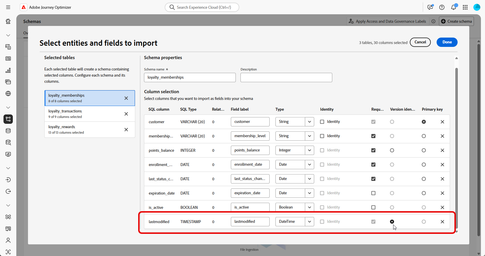

# 파일 업로드 {#file-upload-schema}

+++ 목차

| 오케스트레이션된 캠페인 시작 | 첫 오케스트레이션된 캠페인 시작 | 데이터베이스 쿼리 | 오케스트레이션된 캠페인 활동 |
|---|---|---|---|
| [오케스트레이션된 캠페인 시작](gs-orchestrated-campaigns.md)  관계형 스키마 및 데이터 세트 만들기 및 관리:  <ul><li>[스키마 및 데이터 세트 시작](gs-schemas.md)</li><li>[수동 스키마](manual-schema.md)</li><li>[파일 업로드 스키마](file-upload-schema.md)</li><li>[데이터 수집](ingest-data.md)</li></ul>[오케스트레이션된 캠페인 액세스 및 관리](access-manage-orchestrated-campaigns.md)  [오케스트레이션된 캠페인을 만드는 주요 단계](gs-campaign-creation.md) | [캠페인 만들기 및 예약](create-orchestrated-campaign.md)  [활동 오케스트레이션](orchestrate-activities.md)  [캠페인 시작 및 모니터링](start-monitor-campaigns.md)  [보고](reporting-campaigns.md) | [규칙 빌더로 작업](orchestrated-rule-builder.md)  [첫 번째 쿼리 빌드](build-query.md)  [표현식 편집](edit-expressions.md)  [재타겟팅](retarget.md) | [활동 시작](activities/about-activities.md)  활동: [및 가입](activities/and-join.md) - [대상 작성](activities/build-audience.md) - [차원 변경](activities/change-dimension.md) - [채널 활동](activities/channels.md) - [결합](activities/combine.md) - [중복 제거](activities/deduplication.md) - [데이터 보강](activities/enrichment.md) - [포크](activities/fork.md) - [조정](activities/reconciliation.md) - [대상 저장](activities/save-audience.md) - [분할](activities/split.md) - [대기](activities/wait.md) |

{style="table-layout:fixed"}

+++

 

>[!BEGINSHADEBOX]

 

이 페이지의 컨텐츠는 최종본이 아니며, 변경될 수 있습니다.

>[!ENDSHADEBOX]

**충성도 멤버십**, **충성도 트랜잭션** 및 **충성도 보상**&#x200B;과 같은 스키마를 만들어 오케스트레이션된 캠페인에 필요한 관계형 데이터 모델을 정의합니다. 각 스키마에는 기본 키, 버전 관리 특성 및 **수신자** 또는 **브랜드**&#x200B;와 같은 참조 엔터티에 대한 적절한 관계가 포함되어야 합니다.

<!--
Schemas can be created manually through the interface or imported in bulk using a DDL file.

This section provides step-by-step guidance on how to create a relational schema within Adobe Experience Platform by uploading a DDL (Data Definition Language) file. Using a DDL file allows you to define the structure of your data model in advance, including tables, attributes, keys, and relationships. 

## Upload a DDL file{#ddl-upload}

By uploading a DDL file, you can define the structure of your data model in advance, including tables, attributes, keys, and relationships. 

1. Log in to Adobe Experience Platform.

1. Navigate to the **Data Management** > **Schema**.

1. Click on **Create Schema**.

1. You will be prompted to select between two schema types:

    * **Standard**
    * **Relational**, used specifically for orchestrated campaigns

    

1. Select **Upload DDL file** to define an entity relationship diagram and create schemas.

    The table structure must contain:
    * At least one primary key
    * A version identifier, such as a `lastmodified` field of type `datetime` or `number`.

1. Drag and drop your DDL file and click **[!UICONTROL Next]**.

1. Type-in your **[!UICONTROL Schema name]**.

1. Set up each schema and its columns, ensuring that a primary key is specified. 

    One attribute, such as `lastmodified`, must be designated as a version descriptor. This attribute, typically of type `datetime`, `long`, or `int`, is essential for ingestion processes to ensure that the dataset is updated with the latest data version.

    

1. Click **[!UICONTROL Done]** once done.

You can now verify the table and field definitions within the canvas. [Learn more in the section below](#entities)

## Define relationships {#relationships}

To define logical connections between tables within your schema, follow the steps below.

1. Access the canvas view of your data model and choose the two tables you want to link

1. Click the  button next to the Source Join, then drag and guide the arrow towards the Target Join to establish the connection.

    

1. Fill in the given form to define the link and click **Apply** once configured.

    

    **Cardinality**:

     * **1-N**: one occurrence of the source table can have several corresponding occurrences of the target table, but one occurrence of the target table can have at most one corresponding occurrence of the source table.

    * **N-1**: one occurrence of the target table can have several corresponding occurrences of the source table, but one occurrence of the source table can have at most one corresponding occurrence of the target table.

    * **1-1**: one occurrence of the source table can have at most one corresponding occurrence of the target table.

1. All links defined in your data model are represented as arrows in the canvas view. Click on an arrow between two tables to view details, make edits, or remove the link as needed.

    

1. Use the toolbar to customize and adjust your canvas.

    

    * **Zoom in**: Magnify the canvas to see details of your data model more clearly.

    * **Zoom out**: Reduce the canvas size for a broader view of your data model.

    * **Fit view**: Adjust the zoom to fit all schemas within the visible area.

    * **Filter**: Choose which schema to display within the canvas.

    * **Force auto layout**: Automatically arrange schemas for better organization.

    * **Display map**: Toggle a minimap overlay to help navigate large or complex schema layouts more easily.

1. Click **Save** once done. This action creates the schemas and associated data sets and enables the data set for use in Orchestrated Campaigns.

1. Click **[!UICONTROL Open Jobs]** to monitor the progress of the creation job. This process may take couple minutes, depending on the number of tables defined in the DDL file. 

    

## Link schema {#link-schema}

Establish a relationship between the **loyalty transactions** schema and the **Recipients** schema to associate each transaction with the correct customer record.

1. Navigate to **[!UICONTROL Schemas]** and open your previously create **loyalty transactions**.

1. Click **[!UICONTROL Add Relationship]** from the Customer **[!UICONTROL Field properties]**.

    

1. Select **[!UICONTROL Many-to-One]** as the relationship **[!UICONTROL Type]**.

1. Link to the existing **Recipients** schema.

    

1. Enter a **[!UICONTROL Relationship name from current schema]** and **[!UICONTROL Relationship name from reference schema]**.

1. Click **[!UICONTROL Apply]** to save your changes.

Continue by creating a relationship between the **loyalty rewards** schema and the **Brands** schema to associate each reward entry with the appropriate brand.

-->
<!--### Setting Up Change data capture ingestion {#cdc-ingestion}

If you need to change the data source, you must delete the existing dataflow and create a new one pointing to the same dataset with the new source.

When using Change Data Capture (CDC), it is essential that the source and dataset remain in sync to ensure accurate incremental updates. Follow the steps below:

1. **Schema Requirements**
   - Your schema must include:
     - A **primary key** (e.g., `transaction_id`)
     - A **versioning field** (e.g., `lastmodified` or an incrementing `version_id`)
   - Enable the dataset for **Orchestrated Campaigns** if needed.

2. **CDC Dataflow Setup**
   - During dataflow creation, after choosing your source and files:
     - **Enable the CDC option**
     - Select your CDC-ready dataset
     - Confirm field mappings (especially version field)

3. **Keep Source and Target in Sync**
   - The source system must consistently update the version field so the platform can detect changes accurately.

Once set up, the platform will automatically ingest **only changed or new records** each time the flow runs.
-->