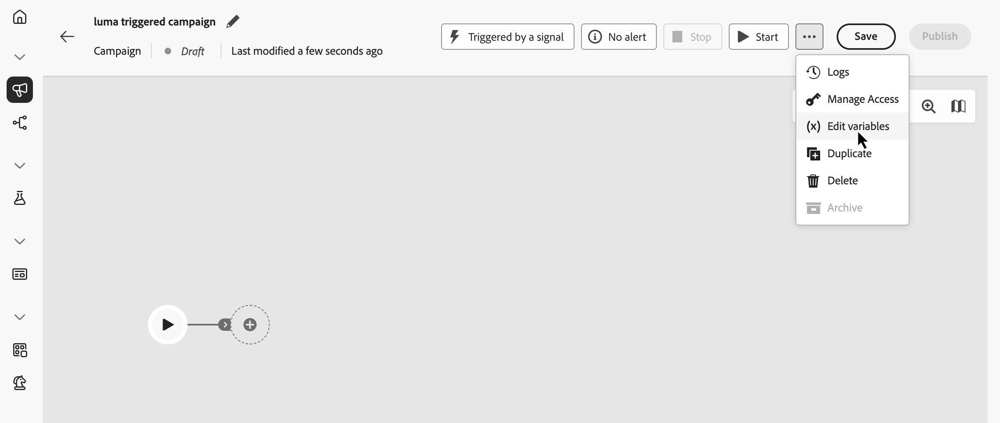

# 오케스트레이션된 캠페인에서 전역 변수 정의 {#define-global-variables}

**전역 변수**&#x200B;은(는) 오케스트레이션된 단일 캠페인에 설정한 이름-값 쌍이며 각 실행에서 재사용되므로 모든 활동에 동일한 값을 붙여넣지 않고 공유 값(예: 기본 채널 또는 테스트 이메일)으로 **[!UICONTROL Test]** 조건, 규칙 빌더 및 기타 캔버스 논리를 제어할 수 있습니다.

이 페이지에서는 전역 변수를 정의하는 방법을 설명합니다. 사용할 수 있게 되면 규칙 및 **[!UICONTROL 테스트]** 조건에 변수를 사용하는 방법에 대한 자세한 내용은 [오케스트레이션된 캠페인에서 변수 사용](variables-orchestrated-campaigns.md)을 참조하세요.

오케스트레이션된 캠페인에 전역 변수를 추가하거나 편집하려면 다음 단계를 따르십시오.

1. 오케스트레이션된 캠페인을 엽니다.

1. **[!UICONTROL 저장]** 옆에 있는 **..** 아이콘을 클릭한 다음 **[!UICONTROL 변수 편집]**&#x200B;을 선택합니다.

   {zoomable="yes"}

1. **[!UICONTROL 변수 추가]**&#x200B;를 클릭하고 변수의 이름과 값을 설정합니다. 기존 변수를 편집하려면 **..** 단추를 클릭하고 **[!UICONTROL 편집]**&#x200B;을 선택합니다.

   변수를 추가하거나 편집할 {zoomable="yes"}

규칙이 정의되면 규칙 및 **[!UICONTROL 테스트]** 조건에서 전역 변수를 사용하는 방법에 대해 알아보려면 [오케스트레이션된 캠페인에서 변수 사용](variables-orchestrated-campaigns.md#use)을 참조하세요.
