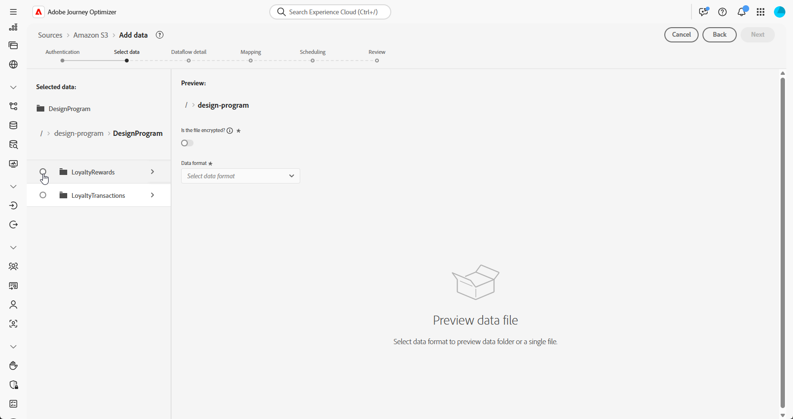

# 데이터 수집 {#ingest-data}

+++ 목차

| 오케스트레이션된 캠페인 시작 | 첫 오케스트레이션된 캠페인 시작 | 데이터베이스 쿼리 | 오케스트레이션된 캠페인 활동 |
|---|---|---|---|
| [오케스트레이션된 캠페인 시작](gs-orchestrated-campaigns.md)  관계형 스키마 및 데이터 세트 만들기 및 관리  <ul><li>[수동 스키마](manual-schema.md)</li><li>[파일 업로드 스키마](file-upload-schema.md)</li><li>[데이터 수집](ingest-data.md)</li></ul>  [오케스트레이션된 캠페인 액세스 및 관리](access-manage-orchestrated-campaigns.md)  [오케스트레이션된 캠페인을 만드는 주요 단계](gs-campaign-creation.md) | [캠페인 만들기 및 예약](create-orchestrated-campaign.md)  [활동 오케스트레이션](orchestrate-activities.md)  [캠페인 시작 및 모니터링](start-monitor-campaigns.md)  [보고](reporting-campaigns.md) | [규칙 빌더로 작업](orchestrated-rule-builder.md)  [첫 번째 쿼리 빌드](build-query.md)  [표현식 편집](edit-expressions.md)  [재타겟팅](retarget.md) | [활동 시작](activities/about-activities.md)  활동: [및 가입](activities/and-join.md) - [대상 작성](activities/build-audience.md) - [차원 변경](activities/change-dimension.md) - [채널 활동](activities/channels.md) - [결합](activities/combine.md) - [중복 제거](activities/deduplication.md) - [데이터 보강](activities/enrichment.md) - [포크](activities/fork.md) - [조정](activities/reconciliation.md) - [대상 저장](activities/save-audience.md) - [분할](activities/split.md) - [대기](activities/wait.md) |

{style="table-layout:fixed"}

+++

 

>[!BEGINSHADEBOX]

이 페이지의 컨텐츠는 최종본이 아니며, 변경될 수 있습니다.

>[!ENDSHADEBOX]

## 클라우드 스토리지 사용 {#ingest}

<!--
>[!IMPORTANT]
>
>Each dataset in Adobe Experience Platform supports only one active dataflow at a time. For detailed setup guidance on how to switch data sources, refer to this [section](#cdc-ingestion).
-->

Adobe Experience Platform을 사용하면 외부 소스에서 데이터를 수집할 수 있으며 Experience Platform 서비스를 사용하여 들어오는 데이터를 구조화하고, 레이블을 지정하고, 향상시킬 수 있습니다. Adobe 애플리케이션, 클라우드 기반 저장소, 데이터베이스 및 기타 여러 소스와 같은 다양한 소스에서 데이터를 수집할 수 있습니다.

1. **[!UICONTROL 연결]** 메뉴에서 **[!UICONTROL 원본]** 메뉴에 액세스합니다.

1. **[!UICONTROL 클라우드 저장소]** 범주를 선택한 다음 Amazon S3을 선택하고 **[!UICONTROL 데이터 추가]**&#x200B;를 클릭합니다.

   

1. S3 계정 연결:

   * 기존 계정 사용

   * 새 계정 사용

   [Adobe Experience Platform 설명서에서 자세히 알아보기](https://experienceleague.adobe.com/en/docs/experience-platform/destinations/catalog/cloud-storage/amazon-s3#connect)

   

1. **[!UICONTROL 데이터 형식]**, **[!UICONTROL 구분 기호]** 및 **[!UICONTROL 압축 형식]** 폴더를 선택하세요.

1. 이전에 만든 두 개의 폴더(예: **충성도 보상** 및 **충성도 거래**)를 찾을 때까지 연결된 S3 원본을 탐색합니다.

1. 데이터가 포함된 폴더를 선택합니다.

   폴더를 선택하면 동일한 구조의 현재 및 향후 파일이 모두 자동으로 처리됩니다. 그러나 단일 파일을 선택하려면 각 새 데이터 증가분을 수동으로 업로드해야 합니다.

   

1. **[!UICONTROL 데이터 형식]**, **[!UICONTROL 구분 기호]** 및 **[!UICONTROL 압축 형식]** 폴더를 선택하세요. 샘플 데이터의 정확성을 확인한 후 **[!UICONTROL 다음]**&#x200B;을 클릭하세요.

   

1. 관계형 스키마에 매핑되고 기본 키와 버전 설명자가 모두 정의된 데이터 세트에서 선택하려면 **[!UICONTROL 변경 데이터 캡처 사용]**&#x200B;을 선택하십시오.

1. [이전에 만든 데이터 세트](#entities)를 선택하고 **[!UICONTROL 다음]**&#x200B;을 클릭합니다.

   

1. **[!UICONTROL 매핑]** 창에서 각 원본 파일 특성이 대상 스키마의 해당 필드와 올바르게 매핑되었는지 확인하십시오.

   완료되면 **[!UICONTROL 다음]**&#x200B;을 클릭하세요.

   

1. 원하는 빈도에 따라 데이터 흐름 **[!UICONTROL 일정]**&#x200B;을(를) 구성하십시오.

1. 데이터 흐름을 만들려면 **[!UICONTROL 마침]**&#x200B;을 클릭합니다. 정의된 일정에 따라 자동으로 실행됩니다.

1. **[!UICONTROL 연결]** 메뉴에서 **[!UICONTROL 원본]**&#x200B;을(를) 선택하고 **[!UICONTROL 데이터 흐름]** 탭에 액세스하여 흐름 실행을 추적하고 수집된 레코드를 검토하고 오류를 해결합니다.

   

<!--### Setting Up Change data capture ingestion {#cdc-ingestion}

If you need to change the data source, you must delete the existing dataflow and create a new one pointing to the same dataset with the new source.

When using Change Data Capture (CDC), it is essential that the source and dataset remain in sync to ensure accurate incremental updates. Follow the steps below:

1. **Schema Requirements**
   - Your schema must include:
     - A **primary key** (e.g., `transaction_id`)
     - A **versioning field** (e.g., `lastmodified` or an incrementing `version_id`)
   - Enable the dataset for **Orchestrated Campaigns** if needed.

2. **CDC Dataflow Setup**
   - During dataflow creation, after choosing your source and files:
     - **Enable the CDC option**
     - Select your CDC-ready dataset
     - Confirm field mappings (especially version field)

3. **Keep Source and Target in Sync**
   - The source system must consistently update the version field so the platform can detect changes accurately.

Once set up, the platform will automatically ingest **only changed or new records** each time the flow runs.
-->