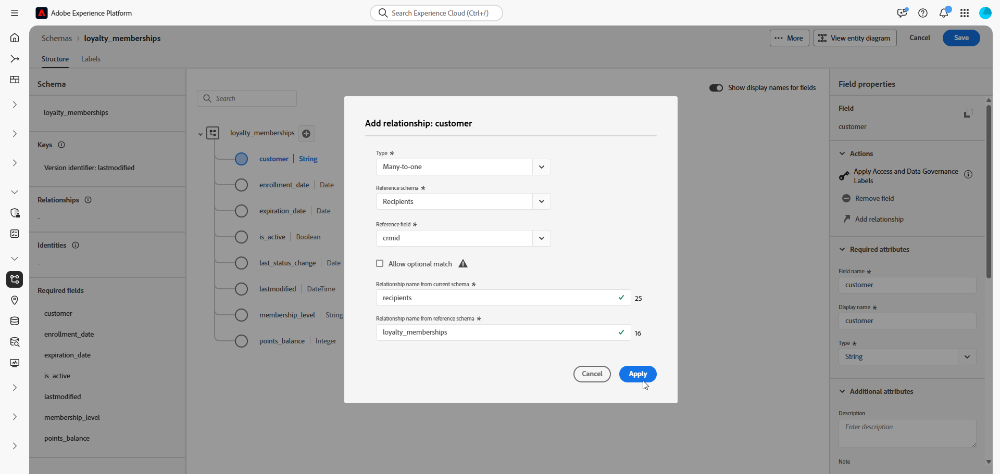
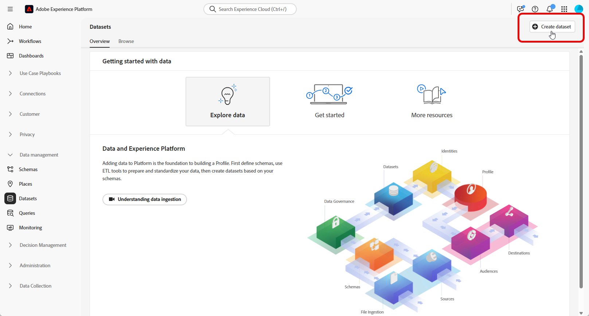
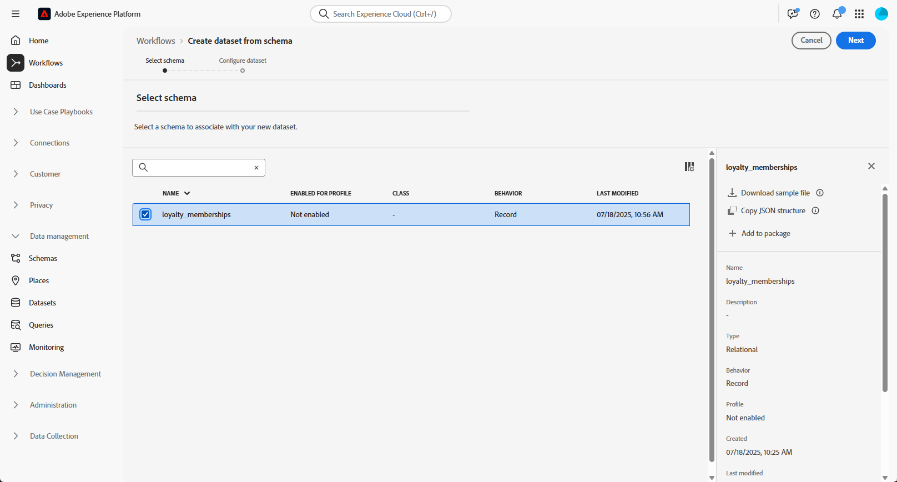

# 수동 관계형 스키마 설정 {#manual-schema}

+++ 목차

| 오케스트레이션된 캠페인 시작 | 오케스트레이션된 첫 번째 캠페인 시작 | 데이터베이스 쿼리 | 오케스트레이션된 캠페인 활동 |
|---|---|---|---|
| [오케스트레이션된 캠페인 시작](gs-orchestrated-campaigns.md)  관계형 스키마 및 데이터 세트 만들기 및 관리: <ul><li>[스키마 및 데이터 세트 시작](gs-schemas.md)</li><li>[수동 스키마](manual-schema.md)</li><li>[파일 업로드 스키마](file-upload-schema.md)</li><li>[데이터 수집](ingest-data.md)</li></ul>[오케스트레이션된 캠페인 액세스 및 관리](access-manage-orchestrated-campaigns.md)  [오케스트레이션된 캠페인을 만드는 주요 단계](gs-campaign-creation.md) | [캠페인 만들기 및 예약](create-orchestrated-campaign.md)  [활동 오케스트레이션](orchestrate-activities.md)  [캠페인 시작 및 모니터링](start-monitor-campaigns.md)  [보고](reporting-campaigns.md) | [규칙 빌더로 작업](orchestrated-rule-builder.md)  [첫 번째 쿼리 작성](build-query.md)  [표현식 편집](edit-expressions.md)  [리타기팅](retarget.md) | [활동 시작](activities/about-activities.md)  활동: [And 조인](activities/and-join.md) - [대상자 빌드](activities/build-audience.md) - [차원 변경](activities/change-dimension.md) - [채널 활동](activities/channels.md) - [결합](activities/combine.md) - [중복 제거](activities/deduplication.md) - [보강](activities/enrichment.md) - [포크](activities/fork.md) - [조정](activities/reconciliation.md) - [대상자 저장](activities/save-audience.md) - [분할](activities/split.md) - [대기](activities/wait.md) |

{style="table-layout:fixed"}

+++

 

>[!BEGINSHADEBOX]

 

이 페이지의 컨텐츠는 최종본이 아니며, 변경될 수 있습니다.

>[!ENDSHADEBOX]

사용자 인터페이스를 통해 직접 관계형 스키마를 생성할 수 있으므로 속성, 기본 키, 버전 관리 필드 및 관계를 세부적으로 구성할 수 있습니다.

다음 예제에서는 오케스트레이션된 캠페인에 필요한 구조를 보여 주기 위해 **충성도 멤버십** 스키마를 수동으로 정의합니다.

1. Adobe Experience Platform 인터페이스를 사용하여 [관계형 스키마를 수동으로 만들기](#schema).

1. 고객 ID, 멤버십 수준 및 상태 필드와 같은 특성을 [추가](#schema-attributes)합니다.

1. 캠페인 타깃팅을 위해 수신자 등의 기본 제공 스키마에 [스키마를 연결](#link-schema)합니다.

1. [스키마를 기반으로 데이터 집합을 만들고](#dataset) 오케스트레이션된 캠페인에서 사용하도록 설정합니다.

1. [지원되는 소스에서 데이터 집합에 데이터 수집](ingest-data.md).

## 스키마 만들기 {#schema}

Adobe Experience Platform에서 수동으로 새 관계형 스키마를 생성하여 시작하십시오. 이 프로세스를 사용하면 이름 및 동작을 포함하여 스키마 구조를 처음부터 정의할 수 있습니다.

1. Adobe Experience Platform에 로그인.

1. **[!UICONTROL 데이터 관리]** > **[!UICONTROL 스키마]** 메뉴로 이동합니다.

1. **[!UICONTROL 스키마 만들기]**&#x200B;를 클릭합니다.

1. **[!UICONTROL 관계형]**&#x200B;을(를) **스키마 형식**(으)로 선택합니다.

   {zoomable="yes"}

1. 필드를 수동으로 추가하여 스키마를 작성하려면 **[!UICONTROL 수동으로 만들기]**&#x200B;를 선택하십시오.

1. **[!UICONTROL 스키마 표시 이름]**&#x200B;을 입력하십시오.

1. **[!UICONTROL 레코드]**&#x200B;을(를) **[!UICONTROL 스키마 동작]**(으)로 선택하십시오.

   {zoomable="yes"}

1. 스키마 만들기를 진행하려면 **마침**&#x200B;을 클릭하세요.

이제 스키마에 속성을 추가하여 구조를 정의할 수 있습니다.

## 스키마에 속성 추가 {#schema-attributes}

그런 다음 속성을 추가하여 스키마의 구조를 정의합니다. 이러한 필드는 고객 식별자, 멤버십 세부 정보 및 활동 날짜와 같이 오케스트레이션된 캠페인에 사용되는 주요 데이터 포인트를 나타냅니다. 이를 정확하게 정의하면 신뢰할 수 있는 개인화, 세분화 및 추적이 보장됩니다.

타깃팅에 사용되는 모든 스키마에는 연결된 ID 네임스페이스가 있는 `String` 유형의 ID 필드가 하나 이상 포함되어야 합니다. 이렇게 하면 Adobe Journey Optimizer의 타기팅 및 ID 해결 기능과의 호환성이 보장됩니다.

+++Adobe Experience Platform에서 관계형 스키마를 생성할 때 다음 기능이 지원됩니다

* **열거형**\
  ENUM 필드는 DDL 기반 및 수동 스키마 생성 모두에서 지원되므로 고정된 허용된 값 집합으로 속성을 정의할 수 있습니다.

* **데이터 거버넌스용 스키마 레이블**\
  액세스 제어 및 사용 제한과 같은 데이터 거버넌스 정책을 적용하기 위해 스키마 필드 수준에서 레이블 지정이 지원됩니다. 자세한 내용은 [Adobe Experience Platform 설명서](https://experienceleague.adobe.com/docs/experience-platform/xdm/home.html?lang=ko-KR)를 참조하세요.

* **합성 키**\
  관계형 스키마 정의에서 복합 기본 키가 지원되므로 여러 필드를 함께 사용하여 레코드를 고유하게 식별할 수 있습니다.

+++

1. 캔버스에서 스키마 이름&#x200B;**옆에 있는**&#x200B;을(를) 클릭하여 특성 추가를 시작합니다.

   {zoomable="yes"}

1. 특성 **[!UICONTROL 필드 이름]**, **[!UICONTROL 표시 이름]** 및 **[!UICONTROL 유형]**&#x200B;을 입력하십시오.

   이 예제에서는 아래 표에 설명된 특성을 **충성도 멤버십** 스키마에 추가했습니다.

+++ 속성 예

   | 속성 이름 | 데이터 유형 | 추가 속성 |
   |-|-|-|
   | 고객 | 문자열 | 기본 키 |
   | membership_level | 문자열 | 필수 여부 |
   | points_balance | 정수 | 필수 여부 |
   | enrollment_date | 날짜 | 필수 여부 |
   | last_status_change | 날짜 | 필수 여부 |
   | expiration_date | 날짜 | - |
   | is_active | 부울 | 필수 여부 |
   | 마지막으로 수정됨 | 날짜/시간 | 필수 여부 |

+++

1. 적절한 필드를 **[!UICONTROL 기본 키]** 및 **[!UICONTROL 버전 설명자]**(으)로 할당하십시오.

   수동 스키마를 생성할 때 다음 필수 필드가 포함되어야 합니다.

   * 하나 이상의 기본 키
   * `datetime` 또는 `number` 유형의 `lastmodified` 필드와 같은 버전 식별자.
   * CDC(변경 데이터 캡처) 수집의 경우, 데이터 변경 유형(예: 삽입, 업데이트, 삭제)을 나타내고 증분 처리를 가능하게 하는 `_change_request_type` 유형의 이름이 `String`인 특수 열입니다.

   {zoomable="yes"}

1. **[!UICONTROL 저장]**&#x200B;을 클릭합니다.

특성이 만들어지면 새로 만든 스키마를 내장 스키마와 연결해야 합니다.

## 스키마 연결 {#link-schema}

두 스키마 간의 관계를 만들면 기본 프로필 스키마 외부에 저장된 데이터로 오케스트레이션된 캠페인을 보강할 수 있습니다.

1. 새로 만든 스키마에서 링크로 사용할 특성을 선택하고 **[!UICONTROL 관계 추가]**&#x200B;를 클릭합니다.

   {zoomable="yes"}

1. **[!UICONTROL 참조 스키마]** 및 **[!UICONTROL 참조 필드]**&#x200B;을(를) 선택하여 관계를 설정하십시오.

   이 예제에서는 `customer` 특성이 `recipients` 스키마에 연결되어 있습니다.

   {zoomable="yes"}

1. 현재 스키마와 참조 스키마의 관계 이름을 입력합니다.

1. 구성하고 나면 **[!UICONTROL 적용]**&#x200B;을 클릭합니다.

관계가 설정되면 스키마를 기반으로 데이터 세트를 만들어야 합니다.

## 스키마에 대한 데이터 세트 만들기 {#dataset}

스키마를 정의한 후 다음 단계는 이를 기반으로 데이터 세트를 만드는 것입니다. 이 데이터 세트는 수집된 데이터를 저장하며, Adobe Journey Optimizer에서 액세스할 수 있도록 오케스트레이션된 캠페인에 대해 활성화해야 합니다. 이 옵션을 활성화하면 데이터 세트가 실시간 오케스트레이션 및 개인화 워크플로우에서 인식됩니다.

1. **[!UICONTROL 데이터 관리]** > **[!UICONTROL 데이터 세트]** 메뉴로 이동한 다음 **[!UICONTROL 데이터 세트 만들기]**&#x200B;를 클릭합니다.

   {zoomable="yes"}

1. **[!UICONTROL 스키마에서 데이터 집합 만들기]**&#x200B;를 선택합니다.

1. 앞에서 만든 스키마를 선택하세요. 여기서는 **충성도 멤버십**&#x200B;을 선택하고 **[!UICONTROL 다음]**&#x200B;을 클릭하세요.

   {zoomable="yes"}

1. **[!UICONTROL 데이터 세트]**&#x200B;의 **[!UICONTROL 이름]**&#x200B;을(를) 입력하고 **[!UICONTROL 완료]**&#x200B;를 클릭합니다.

캠페인을 오케스트레이션하려면 이제 데이터 세트를 활성화해야 합니다.

## 오케스트레이션된 캠페인에 대한 데이터 세트 활성화 {#enable}

데이터 세트를 만든 후에는 오케스트레이션된 캠페인에 대해 명시적으로 활성화해야 합니다. 이 단계에서는 Adobe Journey Optimizer 내에서 데이터 세트를 실시간 오케스트레이션 및 개인화에 사용할 수 있습니다.

1. **[!UICONTROL 데이터 세트]** 목록에서 데이터 세트를 찾습니다.

1. **[!UICONTROL 데이터 세트]** 설정에서 **오케스트레이션된 캠페인** 옵션을 활성화하여 오케스트레이션된 캠페인에서 데이터 세트를 사용할 수 있도록 합니다.

   {zoomable="yes"}

1. 지원 프로세스가 완료될 때까지 몇 분 정도 기다립니다. 이 설정이 완전히 활성화된 후에만 데이터 수집 및 캠페인 사용이 가능합니다.

이제 선택한 소스를 사용하여 스키마로 데이터 수집을 시작할 수 있습니다.

➡️ [데이터 수집 방법 알아보기](ingest-data.md)
