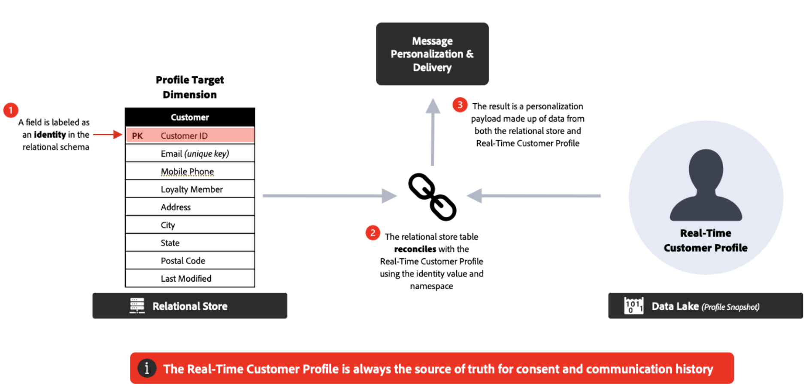

# 자주 묻는 질문 {#faq-oc}

Adobe Journey Optimizer 오케스트레이션된 캠페인에 대한 FAQ는 다음과 같습니다.

세부 정보가 필요하신가요? 이 페이지 하단의 피드백 옵션을 사용하여 질문하거나 [Adobe Journey Optimizer 커뮤니티](https://experienceleaguecommunities.adobe.com/t5/adobe-journey-optimizer/ct-p/journey-optimizer?profile.language=ko){target="_blank"}와 연결하세요.

+++ Campaign 오케스트레이션이란?

Campaign Orchestration은 관계형 데이터 저장소를 활용하여 일괄 처리 참여를 위해 대상을 구축하고 세그먼트화하는 단일 단계 또는 다중 단계 워크플로우를 지원하는 Journey Optimizer의 기능입니다.

새로운 유형의 캠페인을 Journey Optimizer에 제공합니다. **조정된 캠페인**. 오케스트레이션된 캠페인은 브랜드가 복잡한 일대다 마케팅 캠페인을 대규모로 실행하는 데 도움이 됩니다. 프로모션, 시즌 캠페인 또는 계정 기반 커뮤니케이션과 같은 브랜드 주도 참여를 위해 설계되었습니다.

단일 전송/작업 캠페인과 비교하여 아웃바운드 마케팅에 **오케스트레이션 및 시퀀싱**&#x200B;을(를) 도입했습니다. 대상자는 일회성 캠페인을 받지 않고 여러 단계 워크플로우를 함께 진행합니다.

**자세히 알아보기**

* [오케스트레이션된 캠페인 시작](gs-orchestrated-campaigns.md)
* [오케스트레이션된 첫 번째 캠페인 만들기](gs-campaign-creation.md)

+++

+++ 오케스트레이션된 캠페인으로 무엇을 할 수 있습니까?

주요 기능은 다음을 포함합니다.

* **온디맨드 대상**: 관계형 쿼리를 사용하여 대상 그룹을 즉시 만들고 세분화합니다.
* **다중 엔터티 세분화**: 고객 데이터를 관련 엔터티(예: 계정, 구매, 예약)와 연결하여 정확한 대상을 만듭니다.
* **전송 전 가시성**: 타깃팅을 최적화하기 위해 시작하기 전에 정확한 대상 수를 확인하십시오.
* **여러 단계 워크플로**: 계절별 프로모션, 제품 출시 또는 충성도 오퍼와 같은 순차적 캠페인을 실행합니다.

**우수 사례**

* 워크플로우를 디자인하기 전에 **캠페인 목표 지우기**&#x200B;를 정의하십시오.
* **파일럿 대상**(으)로 시작하여 크기 조정 전에 카운트 및 논리의 유효성을 검사합니다.
* 성능 및 투명도를 최적화하려면 세그먼테이션 규칙을 **가능한 한 간단하게**&#x200B;유지하세요.
* 보다 쉽게 관리할 수 있도록 대상 및 캠페인에 대해 **일관된 명명 규칙**&#x200B;을 사용하십시오.

**자세히 알아보기**

* [오케스트레이션된 캠페인 만들기](create-orchestrated-campaign.md)
* [캠페인 활동 작업](activities/about-activities.md)
* [쿼리 모델러를 사용하여 규칙 작성](build-query.md)

+++

+++ Campaign 오케스트레이션에 액세스하는 방법

캠페인 오케스트레이션에 액세스하려면 라이선스에 **Journey Optimizer - 캠페인 및 여정** 또는 **Journey Optimizer - 캠페인** 패키지가 포함되어야 합니다. 필요한 경우 Adobe 담당자에게 문의하여 라이선스를 확인하고 업데이트하십시오.

**자세히 알아보기**

* [오케스트레이션된 캠페인 시작](gs-orchestrated-campaigns.md)
* [Adobe Journey Optimizer 제품 설명](https://helpx.adobe.com/kr/legal/product-descriptions/adobe-journey-optimizer.html){target="_blank"}

+++

+++ 오케스트레이션된 캠페인은 여정과 어떻게 다릅니까?

* **오케스트레이션된 캠페인**: **일괄, 일대다** 캠페인에 적합합니다. 대상이 일정에 따라 대량으로 진행됩니다.
* **여정**: **실시간, 일대일** 참여에 가장 적합합니다. 각 고객은 비헤이비어 또는 이벤트에 의해 트리거된 자신의 속도에 따라 여정을 이동합니다.

**모범 사례**: 함께 사용 - 트리거된 반응형 경험에 대한 여정 및 계획된 달력 기반 이니셔티브에 대한 오케스트레이션된 캠페인.

**자세히 알아보기**

* [오케스트레이션된 캠페인 시작](gs-orchestrated-campaigns.md)
* [첫 여정 만들기](../building-journeys/journey-gs.md)
* [캠페인 시작](../campaigns/get-started-with-campaigns.md)

+++

+++ 다중 엔티티 세그먼테이션이란 무엇입니까?

Adobe Journey Optimizer의 Campaign Orchestration은 관계형 데이터베이스를 사용합니다. 이 유형의 데이터 모델에는 1:1 또는 1:many 관계를 통해 연결된 별도의 데이터 스키마가 있습니다. 이를 통해 사용자는 수신자 수준이 아닌 모든 스키마에서 쿼리를 시작한 다음 구매, 제품, 예약 또는 수신자 세부 정보 등 다른 관련 스키마로 앞뒤로 전환하여 세그먼트와 대상을 만들고 세분화하는 방법에 큰 유연성을 제공할 수 있습니다.

**예** - 앞으로 30일 후에 만료되는 구독이 있는 모든 수신자를 타깃팅합니다. Campaign Orchestration에서 쿼리는 구독 스키마로 시작할 수 있으며 해당 스키마의 만료 날짜 열만 검색하고 만료될 모든 구독을 반환한 다음 수신자 수준에서 각 쿼리를 시작하는 데이터 모델보다 더 빠르고 효율적으로 결과를 반환하는 특정 구독 ID와 관련된 수신자 데이터로 롤업할 수 있습니다.

**자세히 알아보기**

* [스키마 및 데이터 세트 시작](gs-schemas.md)
* [타겟팅 차원 구성](target-dimension.md)
* [쿼리 모델러를 사용하여 규칙 작성](build-query.md)

+++

+++ 데이터 모델은 어떻게 작동합니까?

캠페인은 **관계형 데이터베이스**&#x200B;를 사용합니다. 이를 통해 다양한 데이터 세트(예: 고객, 제품, 구독)를 쿼리하고 고급 세그먼테이션을 위해 유연하게 연결할 수 있습니다.

**우수 사례**

* **관계(조인)**&#x200B;가 비즈니스 논리를 반영하도록 데이터 세트를 구성합니다.
* 불필요한 조인을 방지하여 쿼리를 성능 있게 유지합니다.
* 대규모 추출을 실행하기 전에 샘플 결과를 확인합니다.

**자세히 알아보기**

* [스키마 및 데이터 세트 시작](gs-schemas.md)
* [수동으로 스키마 만들기](manual-schema.md)
* [데이터 수집](ingest-data.md)

+++

+++ 관계형 데이터를 사용하여 메시지를 개인화할 수 있습니까?

예. Campaign Orchestration에서 &#39;사람 엔티티&#39;라고 하는 수신자 프로필을 업데이트하고 해당 데이터를 개인화에 사용할 수 있습니다. 또한 관계형 데이터베이스에 있는 연결된 엔티티의 보강된 데이터를 개인화에 사용할 수도 있습니다. 연결된 데이터(예: 구매 또는 구독)와 함께 고객 프로필을 사용하여 지원되는 모든 채널에서 콘텐츠를 개인화할 수 있습니다.

**Recommendations**

* 오퍼를 관련성 있게 만들려면 **트랜잭션 및 동작 데이터**&#x200B;를 사용하십시오.
* **정적 특성**(예: 충성도 계층)을 **동적 특성**(예: 마지막 구매 날짜)과 결합합니다.
* 개인화를 간결하게 유지합니다. 데이터가 있는 메시지를 오버로드하면 가독성이 저하될 수 있습니다.

**자세히 알아보기**

* [보강 활동 사용](activities/enrichment.md)
* [오케스트레이션된 캠페인에 채널 활동 추가](activities/channels.md)

+++

<!--
## Do Orchestrated campaigns integrate with other Adobe solutions? {#integrations}

Yes. Campaign orchestration is natively integrated with:

* **Customer Journey Analytics**: Campaign orchestration reports are available.  
* **Real-Time CDP**: Audiences built in Campaigns can be read in Real-Time CDP.  
* **Federated Audience Composition (FAC)**: Available as an add-on.  -->

+++ 실시간 오케스트레이션된 캠페인을 초안으로 되돌릴 수 있습니까?

예, 특정 상황에서 사용할 수 있습니다. **[!UICONTROL 초안으로 돌아가기]** 옵션은 캠페인을 게시 취소하고 초안 상태로 되돌리기 위한 복구 메커니즘으로 설계되었습니다.

이 옵션은 실행 대기 중인 예약된 캠페인 또는 실행 오류가 있는 라이브 캠페인에 사용할 수 있습니다. [라이브 캠페인을 초안으로 되돌리는 방법을 알아보세요](start-monitor-campaigns.md#back-to-draft)

+++

+++ 지원되는 채널은 무엇입니까?

오케스트레이션된 캠페인을 만들어 **이메일**, **SMS**, **푸시 알림** 및 **DM**&#x200B;을 보낼 수 있습니다.

**자세히 알아보기**

* [오케스트레이션된 캠페인에 채널 활동 추가](activities/channels.md)
* [캠페인 활동 작업](activities/about-activities.md)

+++

+++ 동일한 오케스트레이션된 캠페인 내에서 여러 커뮤니케이션과 다양한 채널을 시작할 수 있습니까?

예. 오케스트레이션된 캠페인은 크로스채널 오케스트레이션을 지원합니다. 이메일, SMS 및 푸시 알림 활동을 여러 단계의 캠페인 캔버스에 결합하여 포괄적인 고객 경험을 만들 수 있습니다.

**자세히 알아보기**

* [오케스트레이션된 캠페인에 채널 활동 추가](activities/channels.md)
* [캠페인 활동 작업](activities/about-activities.md)

+++

+++ 오케스트레이션된 캠페인 템플릿을 사용할 수 있습니까?

아니요. 캠페인 템플릿을 정의하거나 사용할 수는 없지만, 통신에 콘텐츠 템플릿을 사용할 수는 있습니다.

**자세히 알아보기**

* [오케스트레이션된 캠페인에 채널 활동 추가](activities/channels.md)
* [오케스트레이션된 캠페인 만들기](create-orchestrated-campaign.md)

+++

+++ 오케스트레이션된 캠페인과 관련된 메시지용 콘텐츠 디자이너입니까?

아니요. 이메일 Designer을 포함한 콘텐츠 디자이너는 모든 Journey Optimizer 기능에서 공통됩니다.

**자세히 알아보기**

* [오케스트레이션된 캠페인에 채널 활동 추가](activities/channels.md)
* [보강 활동 사용](activities/enrichment.md)

+++

+++ 오케스트레이션된 캠페인에서 다양한 채널이 어떻게 연결됩니까?

채널 구성 요소 및 런타임은 모든 Journey Optimizer 캠페인에 공통되지만, 지원되는 채널은 다릅니다. 오케스트레이션된 캠페인은 이메일, SMS 및 푸시 알림을 지원합니다.

**자세히 알아보기**

* [오케스트레이션된 캠페인에 채널 활동 추가](activities/channels.md)
* [가드레일 및 제한 사항](guardrails.md)

+++

+++ 오케스트레이션된 캠페인이 아웃바운드 채널(웹, 인앱)과 연결할 수 있습니까?

아니요. 웹 및 인앱과 같은 인바운드 채널은 오케스트레이션된 캠페인에서 지원되지 않습니다. 아웃바운드 채널(이메일, SMS 및 푸시 알림)만 지원됩니다.

**자세히 알아보기**

* [가드레일 및 제한 사항](guardrails.md)
* [오케스트레이션된 캠페인에 채널 활동 추가](activities/channels.md)

+++

+++ 권한 및 동의는 어떻게 됩니까?

오케스트레이션된 캠페인 및 여정에 대한 권한 및 동의는 Adobe Experience Platform에서 중앙에서 관리됩니다. 이러한 설정은 보내기 전에 각 수신자에 대해 두 솔루션 모두에 적용됩니다.

**우수 사례**

* **중앙 집중식 거버넌스** 적용 - 캠페인 수준에서 별도로 동의를 관리하지 마십시오.
* 동의 데이터를 정기적으로 감사하여 불일치를 감지합니다.
* **채널별 옵트아웃**&#x200B;을 준수합니다. 모든 채널을 포괄하는 전역 동의를 가정하지 마십시오.

**자세히 알아보기**

* [오케스트레이션된 캠페인 시작](gs-orchestrated-campaigns.md)
* [가드레일 및 제한 사항](guardrails.md)

+++

+++ 오케스트레이션된 캠페인에서 임시 세분화를 수행할 수 있습니까?

Campaign Orchestration에서는 임시 세분화를 &#39;라이브 세분화&#39;라고 합니다. 이 세분화를 통해 관계형 저장소에서 실시간으로 사용 가능한 모든 데이터에 액세스하고, 복합 쿼리를 빌드하고, 아웃바운드 채널을 통해 즉시 활성화할 수 있습니다(예: 이메일 + SMS).

**팁**

* **시간에 민감한 요구 사항**&#x200B;에 임시 세분화를 사용합니다(예: Flash 프로모션).
* 향후 캠페인에서 재사용할 수 있도록 유용한 쿼리를 저장하고 문서화합니다.
* 활성화 전에 대상 카운트의 유효성을 검사하여 과소 또는 과다 전송을 방지하십시오.

**자세히 알아보기**

* [쿼리 모델러를 사용하여 규칙 작성](build-query.md)
* [대상자 작성 활동 사용](activities/build-audience.md)
* [타겟팅 차원 구성](target-dimension.md)

+++

+++ Campaign Orchestration은 일괄 처리를 통해 로드된 데이터에만 액세스합니까, 아니면 실시간으로 업데이트된 테이블(예: Analytics 데이터)도 쿼리할 수 있습니까?

Journey Optimizer Campaign Orchestration은 관계형 스키마 위에 임시 쿼리를 작성할 수 있습니다. 관계형 스키마는 현재만 배치 소스를 지원합니다. 또한 모든 유형의 Adobe Experience Platform 대상에서 대상 읽기 활동을 지원합니다.

**자세히 알아보기**

* [스키마 및 데이터 세트 시작](gs-schemas.md)
* [데이터 수집](ingest-data.md)
* [대상자 읽기 활동 사용](activities/read-audience.md)

+++

+++ 오케스트레이션된 캠페인이 의사 결정을 지원합니까?

아니요. 오케스트레이션된 캠페인은 의사 결정 기능을 지원하지 않습니다. 의사 결정 기능의 경우 표준 Journey Optimizer 여정 또는 작업 캠페인을 대신 사용하십시오.

**자세히 알아보기**

* [Experience Decisioning 시작](../experience-decisioning/gs-experience-decisioning.md)
* [첫 여정 만들기](../building-journeys/journey-gs.md)
* [캠페인 시작](../campaigns/get-started-with-campaigns.md)

+++

+++ 환경 간 배포는 어떻게 작동합니까?

오케스트레이션된 캠페인에서 생성된 오브젝트(예: 대상자, 워크플로우)는 빌드된 샌드박스에 연결됩니다. 환경(개발, 단계, 프로덕션) 간의 표준 패키징 및 배포 워크플로는 현재 오케스트레이션된 캠페인에 사용할 수 없습니다.

**우수 사례**

* 실험, QA 및 프로덕션을 위해 **별도의 샌드박스**&#x200B;를 유지합니다.
* 필요한 경우 수동 복제를 사용하도록 구성을 철저히 문서화합니다.
* 거버넌스 팀과 협력하여 환경 간의 구성 편차를 줄입니다.

**자세히 알아보기**

* [오케스트레이션된 캠페인 시작](gs-orchestrated-campaigns.md)
* [가드레일 및 제한 사항](guardrails.md)

+++

<!--
## Are there recommended practices for running campaigns at scale? {#scale}

Yes, follow the best practices below:  

* **Plan campaigns around business calendars** (product launches, seasonal peaks) to align volume and resources.  
* Use **audience pre-views** before sending to confirm the expected size and avoid surprises.  
* Where possible, **stagger send times** to avoid overwhelming downstream systems (e.g., call centers, websites).  
* Establish a **monitoring routine**—track delivery logs, error rates, and opt-outs after each send.  
* Run **post-campaign analysis** in Customer Journey Analytics to refine targeting and orchestration for the next cycle.  
-->

+++ 수신자와 프로필 엔티티 간의 관계는 무엇입니까?

세분화는 Adobe Experience Platform 프로필에 대해 전송하는 동안 수신자에 대해 수행됩니다. 수신자 대상 차원은 통합 프로필을 오케스트레이션된 캠페인 내의 세분화에 사용되는 추가 데이터로 확장하는 반면, 수신자는 메시지를 보내고 동의 정책 및 비즈니스 규칙을 확인하기 위해 런타임에 프로필과 조정됩니다. 이 조정은 프로필 수준에서 비즈니스 규칙 및 동의 애플리케이션을 통합하는 데 유용합니다.

**자세히 알아보기**

* [타겟팅 차원 구성](target-dimension.md)
* [스키마 및 데이터 세트 시작](gs-schemas.md)
* [쿼리 모델러를 사용하여 규칙 작성](build-query.md)

+++

+++ 수신자와 프로필 엔티티를 비교 사용하는 것이 좋습니다.

&#39;예&#39;라고 답하면 최상의 데이터 저장소를 제안하지만, 사용 사례와 제약 조건을 기반으로 최상의 접근 방식을 항상 Adobe 담당자에게 확인하십시오.

| 관계형 저장소 | 실시간 고객 프로필 |
|---------|----------|
| 소스가 이미 데이터 관계형입니까? | 데이터 스트리밍의 소스입니까? |
| 마케팅 사용 사례를 위해 데이터를 그대로 수집하시겠습니까? | 데이터 신선도가 주요 요구 사항입니까? |
| 마케팅 활성화 사용 사례에 필요한 대량 내역 데이터(`>` 2개월)가 있습니까? | 즉각적인 작업이나 결정에 데이터가 필요한 시나리오가 있습니까? |
| 대상 생성, 평가 및 활성화에 대한 임시 요구 사항이 있습니까? | 미리 계산된 합계를 사용하여 동작 데이터를 `<` 90일로 제한할 수 있습니까? |
|  | 메시지를 실시간으로 개인화하는 데 데이터가 필요합니까? |

**자세히 알아보기**

* [타겟팅 차원 구성](target-dimension.md)
* [스키마 및 데이터 세트 시작](gs-schemas.md)
* [쿼리 모델러를 사용하여 규칙 작성](build-query.md)

+++

+++ 오케스트레이션된 캠페인당 최대 활동 수는 얼마입니까?

오케스트레이션된 캠페인의 활동 수는 500개로 제한됩니다.

**자세히 알아보기**

* [가드레일 및 제한 사항](guardrails.md)
* [캠페인 활동 작업](activities/about-activities.md)

+++

+++ 데이터를 추가하기 위해 보강하는 것이 가능합니까?

예. 관계형 저장소 및 Adobe Experience Platform 대상자에서 데이터를 보강할 수 있습니다. 데이터 보강 활동을 사용하여 관련 스키마의 추가 속성으로 대상 데이터를 향상시킵니다.

**자세히 알아보기**

* [보강 활동 사용](activities/enrichment.md)
* [조정 활동 사용](activities/reconciliation.md)

+++

+++ 모든 필터를 대상을 통해 정의해야 합니까? 또는 일부 유형의 필터를 구성할 수 있습니까?

오케스트레이션된 캠페인은 사전 정의된 필터를 지원합니다. 쿼리를 정의하여 필터로 저장하고, 즐겨찾기에 추가하고, 추가 세분화 작업에서 다시 사용할 수 있습니다. 사전 정의된 필터에는 사용 시 값을 입력할 수 있도록 매개 변수가 포함될 수 있습니다. [미리 정의된 필터로 작업하는 방법을 알아봅니다](predefined-filters.md).

**자세히 알아보기**

* [쿼리 모델러를 사용하여 규칙 작성](build-query.md)
* [대상자 작성 활동 사용](activities/build-audience.md)
* [미리 정의된 필터 작업](orchestrated-rule-builder.md)

+++

## 추가 리소스

추가 학습 및 업데이트를 보려면 다음 리소스를 살펴보십시오.

* [조정된 캠페인 보호 및 제한 사항](guardrails.md)
* [오케스트레이션된 캠페인에서 스키마 및 데이터 세트 시작](gs-schemas.md)
* [오케스트레이션된 첫 번째 캠페인 만들기](gs-campaign-creation.md)
* [Journey Optimizer 제품 설명](https://helpx.adobe.com/kr/legal/product-descriptions/adobe-journey-optimizer.html){target="_blank"}
