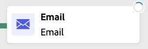

# 오케스트레이션된 캠페인 시작 및 모니터링 {#start-monitor}

>[!CONTEXTUALHELP]
>id="ajo_campaign_publication"
>title="오케스트레이션된 캠페인 게시"
>abstract="캠페인을 시작하려면 먼저 캠페인을 게시해야 합니다. 게시하기 전에 모든 오류가 해결되었는지 확인하십시오."

오케스트레이션된 캠페인을 만들고 캔버스에서 수행할 작업을 디자인하면 캠페인을 게시하고 실행이 어떻게 이루어지는지 모니터링할 수 있습니다.

테스트 모드에서 캠페인을 실행하여 캠페인 실행과 다양한 활동의 결과를 확인할 수도 있습니다.

## 게시하기 전에 캠페인 테스트 {#test}

[!DNL Journey Optimizer]을(를) 사용하면 시작하기 전에 오케스트레이션된 캠페인을 테스트할 수 있습니다. 캠페인이 만들어지면 기본적으로 **초안** 상태가 됩니다. 이 상태에서는 캠페인을 수동으로 실행하여 흐름을 테스트할 수 있습니다.

>[!IMPORTANT]
>
>**[!UICONTROL 대상자 저장]** 활동 및 채널 활동을 제외한 캔버스의 모든 활동이 실행됩니다. 데이터나 대상자에게는 기능적인 영향을 주지 않습니다.

오케스트레이션된 캠페인을 테스트하려면 캠페인을 열고 **[!UICONTROL 시작]**&#x200B;을 선택하세요.

{zoomable="yes"}

캠페인의 각 활동은 캔버스의 끝에 도달할 때까지 순차적으로 실행됩니다. 테스트 중에 캔버스에서 작업 표시줄을 사용하여 캠페인 실행을 제어할 수 있습니다. 여기에서는 다음을 수행할 수 있습니다.

* 언제든지 실행을 **중지**&#x200B;합니다.
* 실행을 다시 **시작**&#x200B;합니다.
* 이전에 일시 중지된 경우 실행을 **다시 시작**&#x200B;합니다.

캔버스 도구 모음의 **[!UICONTROL 경고]** / **[!UICONTROL 경고]** 아이콘은 실행 전에 미리 나타날 수 있는 경고와 실행 중 또는 후에 발생하는 오류를 포함하여 문제를 알려줍니다.

{zoomable="yes"}

각 활동에 직접 표시되는 [시각적 상태 표시기](#activities)를 사용하여 실패한 활동을 빠르게 식별할 수도 있습니다. 자세한 문제 해결 방법이 필요한 경우 오류와 오류 발생 컨텍스트에 대해 상세한 정보를 제공하는 [캠페인의 로그](#logs-tasks)를 엽니다.

캔버스에 채널 활동을 추가한 경우 **[!UICONTROL 콘텐츠 시뮬레이션]** 단추를 사용하여 메시지 콘텐츠를 미리 보고 테스트할 수 있습니다. [채널 활동을 사용하여 작업하는 방법을 알아봅니다](activities/channels.md)

유효성을 검사하면 캠페인을 게시할 수 있습니다.

## 캠페인 게시 {#publish}

캠페인을 테스트하여 준비가 완료되면 **[!UICONTROL 게시]**&#x200B;를 클릭하여 라이브로 만듭니다.

{zoomable="yes"}

>[!NOTE]
>
>**[!UICONTROL 게시]** 단추가 비활성화되어 있으면(회색으로 표시됨) 작업 표시줄에서 로그에 액세스하고 오류 메시지를 확인하십시오. 캠페인을 게시하려면 먼저 모든 오류를 수정해야 합니다.

시각적 흐름이 다시 시작되고, 실제 프로필이 실시간으로 여정을 따라 흐르기 시작합니다.

게시 작업이 실패하는 경우(예: 메시지 콘텐츠 누락) 경고 메시지가 표시되며 문제를 해결한 후 다시 시도해야 합니다. 게시 성공 시 캠페인은 즉시 또는 일정에 따라 실행을 시작하고 **초안**&#x200B;에서 **라이브** 상태로 이동하고 &quot;읽기 전용&quot;이 됩니다.

## 캠페인 실행 모니터링 {#monitor}

### 시각적 흐름 모니터링 {#flow}

테스트 또는 라이브 모드에서 실행하는 동안에는 시각적 흐름을 통해 프로필이 실시간으로 여정을 따라 움직이는 모습을 볼 수 있습니다. 작업 간에 전환되는 프로필 수가 표시됩니다.

{zoomable="yes"}

전환을 통해 한 활동에서 다른 활동으로 전송된 데이터는 임시 작업 테이블에 저장됩니다. 각 전환에 대해 이 데이터를 표시할 수 있습니다. 활동 간에 전달된 데이터를 확인하는 방법은 다음과 같습니다.

1. 전환을 선택합니다.
1. 작업 테이블 스키마를 보려면 속성 창에서 **[!UICONTROL 스키마 미리 보기]**&#x200B;를 클릭합니다. 전송된 데이터를 보려면 **[!UICONTROL 결과 미리 보기]**&#x200B;를 선택합니다.

   {zoomable="yes"}

### 활동 실행 표시기 {#activities}

시각적 상태 표시기는 각 활동이 어떻게 수행되고 있는지 이해하는 데 도움이 됩니다.

| 시각적 표시기 | 설명 |
|-----|------------|
| {zoomable="yes"}{width="70%"} | 활동이 현재 실행 중입니다. |
| {zoomable="yes"}{width="70%"} | 이 활동에는 주의가 필요합니다. 이 주의에는 게재 전송을 확인하거나 필요한 조치를 취하는 작업이 포함될 수 있습니다. |
| {zoomable="yes"}{width="70%"} | 활동에서 오류가 발생했습니다. 이 문제를 해결하려면 오케스트레이션된 캠페인 로그에서 자세한 내용을 확인하십시오. |
| {zoomable="yes"}{width="70%"} | 활동이 성공적으로 실행되었습니다. |

### 로그 및 작업 {#logs-tasks}

>[!CONTEXTUALHELP]
>id="ajo_campaign_logs"
>title="로그 및 작업"
>abstract="**로그 및 작업** 화면은 오케스트레이션된 캠페인 실행 내역을 제공하며, 모든 사용자 액션과 발생한 오류를 기록합니다."

로그 및 작업 모니터링은 오케스트레이션된 캠페인을 분석하고 제대로 실행되고 있는지 확인하는 중요한 단계입니다. 캔버스 도구 모음의 테스트 및 라이브 모드 모두에서 사용할 수 있는 **[!UICONTROL 로그]** 단추에서 로그 및 작업에 액세스할 수 있습니다.

{zoomable="yes"}

**[!UICONTROL 로그 및 작업]** 화면은 모든 사용자 액션과 발생한 오류를 기록하여 캠페인 실행에 대한 완전한 기록을 제공합니다.

{zoomable="yes"}

다음과 같은 두 가지 정보를 사용할 수 있습니다.

* **[!UICONTROL 로그]** 탭에는 모든 작업 및 오류의 시간순 기록이 포함되어 있습니다.
* **[!UICONTROL 작업]** 탭에서는 활동의 단계별 실행 시퀀스를 자세히 설명합니다.

두 탭 모두에서 표시된 열과 그 순서를 선택하고 필터를 적용하고 검색 필드를 사용하여 원하는 정보를 빠르게 찾을 수 있습니다.

## 다음 단계 {#next}

오케스트레이션된 캠페인 캔버스를 시작한 후 Journey Optimizer 보고 기능을 사용하여 대상자 행동을 이해하고 고객 여정의 각 단계 성과를 측정하는 등의 통찰력을 얻을 수 있습니다. [오케스트레이션된 캠페인 보고에 대한 자세한 정보](../orchestrated/reporting-campaigns.md)
