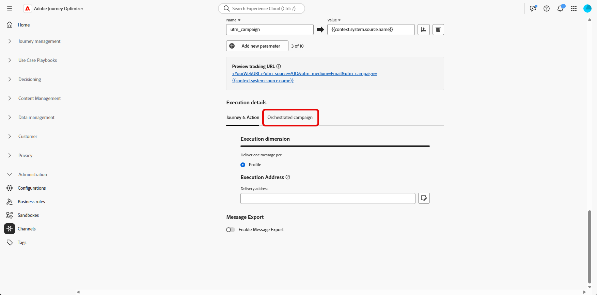

# 타겟팅 차원 구성 {#configuration}

+++ 목차

| 오케스트레이션된 캠페인 시작 | 첫 오케스트레이션된 캠페인 시작 | 데이터베이스 쿼리 | 오케스트레이션된 캠페인 활동 |
|---|---|---|---|
| [오케스트레이션된 캠페인 시작](gs-orchestrated-campaigns.md)  관계형 스키마 및 데이터 세트 만들기 및 관리:  <ul><li>[스키마 및 데이터 세트 시작](gs-schemas.md)</li><li>[수동 스키마](manual-schema.md)</li><li>[파일 업로드 스키마](file-upload-schema.md)</li><li>[데이터 수집](ingest-data.md)</li></ul>[오케스트레이션된 캠페인 액세스 및 관리](access-manage-orchestrated-campaigns.md)  [오케스트레이션된 캠페인을 만드는 주요 단계](gs-campaign-creation.md)  [Target 차원 구성](target-dimension.md) | <b>[캠페인 만들기 및 예약](create-orchestrated-campaign.md)</b>  [활동 오케스트레이션](orchestrate-activities.md)  [캠페인 시작 및 모니터링](start-monitor-campaigns.md)  [보고](reporting-campaigns.md) | [규칙 빌더로 작업](orchestrated-rule-builder.md)  [첫 번째 쿼리 작성](build-query.md)  [표현식 편집](edit-expressions.md)  [리타기팅](retarget.md) | [활동 시작](activities/about-activities.md)  활동: [And 조인](activities/and-join.md) - [대상자 빌드](activities/build-audience.md) - [차원 변경](activities/change-dimension.md) - [채널 활동](activities/channels.md) - [결합](activities/combine.md) - [중복 제거](activities/deduplication.md) - [보강](activities/enrichment.md) - [포크](activities/fork.md) - [조정](activities/reconciliation.md) - [대상자 저장](activities/save-audience.md) - [분할](activities/split.md) - [대기](activities/wait.md) |

{style="table-layout:fixed"}

+++

 

>[!BEGINSHADEBOX]

 

이 페이지의 컨텐츠는 최종본이 아니며, 변경될 수 있습니다.

>[!ENDSHADEBOX]

대부분의 경우 단일 고객 프로필은 각각 고유한 식별자 및 통신 요구 사항을 가진 구독, 서비스 계약 또는 장치와 같은 여러 관련 엔터티에 연결할 수 있습니다.

이제 **오케스트레이션된 캠페인**&#x200B;을 통해 **Adobe Experience Platform의 관계형 스키마 기능**&#x200B;을 사용하여 엔터티 수준에서 타깃팅된 커뮤니케이션을 디자인하고 전달할 수 있습니다. 이를 통해 수신자별 대신 엔티티별로 세그먼트화하고, 개인화하고, 보고할 수 있습니다.

## 타겟팅 차원 만들기 {#targeting-dimension}

단일 고객 프로필은 계약, 장치 또는 구독과 같은 여러 관련 엔티티와 연결될 수 있으며, 각 엔티티에는 고유한 식별자가 있습니다. 이 설정을 사용하여 각 엔티티를 개별적으로 타겟팅하고 세그먼트화하고 보고할 수 있습니다.

먼저 고객 프로필에 관계형 스키마를 매핑하여 캠페인 오케스트레이션을 설정합니다.

1. **[!UICONTROL 관리]**&#x200B;에서 **[!UICONTROL 구성]** 메뉴에 액세스하고 **[!UICONTROL Campaign Target Dimension]**&#x200B;를 선택하세요.

   

1. **[!UICONTROL 만들기]**&#x200B;를 클릭하여 **[!UICONTROL 타깃팅 차원]**&#x200B;을(를) 만듭니다.

1. 드롭다운에서 [이전에 구성된 스키마](gs-schemas.md)&#x200B;을(를) 선택합니다.

1. 타깃팅할 엔터티를 나타내는 **[!UICONTROL ID 값]**&#x200B;을(를) 선택하십시오.

   이 예제에서 고객 프로필은 `crmID` 스키마에서 각각 고유한 `Recipient`(으)로 표시되는 여러 구독에 연결됩니다. **[!UICONTROL 스키마와 해당]** ID를 사용하도록 `Recipient`Target Dimension`crmID`을(를) 설정하여 기본 고객 프로필이 아닌 구독 수준에서 메시지를 보내어 각 계약 또는 줄이 개인화된 메시지를 받도록 할 수 있습니다.

   [Adobe Experience Platform 설명서에서 자세히 알아보기](https://experienceleague.adobe.com/en/docs/experience-platform/xdm/schema/composition#identity)

   

1. 설정을 완료하려면 **[!UICONTROL 저장]**&#x200B;을 클릭하세요.

**[!UICONTROL Target Dimension]**&#x200B;을 구성한 후 계속 **[!UICONTROL 채널 구성]**&#x200B;을 만들고 설정하고 해당 **[!UICONTROL 실행 세부 정보]**&#x200B;를 정의합니다.

## 채널 구성 {#channel-configuration}

**[!UICONTROL Target Dimension]**&#x200B;을 설정한 후에는 전자 메일 또는 SMS를 **[!UICONTROL 채널 구성]**&#x200B;을 구성하고 적절한 **[!UICONTROL 실행 세부 정보]**&#x200B;를 정의해야 합니다. 이렇게 하면 올바른 ID 및 타기팅 논리를 사용하여 메시지를 보낼 수 있습니다.

1. 먼저 **[!UICONTROL 채널 구성]**&#x200B;을 만들고 구성하세요.

   기존 **[!UICONTROL 채널 구성]**&#x200B;을 업데이트할 수도 있습니다.

   ➡️ [이 페이지에 설명된 단계를 따릅니다](../email/surface-personalization.md)

1. **[!UICONTROL 채널 구성]**&#x200B;의 **[!UICONTROL 실행 세부 정보]** 섹션에서 **[!UICONTROL 오케스트레이션된 캠페인]** 탭에 액세스합니다.

   

1. 오케스트레이션된 캠페인과 호환되도록 하려면 **[!UICONTROL 사용]**&#x200B;을 클릭하세요.

1. 게재 방법 선택:

   * **[!UICONTROL 대상 Dimension]**: 기본 엔터티(예: 수신자)로 보냅니다.

   * **[!UICONTROL Target + 보조 Dimension]**: 기본 및 보조 엔터티(예: 수신자 + 계약)를 모두 사용하여 보냅니다.

1. 드롭다운에서 [이전에 만든 Target Dimension](#targeting-dimension)을 선택합니다.

   

1. **[!UICONTROL 실행 주소]** 섹션에서 전자 메일 주소 또는 전화 번호와 같은 게재 주소를 가져오는 데 사용할 **[!UICONTROL Source]**&#x200B;을(를) 선택하십시오.

   * **[!UICONTROL 프로필]**: 게재 주소(예: 이메일)가 기본 고객 프로필에 직접 저장되어 있는 경우 이 옵션을 선택합니다.

     특정 관련 엔티티가 아니라 기본 고객에게 메시지를 보낼 때 유용합니다.

   * **[!UICONTROL 대상 Dimension]**: 게재 주소가 관련 엔터티(예: 받는 사람 또는 구독)에 저장되어 있는 경우 선택하십시오.

     각 수신자에게 다른 전자 메일 또는 전화 번호와 같은 고유한 게재 주소가 있는 경우 유용합니다.

1. **[!UICONTROL 게재 주소]** 필드에서 을 클릭하여 메시지 게재에 사용할 특정 필드를 선택합니다.

   

1. 구성이 완료되면 **[!UICONTROL 제출]**&#x200B;을 클릭합니다.

이제 채널을 **오케스트레이션된 캠페인**&#x200B;에서 사용할 준비가 되었으며 선택한 대상 차원에 따라 메시지가 전달됩니다.
