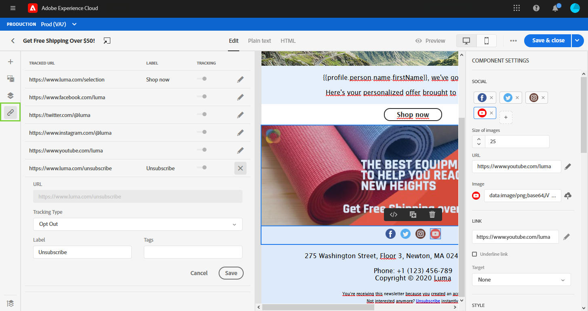

# 마케터를 위한 시작하기

로서의 **마케터** 또는 **여정 연습**, 귀하는 메시지, 오퍼 및 여정을 생성할 책임이 있습니다. 작업을 시작할 수 있습니다 [!DNL Adobe Journey Optimizer] 한 번 [시스템 관리자](administrator.md) 그리고 [데이터 엔지니어](data-engineer.md) 환경에 액세스하고 준비할 수 있습니다.

첫 번째 여정을 설정하고, 오퍼와 자산을 추가하고, 메시지를 보내려면 다음 섹션을 참조하십시오.

1. **세그먼트 만들기**. Journey Optimizer에서 바로 대상 세그먼트를 만들 수 있습니다 **세그먼트** 메뉴를 보고 여정에 활용할 수 있습니다.  세그먼트에 대해 자세히 알아보기 [이 페이지에서](../segment/about-segments.md). 세그먼트를 만드는 방법 살펴보기 [이 샘플](../segment/creating-a-segment.md).

1. **메시지 만들기**. Journey Optimizer에서 이메일 및 푸시 알림을 만드는 방법을 알아봅니다 [이 페이지에서](../create-message.md).

   

1. **개인화 추가**. Journey Optimizer 개인화 기능을 활용하여 메시지를 대상에 맞게 조정하십시오. 개인화에 대해 자세히 알아보기 [이 섹션](../personalization/personalize.md).

   

1. **자산 만들기 및 관리**. [!DNL Adobe Experience Manager Assets Essentials] 는 메시지를 채우는 데 사용할 수 있는 중앙 집중식 단일 자산 저장소를 제공합니다. 추가 정보 [이 섹션](../assets-essentials.md).

1. **오퍼 추가**. [!DNL Journey Optimizer]을(를) 사용하여 적절한 시기에 모든 접점에서 고객에게 최상의 오퍼 및 경험을 제공하십시오. 디자인한 후에는 개인화된 오퍼를 통해 대상을 타기팅하십시오. Decisioning 관리에 대해 자세히 알아보기 [이 섹션](../../using/offers/get-started/starting-offer-decisioning.md).

   

1. **메시지 테스트 및 유효성 검사**. 메시지 콘텐츠가 정의되면 테스트 프로필을 사용하여 미리 보고 테스트할 수 있습니다. 삽입한 경우 [개인화된 콘텐츠](../personalization/personalize.md)를 입력하면 테스트 프로필 데이터를 활용하여 이 콘텐츠가 메시지에 어떻게 표시되는지 확인할 수 있습니다. 또한 **리트머스** 계정 [!DNL Journey Optimizer] 즉시 미리 보려면 **전자 메일 렌더링** 인기 있는 이메일 클라이언트에서 그런 다음 모든 받은 편지함에서 전자 메일 콘텐츠가 제대로 표시되고 제대로 작동하는지 확인할 수 있습니다. 메시지 테스트 및 유효성 검사 방법을 알아봅니다 [이 섹션](../preview.md).

1. **고객 여정 설계** 을 통해 개인화된 컨텍스트 기반의 경험을 제공할 수 있습니다. [!DNL Journey Optimizer] 을(를) 사용하면 이벤트 또는 데이터 소스에 저장된 상황별 데이터를 활용하여 실시간 오케스트레이션 사용 사례를 빌드할 수 있습니다. 다음 기능을 통해 제공되는 여러 단계로 구성된 고급 시나리오 설계:

   * 실시간 보내기 **단일 메시지** 이벤트가 수신될 때 트리거되거나 **일괄적으로** Adobe Experience Platform 세그먼트 사용.

   * 활용 **컨텍스트 기반 데이터** 이벤트, Adobe Experience Platform의 정보 또는 서드파티 API 서비스의 데이터를 포함합니다.

   * 를 사용하십시오 **기본 작업** 에 디자인된 메시지를 보냅니다. [!DNL Journey Optimizer] 또는 만들기 **사용자 지정 작업** 서드파티 시스템을 사용하여 메시지를 전송하는 경우

   * 사용 **여정 디자이너**, 여러 단계 사용 사례를 빌드합니다. 시작 이벤트 또는 세그먼트 읽기 활동을 쉽게 끌어다 놓고 조건을 추가하고 개인화된 메시지를 보냅니다.

   

   여정을 디자인하고 실행하는 방법을 알아봅니다 [이 섹션](../building-journeys/journey-gs.md)

1. **메시지 및 여정 모니터링**. 메시지가 성공적으로 실행, 전송 및 전달되는지 확인하려면, [!DNL Journey Optimizer] 은 현재 게시되고 트리거된 메시지를 모니터링하는 기능을 제공합니다. 성능 모니터링 방법 알아보기 [이 섹션](../message-monitoring.md).
