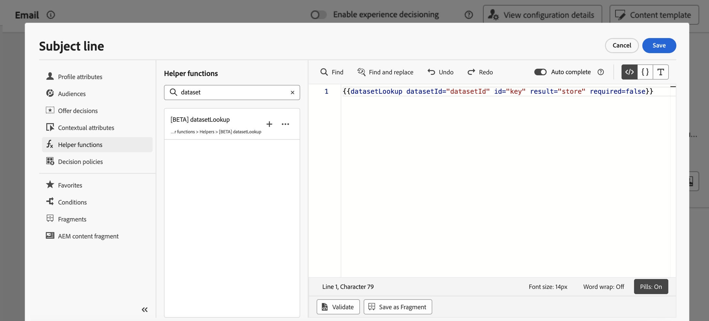
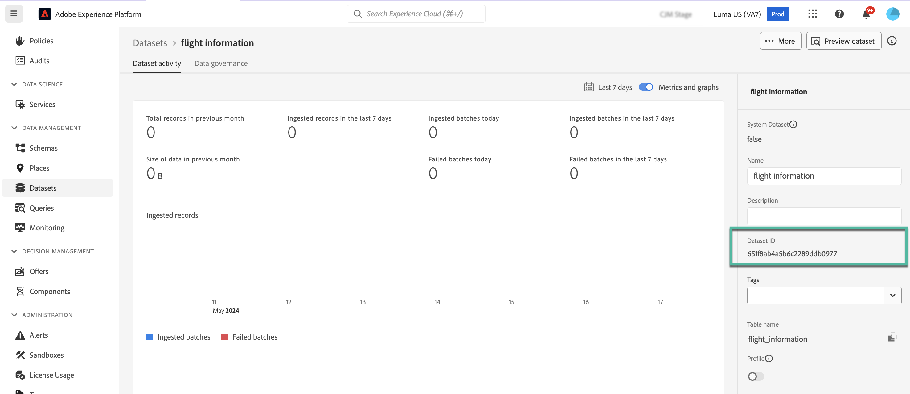
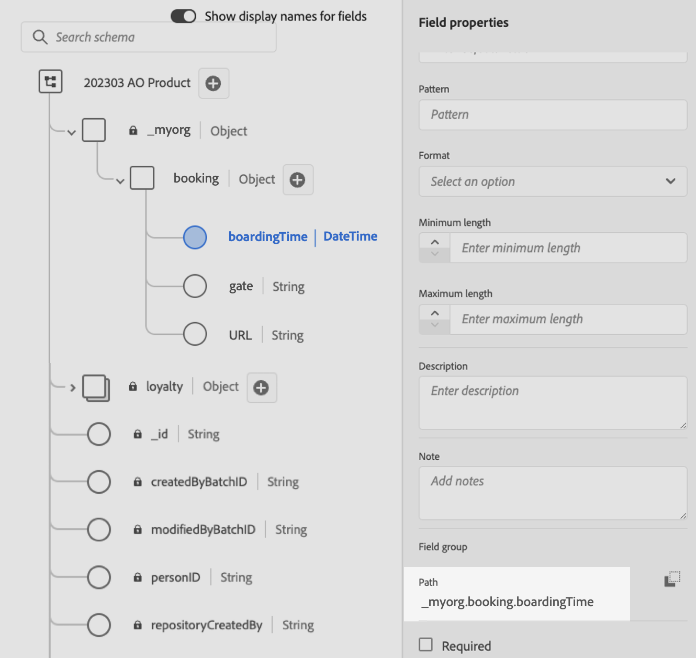

# 개인화에 Adobe Experience Platform 데이터 사용 {#aep-data}

>[!BEGINSHADEBOX]

**이 페이지에서:** 개인화 편집기에서 datasetLookup 도우미 함수를 사용하여 Adobe Experience Platform 레코드 데이터 세트에서 필드를 검색하고 콘텐츠를 개인화하는 방법을 알아봅니다.

>[!ENDSHADEBOX]

>[!AVAILABILITY]
>
>이 기능은 현재 모든 고객이 제한된 가용성 릴리스로 사용할 수 있습니다.
>
>지금은 &quot;datasetLookup&quot; 도우미 함수를 제한된 고객 집합의 표현식 조각 내에서 사용할 수 있습니다. 액세스 권한을 받으려면 Adobe 담당자에게 문의하십시오.

Journey Optimizer을 사용하면 개인화 편집기에서 Adobe Experience Platform 레코드 데이터 세트의 데이터를 활용하여 [콘텐츠를 개인 맞춤화](../personalization/personalize.md)할 수 있습니다. 시작하기 전에 조회 개인화에 필요한 데이터 세트를 먼저 조회에 대해 활성화해야 합니다. 자세한 정보는 이 섹션에서 확인할 수 있습니다. [Adobe Experience Platform 데이터 사용](../data/lookup-aep-data.md).

조회 개인화를 위해 데이터 세트를 활성화하면 해당 데이터를 사용하여 콘텐츠를 [!DNL Journey Optimizer]&#x200B;(으)로 개인화할 수 있습니다.

1. 메시지와 같은 개인화를 정의할 수 있는 모든 컨텍스트에서 사용할 수 있는 개인화 편집기를 엽니다. [개인화 편집기로 작업하는 방법을 알아보세요](../personalization/personalization-build-expressions.md)

1. 도우미 함수 목록으로 이동하여 **datasetLookup** 도우미 함수를 코드 창에 추가합니다.

   

1. 이 함수는 Adobe Experience Platform 데이터 세트에서 필드를 호출할 수 있는 사전 정의된 구문을 제공합니다. 구문은 다음과 같습니다.

   ```
   {{datasetLookup datasetId="datasetId" id="key" result="store" required=false}}
   ```

   * **datasetId**&#x200B;은(는) 작업 중인 데이터 세트의 ID입니다.
   * **id**&#x200B;은(는) 조회 데이터 세트의 기본 ID와 연결해야 하는 원본 열의 ID입니다.

     >[!NOTE]
     >
     >이 필드에 입력한 값은 필드 ID(`profile.packages.packageSKU`), 여정 이벤트에서 전달된 필드(`context.journey.events.event_ID.productSKU`) 또는 정적 값(`sku007653`)일 수 있습니다. 어떤 경우든 시스템은 값을 사용하고 데이터 세트를 조회하여 키가 일치하는지 확인합니다.
     >
     >키에 리터럴 문자열 값을 사용하는 경우 텍스트를 따옴표로 묶습니다. 예: `{{datasetLookup datasetId="datasetId" id="SKU1234" result="store" required=false}}`. 속성 값을 동적 키로 사용하는 경우 따옴표를 제거합니다. 예: `{{datasetLookup datasetId="datasetId" id=category.product.SKU result="SKU" required=false}}`

   * **result**&#x200B;은(는) 데이터 집합에서 검색할 모든 필드 값을 참조하기 위해 제공해야 하는 임의의 이름입니다. 이 값은 코드에서 각 필드를 호출하는 데 사용됩니다.

   * **required=false**: 필요한 경우 TRUE로 설정되어 있으면 일치하는 키가 있는 경우에만 메시지가 배달됩니다. false로 설정하면 일치하는 키가 필요하지 않고 메시지를 계속 전달할 수 있습니다. false로 설정된 경우 메시지 콘텐츠에 대체 항목 또는 기본값을 고려하는 것이 좋습니다.

   +++데이터 세트 ID를 검색하는 위치

   데이터 세트 ID는 Adobe Experience Platform 사용자 인터페이스에서 검색할 수 있습니다. [Adobe Experience Platform 설명서](https://experienceleague.adobe.com/en/docs/experience-platform/catalog/datasets/user-guide#view-datasets){target="_blank"}에서 데이터 세트로 작업하는 방법을 알아보세요.

   

   +++

1. 필요에 맞게 구문을 조정하십시오. 이 예제에서는 승객의 비행과 관련된 데이터를 검색하려고 합니다. 구문은 다음과 같습니다.

   ```
   {{datasetLookup datasetId="1234567890abcdtId" id=profile.upcomingFlightId result="flight"}}
   ```

   * ID가 &quot;abcdtId&quot;인 데이터 세트에서 작업 1234567890,
   * 조회 데이터 세트에 가입하는 데 사용할 필드는 *profile.uncomingFlightId*&#x200B;입니다.
   * &quot;플라이트&quot; 참조 아래에 모든 필드 값을 포함하려고 합니다.

1. Adobe Experience Platform 데이터 세트에서 호출할 구문이 구성되면 검색할 필드를 지정할 수 있습니다. 구문은 다음과 같습니다.

   ```
   {{result.fieldId}}
   ```

   >[!NOTE]
   >
   >데이터 세트 필드를 참조할 때 스키마 내에 정의된 전체 필드 경로와 일치하는지 확인하십시오.
   >
   >도우미 함수를 사용하여 가져올 수 있는 필드의 수에는 엄격한 제한이 없습니다. 그러나 최상의 성능을 위해서는 처리량에 영향을 주지 않도록 필드 수를 50 미만으로 유지하는 것이 좋습니다.

   * **result**&#x200B;은(는) **datasetLookup** 도우미 함수에서 **result** 매개 변수에 할당한 값입니다. 이 예에서는 &quot;flight&quot;입니다.
   * **fieldID**&#x200B;은(는) 검색할 필드의 ID입니다. 이 ID는 데이터 집합과 관련된 레코드 스키마를 검색할 때 [!DNL Adobe Experience Platform] 사용자 인터페이스에 표시됩니다.

     +++필드 ID를 검색하는 위치

     Adobe Experience Platform 사용자 인터페이스에서 데이터 세트를 미리 볼 때 필드 ID를 검색할 수 있습니다. [Adobe Experience Platform 설명서](https://experienceleague.adobe.com/en/docs/experience-platform/catalog/datasets/user-guide#preview){target="_blank"}에서 데이터 세트를 미리 보는 방법에 대해 알아보세요.

     

     +++

   이 예제에서는 승객의 탑승 시간 및 탑승구와 관련된 정보를 사용하려고 합니다. 따라서 다음 두 행을 추가합니다.

   * `{{flight._myorg.booking.boardingTime}}`
   * `{{flight._myorg.booking.gate}}`

1. 이제 코드가 준비되었으므로 평소대로 콘텐츠를 완료하고 시뮬레이션 방법을 사용하여 테스트할 수 있습니다. **[!UICONTROL 콘텐츠 시뮬레이션]**&#x200B;을 클릭하여 샘플 입력 데이터 또는 AI 자동 생성을 통해 콘텐츠 변형을 테스트하거나 **[!UICONTROL 콘텐츠 시뮬레이션]**&#x200B;을 클릭한 다음 드롭다운에서 **[!UICONTROL 콘텐츠 시뮬레이션(AEP 프로필)]**&#x200B;을 선택하여 테스트 프로필로 미리 봅니다. [콘텐츠를 미리 보고 테스트하는 방법에 대해 알아보세요](../content-management/preview-test.md)


   

## 빠른 참조 {#quick-reference}

이 단원에는 이 주제와 관련된 해석, 검색 및 질문 답변을 지원하기 위한 구조화된 지식이 포함되어 있습니다.

이해를 돕기 위해 이 정보를 이 페이지의 설명서와 통합해야 합니다. 두 소스 모두 독립적으로 사용하기 위한 것은 아닙니다. 이 페이지에서는 기능에 대해 설명하지만, 용어, 의도, 적용 가능성 및 제약 조건을 명확히 하는 데 도움이 되는 추가 컨텍스트를 제공합니다.

>[!BEGINTABS]

>[!TAB 개요]

**TL;DR**

이 페이지에서는 Journey Optimizer 개인화 편집기에서 `datasetLookup` 도우미 함수를 사용하여 Adobe Experience Platform 레코드 데이터 세트에서 필드를 검색하고 이를 메시지 개인화에 통합하는 방법을 설명합니다.

**의도**

* 조회 개인화를 위해 AEP 레코드 데이터 세트 활성화
* 개인화 식에 `datasetLookup` 도우미 함수 추가
* 데이터 세트 ID, 조인 키, 결과 별칭 및 필수 플래그를 사용하여 함수 구성
* 결과 별칭을 사용하여 개인화 표현식에서 검색된 데이터 세트 필드 참조
* 콘텐츠 시뮬레이션 흐름을 사용하여 개인화된 콘텐츠 테스트

>[!TAB 용어집]

* **datasetLookup**: 지정한 키에 연결하여 AEP 레코드 데이터 집합에서 필드 값을 검색하는 개인화 편집기의 도우미 함수입니다. *(제품별)*
* **레코드 데이터 집합**: 조회 개인화에 사용할 수 있는 레코드 수준 데이터가 포함된 Adobe Experience Platform 데이터 집합 형식입니다. *(제품별)*
* **개인화 조회**: 메시지 콘텐츠를 개인화하기 위해 전송 시 AEP 레코드 데이터 집합에서 필드를 가져오는 프로세스입니다. *(제품별)*
* **결과 매개 변수**: `datasetLookup` 호출에 할당된 임의의 별칭입니다. 후속 식에서 검색된 모든 필드 값을 참조하는 데 사용됩니다(예: `{{result.fieldId}}`).
* **필수 매개 변수**: 메시지 배달에 데이터 집합에서 일치하는 키를 찾아야 하는지 여부를 제어하는 `datasetLookup`의 부울 플래그.

>[!TAB 용어]

* **정식 이름:** datasetLookup — 변형: 데이터 세트 조회, 데이터 세트 조회 도우미, 데이터 세트 조회 도우미 함수
* **동의어:** &quot;datasetLookup&quot; = &quot;dataset 조회 도우미 함수&quot;
* **혼동하지 마십시오.** &quot;datasetId&quot;(AEP 데이터 집합 식별자) ≠ &quot;id&quot;(데이터 집합의 기본 ID와 결합하는 데 사용되는 소스 열) ≠ &quot;result&quot;(검색된 필드 값을 참조하는 별칭)

>[!TAB 보호 기능 및 제한 사항]

* 이 기능은 제한된 가용성에 있으며 아직 모든 고객이 사용할 수 있는 것은 아닙니다.
* 표현식 조각 내의 `datasetLookup` 도우미 함수는 제한된 고객 집합에서만 사용할 수 있습니다. 액세스 권한을 얻으려면 Adobe 담당자에게 문의하십시오.
* 데이터 집합을 `datasetLookup`에서 사용하려면 조회 개인화에 대해 명시적으로 사용하도록 설정해야 합니다.
* 처리량에 영향을 주지 않도록 `datasetLookup` 호출당 검색된 필드 수를 50개 미만으로 유지합니다(권장 제한 — 페이지에 하드 제한이 지정되지 않음).

>[!TAB FAQ]

**Q: `datasetLookup` 도우미 함수란 무엇입니까?**

Adobe Experience Platform 레코드 데이터 세트에서 필드 값을 검색하여 해당 데이터를 메시지 개인화에 통합할 수 있는 개인화 편집기의 도우미 함수입니다.

**Q: `required=false`이(가) 데이터 집합에 일치하는 키가 없으면 어떻게 됩니까?**

메시지는 계속 전달할 수 있습니다. `required=false`을(를) 사용할 때 메시지 콘텐츠에 대체 항목 또는 기본값을 고려하는 것이 좋습니다.

**Q: `required=true`에 일치하는 키가 없으면 어떻게 됩니까?**

데이터 세트에 일치하는 키가 있는 경우에만 메시지가 전달됩니다.

**Q: 구문에 필요한 데이터 세트 ID와 필드 ID는 어디에서 찾을 수 있습니까?**

데이터 세트 ID는 데이터 세트 아래의 Adobe Experience Platform UI에서 검색할 수 있습니다. 필드 ID는 데이터 세트를 미리 보고 AEP UI에서 레코드 스키마를 검색할 때 표시됩니다.

**Q: `datasetLookup`을(를) 사용하는 콘텐츠를 테스트하려면 어떻게 합니까?**

**콘텐츠 시뮬레이션** 단추를 사용하여 샘플 입력 데이터 또는 AI 자동 생성으로 테스트하거나 드롭다운에서 **콘텐츠 시뮬레이션(AEP 프로필)**&#x200B;을 선택하여 테스트 프로필로 미리 봅니다.

>[!ENDTABS]

<!-- ai-section-version: 1 | source-hash: 89d99e47 -->
