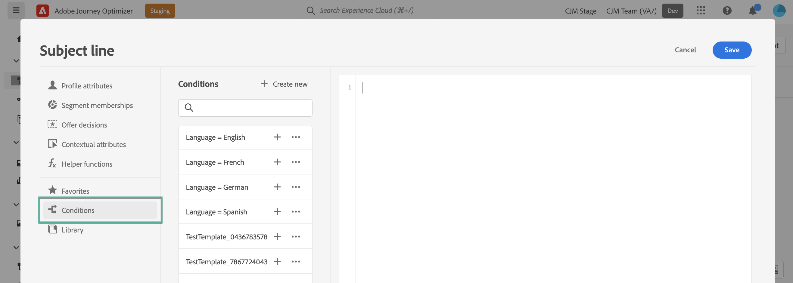
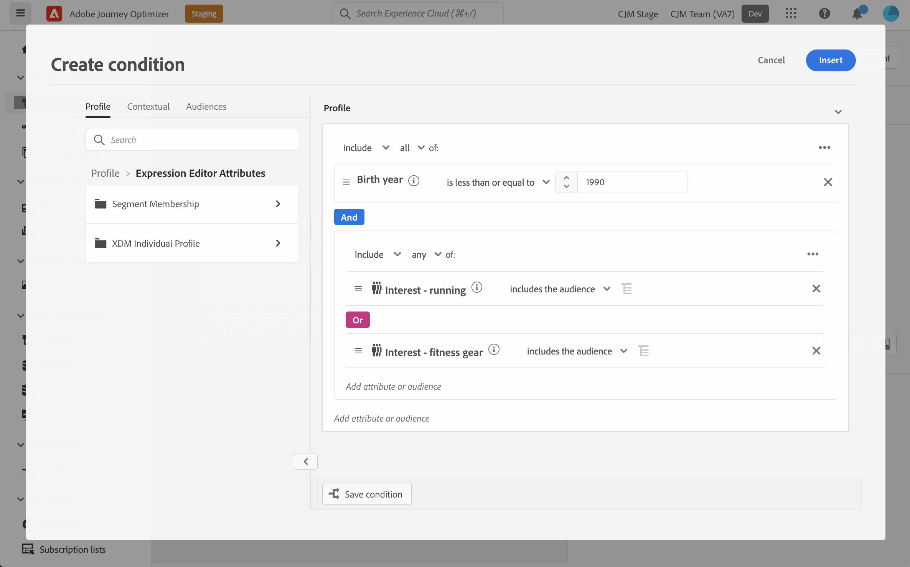
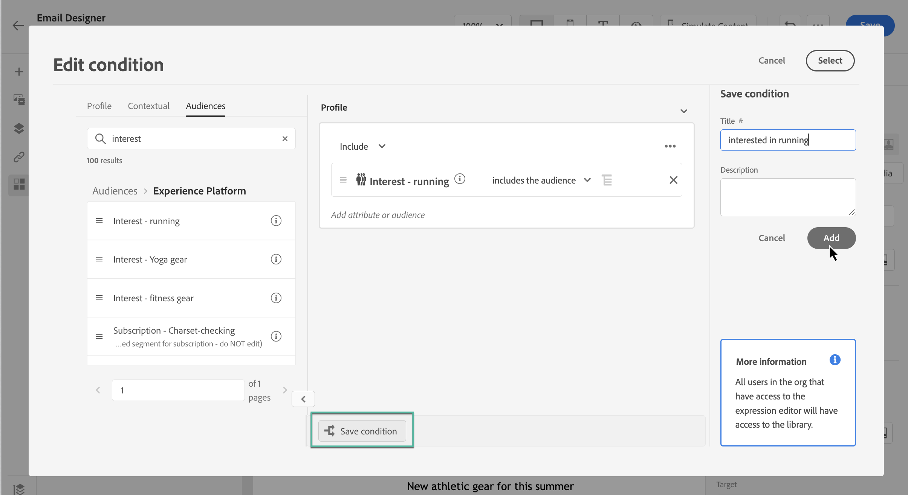
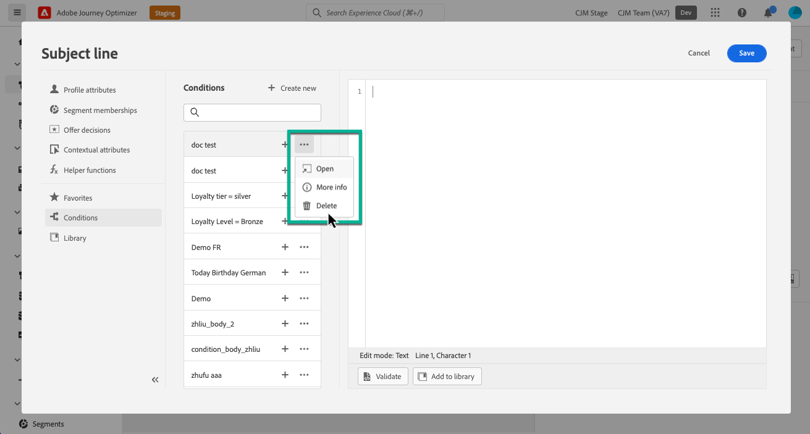

# 조건부 규칙 작업 {#conditions}

>[!BEGINSHADEBOX]

**이 페이지에서:** 프로필 특성, 컨텍스트 기반 이벤트 및 개인화 편집기의 대상자로부터 조건부 규칙을 만든 다음 콘텐츠에 다시 사용할 수 있도록 라이브러리에 저장하는 방법을 알아봅니다.

>[!ENDSHADEBOX]

조건부 규칙은 프로필의 속성, 대상자 멤버십 또는 컨텍스트 이벤트와 같은 다양한 기준에 따라 메시지에 표시할 콘텐츠를 정의하는 규칙 세트입니다.

조건부 규칙은 개인화 편집기를 사용하여 생성되며 콘텐츠 간에 재사용하려는 경우 저장할 수 있습니다. [조건부 규칙을 라이브러리에 저장하는 방법을 알아봅니다](#save)

>[!NOTE]
>
>조건부 규칙을 저장하거나 삭제하려면 개인에게 [라이브러리 항목 관리](../administration/ootb-product-profiles.md) 권한이 필요합니다. 저장된 조건은 조직 내의 모든 사용자가 사용할 수 있습니다.

## 조건부 규칙 빌더에 액세스 {#access}

조건부 규칙은 다음 중 하나에서 액세스할 수 있는 개인화 편집기의 **[!UICONTROL 조건]** 메뉴에서 만들어집니다.

* 이메일 Designer에서 이메일 본문의 구성 요소에 대해 동적 콘텐츠를 활성화할 때 표시됩니다. [다이내믹 콘텐츠를 전자 메일에 추가하는 방법 알아보기](dynamic-content.md#emails)

  

* [개인화 편집기](personalization-build-expressions.md)를 사용하여 개인화를 추가할 수 있는 모든 필드에서.

  

## 조건부 규칙 만들기 {#create-condition}

>[!CONTEXTUALHELP]
>id="ajo_expression_editor_conditions_create"
>title="조건 만들기"
>abstract="프로필 속성, 상황별 이벤트 또는 대상자를 결합하여 메시지에 표시되어야 하는 콘텐츠를 정의하는 규칙을 작성합니다."

>[!CONTEXTUALHELP]
>id="ajo_expression_editor_conditions"
>title="조건 만들기"
>abstract="프로필 속성, 상황별 이벤트 또는 대상자를 결합하여 메시지에 표시되어야 하는 콘텐츠를 정의하는 규칙을 작성합니다."

조건부 규칙을 만드는 단계는 다음과 같습니다.

1. 개인화 편집기 또는 전자 메일 Designer에서 **[!UICONTROL 조건]** 메뉴에 액세스한 다음 **[!UICONTROL 새로 만들기]**&#x200B;를 클릭합니다.

1. 필요에 따라 조건부 규칙을 만듭니다. 이렇게 하려면 왼쪽 메뉴에서 원하는 속성을 캔버스로 드래그 앤 드롭하고 정렬합니다.

   속성을 캔버스에 결합하는 단계는 세그먼트 빌드 경험과 유사합니다. 규칙 빌더 캔버스로 작업하는 방법에 대한 자세한 내용은 [이 설명서](https://experienceleague.adobe.com/docs/experience-platform/segmentation/ui/segment-builder.html#rule-builder-canvas)를 참조하세요.

   

   속성은 다음 세 가지 탭으로 구성됩니다.

   * **[!UICONTROL 프로필]**:
     * **[!UICONTROL 대상]**&#x200B;에 모든 대상 특성(예: 상태, 버전 등)이 나열됩니다. [Adobe Experience Platform 세분화 서비스](https://experienceleague.adobe.com/docs/experience-platform/segmentation/home.html?lang=ko){target="_blank"}의 경우,
     * **[!UICONTROL XDM 개별 프로필]**&#x200B;은(는) Adobe Experience Platform에 정의된 [XDM(Experience Data Model) 스키마](https://experienceleague.adobe.com/docs/experience-platform/xdm/home.html?lang=ko-KR){target="_blank"}와(과) 관련된 모든 프로필 특성을 나열합니다.
   * **[!UICONTROL 상황별]**: 메시지를 여정에 사용하면 이 탭을 통해 상황별 여정 필드를 사용할 수 있습니다.
   * **[!UICONTROL 대상]**: [Adobe Experience Platform 세분화 서비스](https://experienceleague.adobe.com/docs/experience-platform/segmentation/home.html?lang=ko){target="_blank"}에서 만든 세그먼트 정의에서 생성된 모든 대상을 나열합니다.

1. 조건부 규칙이 준비되면 메시지에 추가하여 다이내믹 콘텐츠를 만들 수 있습니다. [다이내믹 콘텐츠를 추가하는 방법 알아보기](dynamic-content.md)

   나중에 다시 사용할 수 있도록 규칙을 저장할 수도 있습니다. [조건 저장 방법 알아보기](#save)

## 조건부 규칙 저장 {#save}

자주 재사용할 조건 규칙이 있는 경우 조건 라이브러리에 저장할 수 있습니다. 저장된 모든 규칙은 공유되며 조직 내의 개인이 액세스하고 사용할 수 있습니다.

>[!NOTE]
>
>여정 컨텍스트 속성을 활용하는 조건부 규칙은 라이브러리에 저장할 수 없습니다.

1. 조건 편집 화면에서 **[!UICONTROL 조건 저장]** 단추를 클릭합니다.

1. 규칙에 이름 및 설명(선택 사항)을 지정한 다음 **[!UICONTROL 추가]**&#x200B;를 클릭합니다.

   

1. 조건부 규칙은 라이브러리에 저장됩니다. 이제 이를 사용하여 메시지에 동적 콘텐츠를 만들 수 있습니다. [다이내믹 콘텐츠를 추가하는 방법 알아보기](dynamic-content.md)

>[!CAUTION]
>
>조건부 콘텐츠 변형의 이름을 지정할 때 영숫자(A-Z, a-z, 0-9)만 사용하십시오. 특수 문자 사용(예: `<`, `>`, `=`, `{`, `}` 등) 변형 이름에서 템플릿 편집기로 인해 구성 요소가 손상되거나 숨겨질 수 있습니다.

## 저장된 조건부 규칙 편집 및 삭제 {#edit-delete}

줄임표 버튼을 사용하여 언제든지 조건부 규칙을 삭제할 수 있습니다.

라이브러리에 저장된 조건부 규칙은 수정할 수 없습니다. 하지만 여전히 새 규칙을 만드는 데 사용할 수 있습니다. 이렇게 하려면 조건부 규칙을 열고 원하는 대로 변경한 다음 라이브러리에 저장합니다. [라이브러리에 조건을 저장하는 방법을 알아봅니다](#save)

## 빠른 참조 {#quick-reference}

이 단원에는 이 주제와 관련된 해석, 검색 및 질문 답변을 지원하기 위한 구조화된 지식이 포함되어 있습니다.

이해를 돕기 위해 이 정보를 이 페이지의 설명서와 통합해야 합니다. 두 소스 모두 독립적으로 사용하기 위한 것은 아닙니다. 이 페이지에서는 기능에 대해 설명하지만, 용어, 의도, 적용 가능성 및 제약 조건을 명확히 하는 데 도움이 되는 추가 컨텍스트를 제공합니다.

>[!BEGINTABS]

>[!TAB 개요]

**TL;DR**

이 페이지에서는 개인화 편집기의 프로필 속성, 컨텍스트 기반 이벤트 및 대상으로부터 조건부 규칙을 작성하는 방법과 메시지 콘텐츠 간에 재사용할 수 있도록 라이브러리에 저장하는 방법에 대해 설명합니다.

**의도**

* 개인화 편집기 또는 이메일 Designer에서 조건부 규칙 빌더에 액세스
* 프로필 속성, 대상 멤버십 및 컨텍스트 여정 필드를 결합하여 조건부 규칙을 만듭니다
* 메시지에 조건부 규칙 을 추가하여 다이내믹 콘텐츠 만들기
* 조직 전체에서 재사용할 수 있도록 조건 규칙을 조건 라이브러리에 저장합니다.
* 저장된 조건부 규칙 편집 또는 삭제

>[!TAB 용어집]

* **조건부 규칙**: 프로필 특성, 대상 멤버십 또는 컨텍스트 이벤트와 같은 기준을 기반으로 메시지에 표시할 콘텐츠를 정의하는 규칙 집합입니다. *(제품별)*
* **조건 라이브러리**: 저장된 조건부 규칙이 저장되고 모든 사용자가 액세스할 수 있는 조직 내의 공유 리포지토리입니다. *(제품별)*
* **다이내믹 콘텐츠**: 표시가 조건부 규칙에 의해 관리되는 메시지 콘텐츠입니다. *(제품별)*
* **컨텍스트 필드**: 여정에서 메시지를 사용할 때 여정 작성기에서 사용할 수 있는 규칙별 필드입니다. 이러한 필드를 사용하는 규칙은 라이브러리에 저장할 수 없습니다.
* **XDM 개별 프로필**: Adobe Experience Platform에 정의된 XDM(Experience Data Model) 스키마와 연결된 프로필 속성을 규칙 기준으로 사용할 수 있습니다.

>[!TAB 용어]

* **정식 이름:** 조건부 규칙 — 변형: 조건, 조건, 조건부 콘텐츠 규칙
* **동의어:** &quot;조건부 규칙&quot; = &quot;조건&quot;(UI에 레이블이 지정됨)
* **혼동하지 마십시오.** &quot;프로필&quot; 탭(대상 특성 및 XDM 개별 프로필 하위 섹션 모두 포함) ≠ &quot;대상&quot; 탭(AEP 세그멘테이션 서비스의 세그먼트 정의에서 생성된 모든 대상을 나열)
* **혼동하지 마십시오.** &quot;조건 저장&quot;(공유 라이브러리에 규칙 저장) ≠ &quot;조건 만들기&quot;(편집기에서 새 규칙 작성)

>[!TAB 보호 기능 및 제한 사항]

* 여정 컨텍스트 속성을 활용하는 조건부 규칙은 조건 라이브러리에 저장할 수 없습니다.
* **라이브러리 항목 관리** 권한이 있는 사용자만 라이브러리에서 조건부 규칙을 저장하거나 삭제할 수 있습니다.
* 저장된 조건은 조직 내의 모든 사용자가 공유하고 액세스할 수 있습니다.
* 라이브러리에 저장된 조건부 규칙은 직접 수정할 수 없습니다. 규칙을 열고 원하는 대로 변경한 후 라이브러리에 저장하십시오.
* 변형 이름에는 영숫자(A-Z, a-z, 0-9)만 사용해야 합니다. `<`, `>`, `=`, `{`, `}`과(와) 같은 특수 문자로 인해 템플릿 편집기에서 구성 요소를 나누거나 숨길 수 있습니다.

>[!TAB FAQ]

**Q: 조건부 규칙을 만드는 데 사용할 수 있는 기준은 무엇입니까?**

프로필 속성, 대상 멤버십 및 컨텍스트 여정 필드(메시지가 여정에 사용되는 경우).

**Q: 여정 컨텍스트 특성을 사용하는 조건부 규칙을 저장할 수 있습니까?**

아니요. 여정 컨텍스트 속성을 활용하는 조건부 규칙은 조건 라이브러리에 저장할 수 없습니다.

**Q: 누가 라이브러리에 조건부 규칙을 저장하거나 삭제할 수 있습니까?**

**라이브러리 항목 관리** 권한이 있는 사용자만 조건부 규칙을 저장하거나 삭제할 수 있습니다.

**Q: 라이브러리에 이미 저장된 조건부 규칙을 수정할 수 있습니까?**

라이브러리에 저장된 조건부 규칙은 직접 수정할 수 없습니다. 저장된 규칙을 열고 원하는 대로 변경한 후 라이브러리에 저장할 수 있습니다.

**Q: 조건부 콘텐츠 변형의 이름을 지정하는 데 제한이 있습니까?**

예. 변형 이름에는 영숫자(A-Z, a-z, 0-9)만 포함되어야 합니다. `<`, `>`, `=`, `{`, `}`과(와) 같은 특수 문자로 인해 템플릿 편집기에서 구성 요소를 나누거나 숨길 수 있습니다.

>[!ENDTABS]

<!-- ai-section-version: 1 | source-hash: f375658d -->
