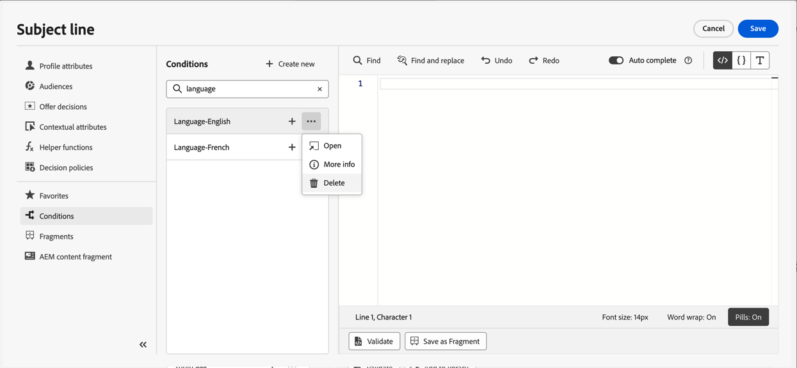

# 조건부 규칙 작업 {#conditions}

조건부 규칙은 프로필의 속성, 대상자 멤버십 또는 컨텍스트 이벤트와 같은 다양한 기준에 따라 메시지에 표시할 콘텐츠를 정의하는 규칙 세트입니다.

조건부 규칙은 개인화 편집기를 사용하여 생성되며 콘텐츠 간에 재사용하려는 경우 저장할 수 있습니다. [조건부 규칙을 라이브러리에 저장하는 방법을 알아봅니다](#save)

>[!NOTE]
>
>조건부 규칙을 저장하거나 삭제하려면 개인에게 [라이브러리 항목 관리](../administration/ootb-product-profiles.md) 권한이 필요합니다. 저장된 조건은 조직 내의 모든 사용자가 사용할 수 있습니다.

## 조건부 규칙 빌더에 액세스 {#access}

조건부 규칙은 다음 중 하나에서 액세스할 수 있는 개인화 편집기의 **[!UICONTROL 조건]** 메뉴에서 만들어집니다.

* 이메일 Designer에서 이메일 본문의 구성 요소에 대해 동적 콘텐츠를 활성화할 때 표시됩니다. [다이내믹 콘텐츠를 전자 메일에 추가하는 방법 알아보기](dynamic-content.md#emails)

  

* [개인화 편집기](personalization-build-expressions.md)를 사용하여 개인화를 추가할 수 있는 모든 필드에서.

  

## 조건부 규칙 만들기 {#create-condition}

>[!CONTEXTUALHELP]
>id="ajo_expression_editor_conditions_create"
>title="조건 만들기"
>abstract="프로필 속성, 상황별 이벤트 또는 대상자를 결합하여 메시지에 표시되어야 하는 콘텐츠를 정의하는 규칙을 작성합니다."

>[!CONTEXTUALHELP]
>id="ajo_expression_editor_conditions"
>title="조건 만들기"
>abstract="프로필 속성, 상황별 이벤트 또는 대상자를 결합하여 메시지에 표시되어야 하는 콘텐츠를 정의하는 규칙을 작성합니다."

조건부 규칙을 만드는 단계는 다음과 같습니다.

1. 개인화 편집기 또는 전자 메일 Designer에서 **[!UICONTROL 조건]** 메뉴에 액세스한 다음 **[!UICONTROL 새로 만들기]**&#x200B;를 클릭합니다.

1. 필요에 따라 조건부 규칙을 만듭니다. 이렇게 하려면 왼쪽 메뉴에서 원하는 속성을 캔버스로 드래그 앤 드롭하고 정렬합니다.

   속성을 캔버스에 결합하는 단계는 세그먼트 빌드 경험과 유사합니다. 규칙 빌더 캔버스로 작업하는 방법에 대한 자세한 내용은 [이 설명서](https://experienceleague.adobe.com/docs/experience-platform/segmentation/ui/segment-builder.html?lang=ko#rule-builder-canvas)를 참조하세요.

   

   속성은 다음 세 가지 탭으로 구성됩니다.

   * **[!UICONTROL 프로필]**:
      * **[!UICONTROL 대상]**&#x200B;에 모든 대상 특성(예: 상태, 버전 등)이 나열됩니다. [Adobe Experience Platform 세분화 서비스](https://experienceleague.adobe.com/docs/experience-platform/segmentation/home.html?lang=ko)의 경우,
      * **[!UICONTROL XDM 개별 프로필]**&#x200B;은(는) Adobe Experience Platform에 정의된 [XDM(Experience Data Model) 스키마](https://experienceleague.adobe.com/docs/experience-platform/xdm/home.html?lang=ko-KR)와(과) 관련된 모든 프로필 특성을 나열합니다.
   * **[!UICONTROL 상황별]**: 메시지를 여정에 사용하면 이 탭을 통해 상황별 여정 필드를 사용할 수 있습니다.
   * **[!UICONTROL 대상]**: [Adobe Experience Platform 세분화 서비스](https://experienceleague.adobe.com/docs/experience-platform/segmentation/home.html?lang=ko)에서 만든 세그먼트 정의에서 생성된 모든 대상을 나열합니다.

1. 조건부 규칙이 준비되면 메시지에 추가하여 다이내믹 콘텐츠를 만들 수 있습니다. [다이내믹 콘텐츠를 추가하는 방법 알아보기](dynamic-content.md)

   나중에 다시 사용할 수 있도록 규칙을 저장할 수도 있습니다. [조건 저장 방법 알아보기](#save)

## 조건부 규칙 저장 {#save}

자주 재사용할 조건 규칙이 있는 경우 조건 라이브러리에 저장할 수 있습니다. 저장된 모든 규칙은 공유되며 조직 내의 개인이 액세스하고 사용할 수 있습니다.

>[!NOTE]
>
>여정 컨텍스트 속성을 활용하는 조건부 규칙은 라이브러리에 저장할 수 없습니다.

1. 조건 편집 화면에서 **[!UICONTROL 조건 저장]** 단추를 클릭합니다.

1. 규칙에 이름 및 설명(선택 사항)을 지정한 다음 **[!UICONTROL 추가]**&#x200B;를 클릭합니다.

   

1. 조건부 규칙은 라이브러리에 저장됩니다. 이제 이를 사용하여 메시지에 동적 콘텐츠를 만들 수 있습니다. [다이내믹 콘텐츠를 추가하는 방법 알아보기](dynamic-content.md)

## 저장된 조건부 규칙 편집 및 삭제 {#edit-delete}

줄임표 버튼을 사용하여 언제든지 조건부 규칙을 삭제할 수 있습니다.

라이브러리에 저장된 조건부 규칙은 수정할 수 없습니다. 하지만 여전히 새 규칙을 만드는 데 사용할 수 있습니다. 이렇게 하려면 조건부 규칙을 열고 원하는 대로 변경한 다음 라이브러리에 저장합니다. [라이브러리에 조건을 저장하는 방법을 알아봅니다](#save)
