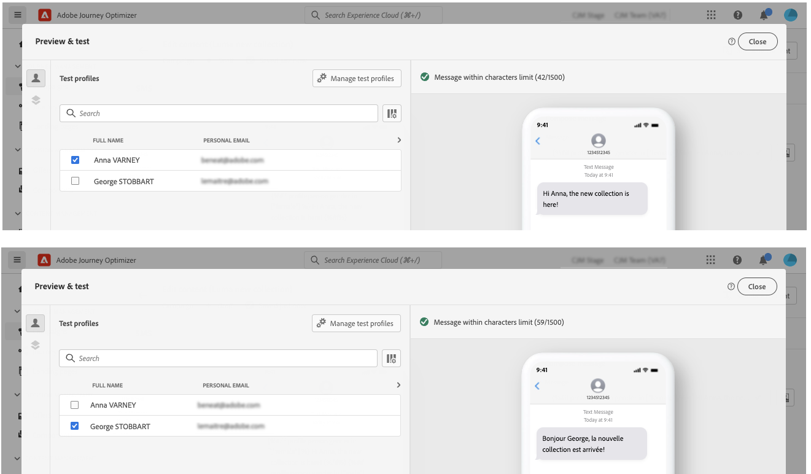
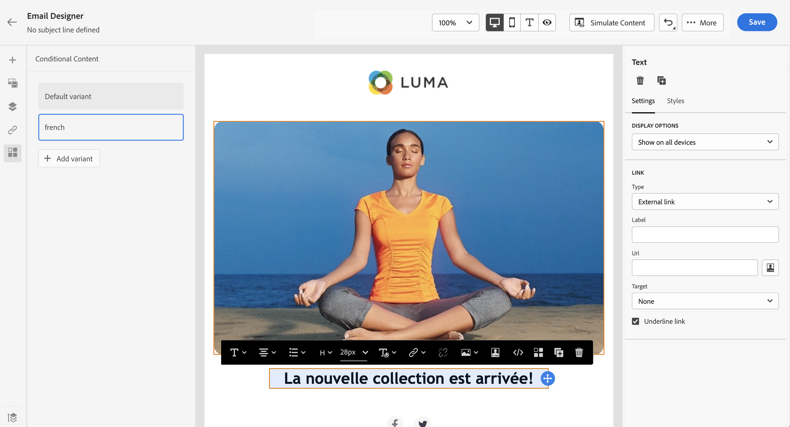

# 다이내믹 콘텐츠 만들기 {#dynamic-content}

Adobe Journey Optimizer을 사용하면 라이브러리에서 만든 조건부 규칙을 활용하여 메시지에 동적 콘텐츠를 추가할 수 있습니다.

표현식 편집기를 사용하여 개인화를 추가할 수 있는 모든 필드에 동적 콘텐츠를 만들 수 있습니다. 여기에는 제목 줄, 링크, 푸시 알림 컨텐츠 또는 텍스트 유형 오퍼의 표현이 포함됩니다. [개인화 컨텍스트에 대해 자세히 알아보기](personalization-contexts.md)

또한 조건부 규칙을 이메일 디자이너에 사용하여 콘텐츠 구성 요소의 여러 변형을 만들 수 있습니다.

## 표현식에 동적 콘텐츠 추가 {#perso-expressions}

표현식에서 동적 컨텐츠를 추가하는 단계는 다음과 같습니다.

1. 동적 컨텐츠를 추가할 필드로 이동한 다음 표현식 편집기를 엽니다.

1. 을(를) 선택합니다 **[!UICONTROL 조건]** 메뉴 아래의 사용 가능한 조건부 규칙 목록을 표시합니다. 규칙 옆에 있는 + 단추를 클릭하여 현재 표현식에 추가합니다.

   을(를) 선택하여 새 규칙을 만들 수도 있습니다 **[!UICONTROL 새로 만들기]**. [조건을 만드는 방법을 알아봅니다](create-conditions.md)

   

1. 다음 사이 추가 `{%if}` 및 `{%/if}` 에는 조건부 규칙이 충족되는 경우 표시할 콘텐츠에 태그를 지정합니다. 표현식의 여러 변형을 만드는 데 필요한 만큼 규칙을 추가할 수 있습니다.

   아래 예에서는 수신자의 기본 설정 언어에 따라 SMS 콘텐츠에 대해 두 개의 변형을 만들었습니다.

   

1. 콘텐츠가 준비되면 **[!UICONTROL 컨텐츠 시뮬레이션]** 버튼을 클릭합니다. [메시지 테스트 및 미리 보기 방법 알아보기](../email/preview.md)

   

## 이메일에 동적 콘텐츠 추가 {#emails}

>[!CONTEXTUALHELP]
>id="ac_conditional_content"
>title="조건부 콘텐츠"
>abstract="조건부 규칙을 사용하여 콘텐츠 구성 요소의 여러 변형을 만듭니다. 메시지를 보낼 때 조건이 충족되지 않으면 기본 변형의 콘텐츠가 표시됩니다."

>[!CONTEXTUALHELP]
>id="ac_conditional_content_select"
>title="조건부 콘텐츠"
>abstract="라이브러리에 저장된 조건부 규칙을 사용하거나 새 규칙을 만듭니다."

이메일 디자이너에서 콘텐츠 구성 요소의 변형을 만드는 단계는 다음과 같습니다.

1. 이메일 디자이너에서 콘텐츠 구성 요소를 선택한 다음 **[!UICONTROL 조건부 콘텐츠 활성화]**.

   

1. 다음 **[!UICONTROL 조건부 콘텐츠]** 창이 왼쪽에 표시됩니다. 이 창에서는 조건을 사용하여 선택한 컨텐츠 구성 요소의 여러 변형을 만들 수 있습니다.

   첫 번째 변형을 선택하고 **[!UICONTROL 조건 적용]** 버튼을 클릭합니다.

   

1. 조건 라이브러리가 표시됩니다. 변형에 연결할 조건부 규칙을 선택한 다음 을 클릭합니다 **[!UICONTROL 선택]**. 이 예에서는 수신자의 선호 언어에 따라 구성 요소 텍스트를 조정하려고 합니다.

   

   을 클릭하여 새 규칙을 만들 수도 있습니다 **[!UICONTROL 새로 만들기]**. [조건을 만드는 방법을 알아봅니다](create-conditions.md)

1. 조건부 규칙은 변형과 연결됩니다. 가독성을 향상시키려면 타원 메뉴를 클릭하여 변형의 이름을 바꾸는 것이 좋습니다.

   이제 메시지를 보낼 때 규칙이 충족되면 구성 요소가 표시되는 방식을 구성합니다. 이 예제에서는 수신자의 선호 언어인 텍스트를 프랑스어로 표시하려고 합니다.

   

1. 컨텐츠 구성 요소에 필요한 만큼 변형을 추가합니다. 언제든지 다른 변형 간을 전환하여 조건부 규칙에 따라 콘텐츠 구성 요소가 표시되는 방식을 확인할 수 있습니다.

   >[!NOTE]
   >메시지를 전송할 때 변형에 정의된 규칙이 모두 충족되지 않으면 콘텐츠 구성 요소에 **[!UICONTROL 기본 변형]**.
   >
   >조건부 콘텐츠는 변형이 표시되는 순서로 연결된 규칙에 대해 평가됩니다. 다른 조건이 충족되지 않으면 기본 변형이 항상 표시됩니다.
