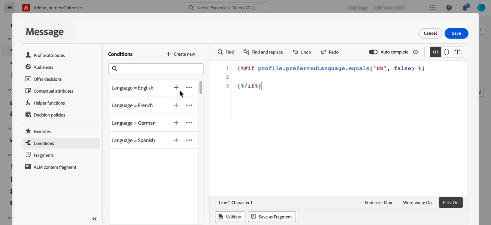

# 다이내믹 콘텐츠 만들기 {#dynamic-content}

Adobe Journey Optimizer을 사용하면 라이브러리에서 만든 조건부 규칙을 활용하여 다이내믹 콘텐츠를 메시지에 추가할 수 있습니다.

다이내믹 콘텐츠는 개인화 편집기를 사용하여 개인화를 추가할 수 있는 모든 필드에 만들 수 있습니다. 제목란, 링크, 푸시 알림 콘텐츠 또는 텍스트 유형 오퍼 표현이 여기에 포함됩니다. [개인화 컨텍스트에 대해 자세히 알아보기](personalization-contexts.md)

또한 이메일 디자이너에 조건부 규칙을 사용하여 콘텐츠 구성 요소의 여러 변형을 만들 수 있습니다.

## 표현식에 동적 콘텐츠 추가 {#perso-expressions}

표현식에 동적 콘텐츠를 추가하는 단계는 다음과 같습니다.

1. 다이내믹 콘텐츠를 추가할 필드로 이동한 다음 개인화 편집기를 엽니다.

1. 다음 항목 선택 **[!UICONTROL 조건]** 메뉴를 사용하여 사용 가능한 조건부 규칙 목록을 표시할 수 있습니다. 규칙 옆에 있는 + 단추를 클릭하여 현재 표현식에 추가합니다.

   을 선택하여 새 규칙을 만들 수도 있습니다. **[!UICONTROL 새로 만들기]**. [조건을 만드는 방법 알아보기](create-conditions.md)

   

1. 다음 사이에 추가 `{%if}` 및 `{%/if}` 조건부 규칙이 충족될 경우 표시할 컨텐츠에 태그를 지정합니다. 표현식의 여러 변형을 만드는 데 필요한 만큼 규칙을 추가할 수 있습니다.

   아래 예에서는 수신자의 기본 언어에 따라 SMS 콘텐츠에 대해 두 개의 변형이 생성되었습니다.

   

1. 콘텐츠가 준비되면 다음을 사용하여 다양한 변형을 미리 볼 수 있습니다. **[!UICONTROL 콘텐츠 시뮬레이션]** 단추를 클릭합니다. [메시지 테스트 및 미리 보기 방법 알아보기](../content-management/preview-test.md)

   

## 이메일에 다이내믹 콘텐츠 추가 {#emails}

>[!CONTEXTUALHELP]
>id="ac_conditional_content"
>title="조건부 콘텐츠"
>abstract="조건부 규칙을 사용하여 콘텐츠 구성 요소의 변형을 여러 개 만듭니다. 메시지를 보낼 때 어느 조건도 충족되지 않으면 기본 변형의 콘텐츠가 표시됩니다."

>[!CONTEXTUALHELP]
>id="ac_conditional_content_select"
>title="조건부 콘텐츠"
>abstract="라이브러리에 저장된 조건부 규칙을 사용하거나 새 규칙을 만듭니다."

이메일 디자이너에서 콘텐츠 구성 요소의 변형을 만드는 단계는 다음과 같습니다.

1. 다음에서 [이메일 디자이너](../email/content-from-scratch.md)을 클릭하고 콘텐츠 구성 요소를 선택한 다음, **[!UICONTROL 조건부 콘텐츠 활성화]**.

   

1. 다음 **[!UICONTROL 조건부 콘텐츠]** 창이 왼쪽에 표시됩니다. 이 창에서는 조건을 사용하여 선택한 콘텐츠 구성 요소의 변형을 여러 개 만들 수 있습니다.

   다음을 선택하여 첫 번째 변형을 구성합니다. **[!UICONTROL 조건 선택]** 단추를 클릭합니다.

   

1. 조건 라이브러리가 표시됩니다. 변형에 연결할 조건부 규칙을 선택한 다음 를 클릭합니다 **[!UICONTROL 선택]**. 이 예제에서는 수신자의 선호 언어에 따라 구성 요소 텍스트를 조정하려고 합니다.

   

   을 클릭하여 새 규칙을 만들 수도 있습니다. **[!UICONTROL 새로 만들기]**. [조건을 만드는 방법 알아보기](create-conditions.md)

1. 조건부 규칙은 변형과 관련되어 있습니다. 가독성을 높이기 위해 **[!UICONTROL 이름 바꾸기]** 추가 작업 아이콘의 작업

   

1. 메시지를 보낼 때 규칙이 충족되는 경우 구성 요소가 표시되는 방식을 구성합니다. 이 예제에서는 수신자의 선호 언어인 경우 프랑스어로 텍스트를 표시하려고 합니다.

   

1. 콘텐츠 구성 요소에 필요한 만큼 변형을 추가합니다. 언제든지 다른 변형 간을 전환하여 조건부 규칙에 따라 콘텐츠 구성 요소가 표시되는 방식을 확인할 수 있습니다.

   >[!NOTE]
   >메시지를 보낼 때 변형에 정의된 규칙을 충족하지 않는 경우 콘텐츠 구성 요소는에 정의된 콘텐츠를 표시합니다. **[!UICONTROL 기본 변형]**.
   >
   >조건부 콘텐츠는 변형이 표시되는 순서로 연결된 규칙에 대해 평가됩니다. 다른 조건이 충족되지 않으면 기본 변형이 항상 표시됩니다.

1. 변형을 삭제하려면 원하는 변형 옆에 있는 추가 작업 아이콘을 클릭하고 을 선택합니다 **[!UICONTROL 삭제]**.

   
