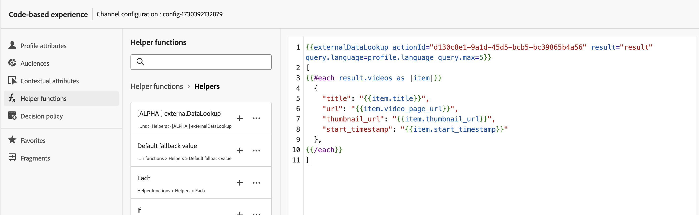

# 외부 데이터 조회 도우미

`externalDataLookup` 개인화 편집기의 [!DNL Journey Optmizer] 도우미는 코드 기반 경험, 웹 및 인앱 메시지 채널과 같은 인바운드 채널에 대한 콘텐츠를 생성하는 데 사용할 외부 끝점에서 데이터를 동적으로 가져오는 데 사용할 수 있습니다.

>[!AVAILABILITY]
>
>이 기능은 조직 집합(제한된 가용성)에만 사용할 수 있습니다.

도우미를 사용하려면 먼저 **[!UICONTROL 관리]** > **[!UICONTROL 구성]** 메뉴에서 동작을 정의해야 합니다. 작업은 URL, GET 및 POST 메서드, 헤더 매개 변수, 쿼리 매개 변수, POST 본문 JSON 스키마 및 응답 JSON 스키마와 같은 외부 끝점에 대한 세부 사항을 구성하는 것입니다.

작업이 정의되면 다음 두 가지 용도로 사용할 수 있습니다.

* 여정에서 콘텐츠를 가져오기 위한 사용자 지정 작업 활동
* 여정 및 인바운드 캠페인에서 externalDataLookup 도우미에서 인바운드 작업에서 데이터를 가져옵니다.

## 보호 및 제한 사항

[!DNL Journey Optimizer] 인바운드 채널 캠페인 및 여정의 사용자 지정 #GuardrailsandGuidelines을 참조하십시오.

* 기본적으로 [!DNL Journey Optimizer]은(는) 외부 끝점을 호출할 때 300ms의 시간 제한을 사용합니다. 끝점에 대한 이 시간 제한을 늘리려면 [!DNL Journey Optimizer] Engineering에 문의하십시오.
* Personalization 편집기에서 [!DNL Journey Optimizer]은(는) 표현식을 삽입할 때 끝점 응답의 스키마를 찾을 수 없으며 표현식에 사용된 응답에서 JSON 특성에 대한 참조의 유효성을 검사하지 않습니다.
* externalDataLookup 도우미를 통해 대체할 페이로드 변수 매개 변수에 대해 지원되는 데이터 유형은 String, Integer, Decimal, Boolean, listString, listInt, listInteger, listDecimal입니다.
* 작업 구성 변경 사항은 라이브 캠페인 및 여정의 해당 externalDataLookup 호출에 반영되지 않습니다. 변경 사항을 반영하려면 externalDataLookup 도우미에서 작업을 사용하는 모든 라이브 캠페인 또는 여정을 복사하거나 수정해야 합니다.
* 아직 외부 데이터 조회 도우미 매개 변수 내에서는 변수 사용이 지원되지 않습니다.
* 동적 URL 경로는 현재 지원되지 않습니다.  - 인바운드 사용자 지정 작업 개선 사항#DynamicPathSegments.
* 다중 패스 렌더링이 지원됩니다.
* 현재 externalDataLookup 도우미에서 작업 구성의 인증 옵션을 지원하지 않습니다. 그동안 API 키 기반 인증 또는 기타 일반 텍스트 인증 키의 경우 작업 구성에서 헤더 필드로 지정할 수 있습니다.

## 작업 구성 및 도우미 사용

작업을 정의하고 개인화에 도우미를 사용하려면 다음 단계를 수행하십시오.

1. 작업을 만들어 조회에 대한 끝점을 구성합니다. 이 작업은 각 끝점에 대해 한 번만 수행하면 되며 기술 사용자가 수행해야 합니다. [사용자 지정 작업을 구성하는 방법을 알아봅니다](../action/about-custom-action-configuration.md)

   작업 ID를 기록하고 복사합니다.

   

1. 인바운드 캠페인 또는 여정 작업을 만듭니다. 이 예에서는 코드 기반 경험 JSON 작업에서 externalDataLookup 도우미를 사용하는 방법을 보여 주지만, 모든 인바운드 채널의 개인화 필드에서 사용할 수 있습니다.

1. 작업의 콘텐츠를 편집하고 개인화 편집기의 도우미 함수로 이동한 다음 **[!UICONTROL 도우미 함수]** > **[!UICONTROL 도우미]**(으)로 이동합니다.

1. externalDataLookup 도우미를 삽입하려면 `+` 단추를 클릭하세요. 도우미 식이 `actionId` 및 `result`에 대한 자리 표시자 값과 함께 편집기에 삽입됩니다.

   

   자리 표시자 값을 다음과 같이 바꿉니다.

   * `actionId`: 이전에 복사한 작업 ID를 붙여넣습니다.
   * `result`: 선택한 이름을 설정합니다. 이 결과 변수를 사용하여 가져온 콘텐츠에 액세스합니다.

1. 끝점 호출의 일부로 전달될 변수 매개 변수 값을 추가합니다. 예를 들어 언어 매개 변수와 최대 항목 매개 변수를 전달하는 방법은 다음과 같습니다.

   

1. 가져온 데이터에 액세스하고 인바운드 작업을 위해 콘텐츠에 삽입하려면 결과 변수를 사용하십시오. 예를 들어 엔드포인트에서 가져온 항목의 JSON 배열을 반환하는 방법은 다음과 같습니다.

   

## 작동 방식

### 런타임 실행

인바운드 작업에 externalDataLookup 도우미가 포함된 경우 AEP Edge Network에서 [!DNL Journey Optimizer] 개인화 요청을 받고 처리할 때 끝점이 동적으로 호출됩니다.

즉, 외부 끝점은 클라이언트가 지정된 표면에 대해 AEP Edge Network으로 전송하는 만큼의 동시 로드 및 처리량을 처리할 수 있어야 합니다.

### 구문

`{{externalDataLookup actionId="d130c8e2-9a2d-45d5-bcb6-bc39865b4a56" result="result" optional-parameters...}}`

### 매개 변수 전달

외부 끝점이 호출되면 작업에 정의된 모든 상수 헤더 값, 쿼리 매개 변수 및 요청 페이로드 값이 작업 구성에 지정된 값과 함께 전송됩니다.

변수 헤더 값, 쿼리/경로 매개 변수 또는 요청 페이로드 값의 경우 매개 변수를 사용하여 값을 externalDataLookup 도우미에 동적으로 전달할 수 있습니다.

매개 변수 이름:

* 헤더 매개 변수: header.<parameter-name>
* 쿼리 매개 변수: query.<parameter-name>
* 페이로드 매개변수: 페이로드.<parameter-name>
* 경로 매개 변수: dynamic_path.<parameter-name>

예:

`{{externalDataLookup actionId="..." result="result" header.myHeaderParameter="value1" query.myQueryParameter="value2" payload.myPayloadParameter="value3"}}`

매개 변수 값은 고정 값일 수 있으며, 프로필 필드 또는 기타 컨텍스트 속성을 참조하여 개인화할 수 있습니다. 예:

`{{externalDataLookup actionId="..." result="result" query.myQueryParameter=profile.myProfileValue}}`

페이로드 매개 변수는 다음과 같이 중첩된 JSON 속성을 참조하는 점 표기법을 사용하여 제공할 수 있습니다.

`{{externalDataLookup actionId="..." result="result" payload.context.channel="web"}}`

### 결과 액세스

외부 끝점 조회 호출에서 가져온 데이터에 액세스하려면 개인화 표현식 및 도우미 함수를 사용하여 작업 정의의 응답 페이로드에 정의된 필드를 참조할 수 있습니다.

예를 들어 작업의 응답 페이로드가 다음과 같은 경우:

```
{
    "videos": [
        {
            "id": "integer",
            "title": "string",
            "description": "string",
            "thumbnail_url": "string",
            "video_page_url": "string",
            "url": "string",
            "video_type": "string",
            "start_timestamp": "dateOnly",
            "created_on": "dateOnly",
            ...
        }
    ]
}
```

그런 다음 예를 들어 다음과 같은 코드 기반 Experience HTML 작업에서 첫 번째 비디오의 설명을 가져오고 액세스할 수 있습니다.

```
{{externalDataLookup actionId="d130c8e2-9a2d-45d5-bcb6-bc39865b4a56" result="result"}}
 
First video description: <b>result.videos[0].description</b>
```

또는 예를 들어 다음과 같은 코드 기반 Experience JSON 작업에서 항목 배열을 반환하기 위해 항목을 가져와서 반복할 수 있습니다.

```
{{externalDataLookup actionId="d130c8e2-9a2d-45d5-bcb6-bc39865b4a56" result="result"}}
 
[
{{#each result.videos as |item|}}
    {                                                  
        "title": "{{item.title}}",
        "url": "{{item.video_page_url}}",
        "thumbnail_url": "{{item.thumbnail_url}}",
        "start_timestamp": "{{item.start_timestamp}}"
    },
{{/each}}
]
```

## 문제 해결

### 시간 초과 및 오류 처리

[!DNL Journey Optimizer]은(는) AEP Edge Network에 대해 대기 시간이 짧고 처리량이 많은 성능 특성을 유지하기 위해 외부 끝점을 호출할 때 엄격한 시간 제한을 사용합니다.

끝점이 시간 초과되거나 끝점에 도달하는 다른 종류의 오류가 있는 경우 결과 변수는 비어 있습니다. 이 경우 결과 변수 내의 속성에 대한 모든 참조도 비어 있게 됩니다. 콘텐츠에 속성을 단순히 표시하는 경우 공백으로 표시됩니다. 결과에서 배열 특성을 반복하려고 하면 항목이 반환되지 않습니다.

대체 콘텐츠를 표시하여 시간 초과나 오류를 보다 적절하게 처리하려는 경우 조회 결과가 비어 있는지 확인하고 대체 콘텐츠를 표시할 수 있습니다.

예를 들어 다음과 같이 단일 속성에 대한 대체 값을 표시할 수 있습니다.

`First video description: `

또는 다음과 같이 컨텐츠 전체 블록을 조건부로 렌더링할 수 있습니다.

```
{{externalDataLookup actionId="d130c8e2-9a2d-45d5-bcb6-bc39865b4a56" result="result"}}
 

   ... do something with result ...

    ... return fallback content ...

```

### 디버깅

디버깅에 도움이 되도록 외부 데이터 조회에 대한 시간 제한 및 오류 세부 정보가 AEP Assurance의 Edge Delivery 보기에 포함되어 있습니다. 인바운드 작업에서 externalDataLookup 도우미에 대한 예상 결과가 표시되지 않는 경우 Assurance 세션을 시작하고, 웹 또는 모바일 구현에서 [!DNL Journey Optimizer] 호출을 시작하고, Edge Delivery 보기를 사용하여 시간 초과 또는 오류 세부 정보를 확인할 수 있습니다.

예:

실행 세부 정보의 일부로서 보증 추적의 Edge Delivery 섹션 아래에 아래 내용과 유사한 요청 및 응답 세부 정보와 함께 새 customActions 블록이 추가되었습니다. 오류 섹션은 사용자 지정 작업을 실행하는 동안 문제가 있는 경우 디버깅에 도움이 됩니다


## FAQ

* 요청의 컨텍스트 속성을 매개 변수로 외부 데이터 조회에 전달하는 방법

  컨텍스트 속성 > 데이터스트림 > 이벤트 메뉴를 사용하여 사용 중인 경험 이벤트 스키마를 검색하고 관련 속성을 다음과 같은 매개 변수 값으로 삽입합니다.

  `{{externalDataLookup actionId="..." result="result" query.myQueryParameter=context.datastream.event.<schemaId>.my.xdm.attribute}}`

* [!DNL Journey Optimizer]이(가) 외부 끝점 응답을 캐싱합니까?

  현재는 지원되지 않습니다. 이 기능은 향후에 지원됩니다.
