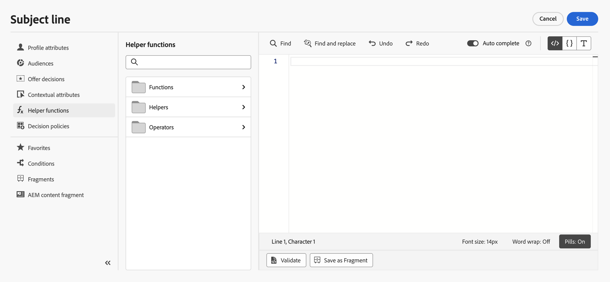

# 도우미 함수 시작{#functionsL}

사용 [!DNL Journey Optimizer] 계산, 데이터 서식 또는 전환, 조건 등과 같은 데이터 작업을 수행하고, 개인화 컨텍스트에서 이를 조작할 수 있는 템플릿 언어 에서 개인화 구문 지침을 살펴보십시오. [이 페이지](../personalization-syntax.md).

➡️ [도우미 함수를 사용하는 방법을 알아봅니다](#video) (비디오)

템플릿 언어는 다음과 같이 표현식 편집기의 개인화 드롭다운 목록에서 사용할 수 있는 도우미 함수에서 활용됩니다.

에서 [!DNL Journey Optimizer] 표현식 편집기, 도우미 함수는 [함수](#functions-helper), [도우미](#helper-helper) 및 [연산자](#operators-helper).

카테고리를 선택하여 하위 카테고리와 기능에 액세스합니다.

하위 카테고리에 액세스하려면 `>` 아이콘. 을(를) 클릭하여 함수를 선택합니다 `+` 아이콘: 함수가 자동으로 개인화 화면에 추가됩니다.

을(를) 클릭합니다. `...` 아이콘 을 클릭하여 함수의 설명을 보고 즐겨찾기에 추가합니다. [자세히 알아보기](../personalize.md#fav)

## 함수{#functions-helper}

### 배열 함수

<table>
    <tr>
        <td><a href="aggregation.md#average">평균</a></td><td>이 함수는 배열 내에서 선택한 모든 값의 산술 평균을 반환합니다</td>
    </tr>
    <tr>
        <td><a href="arrays-list.md#in">in</a></td><td>이 함수는 항목이 배열 또는 목록의 구성원인지 확인하는 데 사용됩니다</td>
    </tr>
    <tr>
        <td><a href="aggregation.md#min">최소값</a></td><td>이 함수는 배열 내에서 선택한 모든 값 중 가장 작은 값을 반환합니다</td>
    </tr>
    <tr>
        <td><a href="aggregation.md#count">카운트</a></td><td>이 함수는 지정된 배열 내의 요소 수를 반환합니다</td>
    </tr>
    <tr>
        <td><a href="arrays-list.md#includes">포함</a></td><td>이 함수는 배열 또는 목록에 지정된 항목이 포함되어 있는지 여부를 결정합니다</td>
    </tr>
    <tr>
        <td><a href="arrays-list.md#notin">아님</a></td><td>이 함수는 항목이 배열 또는 목록의 멤버가 아닌지 확인합니다</td>
    </tr>
    <tr>
        <td><a href="arrays-list.md#distinct">고유</a></td><td>이 함수는 중복된 값이 제거된 배열 또는 목록의 값을 가져옵니다</td>
    </tr>
    <tr>
        <td><a href="arrays-list.md#intersects">교차</a></td><td>이 함수는 두 배열 또는 목록에 하나 이상의 공통 멤버가 있는지 여부를 결정합니다</td>
    </tr>
    <tr>
        <td><a href="arrays-list.md#subset">하위 집합</a></td><td>이 함수는 특정 배열(배열 A)이 다른 배열(배열 B)의 하위 집합인지, 즉 배열 A의 모든 요소가 배열 B의 요소인지 여부를 결정합니다</td>
    </tr>
    <tr>
        <td><a href="arrays-list.md#head">첫 번째 항목</a></td><td>이 함수는 배열 또는 목록의 첫 번째 항목을 반환합니다</td>
    </tr>
    <tr>
        <td><a href="arrays-list.md#last-n">배열의 마지막 n</a></td><td>이 함수는 지정된 숫자 식을 기반으로 오름차순으로 정렬된 경우 배열의 마지막 'N' 항목을 반환합니다</td>
    </tr>
    <tr>
        <td><a href="aggregation.md#sum">합계</a></td><td>이 함수는 배열 내에서 선택한 모든 값의 합계를 반환합니다</td>
    </tr>
    <tr>
        <td><a href="arrays-list.md#first-n">배열의 첫 n개</a></td><td>이 함수는 지정된 숫자 식을 기반으로 오름차순으로 정렬된 경우 배열의 첫 번째 'N' 항목을 반환합니다</td>
    </tr>
    <tr>
        <td><a href="aggregation.md#max">최대값</a></td><td>이 함수는 배열 내에서 선택한 모든 값 중 가장 큰 값을 반환합니다</td>
    </tr>
    <tr>
    <td><a href="arrays-list.md#superset">의 상위 집합</a></td><td>이 함수는 특정 배열(배열 A)이 다른 배열(배열 B)의 상위 집합인지, 즉 해당 배열 A에 배열 B의 모든 요소가 포함되어 있는지 여부를 결정합니다</td>
    </tr>
</table>

### 날짜 시간 함수{#date-functions}

<table>
    <tr>
        <td><a href="dates.md#age">연령</a></td><td>이 함수는 지정된 날짜에서 페이지를 검색합니다</td>
    </tr>
    <tr>
        <td><a href="dates.md#current">현재 시간(밀리초)</a></td><td>이 함수는 epoch 밀리초 단위의 현재 시간을 검색합니다</td>
    </tr>
    <tr>
        <td><a href="dates.md#date-diff">날짜 차이</a></td><td>이 함수는 일 수로 두 날짜 간의 차이를 검색합니다</td>
    </tr>
    <tr>
        <td><a href="dates.md#day-week">요일</a></td><td>이 함수는 요일을 검색합니다</td>
    </tr>
    <tr>
        <td><a href="dates.md#day-year">일(한 해 기준)</a></td><td>이 함수는 날짜를 검색합니다</td>
    </tr>
    <tr>
        <td><a href="dates.md#format-date">날짜 형식 지정</a></td><td>이 함수는 날짜 시간 값의 형식을 지정합니다</td>
    </tr>
    <tr>
        <td><a href="dates.md#set-days">설정 일</a></td><td>이 함수는 지정된 날짜 시간에 대한 월의 일을 설정합니다</td>
    </tr>
    <tr>
        <td><a href="dates.md#set-hours">설정 일</a></td><td>이 함수는 날짜 시간의 시간을 설정합니다</td>
    </tr>
    <tr>
        <td><a href="dates.md#to-utc">UTC로</a></td><td>이 함수는 datetime을 UTC로 변환합니다</td>
    </tr>
    <tr>
        <td><a href="dates.md#week-of-year">주(연 기준)</a></td><td>이 함수는 해당 연도의 주를 반환합니다</td>
    </tr>
</table>
</table>

### 맵 함수

<table>
    <tr>
        <td><a href="maps.md#get">가져오기</a></td><td>이 함수는 지정된 키에 대한 맵 값을 검색하는 데 사용됩니다</td>
    </tr>
    <tr>
        <td><a href="maps.md#keys">키</a></td><td>이 함수는 지정된 맵에 대한 모든 키를 검색하는 데 사용됩니다</td>
    </tr>
    <tr>
        <td><a href="maps.md#values">값</a></td><td>이 함수는 주어진 맵의 모든 값을 검색합니다</td>
    </tr>
</table>

**개체 함수**

<table>
    <tr>
        <td><a href="objects.md#isNotNull">null이 아님</a></td><td>이 함수는 개체 참조가 있는지 확인하는 데 사용됩니다</td>
    </tr>
    <tr>
        <td><a href="objects.md#isNull">null임</a></td><td>이 함수는 개체 참조가 존재하지 않는지 확인하는 데 사용됩니다</td>
    </tr>
</table>

### 문자열 함수

<table>
    <tr>
        <td><a href="string.md#camelCase">카멜 사례</a></td><td>이 함수는 문자열의 각 단어의 첫 글자를 대문자로 사용하는 데 사용됩니다</td>
    </tr>
    <tr>
        <td><a href="string.md#concat">Concat</a></td><td>이 함수는 두 문자열을 하나로 결합하는 데 사용됩니다</td>
    </tr>
    <tr>
        <td><a href="string.md#contains">다음 포함</a></td><td>이 함수는 문자열에 지정된 하위 문자열이 포함되어 있는지 확인하는 데 사용됩니다</td>
    </tr>
    <tr>
        <td><a href="string.md#doesNotContain">다음을 포함하지 않음</a></td><td>이 함수는 문자열에 지정된 하위 문자열이 없는지 확인하는 데 사용됩니다</td>
    </tr>
    <tr>
        <td><a href="string.md#doesNotEndWith">다음으로 끝나지 않음</a></td><td>이 함수는 문자열이 지정된 하위 문자열로 끝나지 않는지 여부를 확인하는 데 사용됩니다</td>
    </tr>
    <tr>
        <td><a href="string.md#doesNotStartWith">다음으로 시작하지 않음</a></td><td>이 함수는 문자열이 지정된 하위 문자열로 시작하지 않는지 여부를 확인하는 데 사용됩니다</td>
    </tr>
    <tr>
        <td><a href="string.md#encode64">64 인코딩</a></td><td>이 함수는 문자열을 인코딩하거나 디코딩하는 데 사용됩니다</td>
    </tr>
    <tr>
        <td><a href="string.md#endsWith">다음으로 끝남</a></td><td>이 함수는 문자열이 지정된 하위 문자열로 끝났는지 여부를 확인하는 데 사용됩니다</td>
    </tr>
        </tr>
    <tr>
        <td><a href="string.md#equals">다음과 같음</a></td><td>이 함수는 문자열을 대/소문자 구분을 사용하여 지정된 하위 문자열로 시작하지 않는지 여부를 확인하는 데 사용됩니다</td>
    </tr>
    <tr>
        <td><a href="string.md#equalsIgnoreCase">대/소문자 무시 같음</a></td><td>이 함수는 문자열을 대/소문자 구분 없이 지정된 하위 문자열로 시작하지 않는지 여부를 확인하는 데 사용됩니다</td>
    </tr>
    <tr>
        <td><a href="string.md#extractEmailDomain">이메일 도메인 추출</a></td><td>이 함수는 이메일 주소의 도메인을 추출하는 데 사용됩니다</td>
    </tr>
    <tr>
        <td><a href="string.md#isEmpty">IsEmpty</a></td><td>이 함수는 문자열 또는 표현식이 비어 있는지 확인하는 데 사용됩니다.</td>
    </tr>
    <tr>
        <td><a href="string.md#leftTrim">왼쪽 트림</a></td><td>이 함수는 문자열 시작 부분에서 공백을 제거합니다</td>
    </tr>
    <tr>
        <td><a href="string.md#length">Length</a></td><td>이 함수는 문자열 또는 표현식의 문자 수를 가져오는 데 사용됩니다</td>
    </tr>
    <tr>
        <td><a href="string.md#like">좋아요</a></td><td>이 함수는 문자열이 지정된 패턴과 일치하는지 확인하는 데 사용됩니다</td>
    </tr>
    <tr>
        <td><a href="string.md#lower">소문자</a></td><td>이 함수는 문자열을 소문자로 변환합니다</td>
    </tr>
    <tr>
        <td><a href="string.md#matches">일치</a></td><td>이 함수는 문자열이 특정 정규 표현식과 일치하는지 확인하는 데 사용됩니다</td>
    </tr>
    <tr>
        <td><a href="string.md#notEqualTo">다음과 같지 않음</a></td><td>이 함수는 문자열이 지정된 문자열과 같지 않은지 확인하는 데 사용됩니다</td>
    </tr>
    <tr>
        <td><a href="string.md#regexGroup">정규 표현식 그룹</a></td><td>이 함수는 제공된 정규 표현식을 기반으로 특정 정보를 추출하는 데 사용됩니다</td>
    </tr>
    <tr>
        <td><a href="string.md#replace">바꾸기</a></td><td>이 함수는 문자열의 지정된 하위 문자열을 다른 하위 문자열로 바꿉니다</td>
    </tr>
    <tr>
        <td><a href="string.md#replaceAll">모두 바꾸기</a></td><td>이 함수는 "target"과 일치하는 텍스트의 모든 하위 문자열을 지정된 리터럴 "대체" 문자열로 바꿉니다</td>
    </tr>
    <tr>
        <td><a href="string.md#rightTrim">오른쪽 트림</a></td><td>이 함수는 문자열 끝에서 공백을 제거합니다 </td>
    </tr>
    <tr>
        <td><a href="string.md#split">분할</a></td><td>이 함수는 문자열을 지정된 문자로 분할하는 데 사용됩니다</td>
    </tr>
    <tr>
        <td><a href="string.md#startsWith">다음으로 시작</a></td><td>이 함수는 문자열이 지정된 하위 문자열로 시작하는지 여부를 확인하는 데 사용됩니다</td>
    </tr>
    <tr>
        <td><a href="string.md#titleCase">제목 사례</a></td><td>이 함수는 문자열의 각 단어의 첫 글자를 대문자로 사용하는 데 사용됩니다</td>
    </tr>
    <tr>
        <td><a href="string.md#trim">Trim</a></td><td>이 함수는 문자열 시작 부분과 끝에서 공백을 제거합니다</td>
    </tr>
    <tr>
        <td><a href="string.md#upper">대문자</a></td><td>이 함수는 문자열을 대문자로 변환</td>
    </tr>
</table>

## 도우미{#helper-helper}

지원자는에 자세히 설명되어 있습니다. [이 페이지](helpers.md).

<table>
    <tr>
        <td><a href="helpers.md#each">각</a></td><td>이 함수는 배열을 반복하는 데 사용됩니다</td>
    </tr>
    <tr>
        <td><a href="helpers.md#if-function">If</a></td><td>이 함수는 조건부 블록을 정의하는 데 사용됩니다. 표현식 평가가 true를 반환하면 블록이 렌더링됩니다</td>
    </tr>
    <tr>
        <td><a href="helpers.md#let">Let</a></td><td>이 함수를 사용하면 표현식을 변수로 저장하여 나중에 쿼리에서 사용할 수 있습니다</td>
    </tr>
   <tr>
        <td><a href="helpers.md#unless">그렇지 않은 경우</a></td><td>이 함수는 조건부 블록을 정의하는 데 사용됩니다. 표현식 평가가 false를 반환하는 경우 블록이 렌더링됩니다</td>
    </tr>
    <tr>
        <td><a href="helpers.md#with">사용</a></td><td>이 함수는 템플릿 부품의 평가 토큰을 변경하는 데 사용됩니다</td>
    </tr>
</table>

## 연산자{#operators-helper}

### 산술 함수 {#arithmetic-helper}

산술 함수는 값에 대한 기본 계산을 수행하는 데 사용됩니다.

<table>
    <tr>
        <td><a href="arithmetic-functions.md#add">추가</a></td><td>이 연산자는 두 인수 표현식의 합계를 찾는 데 사용됩니다</td>
    </tr>
    <tr>
        <td><a href="arithmetic-functions.md#divide">나누기</a></td><td>이 연산자는 두 인수 식의 따옴표를 찾는 데 사용됩니다</td>
    </tr>
    <tr>
        <td><a href="arithmetic-functions.md#multiply">곱하기</a></td><td>이 연산자는 두 인수 표현식의 제품을 찾는 데 사용됩니다</td>
    </tr>
    <tr>
        <td><a href="arithmetic-functions.md#remainder">나머지</a> </td><td>이 연산자는 두 인수 표현식을 분할한 후 나머지를 찾는 데 사용됩니다</td>
    </tr>
    <tr>
        <td><a href="arithmetic-functions.md#substract">빼기</a> </td><td>이 연산자는 두 표현식 간의 차이를 찾습니다</td>
    </tr>
</table>

### 부울 함수

부울 함수는 다른 요소에서 부울 논리를 수행하는 데 사용됩니다.

<table>
    <tr>
        <td><a href="operators.md#and">및</a></td><td>이 연산자는 논리 연결을 만듭니다</td>
    </tr>
    <tr>
        <td><a href="operators.md#not">If</a></td><td>이 연산자는 지정된 조건이 true인지 여부에 따라 표현식을 확인합니다</td>
    </tr>
    <tr>
        <td><a href="operators.md#not">아님</a></td><td>이 연산자는 논리 부정을 만듭니다</td>
    </tr>
    <tr>
        <td><a href="operators.md#or">또는</a></td><td>이 연산자는 논리 분리를 만듭니다</td>
    </tr>
</table>

### 비교 함수

비교 함수는 다른 표현식과 값 간을 비교하고 그에 따라 true 또는 false를 반환하는 데 사용됩니다.

<table>
    <tr>
        <td><a href="operators.md#and">다음과 같음</a></td><td>이 작업은 값이 동일한지 확인합니다</td>
    </tr>
    <tr>
        <td><a href="operators.md#greaterthan">보다 큼</a></td><td>이 연산자는 첫 번째 값이 두 번째 값보다 커야 하는지 확인합니다</td>
    </tr>
    <tr>
        <td><a href="operators.md#greaterthanorequal">크거나 같음</a></td><td>이 연산자는 첫 번째 값이 두 번째 값보다 크거나 같은지 확인합니다</td>
    </tr>
    <tr>
        <td><a href="operators.md#notequal">다음과 같지 않음</a></td><td>이 연산자는 제공된 표현식이 값 제공과 같지 않은지 확인합니다</td>
    </tr>
    <tr>
        <td><a href="operators.md#lessthanorequal">작거나 같음</a> </td><td>이 연산자는 첫 번째 값이 두 번째 값보다 작거나 같은지 확인합니다</td>
    </tr>
</table>

## 방법 비디오{#video}

개인화 도우미 기능을 사용하여 개인화 값을 변형하는 방법을 알아보고 도우미 기능의 다양한 사용 사례를 이해합니다.

>[!VIDEO](https://video.tv.adobe.com/v/334244?quality=12)
