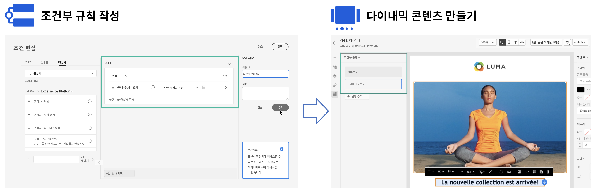

# 다이내믹 콘텐츠 시작 {#start-dynamic-content}

>[!CONTEXTUALHELP]
>id="ajo_conditions_list"
>title="조건"
>abstract="조건부 규칙을 통해 프로필 속성, 상황별 이벤트 또는 대상자를 기반으로 메시지에 여러 콘텐츠 변형을 표시할 수 있습니다."

다이내믹 콘텐츠를 사용하면 **조건부 규칙**&#x200B;에 따라 메시지의 콘텐츠를 조정할 수 있습니다. 이 규칙은 프로필 속성이나 상황별 이벤트 또는 대상자로 구성될 수 있습니다. 조건부 규칙은 개인화 편집기 내에서 시각적 규칙 빌더를 사용하여 작성되며, 이 빌더를 저장하여 여정 및 캠페인 간에 다시 사용할 수 있습니다.

조건부 규칙을 이메일 Designer 및 개인화 편집기에 활용하여 메시지의 타겟팅된 프로필에 맞게 **동적 콘텐츠를 만들기**&#x200B;할 수 있습니다.

* [조건부 규칙 사용 방법 알아보기](create-conditions.md)
* [다이내믹 콘텐츠를 만드는 방법 알아보기](dynamic-content.md)

## 방법 비디오 {#video}

조건부 규칙 빌더로 다이내믹 콘텐츠를 만드는 방법을 알아봅니다.

>[!VIDEO](https://video.tv.adobe.com/v/3409815?quality=12)
