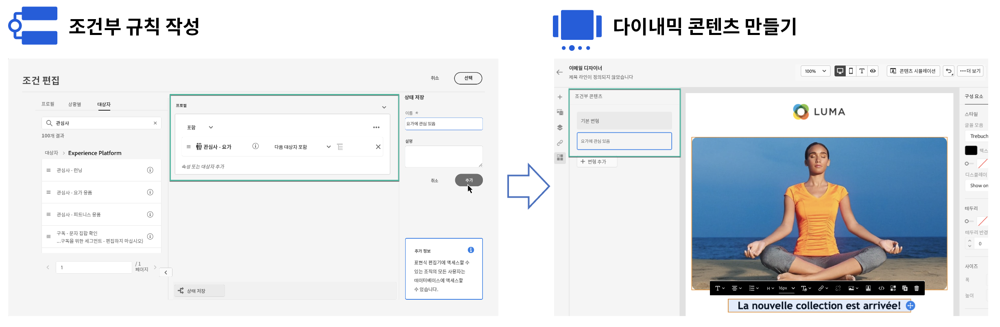

# 다이내믹 콘텐츠 시작 {#start-dynamic-content}

>[!BEGINSHADEBOX]

**이 페이지에서:** 다이내믹 콘텐츠가 프로필 특성, 컨텍스트 이벤트 및 대상으로 만들어진 조건부 규칙을 사용하여 메시지를 타겟팅된 프로필에 적용하는 방법을 이해합니다.

>[!ENDSHADEBOX]

>[!CONTEXTUALHELP]
>id="ajo_conditions_list"
>title="조건"
>abstract="조건부 규칙을 통해 프로필 속성, 상황별 이벤트 또는 대상자를 기반으로 메시지에 여러 콘텐츠 변형을 표시할 수 있습니다."

다이내믹 콘텐츠를 사용하면 **조건부 규칙**&#x200B;에 따라 메시지의 콘텐츠를 조정할 수 있습니다. 이 규칙은 프로필 속성이나 상황별 이벤트 또는 대상자로 구성될 수 있습니다. 조건부 규칙은 개인화 편집기 내에서 시각적 규칙 빌더를 사용하여 작성되며, 이 빌더를 저장하여 여정 및 캠페인 간에 다시 사용할 수 있습니다.

조건부 규칙을 이메일 Designer 및 개인화 편집기에 활용하여 메시지의 타겟팅된 프로필에 맞게 **동적 콘텐츠를 만들기**&#x200B;할 수 있습니다.

* [조건부 규칙 사용 방법 알아보기](create-conditions.md)
* [다이내믹 콘텐츠를 만드는 방법 알아보기](dynamic-content.md)

## 사용 방법 비디오 {#video}

조건부 규칙 빌더로 다이내믹 콘텐츠를 만드는 방법을 알아봅니다.

>[!VIDEO](https://video.tv.adobe.com/v/3413674?captions=kor&quality=12)

## 빠른 참조 {#quick-reference}

이 단원에는 이 주제와 관련된 해석, 검색 및 질문 답변을 지원하기 위한 구조화된 지식이 포함되어 있습니다.

이해를 돕기 위해 이 정보를 이 페이지의 설명서와 통합해야 합니다. 두 소스 모두 독립적으로 사용하기 위한 것은 아닙니다. 이 페이지에서는 기능에 대해 설명하지만, 용어, 의도, 적용 가능성 및 제약 조건을 명확히 하는 데 도움이 되는 추가 컨텍스트를 제공합니다.

>[!BEGINTABS]

>[!TAB 개요]

**TL;DR**

이 페이지에서는 Journey Optimizer의 다이내믹 콘텐츠를 소개합니다. 프로필 속성, 컨텍스트 이벤트 및 대상자로 구축된 조건부 규칙을 통해 메시지가 타겟팅하는 프로필에 맞게 적응하는 방법입니다.

**의도**

* 다이내믹 컨텐츠가 무엇인지, 정적 메시지 컨텐츠와 어떻게 다른지 이해합니다.
* 다이내믹 컨텐츠에 대한 두 개의 시작 지점, 즉 이메일 Designer 및 개인화 편집기를 식별합니다
* 조건부 규칙을 작성하거나 다이내믹 콘텐츠를 만들기 위한 적절한 안내서로 이동합니다

>[!TAB 용어집]

* **다이내믹 콘텐츠**: 조건부 규칙에 따라 조정되는 메시지 콘텐츠입니다. 정의된 조건을 충족하는지 여부에 따라 다른 프로필에 다른 콘텐츠가 표시됩니다. *(제품별)*
* **조건부 규칙**: 프로필에서 수신하는 콘텐츠 변형을 결정하는 일련의 기준(프로필 특성, 컨텍스트 이벤트 또는 대상으로 작성됨)입니다. *(제품별)*
* **시각적 규칙 빌더**: 조건부 규칙을 만들고 저장하는 데 사용되는 개인화 편집기 내의 대화형 캔버스입니다. *(제품별)*

>[!TAB 용어]

* **정식 이름:** 다이내믹 콘텐츠 — 변형: 조건부 콘텐츠, 개인화된 콘텐츠
* **동의어:** &quot;조건부 규칙&quot; = &quot;조건&quot;(UI에 레이블이 지정됨)
* **혼동하지 마십시오.** 동적 콘텐츠(조건부 규칙에 따라 프로필별로 조정되는 콘텐츠)≠ 정적 콘텐츠(조건에 관계없이 모든 받는 사람에게 표시되는 동일한 콘텐츠)

>[!TAB FAQ]

**Q: 조건부 규칙에서 사용할 수 있는 기준 유형은 무엇입니까?**

프로필 속성, 컨텍스트 기반 이벤트 및 대상자 멤버십에서 조건부 규칙을 작성할 수 있습니다.

**Q: 조건부 규칙을 사용하여 다이내믹 콘텐츠를 만들 수 있는 위치는 어디입니까?**

이메일 Designer(구성 요소 변형 만들기) 및 개인화 편집기(조건부로 표현식 블록 래핑)에서 확인할 수 있습니다. 두 진입점 모두 링크된 페이지에서 다룹니다.

**Q: 여정 및 캠페인에서 조건부 규칙을 다시 사용할 수 있습니까?**

예. 조건부 규칙을 저장하여 여정 및 캠페인 간에 추가로 재사용할 수 있습니다.

>[!ENDTABS]

<!-- ai-section-version: 1 | source-hash: 0f90f9b5 -->
