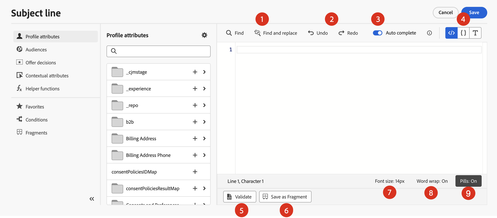

# 개인화 추가 {#build-personalization-expressions}

>[!CONTEXTUALHELP]
>id="ajo_perso_editor"
>title="개인화 편집기 정보"
>abstract="개인화 편집기를 통해 모든 데이터를 선택하고, 배열하고, 사용자 정의하고 검증하여 개인 맞춤화 콘텐츠를 만들 수 있습니다."

개인화 편집기는 [!DNL Journey Optimizer]에서 개인화의 중심입니다. 이메일, 푸시 및 오퍼와 같은 개인화를 정의해야 하는 모든 컨텍스트에서 사용할 수 있습니다.

개인화 편집기 인터페이스에서 모든 데이터를 선택하고, 정렬하고, 맞춤화하고, 유효성을 검사하여 콘텐츠에 대한 맞춤화된 개인화를 만들 수 있습니다.


## 개인화를 추가할 수 있는 위치

 아이콘을 사용하여 모든 필드의 **[!DNL Journey Optimizer]**&#x200B;에 개인화를 추가할 수 있습니다. 자세한 내용을 보려면 아래 섹션을 확장하십시오.

+++메시지

메시지의 경우 **[!UICONTROL 제목 줄]** 필드와 같이 메시지의 다른 위치에 개인화를 추가할 수 있습니다.


콘텐츠의 다른 섹션에도 추가할 수 있습니다. 예를 들어 [푸시 알림](../push/push-gs.md)의 경우 **제목**, **본문**, **사용자 지정 소리**, **배지** 및 **사용자 지정 데이터** 필드에 개인화를 추가할 수 있습니다.

+++

+++이메일 Designer

[전자 메일 Designer](../email/get-started-email-design.md)에서 전자 메일 콘텐츠를 편집할 때 상황별 도구 모음의 아이콘을 사용하여 텍스트 블록 및 URL에 개인화를 추가할 수 있습니다.


+++

+++오퍼

**오퍼 표시**&#x200B;에서 텍스트 유형 콘텐츠를 사용할 때 개인화를 추가할 수 있습니다. [개인화된 오퍼를 만드는 방법을 알아봅니다](../offers/offer-library/creating-personalized-offers.md)

+++

+++URL

Journey Optimizer을 사용하면 메시지에서 **URL**&#x200B;을(를) 개인화할 수도 있습니다.  개인화된 URL은 프로필 속성에 따라 수신자를 웹사이트의 특정 페이지 또는 개인화된 마이크로사이트로 이동합니다. URL 개인화는 **외부 링크**, **구독 취소 링크** 및 **옵트아웃** 유형의 링크에서 사용할 수 있습니다.

샘플 개인화된 URL:

* `https://www.adobe.com/users/{{profile.person.name.lastName}}`
* `https://www.adobe.com/users?uid={{profile.person.name.firstName}}`
* `https://www.adobe.com/usera?uid={{context.journey.technicalProperties.journeyUID}}`
* `https://www.adobe.com/users?uid={{profile.person.crmid}}&token={{context.token}}`

{width="50%"}

>[!NOTE]
>
>개인화 편집기에서 개인화된 URL을 편집할 때 보안상의 이유로 도우미 함수와 대상자 멤버십이 비활성화됩니다.
>
>URL 내에서 사용되는 개인화 토큰에는 공백이 지원되지 않습니다.

+++

+++이메일 구성

이메일 채널 구성을 만들 때 하위 도메인, 헤더 및 URL 추적 매개 변수에 대해 개인화된 값을 정의할 수 있습니다. [자세히 알아보기](../email/surface-personalization.md)

+++

## Personalization 소스 {#sources}

탐색 창에서는 개인화를 위한 소스를 선택할 수 있습니다. 사용 가능한 소스는 다음과 같습니다.

* **[!UICONTROL 프로필 특성]** : [XDM(Adobe Experience Platform 데이터 모델) 설명서](https://experienceleague.adobe.com/docs/experience-platform/xdm/home.html?lang=ko-KR){target="_blank"}에 설명된 프로필 스키마와 관련된 모든 참조를 나열합니다.
* **[!UICONTROL 대상]** : Adobe Experience Platform 세분화 서비스에서 만든 모든 대상을 나열합니다. 사용 가능한 세분화에 대한 자세한 정보는 [여기](https://experienceleague.adobe.com/docs/experience-platform/segmentation/home.html?lang=ko){target="_blank"}를 참조하세요.
* **[!UICONTROL 오퍼 결정]** : 특정 배치와 관련된 모든 오퍼를 나열합니다. 배치를 선택한 다음 콘텐츠에 오퍼를 삽입합니다. 오퍼 관리 방법에 대한 전체 문서를 보려면 [이 섹션](../offers/get-started/starting-offer-decisioning.md)을 참조하세요.
* **[!UICONTROL 컨텍스트 특성]** : 여정 또는 캠페인에서 채널 작업 활동(이메일, 푸시, SMS)을 사용하면 이벤트 및 속성과 관련된 컨텍스트 특성을 개인화할 수 있습니다. 컨텍스트 특성을 활용하는 개인화의 예가 [이 섹션](personalization-use-case.md)에 나와 있습니다.

>[!NOTE]
>
>작성 워크플로우를 사용하여 생성된 보강 속성을 사용하여 대상자를 타겟팅하는 경우 이러한 보강 속성을 활용하여 메시지를 개인화할 수 있습니다. [대상 데이터 보강 특성을 사용하는 방법을 알아보세요](../audience/about-audiences.md#enrichment)

## 개인화 추가 {#add}

>[!CONTEXTUALHELP]
>id="ajo_perso_editor_autocomplete"
>title="자동 완성"
>abstract="이 옵션을 토글하면 입력할 때 시스템에서 자동으로 코드를 제안하고 완성합니다. 이 기능은 HTML 및 텍스트 형식에만 사용할 수 있으며, 프로필 및 컨텍스트 속성을 지원합니다. 토글을 통해 비활성화하면 편집기에서 대신 기본 HTML 코드 자동 완성 기능을 제공합니다."

중앙 작업 영역은 개인화 구문을 작성하는 위치입니다. 특성을 사용하여 메시지를 개인화하려면 특성 창에서 특성을 찾은 다음 `+` 단추를 클릭하여 식에 추가하십시오.


`+` 아이콘 옆에 있는 줄임표 메뉴를 사용하면 각 속성에 대한 자세한 내용을 확인하고 자주 사용하는 특성을 즐겨찾기에 추가할 수 있습니다. 즐겨찾기에 추가된 특성은 탐색 창의 **[!UICONTROL 즐겨찾기]** 메뉴에서 액세스할 수 있습니다.

>[!NOTE]
>
>기본적으로 속성 창에는 채워진 속성만 표시됩니다. 모든 특성을 표시하려면 검색 필드 위에 있는  단추를 선택하고 **[!UICONTROL 채워진 특성만 표시]** 옵션을 끄십시오.

또한 문자열 유형 프로필 속성이 비어 있는 경우 표시될 기본 대체 텍스트를 정의할 수 있습니다. 이렇게 하려면 특성 옆에 있는 줄임표 버튼을 클릭하고 **[!UICONTROL 대체 텍스트로 삽입]**&#x200B;을 선택합니다. 프로필에 대한 특성 값이 비어 있는 경우 기본적으로 표시되는 텍스트를 작성한 다음 **[!UICONTROL 추가]**&#x200B;를 클릭합니다.


다음 예에서는 개인화 편집기를 사용하여 생일이 오늘 인 프로필을 선택한 다음 해당 요일에 해당하는 특정 오퍼를 삽입하여 맞춤화를 완료할 수 있습니다.


## 표현식 편집용 도구

중앙 작업 영역은 개인화 표현식을 작성하는 데 도움이 되는 다양한 도구를 제공합니다.



사용 가능한 옵션은 다음과 같습니다.

1. **[!UICONTROL 찾기]** / **[!UICONTROL 찾기 및 바꾸기]**: 식을 검색하고 코드 부분을 자동으로 바꿉니다.
1. **[!UICONTROL 실행 취소]** / **[!UICONTROL 다시 실행]**: 마지막 작업을 실행 취소/다시 실행합니다.
1. **[!UICONTROL 자동 완성]**: 입력할 때 코드를 자동으로 제안하고 완료합니다. 이 기능은 HTML 및 텍스트 형식에만 사용할 수 있으며, 프로필 및 컨텍스트 속성을 지원합니다. 토글을 통해 비활성화하면 편집기에서 대신 기본 HTML 코드 자동 완성 기능을 제공합니다.

   {width="70%" align="center" zoomable="yes"}

1. **[!UICONTROL HTML]** / **[!UICONTROL JSON]** / **[!UICONTROL 텍스트]**: 코드 형식을 식별합니다. 이렇게 하면 시스템이 선택한 언어를 기반으로 유효성 검사 및 자동 완성 기능을 조정할 수 있습니다.
1. **[!UICONTROL 유효성 검사]**: 식의 구문을 확인하십시오. 자세한 내용은 [이 섹션](../personalization/personalization-build-expressions.md)을 참조하십시오.
1. **[!UICONTROL 조각으로 저장]**: 표현식을 표현식 조각으로 저장합니다. [이 섹션](../content-management/save-fragments.md#save-as-expression-fragment)에서 자세히 알아보기
1. **[!UICONTROL 글꼴 크기]**: 가독성을 높이기 위해 편집기 내의 콘텐츠 글꼴 크기를 조정합니다.
1. **[!UICONTROL 자동 줄 바꿈]**: 자동 줄 바꿈을 사용하거나 사용하지 않도록 설정하여 긴 식을 한 줄에 표시하거나 편집기 내에서 줄 바꿈할 수 있습니다. 옵션은 다음과 같습니다.
   * **해제**(기본값) - 줄 바꿈이 없습니다. 긴 줄은 편집기 보기를 넘어 확장되므로 수평 스크롤이 필요합니다.
   * **On** - 편집기 너비의 줄을 줄바꿈합니다.
   * **줄 바꿈 열** - 줄 문자가 80자에 도달하면 줄을 바꿈합니다.
   * **Bounded** - 편집기 너비 또는 80자 중 더 작은 문자를 줄바꿈합니다.

탐색 창에서는 개인화 표현식을 작성하는 데 도움이 되는 추가 기능을 사용할 수 있습니다.


* **[!UICONTROL 도우미 함수]** - 도우미 함수를 사용하면 계산, 데이터 서식 또는 전환, 조건 등 데이터에 대한 작업을 수행하고 개인 맞춤화의 컨텍스트에서 조작할 수 있습니다. [사용 가능한 도우미 기능에 대해 자세히 알아보기](functions/functions.md)

* **[!UICONTROL 즐겨찾기]** - 즐겨찾기에 추가한 특성이 이 목록에 표시됩니다. 이를 통해 가장 자주 사용하는 항목에 빠르게 액세스할 수 있습니다. 즐겨찾기에 특성을 추가하려면 줄임표 메뉴를 클릭하고 **[!UICONTROL 즐겨찾기에 추가]**&#x200B;를 선택하십시오.

* **[!UICONTROL 조건]** - 라이브러리에서 만든 조건부 규칙을 활용하여 동적 콘텐츠를 메시지에 추가합니다. 이를 통해 조건을 기반으로 메시지의 여러 변형을 만들 수 있습니다. [동적 콘텐츠를 만드는 방법을 알아봅니다](../personalization/get-started-dynamic-content.md)

* **[!UICONTROL 조각]** - 현재 샌드박스에 생성되거나 저장된 표현식 조각을 활용합니다. 조각은 [!DNL Journey Optimizer] 캠페인 및 여정에서 참조할 수 있는 재사용 가능한 구성 요소입니다. 이 기능을 사용하면 마케팅 사용자가 개선된 디자인 프로세스에서 콘텐츠를 빠르게 조합하는 데 사용할 수 있는 여러 사용자 지정 콘텐츠 블록을 미리 빌드할 수 있습니다. [개인화에 식 조각을 사용하는 방법을 알아봅니다](../personalization/use-expression-fragments.md)

개인화 표현식이 준비되면 개인화 편집기에서 유효성을 검사해야 합니다. 자세한 내용은 [이 섹션](../personalization/personalization-build-expressions.md)을 참조하십시오.

## 유효성 검사 메커니즘 {#validation-mechanisms}

편집기 창을 닫으려면 **추가** 단추를 클릭하면 식의 유효성 검사가 자동으로 실행됩니다. **유효성 검사** 단추를 사용하여 개인화 구문을 확인할 수도 있습니다.


아래 섹션을 확장하여 개인화를 확인할 때 발생할 수 있는 일반적인 오류를 확인합니다.

+++일반적인 오류

* **경로 &quot;XYZ&quot;를 찾을 수 없음**

스키마에 정의되지 않은 필드를 참조하려고 할 때

이 경우 **firstName1**&#x200B;은(는) 프로필 스키마에 특성으로 정의되어 있지 않습니다.

```
{{profile.person.name.firstName1}}
```

* **변수 &quot;XYZ&quot;에 대한 형식이 일치하지 않습니다. 배열이 필요합니다. 문자열을 찾았습니다.**

배열 대신 문자열을 반복하려고 할 때.

이 경우 **product**&#x200B;은(는) 배열이 아닙니다.

```
{{each profile.person.name.firstName as |product|}}
 {{product.productName}}
{{/each}}
```

* **잘못된 Handlebars 구문입니다.`'[XYZ}}'`**&#x200B;을(를) 찾음

잘못된 Handlebars 구문이 사용되는 경우.

Handlebars 식은 **{{expression}}**(으)로 둘러싸여 있습니다.

```
   {{[profile.person.name.firstName}}
```

* **잘못된 세그먼트 정의**

```
No segment definition found for 988afe9f0-d4ae-42c8-a0be-8d90e66e151
```

+++

오퍼의 경우 특정 오류가 발생할 수 있습니다. 자세한 내용을 보려면 아래 섹션을 확장하십시오.

+++ 오퍼와 관련된 특정 오류

이메일 또는 푸시 메시지의 오퍼 통합과 관련된 오류의 패턴은 다음과 같습니다.

```
Offer.<offerType>.[PlacementID].[ActivityID].<offer-attribute>
```

유효성 검사는 개인화 편집기에서 개인화 콘텐츠를 확인하는 동안 수행됩니다.

<table> 
 <thead> 
  <tr> 
   <th> 오류 제목<br /> </th> 
   <th> 유효성 검사/해결 방법 <br /> </th> 
  </tr> 
 </thead> 
 <tbody> 
  <tr> 
   <td>ID placementID 및 유형 OfferPlacement의 리소스를 찾을 수 없습니다. <br/>
ID activityID 및 유형의 리소스를 찾을 수 없음<br/></td> 
   <td>ActivityID 및/또는 PlacementID를 사용할 수 있는지 확인</td> 
  </tr> 
   <tr> 
   <td>리소스를 확인할 수 없습니다.</td> 
   <td>배치의 componentType은 offerType 오퍼와 일치해야 합니다.</td> 
  </tr> 
   <tr> 
   <td>공개 URL이 offerId에 없습니다.</td> 
   <td>이미지 오퍼(결정 및 배치 쌍과 연결된 모든 개인화된 및 폴백)에는 공개 URL이 채워져 있어야 합니다(deliveryURL은 비어 있지 않아야 함).</td> 
  </tr> 
  <tr> 
   <td>결정에 프로필이 아닌 속성이 포함되어 있습니다.</td> 
   <td>오퍼 모델 사용에는 프로필 속성만 포함되어야 합니다.</td> 
  </tr> 
  <tr> 
   <td>결정 사용을 가져오는 도중 오류가 발생했습니다.</td> 
   <td>이 오류는 API가 오퍼 모델을 가져오려고 할 때 발생할 수 있습니다.</td> 
  </tr>
  <tr> 
   <td>오퍼 속성 offer-attribute가 잘못되었습니다.</td> 
   <td>오퍼 DRP에서 참조된 오퍼 속성이 유효한지 확인합니다. 다음은 올바른 특성입니다. <br/>
이미지: deliveryURL, linkURL<br/>
텍스트: 컨텐츠<br/>
HTML: 콘텐츠<br/></td> 
  </tr> 
 </tbody> 
</table>

+++
