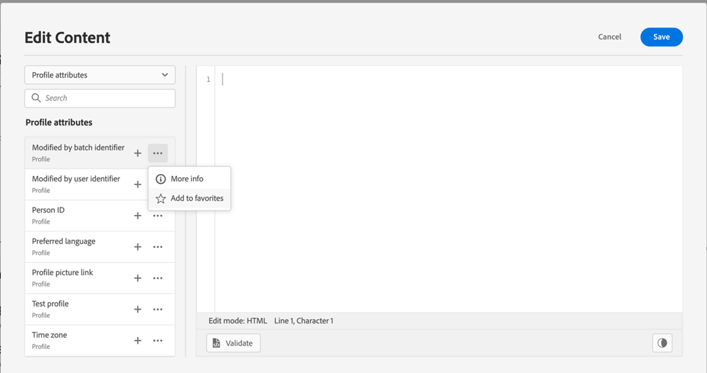

# 즐겨찾기에 속성 추가 {#fav}

즐겨찾기 메뉴에 다양한 속성을 추가하면 가장 자주 사용하는 항목에 빠르게 액세스할 수 있습니다. 즐겨찾기에 속성을 추가하려면 타원 메뉴를 클릭하고 **[!UICONTROL Add to favorites]**.

즐겨찾는 항목에 액세스하려면 **[!UICONTROL Favorites]** 메뉴 아래의 왼쪽 창에 표시됩니다.

이 목록에서 현재 표현식에 개인화 개체를 빠르게 추가할 수 있습니다.

즐겨찾기 목록에 항목이 더 이상 표시되지 않게 하려면 즐겨찾기에서 제거할 수 있습니다.

