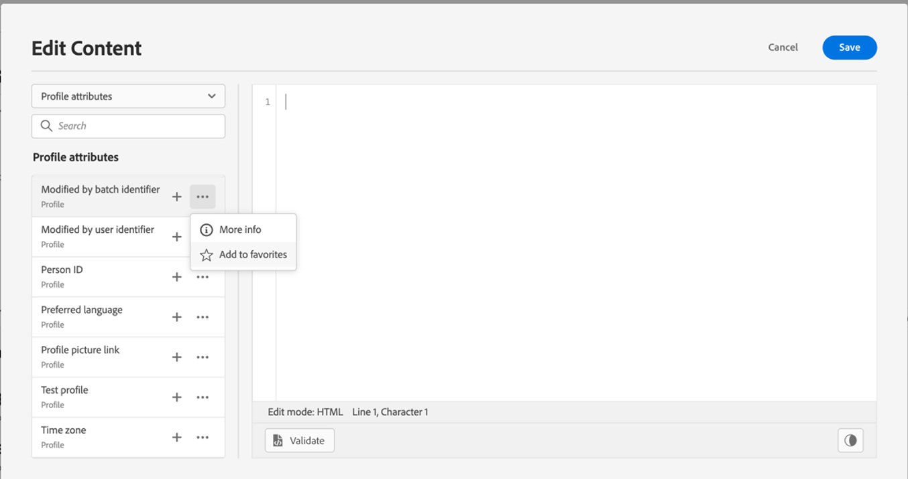
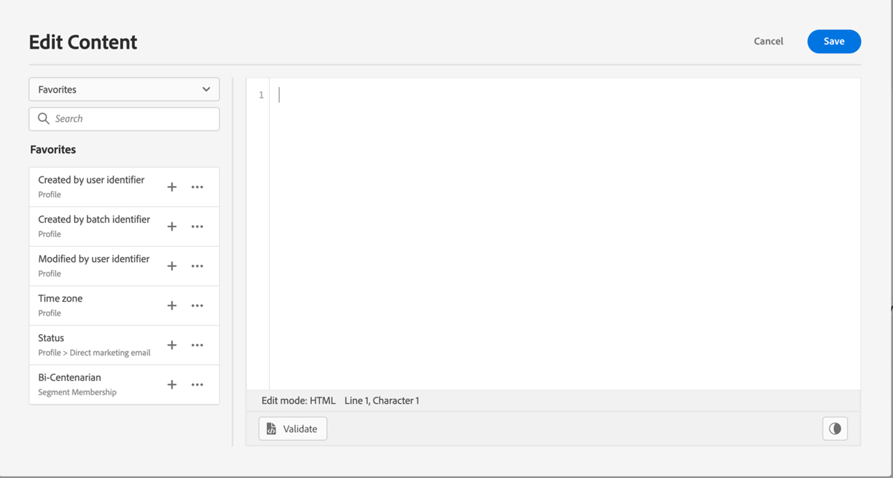
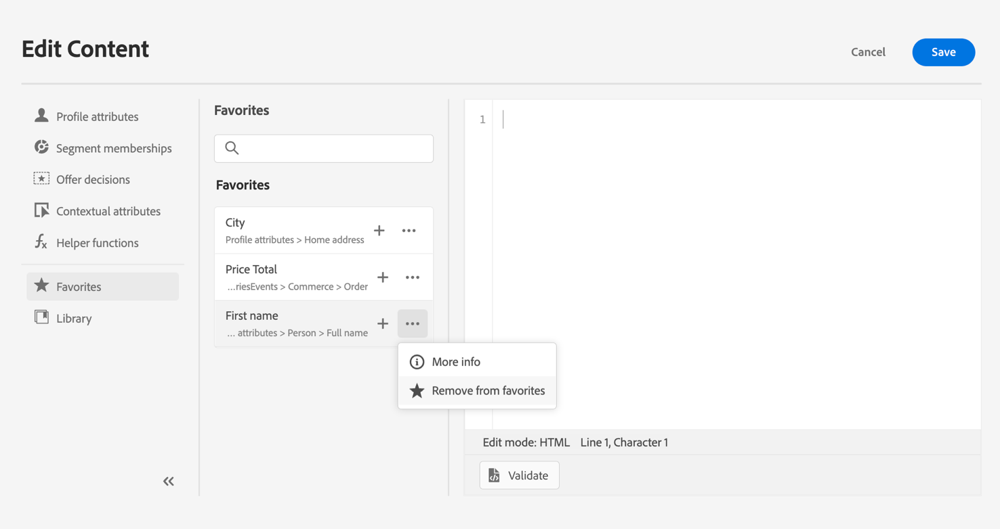

# 즐겨찾기에 속성 추가 {#fav}

>[!BEGINSHADEBOX]

**이 페이지에서:** Adobe Journey Optimizer에서 개인화 식을 작성할 때 빠르게 재사용할 수 있도록 즐겨찾기 메뉴에 특성을 추가, 액세스 및 제거하는 방법을 알아봅니다.

>[!ENDSHADEBOX]

즐겨찾기 메뉴에 다양한 속성을 추가하면 가장 자주 사용하는 항목에 빠르게 액세스할 수 있습니다. 즐겨찾기에 특성을 추가하려면 타원 메뉴를 클릭하고 **[!UICONTROL 즐겨찾기에 추가]**&#x200B;를 선택하십시오.

<!--

-->

즐겨찾는 항목에 액세스하려면 왼쪽 창의 **[!UICONTROL 즐겨찾기]** 메뉴를 사용하십시오.

이 목록에서 개인화 개체를 현재 표현식에 빠르게 추가할 수 있습니다.

<!--

-->

즐겨찾기 목록에 더 이상 항목이 표시되지 않도록 하려면 즐겨찾기에서 제거할 수 있습니다.

<!--

-->

## 빠른 참조 {#quick-reference}

이 단원에는 이 주제와 관련된 해석, 검색 및 질문 답변을 지원하기 위한 구조화된 지식이 포함되어 있습니다.

이해를 돕기 위해 이 정보를 이 페이지의 설명서와 통합해야 합니다. 두 소스 모두 독립적으로 사용하기 위한 것은 아닙니다. 이 페이지에서는 기능에 대해 설명하지만, 용어, 의도, 적용 가능성 및 제약 조건을 명확히 하는 데 도움이 되는 추가 컨텍스트를 제공합니다.

>[!BEGINTABS]

>[!TAB 개요]

**TL;DR**

이 페이지에서는 개인화 편집기의 즐겨찾기 메뉴에 자주 사용하는 속성을 추가하고, 빠르게 재사용하기 위해 액세스한 다음, 더 이상 필요하지 않을 때 제거하는 방법을 설명합니다.

**의도**

* 빠른 액세스를 위해 즐겨찾기 메뉴에 개인화 속성 추가
* 편집기의 왼쪽 창에 있는 즐겨찾기 메뉴에서 즐겨찾는 속성에 액세스합니다
* 즐겨찾기 목록에서 속성 제거

>[!TAB 용어집]

* **즐겨찾기 메뉴**: 개인화 편집기의 왼쪽 탐색 창에 있는 전용 섹션으로, 사용자가 즐겨찾기로 표시한 속성에 빠르게 액세스할 수 있으므로 더 빠른 표현식 빌드를 가능하게 합니다. *(제품별)*

>[!TAB 용어]

* **정식 이름:** 즐겨찾기 — 변형: 즐겨찾기 메뉴, 특성 즐겨찾기, 즐겨찾는 특성
* **정식 이름:** 즐겨찾기 — 변형: 즐겨찾기 메뉴, 즐겨찾는 특성

>[!TAB FAQ]

**Q: 즐겨찾기에 특성을 추가하려면 어떻게 해야 합니까?**

탐색 창에서 특성 옆에 있는 줄임표 메뉴를 클릭하고 **즐겨찾기에 추가**&#x200B;를 선택합니다.

**Q: 즐겨찾는 특성은 어디에서 찾을 수 있습니까?**

개인화 편집기의 왼쪽 창에 있는 **즐겨찾기** 메뉴에서

**Q: 즐겨찾기에서 특성을 제거하려면 어떻게 해야 합니까?**

왼쪽 창의 **즐겨찾기** 메뉴에서 즐겨찾기에서 항목을 제거합니다.

>[!ENDTABS]

<!-- ai-section-version: 1 | source-hash: 44d87d52 -->
