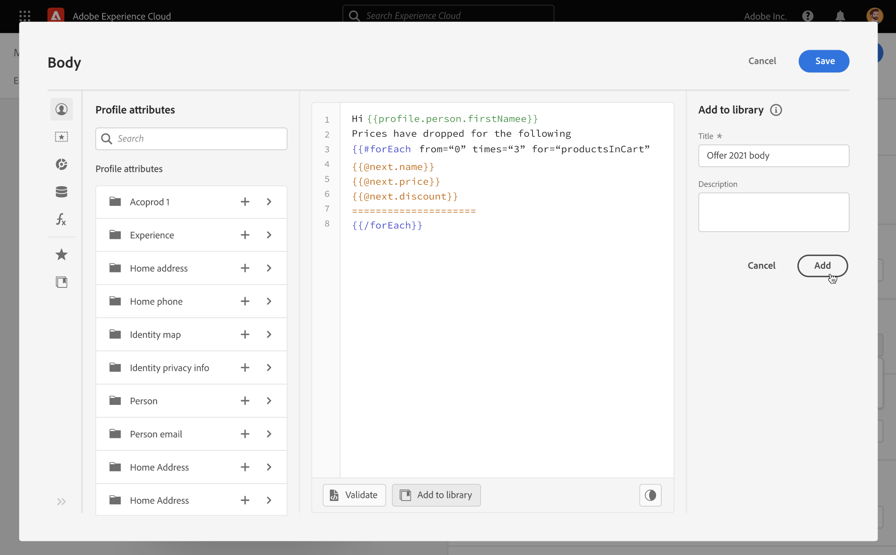

# 저장된 표현식을 사용한 작업 {#expression-library}

>[!CONTEXTUALHELP]
>id="ajo_perso_library"
>title="표현식 라이브러리 정보"
>abstract="[!DNL Journey Optimizer] 는 관리자 사용자가 구성한 저장된 개인화 표현식에 액세스할 수 있는 라이브러리를 제공합니다. "

[!DNL Journey Optimizer] 은 관리자 사용자가 추가한 이전에 저장한 개인화 표현식에 액세스할 수 있는 라이브러리를 제공합니다.

1. 저장된 표현식에 액세스하려면 **[!UICONTROL Library]** 왼쪽 창에 있는 단추. 이 목록에는 관리자 사용자가 저장한 모든 표현식이 표시됩니다( [라이브러리에 표현식 저장](#save-expressions)).

   >[!NOTE]
   >
   >정보 단추를 사용하여 저장된 표현식의 내용에 대한 자세한 정보를 얻을 수 있습니다. 라이브러리 항목을 관리할 수 있는 적절한 권한이 있으면 정보 단추가 타원 메뉴에 나타납니다.

   

1. 표현식을 편집기에 삽입하려면 + 를 클릭합니다. 그런 다음 개인화 컨텐츠를 평소대로 사용자 지정하고 유효성을 검사할 수 있습니다. [자세히 알아보기](../personalization/personalization-build-expressions.md)

   

## 라이브러리에 표현식을 저장합니다 {#save-expressions}

[!DNL Journey Optimizer] 관리자 사용자가 라이브러리에 개인화 표현식을 저장할 수 있습니다. 그런 다음 모든 사용자가 이러한 표현식을 사용하여 개인화 컨텐츠를 작성할 수 있습니다.

표현식을 라이브러리에 저장하려면 다음 단계를 수행합니다.

1. 편집기 인터페이스에서 표현식을 작성한 다음 **[!UICONTROL Add to library]**.

   >[!NOTE]
   >
   >단추가 보이지 않는다면 필요한 권한이 있는지 Admin Console에서 확인합니다( [권한 수준](../administration/high-low-permissions.md)).

   

1. 오른쪽 창에서 사용자가 쉽게 찾을 수 있도록 표현식의 제목과 설명을 입력한 다음 을 클릭합니다 **[!UICONTROL Add]**.

   

1. 표현식이 라이브러리에 추가됩니다. 이제 사용자가 이 콘텐츠를 사용하여 개인화 콘텐츠를 작성할 수 있습니다.

>[!NOTE]
>
>* 라이브러리에 최대 40개의 표현식을 저장합니다.
>
>* 식은 200KB를 초과할 수 없습니다.
>
>* 저장된 표현식은 생성 날짜별로 정렬됩니다. 최근에 추가한 표현식이 목록에 먼저 표시됩니다.

기존 표현식을 편집하려면 편집기에 추가한 다음 필요에 따라 수정합니다. 클릭 **[!UICONTROL Add to library]** 구문의 유효성을 검사하고 표현식을 저장하려면

표현식을 삭제하려면 타원 버튼을 클릭한 다음 **[!UICONTROL Delete]**.
