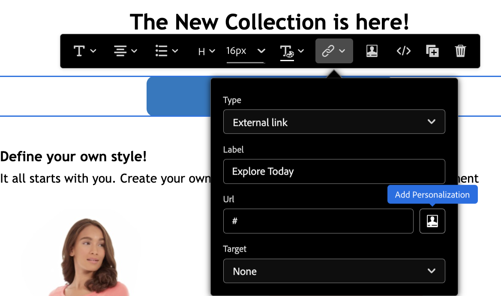

# 개인화 구문 {#personalization-syntax}

의 개인화 [!DNL Journey Optimizer] 은 Handlebars라는 템플릿 구문을 기반으로 합니다.
Handlebars 구문에 대한 전체 설명은 다음을 참조하십시오 [HandlebarsJS 설명서](https://handlebarsjs.com/).

템플릿과 입력 개체를 사용하여 HTML 또는 기타 텍스트 형식을 생성합니다. Handlebars 템플릿은 포함된 Handlebars 표현식이 있는 일반 텍스트와 같습니다.

단순 표현식 샘플:

`{{profile.person.name}}`

여기에서

* `profile` 는 네임스페이스입니다.
* `person.name` 는 속성으로 구성된 토큰입니다. 특성 구조는 Adobe Experience Platform XDM 스키마에 정의되어 있습니다. [자세히 알아보기](https://experienceleague.adobe.com/docs/experience-platform/xdm/home.html?lang=ko){target=&quot;_blank&quot;}.

## 구문 일반 규칙 {#general-rules}

식별자는 다음을 제외하고 유니코드 문자일 수 있습니다.

```
Whitespace ! " # % & ' ( ) * + , . / ; < = > @ [ \ ] ^ ` { | } ~
```

구문은 대/소문자를 구분합니다.

단어 **true**, **false**, **null** 및 **정의되지 않음** 경로 식의 첫 부분에서만 허용됩니다.

Handlebars에서 {{expression}}에서 반환되는 값은 다음과 같습니다 **HTML 이스케이프 처리**. 표현식에 가 포함되어 있는 경우 `&`를 반환하면 반환된 HTML 이스케이프 처리된 출력이 `&amp;`. Handlebars가 값을 이스케이프 처리하지 않도록 하려면 &quot;트리플 스태시&quot;를 사용합니다.

## 프로필

이 네임스페이스를 사용하면 [Adobe Experience Platform 데이터 모델(XDM) 설명서](https://experienceleague.adobe.com/docs/experience-platform/xdm/home.html){target=&quot;_blank&quot;}.

스키마에서 참조되기 전에 속성을 정의해야 합니다 [!DNL Journey Optimizer] 개인화 블록.

>[!NOTE]
>
>의 조건에서 프로필 속성을 활용하는 방법을 알아봅니다 [이 섹션](functions/helpers.md#if-function).

**샘플 참조:**

`{{profile.person.name.fullName}}`

`{{profile.person.name.firstName}}`

`{{profile.person.gender}}`

`{{profile.personalEmail.address}}`

`{{profile.mobilePhone.number}}`

`{{profile.homeAddress.city}}`

`{{profile.faxPhone.number}}`

## 세그먼트{#perso-segments}

의 조건에서 프로필 속성을 활용하는 방법을 알아봅니다 [이 섹션](functions/helpers.md#if-function).

>[!NOTE]
>세그멘테이션 및 세그멘테이션 서비스에 대한 자세한 내용은 [이 섹션](../segment/about-segments.md).

## 오퍼 {#offers-syntax}

이 네임스페이스를 사용하면 기존 오퍼 결정을 참조할 수 있습니다.
오퍼를 참조하려면 오퍼를 정의하는 다른 정보로 경로를 선언해야 합니다.

이 경로는 다음 구조를 갖습니다.

`offers.Type.[Placement Id].[Activity Id].Attribute`

여기에서

* `offers` 오퍼 네임스페이스에 속하는 경로 표현식을 식별합니다
* `Type`  오퍼 표현 유형을 결정합니다. 가능한 값은 다음과 같습니다. `image`, `html` 및 `text`
* `Placement Id` 및 `Activity Id` 배치 및 활동 식별자
* `Attributes` 은 오퍼 유형에 따라 달라지는 오퍼 특정 속성입니다. 예: `deliveryUrl` 이미지

결정 API 및 오퍼 표현에 대한 자세한 내용은 [이 페이지](../../using/offers/api-reference/decisions-api/deliver-offers.md)

모든 참조는 [이 페이지](personalization-validation.md)

**샘플 참조:**

* 이미지가 호스팅되는 위치:

   `offers.image.[offers:xcore:offer-placement:126f767d74b0da80].[xcore:offer-activity:125e2c6889798fd9].deliveryUrl`

* 이미지를 클릭하면 Target URL:

   `offers.image.[offers:xcore:offer-placement:126f767d74b0da80].[xcore:offer-activity:125e2c6889798fd9].linkUrl`

* 의사 결정 엔진에서 나오는 오퍼의 텍스트 컨텐츠:

   `offers.text.[offers:xcore:offer-placement:126f767d74b0da80].[xcore:offer-activity:125e2c6889798fd9].content`

* 의사 결정 엔진에서 나오는 오퍼의 HTML 컨텐츠:

   `offers.html.[offers:xcore:offer-placement:126f767d74b0da80].[xcore:offer-activity:125e2c6889798fd9].content`


## 도우미{#helpers-all}

Handlebars 도우미는 매개 변수 뒤에 올 수 있는 간단한 식별자입니다.
각 매개 변수는 Handlebars 표현식입니다. 이러한 도우미는 템플릿의 모든 컨텍스트에서 액세스할 수 있습니다.

이러한 블록 도우미는 도우미 이름 앞에 있는 # 로 식별되며 같은 이름의 닫는 / 와 일치해야 합니다.
블록은 블록이 열려 있는 표현식입니다({{# }}) 및 닫기({{/}}).


>[!NOTE]
>
>도우미 함수는 [이 섹션](functions/helpers.md).

## 리터럴 형식 {#literal-types}

[!DNL Adobe Journey Optimizer] 에서는 다음 리터럴 유형을 지원합니다.

| 리터럴 | 정의 |
| ------- | ---------- |
| 문자열 | 큰따옴표로 묶인 문자로 구성된 데이터 유형입니다. <br>예: `"prospect"`, `"jobs"`, `"articles"` |
| 부울 | true 또는 false인 데이터 유형입니다. |
| 정수 | 전체 수를 나타내는 데이터 유형입니다. 양수, 음수 또는 0일 수 있습니다. <br>예: `-201`, `0`, `412` |
| 어레이 | 다른 리터럴 값의 그룹으로 구성된 데이터 유형입니다. 대괄호는 대괄호를 사용하여 그룹화하고 쉼표를 사용하여 서로 다른 값 간에 구분합니다. <br> **참고:** 배열 내의 항목의 속성에 직접 액세스할 수는 없습니다. <br> 예: `[1, 4, 7]`, `["US", "FR"]` |

>[!CAUTION]
>
>의 사용 **xEvent** 변수를 개인화 표현식에서 사용할 수 없습니다. xEvent를 참조하면 유효성 검사가 실패합니다.

## URL 개인화{#perso-urls}

개인화된 URL은 프로필 속성에 따라 수신자를 웹사이트의 특정 페이지 또는 개인화된 마이크로사이트로 이동합니다. Adobe Journey Optimizer에서 메시지 콘텐츠의 URL에 개인화를 추가할 수 있습니다. URL 개인화는 텍스트 및 이미지에 적용할 수 있으며, 프로필 데이터 또는 컨텍스트 데이터를 사용합니다.

Journey Optimizer에서는 개인화 필드를 메시지에 추가하여 하나 또는 여러 개의 URL을 개인화할 수 있습니다. URL을 개인화하려면 아래 단계를 수행하십시오.

1. 메시지 콘텐츠에 링크를 만듭니다. [자세히 알아보기](../messages/message-tracking.md#insert-links)
1. 개인화 아이콘에서 속성을 선택합니다. 개인화 아이콘은 다음 유형의 링크에만 사용할 수 있습니다. **외부 링크**, **구독 취소 링크** 및 **옵트아웃**.



>[!NOTE]
>
>표현식 편집기에서 개인화된 URL을 편집하면 보안상의 이유로 도우미 함수 및 세그먼트 멤버십이 비활성화됩니다.

**개인화된 URL 샘플**

* `https://www.adobe.com/users/{{profile.person.name.lastName}}`
* `https://www.adobe.com/users?uid={{profile.person.name.firstName}}`
* `https://www.adobe.com/usera?uid={{context.journey.technicalProperties.journeyUID}}`
* `https://www.adobe.com/users?uid={{profile.person.crmid}}&token={{context.token}}`

>[!CAUTION]
>
>URL 내에서 사용되는 개인화 토큰에서는 공백이 지원되지 않습니다.
