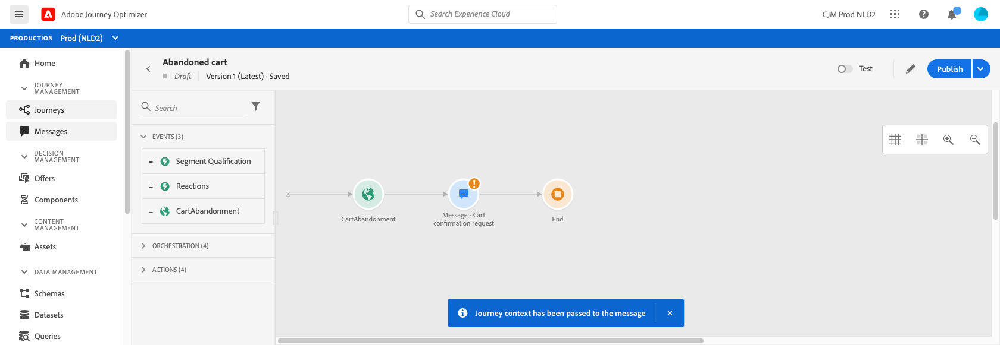

# 개인화 사용 사례:장바구니 포기 이메일 {#personalization-use-case-helper-functions}

이 예제에서는 이메일 메시지 본문을 개인화합니다. 이 메시지는 장바구니에 항목을 남겼지만 구매를 완료하지 않은 고객을 타겟팅합니다.

다음과 같은 유형의 도우미 함수를 사용합니다.

* 고객의 이름을 대문자로 삽입하기 위한 `upperCase` 문자열 함수입니다. [자세히 알아보기](functions/string.md#upper).
* 장바구니에 있는 항목을 나열하려면 `each` 도우미 [자세히 알아보기](functions/helpers.md#each).
* 관련 제품이 장바구니에 있는 경우 제품별 메모를 삽입하기 위한 `if` 도우미. [자세히 알아보기](functions/helpers.md#if-function).

<!-- **Context**: personalization based on contextual data from the journey -->

시작하기 전에 다음 요소를 구성하는 방법을 알고 있어야 합니다.
* 이메일 메시지. [자세히 알아보기](../create-message.md)
* 이메일 본문. [자세히 알아보기](../create-email-content.md).
* 단일 이벤트. [자세히 알아보기](../event/about-events.md).
* 이벤트로 시작하는 여정. [자세히 알아보기](../building-journeys/using-the-journey-designer.md).

다음 단계를 수행합니다.
1. [이메일 메시지를 만듭니다](#configure-email).
2. [고객의 이름을 대문자로 삽입합니다](#uppercase-function).
3. [초기 이벤트와 여정 ](#create-context)를 만듭니다.
4. [이메일에 장바구니 컨텐츠를 추가합니다](#each-helper).
5. [제품별 메모를 삽입합니다](#if-helper).
6. [여정 테스트 및 게시](#test-and-publish).

## 1단계:이메일 만들기{#configure-email}

1. 이메일 메시지를 만들거나 수정한 다음 **[!UICONTROL Email Designer]** 을 클릭합니다.
   

2. 전자 메일 디자이너 홈 페이지의 왼쪽 팔레트에서 3개의 구조 구성 요소를 메시지 본문에 끌어다 놓습니다.

3. HTML 콘텐츠 구성 요소를 각각의 새 구조 구성 요소에 끌어다 놓습니다.

   

## 2단계:고객의 이름을 대문자로 삽입합니다. {#uppercase-function}

1. 이메일 디자이너 홈페이지에서 고객의 이름을 추가할 HTML 구성 요소를 클릭합니다.
2. 상황별 도구 모음에서 **[!UICONTROL Show the source code]** 을 클릭합니다.

   

3. **[!UICONTROL Edit HTML]** 창에서 `upperCase` 문자열 함수를 추가합니다.
   1. 목록에서 **[!UICONTROL Helper functions]** 을 선택합니다.
   2. 검색 필드를 사용하여 &quot;대문자&quot;를 찾습니다.
   3. 검색 결과에서 `upperCase` 함수를 추가합니다. 이렇게 하려면 `: string` 옆에 있는 더하기(+) 기호를 클릭합니다.

      표현식 편집기에 다음 표현식이 표시됩니다.

      ```handlebars
      
      ```

      

4. 표현식에서 &quot;string&quot; 자리 표시자를 제거합니다.
5. 이름 토큰 추가:
   1. 목록에서 **[!UICONTROL Profile]** 을 선택합니다.
   2. 선택 **[!UICONTROL Profile]** > **[!UICONTROL Person]** > **[!UICONTROL Full name]**.
   3. 표현식에 **[!UICONTROL First name]** 토큰을 추가합니다.

      표현식 편집기에 다음 표현식이 표시됩니다.

      ```handlebars
      
      ```

      

      [Adobe Experience Platform 설명서](https://experienceleague.adobe.com/docs/experience-platform/xdm/data-types/person-name.html){target=&quot;_blank&quot;}의 개인 이름 데이터 유형에 대해 자세히 알아보십시오.

6. **[!UICONTROL Validate]**&#x200B;를 클릭한 다음 **[!UICONTROL Save]**&#x200B;을 클릭합니다.

   
7. 메시지를 저장합니다.

## 3단계:초기 이벤트 및 관련 여정 만들기 {#create-context}

장바구니 콘텐츠는 여정의 컨텍스트 정보입니다. 따라서 이메일에 장바구니 관련 정보를 추가하려면 먼저 초기 이벤트와 이메일을 여정에 추가해야 합니다.

1. 스키마에 `productListItems` 배열이 포함된 이벤트를 만듭니다.
2. 이 배열의 모든 필드를 이 이벤트의 페이로드 필드로 정의합니다.

   [Adobe Experience Platform 설명서](https://experienceleague.adobe.com/docs/experience-platform/xdm/data-types/product-list-item.html){target=&quot;_blank&quot;}의 제품 목록 항목 데이터 유형에 대해 자세히 알아보십시오.

3. 이 이벤트로 시작하는 여정을 만듭니다.
4. 메시지를 여정에 추가합니다.
5. 종료 활동으로 여정을 종료합니다.

   메시지를 아직 게시하지 않았으므로 여정을 테스트하거나 게시할 수 없습니다.

   

6. **[!UICONTROL OK]**&#x200B;을(를) 클릭합니다.

   메시지에 여정 컨텍스트이 전달되었음을 알리는 메시지가 표시됩니다.

   

## 4단계:장바구니에서 항목 목록을 삽입합니다. {#each-helper}

1. 메시지를 다시 엽니다.

   

2. 이메일 디자이너 홈페이지에서 장바구니 콘텐츠를 나열할 HTML 구성 요소를 클릭합니다.
3. 상황별 도구 모음에서 **[!UICONTROL Show the source code]** 을 클릭합니다.

   

4. **[!UICONTROL Edit HTML]** 창에서 `each` 도우미를 추가합니다.
   1. 목록에서 **[!UICONTROL Helper functions]** 을 선택합니다.
   2. 검색 필드를 사용하여 &quot;각&quot;을 찾습니다.
   3. 검색 결과에서 `each` 도우미를 추가합니다.

      표현식 편집기에 다음 표현식이 표시됩니다.

      ```handlebars
      {{#each someArray as |variable|}} {{/each}}
      ```

      

5. 식에 `productListItems` 배열을 추가합니다.

   1. 표현식에서 &quot;someArray&quot; 자리 표시자를 제거합니다.
   2. 목록에서 **[!UICONTROL Context]** 을 선택합니다.

      **[!UICONTROL Context]** 옵션은 여정 컨텍스트이 메시지에 전달된 후에만 사용할 수 있습니다.

   3. **[!UICONTROL Journey Orchestration]** > **[!UICONTROL Events]** > ***[!UICONTROL event_name]***을 선택한 다음 **[!UICONTROL productListItems]** 노드를 확장합니다.

      이 예에서 *event_name*&#x200B;은 이벤트의 이름을 나타냅니다.

   4. 표현식에 **[!UICONTROL Product]** 토큰을 추가합니다.

      표현식 편집기에 다음 표현식이 표시됩니다.

      ```handlebars
      {{#each context.journey.events.event_ID.productListItems.product as |variable|}} {{/each}}
      ```
      이 예에서 *event_ID*&#x200B;은 이벤트의 ID를 나타냅니다.

      

   5. 표현식을 수정합니다.
      1. &quot;.product&quot; 문자열을 제거합니다.
      2. &quot;변수&quot; 자리 표시자를 &quot;product&quot;로 바꿉니다.

      다음 예는 수정된 표현식을 보여 줍니다.

      ```handlebars
      {{#each context.journey.events.event_ID.productListItems as |product|}}
      ```
6. 열기 `{{#each}}` 태그와 닫는 `{/each}}` 태그 사이에 이 코드를 붙여 넣습니다.

   ```html
   <table>
      <tbody>
         <tr>
            <td><b>#name</b></td>
            <td><b>#quantity</b></td>
            <td><b>$#priceTotal</b></td>
         </tr>
      </tbody>
   </table>
   ```

7. 항목 이름, 수량 및 가격에 대한 개인화 토큰을 추가합니다.

   1. HTML 테이블에서 자리 표시자 &quot;#name&quot;을 제거합니다.
   2. 이전 검색 결과에서 식에 **[!UICONTROL Name]** 토큰을 추가합니다.

   다음 단계를 두 번 반복합니다.
   * 자리 표시자 &quot;#quantity&quot;을 **[!UICONTROL Quantity]** 토큰으로 바꿉니다.
   * 자리 표시자 &quot;#priceTotal&quot;을 **[!UICONTROL Total price]** 토큰으로 바꿉니다.

   다음 예는 수정된 표현식을 보여 줍니다.

   ```handlebars
   {{#each context.journey.events.event_ID.productListItems as |product|}}
      <table>
         <tbody>
            <tr>
               <td><b>{{context.journey.events.event_ID.productListItems.name}}</b></td>
               <td><b>{{context.journey.events.event_ID.productListItems.quantity}}</b></td>
               <td><b>${{context.journey.events.event_ID.productListItems.priceTotal}}</b></td>
            </tr>
         </tbody>
      </table>
   {{/each}}
   ```
8. **[!UICONTROL Validate]**&#x200B;를 클릭한 다음 **[!UICONTROL Save]**을 클릭합니다.
   

## 5단계:제품별 메모 삽입 {#if-helper}

1. 전자 메일 디자이너 홈페이지에서 메모를 삽입할 HTML 구성 요소를 클릭합니다.
2. 상황별 도구 모음에서 **[!UICONTROL Show the source code]** 을 클릭합니다.

   

3. **[!UICONTROL Edit HTML]** 창에서 `if` 도우미를 추가합니다.
   1. 목록에서 **[!UICONTROL Helper functions]** 을 선택합니다.
   2. 검색 필드를 사용하여 &quot;if&quot;를 찾습니다.
   3. 검색 결과에서 `if` 도우미를 추가합니다.

      표현식 편집기에 다음 표현식이 표시됩니다.

      ```handlebars
       render_1
          render_2
          default_render
      
      ```
      

4. 표현식에서 이 조건을 제거합니다.

   ```handlebars
    render_2
   ```

   다음 예는 수정된 표현식을 보여 줍니다.

   ```handlebars
    render_1
       default_render
   
   ```

5. 조건에 제품 이름 토큰을 추가합니다.
   1. 표현식에서 &quot;condition1&quot; 자리 표시자를 제거합니다.
   2. 목록에서 **[!UICONTROL Context]** 을 선택합니다.
   3. **[!UICONTROL Journey Orchestration]** > **[!UICONTROL Events]** > ***[!UICONTROL event_name]***을 선택한 다음 **[!UICONTROL productListItems]** 노드를 확장합니다.

      이 예에서 *event_name*&#x200B;은 이벤트의 이름을 나타냅니다.

   4. 표현식에 **[!UICONTROL Name]** 토큰을 추가합니다.

      표현식 편집기에 다음 표현식이 표시됩니다.

      ```handlebars
      
         render_1
          default_render
      
      ```
      

6. 표현식을 수정합니다.
   1. 표현식 편집기에서 `name` 토큰 뒤에 제품 이름을 지정합니다.

      이 구문을 사용합니다. 여기서 *product_name*&#x200B;은(는) 제품의 이름을 나타냅니다.

      ```javascript
      = "product_name"
      ```

      이 예에서 제품 이름은 &quot;Juno Jacket&quot;입니다.

      ```handlebars
      
         render_1
          default_render
      
      ```

   2. &quot;render_1&quot; 자리 표시자를 메모의 텍스트로 바꿉니다.

      예:

      ```handlebars
      
         Due to longer than usual lead times on the Juno Jacket, please expect item to ship two weeks after purchase.
          default_render
      
      ```
   3. 표현식에서 &quot;default_render&quot; 자리 표시자를 제거합니다.
7. **[!UICONTROL Validate]**&#x200B;를 클릭한 다음 **[!UICONTROL Save]**&#x200B;을 클릭합니다.

   

8. 메시지를 저장하고 게시합니다.

## 6단계:여정 테스트 및 게시 {#test-and-publish}

1. 여정을 엽니다. 여정이 이미 열려 있다면 페이지를 새로 고칩니다.
2. **[!UICONTROL Test]** 토글을 켜고 **[!UICONTROL Trigger an event]** 를 클릭합니다.

   메시지를 게시한 후에만 테스트 모드를 설정할 수 있습니다.

   

3. **[!UICONTROL Event configuration]** 창에서 입력 값을 입력한 다음 **[!UICONTROL Send]** 를 클릭합니다.

   테스트 모드는 테스트 프로필에서만 작동합니다.

   

   테스트 프로필의 주소로 이메일이 전송됩니다.

   Juno Jacket에 대한 메모가 이 제품이 장바구니에 있으므로 이 이메일에 포함됩니다.

   

4. 오류가 없는지 확인한 다음 여정을 게시합니다.


## 관련 항목

### Handlebars 함수

* [도우미](functions/helpers.md)

* [문자열 함수](functions/string.md)

### 사용 사례

* [프로필 정보, 컨텍스트 및 오퍼를 사용한 개인화](personalization-use-case.md)

* [의사 결정 기반 오퍼를 사용한 개인화](../offers/offers-e2e.md)

## 튜토리얼 비디오{#helper-functions-video}

>[!VIDEO](https://video.tv.adobe.com/v/334244?quality=12)