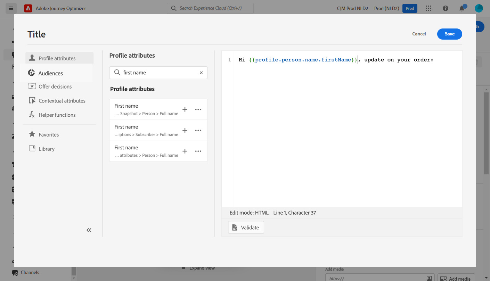
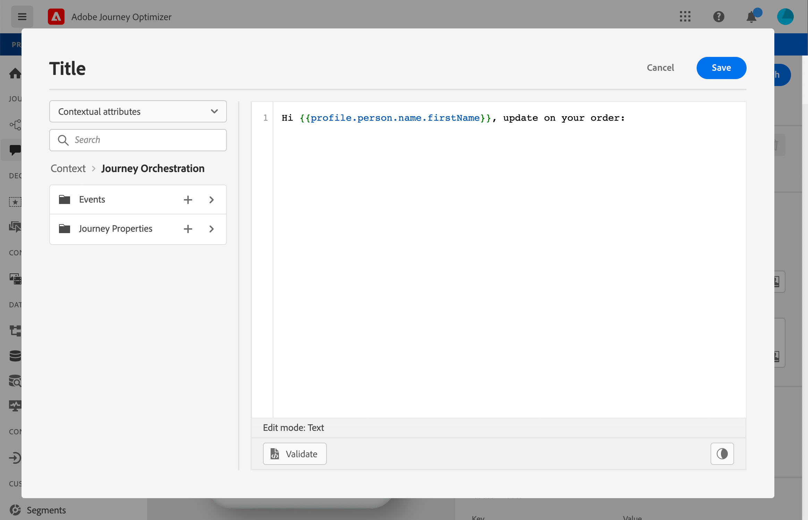

# 개인화 사용 사례: 주문 상태 알림 {#personalization-use-case}

이 사용 사례에서는 단일 푸시 알림 메시지에서 여러 유형의 개인화를 사용하는 방법을 확인할 수 있습니다. 다음 세 가지 유형의 개인화가 사용됩니다.

* **프로필**: 프로필 필드를 기반으로 한 메시지 개인화
* **오퍼 결정**: offer decisioning 변수를 기반으로 한 개인화
* **컨텍스트**: 여정의 컨텍스트 데이터 기반의 개인화

이 예제의 목표는 이벤트를 [!DNL Journey Optimizer] 고객 주문이 업데이트될 때마다 그런 다음 주문 및 개인화된 오퍼에 대한 정보를 사용하여 고객에게 푸시 알림이 전송됩니다.

이 사용 사례에는 다음 전제 조건이 필요합니다.

* 푸시 알림 메시지를 게시하지 않고 만들고 디자인합니다. 다음을 참조하십시오 [섹션](../messages/create-message.md).
* 주문 번호, 상태 및 품목 이름을 포함하는 주문 이벤트를 구성합니다. 다음을 참조하십시오 [섹션](../event/about-events.md).
* 결정을 만듭니다(이전에 &#39;오퍼 활동&#39;이라고 함). 이 내용을 참조하십시오 [섹션](../offers/offer-activities/create-offer-activities.md).

## 1단계 - 프로필에 개인화 추가 {#add-perso}

1. 을(를) 클릭합니다. **[!UICONTROL Message]** 메뉴를 선택하고 메시지를 선택합니다.

   

1. 을(를) 클릭합니다. **제목** 필드.

   

1. 제목을 입력하고 프로필 개인화를 추가합니다. 검색 막대를 사용하여 프로필의 이름 필드를 찾습니다. 제목 텍스트에서 개인화 필드를 삽입할 위치에 커서를 놓고 **+** 아이콘. **저장**&#x200B;을 클릭합니다.

   

   >[!NOTE]
   >
   >메시지를 초안으로 둡니다. 아직 게시하지 마십시오.

## 2단계 - 여정 만들기 {#create-journey}

1. 을(를) 클릭합니다. **[!UICONTROL Journeys]** 메뉴를 보고 새 여정을 만듭니다.

   

1. 시작 이벤트, **메시지** 그리고 **종료** 활동.

   

1. 에서 **메시지** 활동에서 이전에 만든 메시지를 선택합니다. 클릭 **확인**.

   

   시작 이벤트 데이터와 여정 속성이 메시지에 전달되었음을 알리는 메시지가 표시됩니다.

   

   >[!NOTE]
   >
   >경고 아이콘과 함께 메시지가 나타납니다. 메시지가 아직 게시되지 않았기 때문입니다.

## 3단계 - 컨텍스트 기반 데이터에 개인화 추가 {#add-perso-contextual-data}

1. 에서 **메시지** 활동을 클릭하고 **메시지 열기** 아이콘. 메시지가 새 탭에서 열립니다.

   

1. 을(를) 클릭합니다. **제목** 필드.

   

1. 을(를) 선택합니다 **상황별 특성** 메뉴 아래의 제품에서 사용할 수 있습니다. 컨텍스트 속성은 여정이 메시지에 컨텍스트 데이터를 전달한 경우에만 사용할 수 있습니다. 클릭 **Journey Orchestration**. 다음과 같은 상황별 정보가 표시됩니다.

   * **이벤트**: 이 카테고리는 **메시지** 활동 을 만들 수 있습니다.
   * **여정 속성**: 주어진 프로필의 여정과 관련된 기술 필드(예: 여정 ID 또는 발생한 특정 오류)입니다. 추가 정보 [Journey Orchestration 설명서](../building-journeys/expression/journey-properties.md).

   

1. 를 확장합니다. **이벤트** 항목을 검색하고 이벤트와 관련된 주문 번호 필드를 찾습니다. 검색 상자를 사용할 수도 있습니다. 을(를) 클릭합니다. **+** 아이콘을 클릭하여 제목 텍스트에 개인화 필드를 삽입합니다. **저장**&#x200B;을 클릭합니다.

   

1. 이제 **본문** 필드.

   

1. **에서 메시지를 입력하고 삽입 을 클릭합니다.**[!UICONTROL Contextual attributes]** 메뉴, 주문 품목 이름 및 주문 진행 상태

   

1. 왼쪽 메뉴에서 **오퍼 결정** offer decisioning 변수를 삽입하려면 다음을 수행하십시오. 배치를 선택하고 을(를) 클릭합니다. **+** 결정 옆에 있는 아이콘(이전에 &#39;오퍼 활동&#39;이라고 함)을 본문에 추가합니다.

   

1. 유효성 검사 를 클릭하여 오류가 없는지 확인한 다음 를 클릭합니다 **저장**.

   

1. 이제 메시지를 게시합니다.

   

## 4단계 - 여정 테스트 및 게시 {#test-publish}

1. 여정을 다시 엽니다. 여정이 이미 열려 있다면 페이지를 새로 고치십시오. 메시지가 게시되었으므로 여정에 오류가 없음을 확인할 수 있습니다. 을(를) 클릭합니다. **테스트** 단추를 클릭한 다음 **이벤트 트리거**.

   

1. 테스트에 전달할 다른 값을 입력합니다. 테스트 모드는 테스트 프로필에서만 작동합니다. 프로필 식별자는 테스트 프로필에 해당해야 합니다. **보내기**&#x200B;를 클릭합니다.

   

   푸시 알림이 전송되고 테스트 프로필의 휴대폰에 표시됩니다.

   

1. 오류가 없는지 확인하고 여정을 게시합니다.
