# Personalization 사용 사례: 주문 상태 알림 {#personalization-use-case}

>[!BEGINSHADEBOX]

**이 페이지에서:** Adobe Journey Optimizer에서 푸시 알림을 개인화하기 위해 프로필, 오퍼 결정 및 상황별 여정 데이터를 결합하는 주문 상태 사용 사례를 따릅니다.

>[!ENDSHADEBOX]

이 사용 사례에서는 단일 푸시 알림 메시지에 여러 유형의 개인화를 사용하는 방법을 알아봅니다. 세 가지 유형의 개인화가 사용됩니다.

* **프로필**: 프로필 필드를 기반으로 한 메시지 개인화
* **오퍼 결정**: 의사 결정 관리 변수를 기반으로 한 개인화
* **컨텍스트**: 여정의 컨텍스트 데이터를 기반으로 한 개인화

이 예제의 목표는 고객 주문이 업데이트될 때마다 이벤트를 [!DNL Journey Optimizer]에 푸시하는 것입니다. 그런 다음 주문 및 맞춤형 오퍼에 대한 정보와 함께 푸시 알림이 고객에게 전송됩니다.

이 사용 사례의 경우 다음 사전 요구 사항이 필요합니다.

* 주문 번호, 상태 및 품목 이름을 포함하는 주문 이벤트를 구성합니다. 이 [섹션](../event/about-events.md)을 참조하십시오.
* 결정을 만듭니다. 이 [섹션](../offers/offer-activities/create-offer-activities.md)을 참조하세요.

➡️ [비디오에서 유사한 사용 사례 검색](#video)

## 1단계 - 여정 만들기 {#create-journey}

1. **[!UICONTROL 여정]** 메뉴를 클릭하고 새 여정을 만듭니다.

   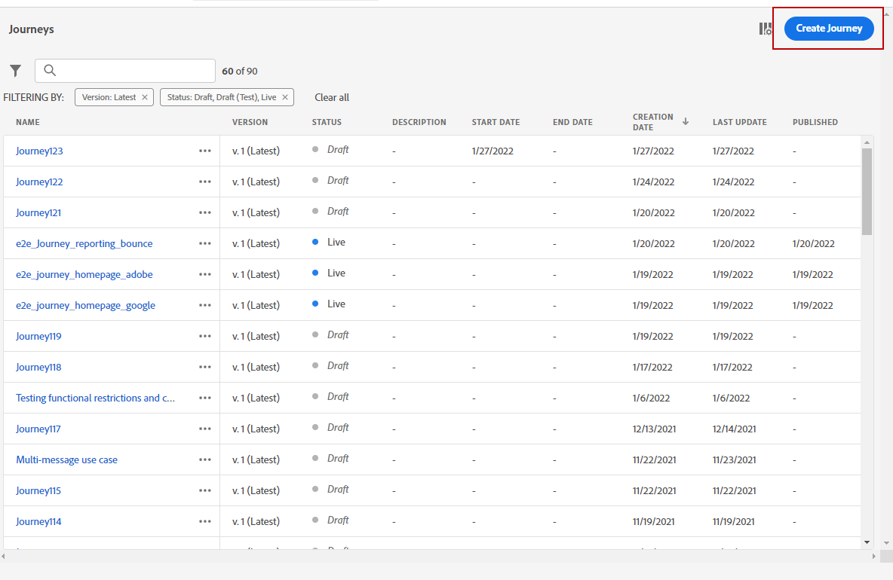

1. 시작 이벤트 및 **푸시** 동작 활동을 추가합니다.

   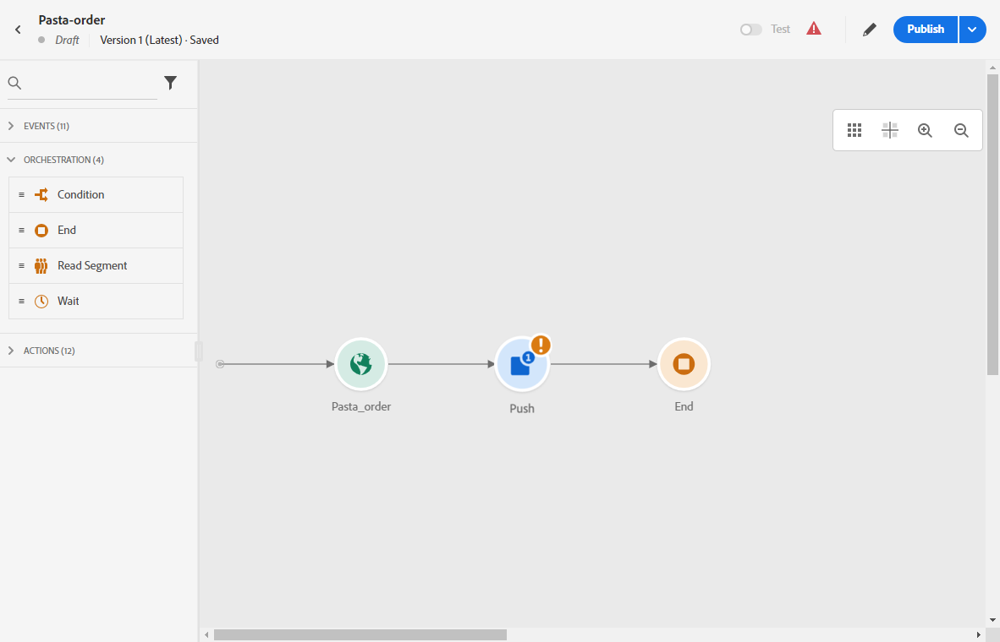

1. 푸시 알림 메시지를 구성하고 디자인합니다. 이 [섹션](../push/create-push.md)을 참조하십시오.

## 2단계 - 프로필에 개인화 추가 {#add-perso}

1. **푸시** 활동에서 **콘텐츠 편집**&#x200B;을 클릭합니다.

1. **제목** 필드를 클릭합니다.

   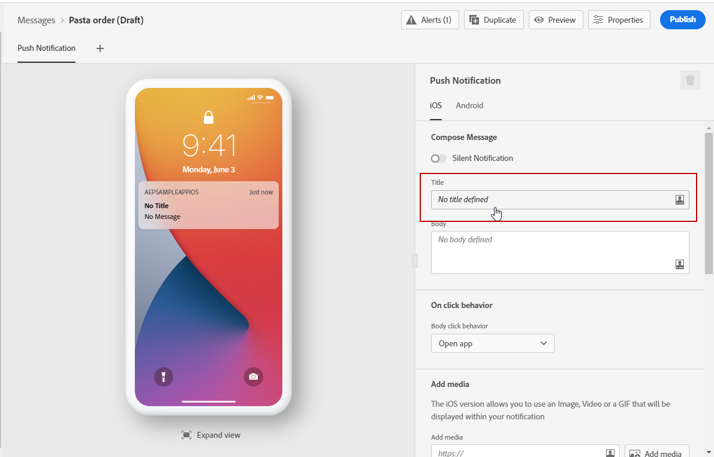

1. 제목을 입력하고 프로필 개인화를 추가하십시오. 검색창을 사용하여 프로필의 이름 필드를 찾습니다. 제목 텍스트에서 개인화 필드를 삽입할 위치에 커서를 놓고 **+** 아이콘을 클릭합니다. **저장**&#x200B;을 클릭합니다.

   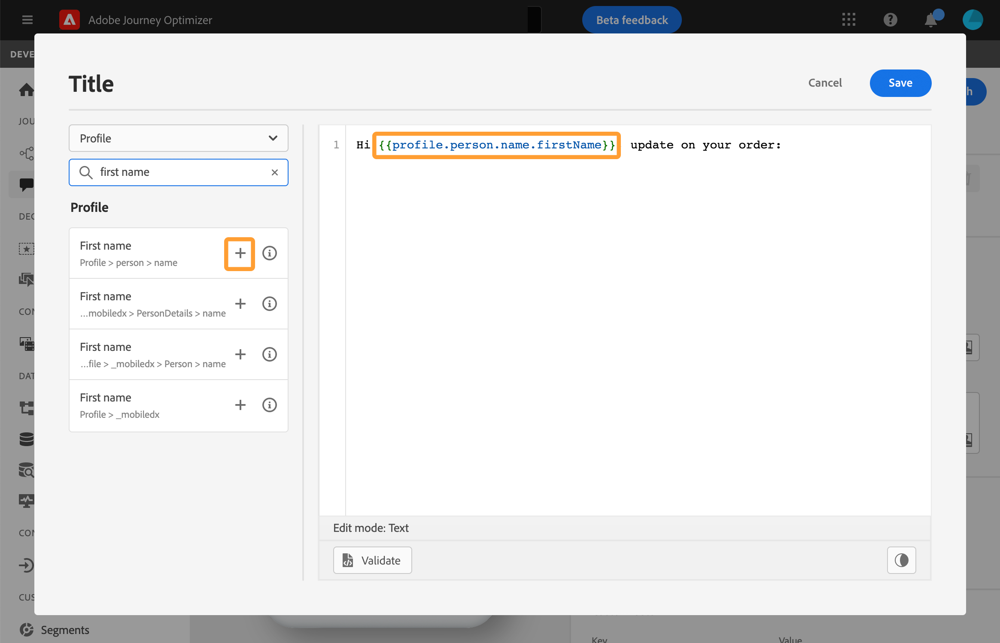

## 3단계 - 컨텍스트 기반 데이터에 개인화 추가 {#add-perso-contextual-data}

1. **푸시** 활동에서 **콘텐츠 편집**&#x200B;을 클릭하고 **제목** 필드를 클릭합니다.

   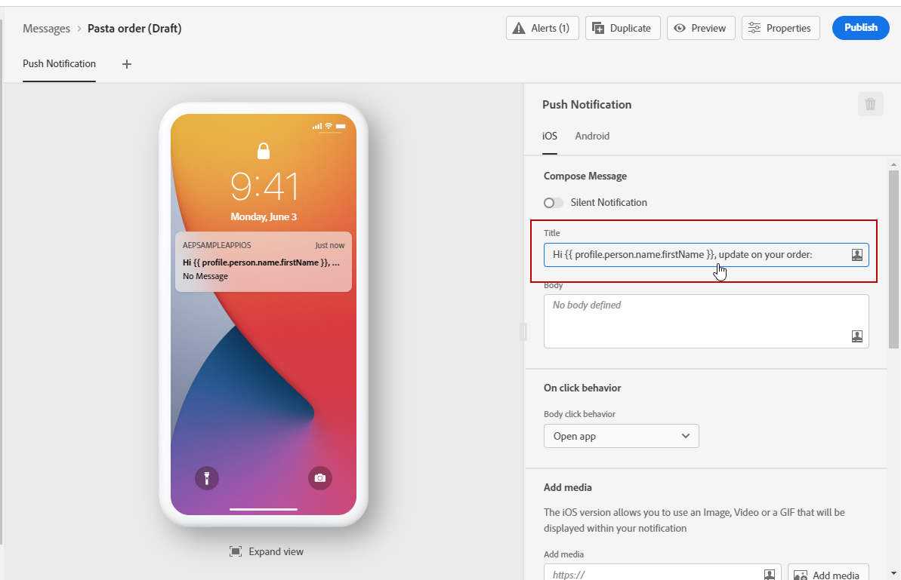

1. **상황별 특성** 메뉴를 선택하십시오. 컨텍스트 속성은 여정이 컨텍스트 데이터를 메시지에 전달한 경우에만 사용할 수 있습니다. **Journey Orchestration**&#x200B;을(를) 클릭합니다. 다음과 같은 상황별 정보가 나타납니다.

   * **이벤트**: 이 범주는 여정에서 채널 작업 활동 전에 배치된 이벤트의 모든 필드를 다시 그룹화합니다.
   * **여정 속성**: 지정된 프로필의 여정과 관련된 기술 필드(예: 여정 ID 또는 발생한 특정 오류). 자세한 내용은 [Journey Orchestration 설명서](../building-journeys/expression/journey-properties.md)를 참조하세요.

   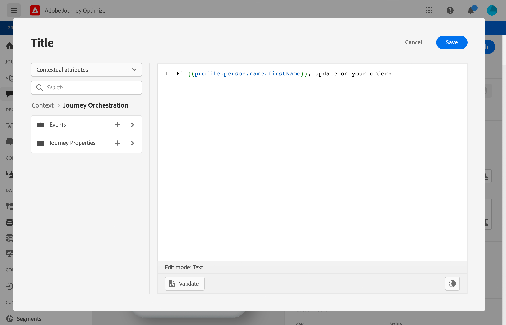

1. **이벤트** 항목을 확장하고 이벤트와 관련된 주문 번호 필드를 찾습니다. 검색 상자를 사용할 수도 있습니다. 제목 텍스트에 개인화 필드를 삽입하려면 **+** 아이콘을 클릭하십시오. **저장**&#x200B;을 클릭합니다.

   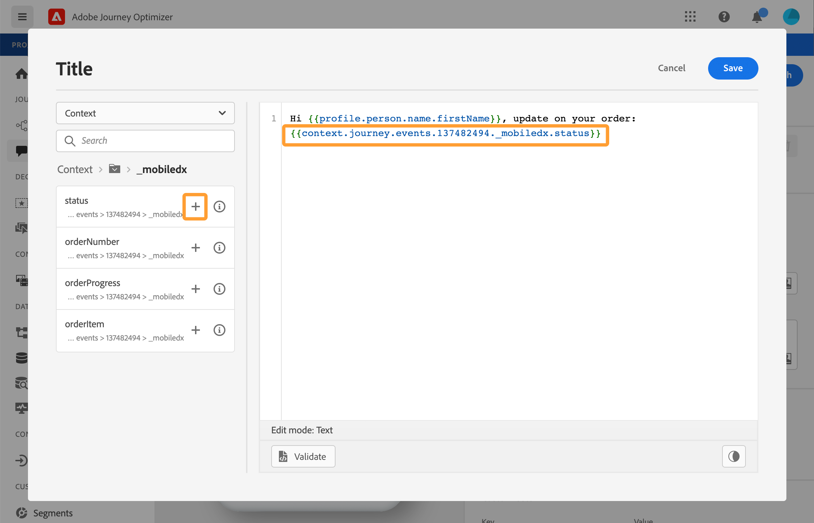

1. 이제 **본문** 필드를 클릭합니다.

   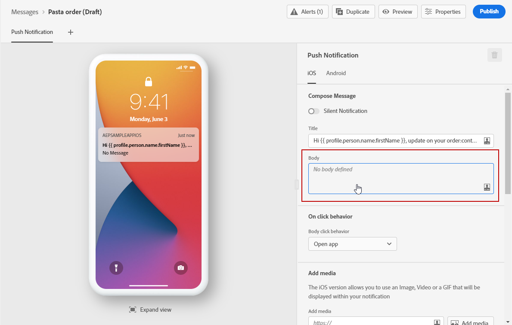

1. 메시지를 입력하고 **[!UICONTROL 컨텍스트 특성]** 메뉴에서 주문 항목 이름과 주문 진행률을 삽입합니다.

   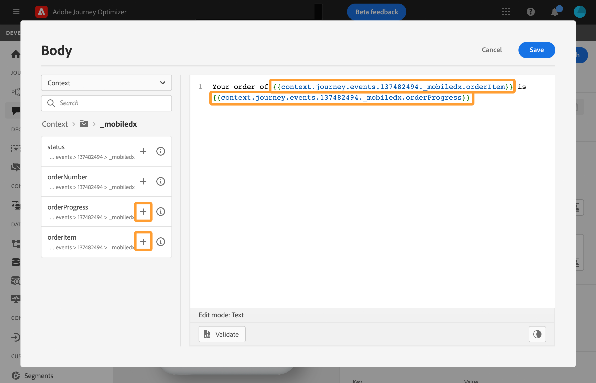

1. 왼쪽 메뉴에서 **오퍼 결정**&#x200B;을 선택하여 결정 변수를 삽입합니다. 배치를 선택하고 결정 옆에 있는 **+** 아이콘을 클릭하여 본문에 추가합니다.

   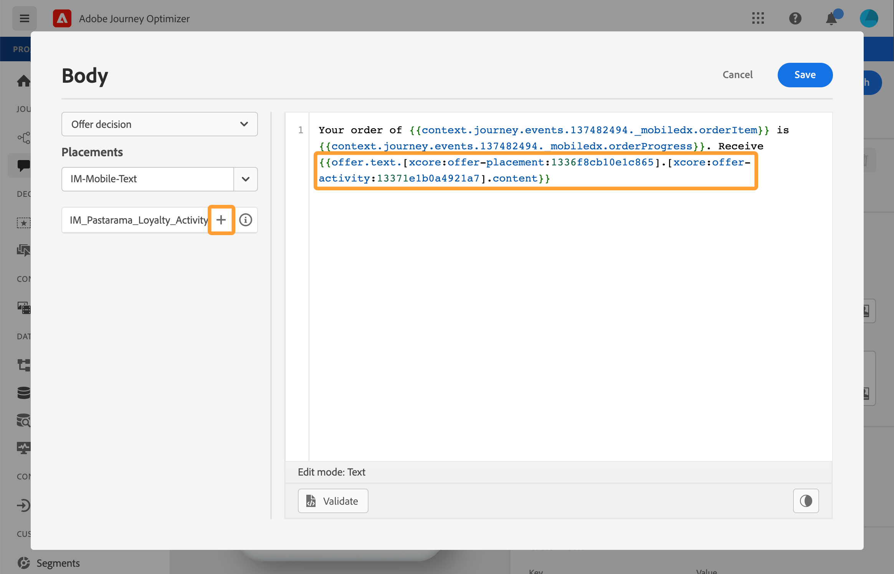

1. 오류가 없는지 확인하려면 [유효성 검사]를 클릭하고 **저장**&#x200B;을 클릭하세요.

   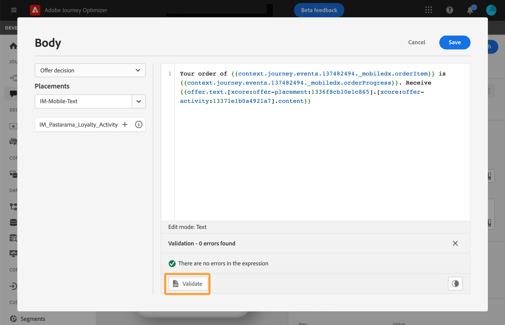

## 4단계 - 여정 테스트 및 게시 {#test-publish}

1. **테스트** 단추를 클릭한 다음 **이벤트 트리거**&#x200B;를 클릭합니다.

   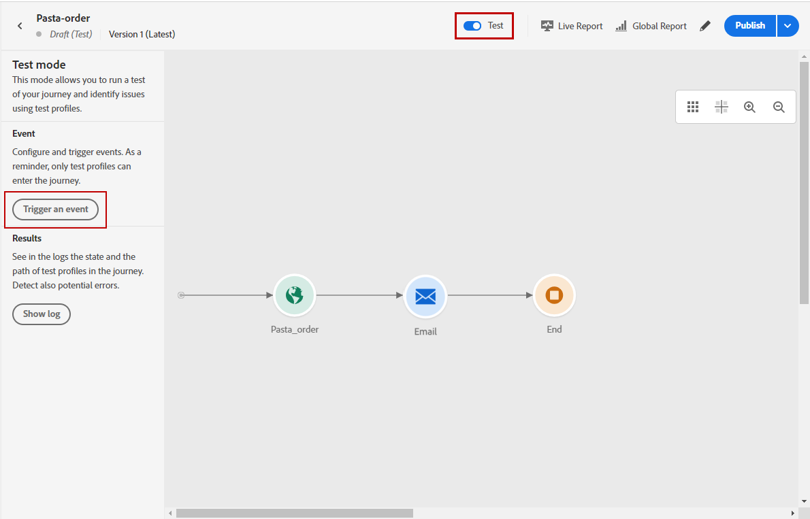

1. 테스트에 전달할 다른 값을 입력합니다. 테스트 모드는 테스트 프로필에서만 작동합니다. 프로필 식별자가 테스트 프로필에 해당해야 합니다. **보내기**&#x200B;를 클릭합니다.

   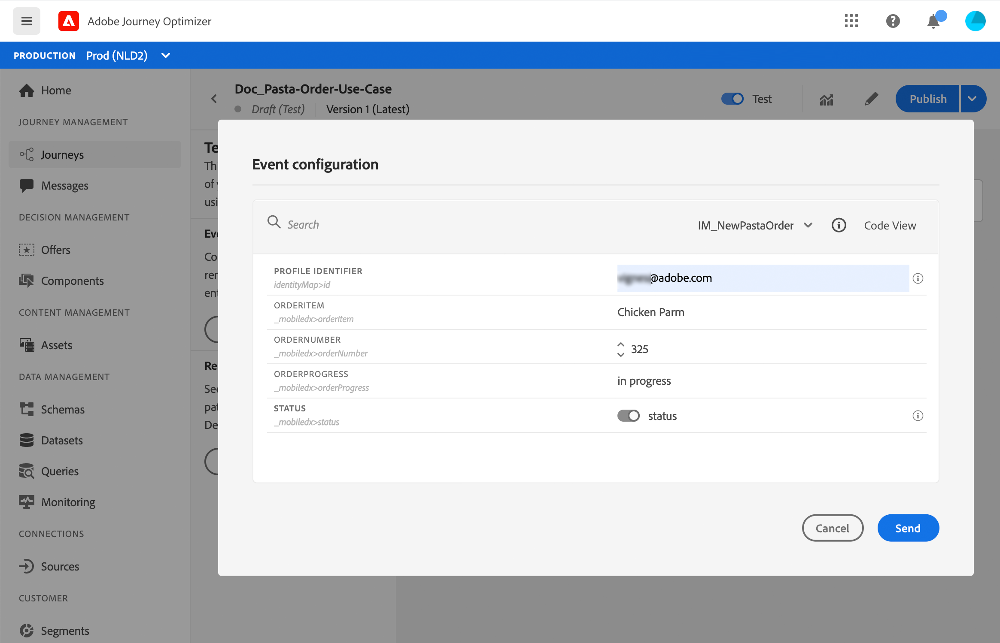

   푸시 알림이 전송되어 테스트 프로필의 휴대폰에 표시됩니다.

   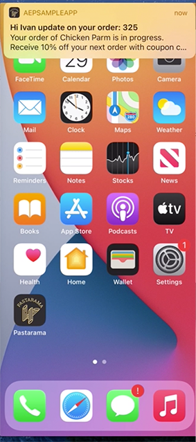

1. 오류가 없는지 확인하고 여정을 게시합니다.

## 사용 방법 비디오 {#video}

아래 비디오에서는 여정의 컨텍스트 데이터를 활용하여 이메일을 개인화하는 유사한 사용 사례를 보여줍니다.

>[!VIDEO](https://video.tv.adobe.com/v/3425027?quality=12)

## 빠른 참조 {#quick-reference}

이 단원에는 이 주제와 관련된 해석, 검색 및 질문 답변을 지원하기 위한 구조화된 지식이 포함되어 있습니다.

이해를 돕기 위해 이 정보를 이 페이지의 설명서와 통합해야 합니다. 두 소스 모두 독립적으로 사용하기 위한 것은 아닙니다. 이 페이지에서는 기능에 대해 설명하지만, 용어, 의도, 적용 가능성 및 제약 조건을 명확히 하는 데 도움이 되는 추가 컨텍스트를 제공합니다.

>[!BEGINTABS]

>[!TAB 개요]

**TL;DR**

이 페이지에서는 세 가지 유형의 개인화(프로필 필드, 오퍼 의사 결정 및 컨텍스트 여정 데이터)를 단일 메시지로 결합한 주문 상태 푸시 알림 사용 사례를 안내합니다.

**의도**

* 주문 이벤트와 푸시 작업 활동으로 여정 만들기
* 푸시 제목에 프로필 기반 개인화(고객 이름) 추가
* 여정 이벤트에서 컨텍스트 데이터 개인화(주문 번호, 품목 이름, 주문 진행률) 추가
* 푸시 본문에 오퍼 의사 결정 개인화 추가
* 테스트 모드에서 여정 테스트 및 게시

>[!TAB 용어집]

* **프로필 개인화**: `profile.*` 특성을 통해 액세스되는 이름과 같은 프로필 필드를 기반으로 하는 Personalization. *(제품별)*
* **오퍼 결정**: 의사 결정 관리 변수를 기반으로 하는 Personalization입니다. 개인화 편집기의 오퍼 결정 메뉴에서 삽입됩니다. *(제품별)*
* **상황별 개인화**: 여정의 데이터(예: 주문 번호, 항목 이름, 주문 진행률)와 여정 속성(예: 여정 ID, 오류)을 기반으로 하는 Personalization. 여정이 컨텍스트 데이터를 메시지에 전달한 경우에만 사용할 수 있습니다. *(제품별)*
* **여정 속성**: 컨텍스트 특성 > Journey Orchestration에서 액세스할 수 있는 특정 프로필의 여정 관련 기술 필드(예: 여정 ID 또는 오류 발생)입니다. *(제품별)*

>[!TAB 용어]

* **표준 이름:** 컨텍스트 개인화 — 변형: 컨텍스트 기반 개인화, 여정 컨텍스트 개인화
* **동의어:** &quot;Journey Orchestration&quot;(컨텍스트 특성 메뉴의 UI 레이블) = 컨텍스트 여정 데이터 원본
* **혼동하지 마십시오.** 프로필 개인화(정적 프로필 필드 값, 항상 사용 가능)≠ 컨텍스트 개인화(여정 이벤트 및 속성 데이터, 여정 컨텍스트가 메시지에 전달된 후에만 사용 가능) ≠ 오퍼 의사 결정 개인화(의사 결정 관리 변수)

>[!TAB 보호 기능 및 제한 사항]

* 컨텍스트 속성은 여정이 컨텍스트 데이터를 메시지에 전달한 경우에만 개인화 편집기에서 사용할 수 있습니다.
* 테스트 모드는 테스트 프로필에서만 작동합니다. 이벤트 구성에 입력한 프로필 식별자는 기존 테스트 프로필과 일치해야 합니다.

>[!TAB FAQ]

**Q: 이 사용 사례에는 어떤 세 가지 유형의 개인화가 결합됩니까?**

프로필 개인화(고객 이름: `profile.*`), 컨텍스트 데이터 개인화(주문 번호, 항목 이름, 여정 이벤트의 주문 진행률) 및 오퍼 의사 결정 개인화(본문에 삽입된 의사 결정 관리 오퍼).

**Q: 컨텍스트 특성은 개인화 편집기에서 어디에서 가져옵니까?**

컨텍스트 속성은 여정에서 채널 작업 활동 전에 배치된 이벤트와 여정 기술 속성에서 가져옵니다. 컨텍스트 특성 > Journey Orchestration > 이벤트(이벤트 필드) 또는 여정 속성(여정 메타데이터) 아래의 개인화 편집기에 표시됩니다.

**Q: 이 사용 사례에 대한 필수 구성 요소는 무엇입니까?**

주문 이벤트는 주문 번호, 상태 및 품목명 필드로 구성해야 하며, 의사 결정 관리에 의사 결정이 있어야 합니다.

**Q: 이 사용 사례에서는 푸시 알림을 어떻게 테스트합니까?**

여정에서 테스트 단추를 클릭한 다음, &quot;이벤트 트리거&quot;를 클릭하고 이벤트 구성 창에 이벤트 값을 입력합니다. 테스트 모드는 테스트 프로필에서만 작동합니다. 프로필 식별자는 기존 테스트 프로필과 일치해야 합니다.

>[!ENDTABS]

<!-- ai-section-version: 1 | source-hash: ae5284c7 -->
