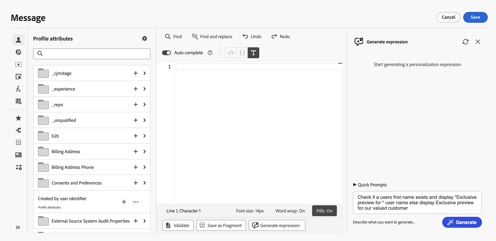

# 개인화 시작{#add-personalization}

>[!BEGINSHADEBOX]

**이 페이지에서:** 개인화 편집기 작동 방식, 사용할 수 있는 프로필 데이터, 학습 놀이터, 인라인 편집 등 Adobe Journey Optimizer에서 개인 맞춤화를 시작하십시오.

>[!ENDSHADEBOX]

>[!CONTEXTUALHELP]
>id="ajo_homepage_card5"
>title="개인화 경험"
>abstract="**Adobe Journey Optimizer**&#x200B;를 사용하면 수신자에 대한 데이터와 정보를 활용하여 각 수신자에 맞게 메시지를 적응할 수 있습니다. 이는 이름, 관심사, 거주지, 구입한 제품 등이 될 수 있습니다."

[!DNL Adobe Journey Optimizer] 개인화 기능을 사용하면 보유한 데이터 및 정보를 활용하여 메시지를 각 특정 받는 사람에게 적용할 수 있습니다. 이는 이름, 관심사, 거주지, 구입한 제품 등이 될 수 있습니다.

## 개인화 작동 방식

**개인화 편집기**&#x200B;를 사용하면 모든 데이터를 선택하고, 정렬하고, 사용자 지정하고, 유효성을 검사하여 콘텐츠에 맞는 사용자 지정 개인화를 만들 수 있으며, 도우미 함수나 미리 정의된 표현식 등 다양한 도구를 활용하여 메시지를 효과적으로 사용자 지정할 수 있습니다.

Journey Optimizer에서는 중괄호 **`{{}}`**&#x200B;로 묶은 내용을 포함하는 식을 만들 수 있는 Handlebars를 기반으로 하는 인라인 개인화 구문을 사용합니다.

메시지를 처리할 때 Journey Optimizer은 표현식을 Experience Platform 데이터 세트에 포함된 데이터로 대체합니다. 예를 들어 `Hello {{profile.person.name.firstName}} {{profile.person.name.lastName}}`은(는) 동적으로 `Hello John Doe`이(가) 됩니다. 이 구문을 사용하면 이메일 제목 줄, 메시지 본문, 푸시 알림 또는 URL을 포함하여 여러 필드에 메시지를 개인화할 수 있습니다.

## 개인화에 사용되는 데이터

Personalization은 Adobe Experience Platform에 정의된 **XDM 개인 프로필** 스키마에서 관리하는 프로필 데이터를 기반으로 합니다. **XDM 개인 프로필** 스키마는 [!DNL Journey Optimizer]에서 콘텐츠를 개인화하는 데 사용할 수 있는 유일한 스키마입니다. 자세한 내용은 [XDM(Adobe Experience Platform 데이터 모델) 설명서](https://experienceleague.adobe.com/docs/experience-platform/xdm/home.html?lang=ko-KR){target="_blank"}를 참조하세요.

**계산된 특성**&#x200B;을 활용하여 콘텐츠를 개인화할 수도 있습니다. 계산된 속성을 사용하면 개별 행동 이벤트를 Adobe Experience Platform에서 사용할 수 있는 계산된 프로필 속성으로 요약할 수 있습니다. [계산된 특성으로 작업하는 방법을 알아봅니다](../audience/computed-attributes.md)

또한 [!DNL Journey Optimizer]을(를) 사용하면 개인화 편집기에서 Adobe Experience Platform의 데이터를 활용하여 콘텐츠를 개인화할 수 있습니다. 이렇게 하려면 조회 개인화에 필요한 데이터 세트를 먼저 API 호출을 통해 활성화해야 합니다. 완료되면 해당 데이터를 사용하여 콘텐츠를 Journey Optimizer에 개인화할 수 있습니다. 이 기능은 현재 Beta 버전으로 제공됩니다. [자세히 알아보기](../personalization/aep-data-perso.md)

## 개인화 학습 및 실험 {#playground}

**[!DNL Adobe Journey Optimizer]**&#x200B;에는 개인화 기능을 학습하고 실험하는 데 도움이 되도록 설계된 대화형 도구가 포함되어 있습니다.

이 플레이스에서는 라이브 데이터 세트가 없어도 샘플 데이터를 사용하여 개인화 코드를 작성하고 테스트할 수 있는 시뮬레이션된 환경을 제공합니다. 사전 정의된 코드 샘플을 활용하고, 더미 프로필 페이로드를 편집하고, 개인화 코드의 출력을 실시간으로 미리 볼 수 있습니다.

➡️ [개인화 플레이그라운드에 액세스](https://experienceleague.adobe.com/en/apps/journey-optimizer/ajo-personalization){target="_blank"}

## 개인화 표현식에 대한 콘텐츠 생성 {#ai-personalization-expressions}

**[!UICONTROL Personalization 편집기]** 또는 전자 메일 Designer 도구 모음(**[!UICONTROL 식 추가]**)에서 **[!UICONTROL 콘텐츠 생성]**&#x200B;을 사용하면 자연어에서 새 식을 생성하고, 기존 코드가 수행하는 작업을 설명하고, 선택 항목의 문제를 해결한 다음 출력이 사용자의 의도와 일치할 때 출력을 적용할 수 있습니다.

➡️ [개인화 식에 대한 콘텐츠 생성으로 작업하는 방법을 알아봅니다.](../content-management/generative-personalization-expressions.md)

## 프로필 속성의 인라인 편집 {#inline-personalization}

전체 개인화 편집기를 열지 않고도 **이메일 Designer** 또는 **푸시 채널** 편집기에서 콘텐츠를 편집하는 동안 프로필 특성 식을 직접 삽입할 수 있습니다.

이렇게 하려면 다음 단계를 수행합니다.

1. 텍스트 필드에 `{{`을(를) 입력합니다. 커서 위치에서 인라인 자동 완성 드롭다운이 열립니다.
1. 사용 가능한 프로필 속성을 필터링하려면 입력을 시작하십시오.
1. 필요한 속성을 선택합니다. 이 속성은 커서 위치에 개인화 토큰으로 삽입됩니다.

## 더 자세히 알아보기

이제 **[!DNL Journey Optimizer]**&#x200B;의 개인화에 대해 이해했으므로 이 설명서 섹션을 자세히 살펴보고 기능 작업을 시작할 차례입니다.

<table style="table-layout:fixed"><tr style="border: 0;">
<td>

<a href="personalization-build-expressions.md"><strong>개인화 추가</strong></a>

</td>
<td>

<a href="../personalization/personalization-syntax.md"><strong>Personalization 구문</strong>

</td>
<td>

<a href="../personalization/functions/functions.md"><strong>도우미 함수 목록</strong></a>

</td>
<td>

<a href="../personalization/personalization-recipes.md"><strong>Personalization 레시피</strong></a>

</td>
<td>

<a href="../personalization/personalization-use-case.md"><strong>Personalization 사용 사례</strong></a>

</td>
</tr></table>

## 방법 비디오{#video-perso}

여정에서 얻은 컨텍스트 기반 이벤트 정보를 사용하여 메시지를 개인화하는 방법을 알아봅니다.

>[!VIDEO](https://video.tv.adobe.com/v/334165?quality=12)

메시지에 프로필 기반 개인 맞춤화를 추가하는 방법과 개인 맞춤화 블록의 전제 조건으로 대상자 멤버십을 사용하는 방법에 대해 알아봅니다.

>[!VIDEO](https://video.tv.adobe.com/v/334078?quality=12)

개인화 편집기 플레이그라운드를 활용하여 샘플 데이터를 사용하여 개인화 코드를 작성하고 테스트하는 방법을 알아봅니다.

>[!VIDEO](https://video.tv.adobe.com/v/3457868?quality=12)

[Personalization 자습서](https://experienceleague.adobe.com/ko/docs/journey-optimizer-learn/tutorials/personalize-content/personalization-editor-overview){target="_blank"}에서 개인화 기능 및 모범 사례에 대한 비디오 튜토리얼을 더 살펴보십시오

## 빠른 참조 {#quick-reference}

이 단원에는 이 주제와 관련된 해석, 검색 및 질문 답변을 지원하기 위한 구조화된 지식이 포함되어 있습니다.

이해를 돕기 위해 이 정보를 이 페이지의 설명서와 통합해야 합니다. 두 소스 모두 독립적으로 사용하기 위한 것은 아닙니다. 이 페이지에서는 기능에 대해 설명하지만, 용어, 의도, 적용 가능성 및 제약 조건을 명확히 하는 데 도움이 되는 추가 컨텍스트를 제공합니다.

>[!BEGINTABS]

>[!TAB 개요]

**TL;DR**

이 페이지에서는 Journey Optimizer의 개인화(Handlebars 기반 개인화 편집기 작동 방식, 사용 데이터, 대화형 플레이그라운드, 표현식에 대한 콘텐츠 생성, 이메일 Designer 및 푸시 편집기의 인라인 속성 편집)를 소개합니다.

**의도**

* Journey Optimizer 개인화의 작동 방식 이해(중괄호를 사용한 Handlebars 구문)
* 개인화에 사용할 수 있는 데이터 소스 식별(XDM 개별 프로필 스키마, 계산된 속성, 베타에서 AEP 데이터 세트 조회)
* 라이브 샌드박스 없이 대화형 플레이그라운드를 사용하여 개인화 실험
* AI를 사용하여 자연어에서 개인화 표현식을 생성, 설명 또는 수정합니다.
* `{{`을(를) 입력하여 이메일 Designer 또는 푸시 편집기에서 프로필 특성을 인라인으로 삽입합니다.

>[!TAB 용어집]

* **Personalization 편집기**: 개인화 표현식을 작성, 사용자 지정 및 확인하기 위한 모든 기능을 갖춘 도구로서, 개인화를 지원하는 모든 Journey Optimizer 필드에서 사용할 수 있습니다. *(제품별)*
* **XDM 개인 프로필 스키마**: Journey Optimizer에서 콘텐츠를 개인화하는 데 사용할 수 있는 유일한 스키마입니다. 개인화에 사용할 수 있는 모든 프로필 속성을 정의합니다. *(제품별)*
* **계산된 특성**: 개별 동작 이벤트를 프로필 수준 값으로 요약하는 미리 계산된 프로필 특성입니다. 표준 XDM 프로필 필드와 함께 개인화 데이터로 사용할 수 있습니다. *(제품별)*
* **Personalization 플레이그라운드**: 샘플 데이터로 개인화 코드를 작성 및 테스트하기 위한 Experience League의 대화형 시뮬레이션 환경입니다. 라이브 데이터 세트 또는 샌드박스가 필요하지 않습니다. *(제품별)*
* **인라인 편집**: 전자 메일 Designer 또는 푸시 채널 편집기의 텍스트 필드에 `{{`을(를) 입력하여 자동 완성 드롭다운을 트리거하고 전체 개인화 편집기를 열지 않고 프로필 특성을 삽입하는 기능. *(제품별)*
* **콘텐츠 생성(개인화 표현식)**: 개인화 편집기의 AI 도구 및 이메일 Designer으로 자연어에서 개인화 표현식을 생성하고 기존 코드를 설명하며 선택 항목의 문제를 수정합니다. *(제품별)*

>[!TAB 용어]

* **정식 이름:** 개인화 — 변형: 콘텐츠 개인화, 메시지 개인화, 표현식 개인화
* **표준 이름:** 개인화 편집기 — 변형: 개인화 기능
* **혼동하지 마십시오.** Personalization 편집기(메시지 및 오퍼에서 콘텐츠 식을 만드는 데 사용됨 - Handlebars와 PQL을 모두 지원)≠ 고급 표현식 편집기(데이터 소스 및 이벤트 정보에 대한 조건, 사용자 지정 대기 활동 및 작업 매개 변수 매핑에 대한 여정에 사용됨 - 개인화 편집기와 다른 기본 제공 함수 및 연산자를 제공합니다.)
* **혼동하지 마십시오.** 인라인 편집(전자 메일 Designer의 `{{` 형식 또는 전체 편집기를 열지 않고 빠른 특성 삽입을 위해 푸시) ≠ 개인화 편집기(복합 표현식, 도우미 함수, 조건부 규칙 및 조각에 대한 전체 도구)
* **혼동하지 마십시오.** XDM 개인 프로필 스키마(Journey Optimizer에서 개인화에 사용할 수 있는 유일한 스키마) ≠ 다른 AEP 스키마(데이터 세트 조회를 통해 노출되지 않는 한 개인화에 사용할 수 없음)

>[!TAB 보호 기능 및 제한 사항]

* XDM 개인 프로필 스키마는 Journey Optimizer에서 콘텐츠를 개인화하는 데 사용할 수 있는 유일한 스키마입니다.
* 개인화를 위한 AEP 데이터 세트 조회를 사용하려면 사용하기 전에 API 호출을 통해 데이터 세트를 활성화해야 합니다. 이 기능은 현재 Beta입니다.
* 인라인 편집(이메일 Designer 또는 푸시 편집기에 `{{`을(를) 입력)에서는 프로필 특성만 지원합니다.

>[!TAB FAQ]

**Q: Journey Optimizer에서 개인화에 사용할 수 있는 데이터는 무엇입니까?**

XDM 개인 프로필 스키마, 계산된 속성(프로필 수준에서 요약된 행동 이벤트) 및 AEP 레코드 데이터 세트 조회(현재 Beta — API를 통해 데이터 세트를 활성화해야 함)의 프로필 데이터.

**Q: 개인화 플레이그라운드란 무엇입니까?**

라이브 Journey Optimizer 샌드박스 또는 실제 데이터 세트 없이 샘플 데이터를 사용하여 개인화 코드를 작성하고 테스트할 수 있는 Experience League의 대화형 시뮬레이션 환경입니다.

**Q: 인라인 특성 편집은 어떻게 작동합니까?**

전자 메일 Designer 또는 푸시 채널 편집기의 텍스트 필드에 `{{`을(를) 입력하여 커서 위치에서 자동 완성 드롭다운을 엽니다. 프로필 속성을 필터링하려면 입력을 시작한 다음 하나를 선택하여 개인화 토큰으로 삽입합니다. 프로필 속성만 인라인으로 사용할 수 있습니다.

**Q: 개인화 편집기에서 콘텐츠를 생성할 수 있는 작업**

자연어 설명에서 새 개인화 표현식을 생성하고, 기존 코드의 기능을 설명하고, 선택한 표현식의 문제를 해결한 다음 의도와 일치하면 출력을 적용할 수 있습니다.

>[!ENDTABS]

<!-- ai-section-version: 1 | source-hash: 248b894f -->
