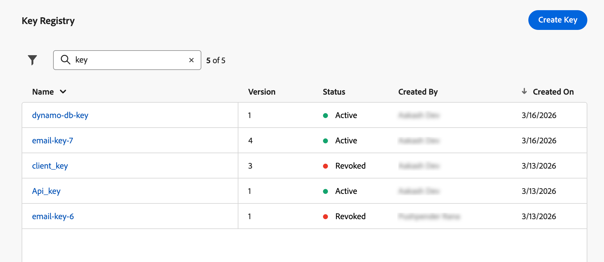
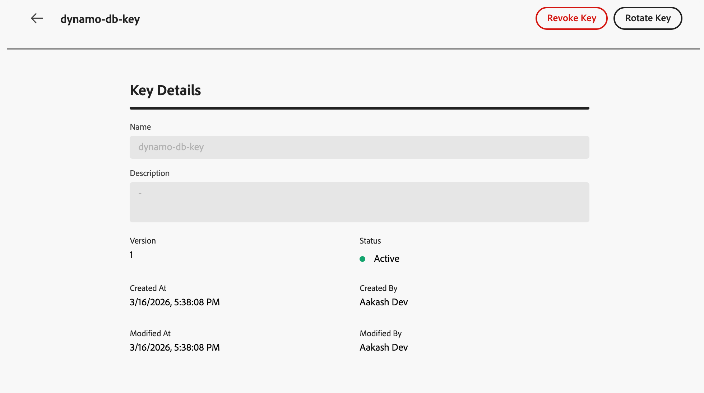

# URL 매개 변수 암호화 {#url-parameter-encryption}

>[!BEGINSHADEBOX]

**이 페이지에서:** 관리자가 Adobe Journey Optimizer의 샌드박스 키 레지스트리에서 키를 만들고, 회전하고, 취소하는 방법을 포함하여 개인 식별 정보가 일반 텍스트로 노출되지 않도록 중요한 URL 쿼리 매개 변수를 암호화하는 방법에 대해 알아봅니다.

>[!ENDSHADEBOX]

>[!AVAILABILITY]
>
>이 기능은 현재 이메일 채널에만 사용할 수 있습니다.

## URL 매개 변수 암호화를 사용하는 이유는 무엇입니까? {#why-url-parameter-encryption}

개인화된 추적 링크 및 랜딩 페이지 URL은 종종 쿼리 문자열에 프로필 속성, 식별자, 토큰 또는 기타 값을 포함합니다. 이러한 매개 변수는 일반적으로 이메일이나 SMS에 일반 텍스트로 표시되며, 누군가 링크를 복사, 공유 또는 책갈피를 지정하면 읽을 수 있습니다. 값에 PII(개인 식별 정보) 또는 보호해야 하는 기타 민감한 데이터가 포함될 수 있는 경우 이는 보안 및 개인정보 위험이 될 수 있습니다.

[!DNL Journey Optimizer]은(는) 개인화 편집기에서 암호화 도우미를 제공하므로 렌더링 시 모든 표현식 값(예: 프로필 속성, 토큰 또는 여러 필드에서 작성한 문자열)을 암호화할 수 있습니다. 암호화는 항상 조직의 레지스트리에서 키가 필요합니다.

관리자가 샌드박스 수준 레지스트리에서 관리하는 키를 사용하여 선택한 쿼리 매개 변수만 암호화하므로 링크를 공유하거나 검사할 때 기밀 값이 일반 텍스트로 노출되지 않습니다.

### 작동 방식 {#how-it-works}

* **관리자**&#x200B;는 키 레지스트리를 사용하여 조직의 보안 정책에 따라 [키를 만들고](#create-keys) [키를 관리합니다](#manage-keys).
* **마케터** 개인화 편집기에서 `Encrypt` 도우미를 삽입하고 레지스트리에서 보호할 값과 활성 키 식별자를 전달합니다. 구문 및 옵션에 대해서는 [이 섹션](functions/helpers.md#url-parameter-encryption-helper)을 참조하십시오.

>[!IMPORTANT]
>
>암호 해독은 조직의 책임입니다. [!DNL Journey Optimizer]은(는) 메시지가 렌더링될 때 값을 암호화합니다. 웹 사이트, 앱 또는 API는 사용자가 정의한 것과 동일한 암호화 자료 및 프로세스를 사용하여 보안 모델과 일관되게 매개 변수를 해독해야 합니다.

### 예

랜딩 페이지 URL은 값이 문자열 토큰인 쿼리 매개 변수(예: 오퍼 또는 프로필 식별자가 있는 JSON 페이로드)를 사용할 수 있습니다. `token` 암호화를 사용하지 않으면 해당 문자열 토큰이 링크에 일반 텍스트로 표시됩니다. 해당 값을 암호화 도우미로 줄바꿈하면 나머지 링크는 변경되지 않은 상태로 중요한 페이로드가 URL의 암호문으로 대체됩니다.

## 키 만들기 {#create-keys}

URL 매개 변수 암호화 도우미를 사용하려면 먼저 키를 만들어야 합니다. 그 방법은 다음과 같습니다.

>[!IMPORTANT]
>
>키에 액세스하고 관리하려면 **키 레지스트리 보기** 및 **키 레지스트리 관리** 권한이 부여되어야 합니다. [자세히 알아보기](../administration/high-low-permissions.md#administration-permissions)

1. **[!UICONTROL 관리]** > **[!UICONTROL 구성]**(으)로 이동합니다.

1. **[!UICONTROL 관리]** 단추를 클릭하여 **[!UICONTROL 키 레지스트리]**&#x200B;를 엽니다.

   {width="80%"}

1. 전용 버튼을 사용하여 조직에 필요한 키를 만듭니다.

   {width="80%"}

1. 팀이 개인화 편집기에서 참조할 수 있는 명확한 레이블 또는 식별자를 지정합니다.

   {width="80%"}

1. 변경 내용을 확인하려면 **[!UICONTROL 제출]**&#x200B;을 클릭하세요.

키가 생성되면 마케터는 개인화 편집기의 [URL 매개 변수 암호화](functions/helpers.md#url-parameter-encryption-helper) 도우미를 사용하여 URL 쿼리 매개 변수에 배치되는 특정 값을 암호화할 수 있습니다.

## 키 관리 {#manage-keys}

키를 관리하려면 아래 단계를 따르십시오.

1. **[!UICONTROL 키 레지스트리]**&#x200B;에 액세스합니다. 목록 보기에서 현재 샌드박스에 대해 만들어진 모든 키를 볼 수 있습니다.

   {width="100%"}

1. 키 세부 정보를 열려면 **[!UICONTROL 활성]** 상태의 키를 클릭하십시오.

   {width="80%"}

1. 새 암호화에 대해 키를 영구적으로 사용하지 않도록 설정하려면 **[!UICONTROL 취소]** 단추를 클릭하십시오.

   키가 취소되면 렌더링 시 도우미에서 해당 키를 사용하려고 시도해도 실패합니다. 취소된 항목은 감사를 위해 계속 표시됩니다. 팀은 자체 시스템에서 이전 페이로드를 해독하기 위해 해당 자료가 필요할 수 있습니다.

1. 여정 및 캠페인이 이미 참조하는 안정적인 키 식별자를 유지하면서 새 키 자료를 제공하려면 **[!UICONTROL 회전]** 단추를 클릭하십시오.

   이전 자료는 취소된 상태와 적절한 이유(예: 회전 타임스탬프)로 레지스트리에 유지되며, 새 행이나 버전은 활성 키를 반영합니다.

   >[!NOTE]
   >
   >개인화 편집기에서 새 값을 암호화하려면 활성 키만 선택해야 합니다. 새 콘텐츠에 대해 해지된 키를 사용하지 마십시오.

## 빠른 참조 {#quick-reference}

이 단원에는 이 주제와 관련된 해석, 검색 및 질문 답변을 지원하기 위한 구조화된 지식이 포함되어 있습니다.

이해를 돕기 위해 이 정보를 이 페이지의 설명서와 통합해야 합니다. 두 소스 모두 독립적으로 사용하기 위한 것은 아닙니다. 이 페이지에서는 기능에 대해 설명하지만, 용어, 의도, 적용 가능성 및 제약 조건을 명확히 하는 데 도움이 되는 추가 컨텍스트를 제공합니다.

>[!BEGINTABS]

>[!TAB 개요]

**TL;DR**

이 페이지에서는 관리자가 Journey Optimizer의 샌드박스 수준 키 레지스트리에서 암호화 키를 만들고, 회전하고, 취소하는 방법을 설명합니다. 이를 통해 마케터는 민감한 URL 쿼리 매개 변수를 암호화하여 PII가 추적 링크 및 랜딩 페이지의 일반 텍스트에 노출되지 않도록 합니다.

**의도**

* URL 매개 변수 암호화가 필요한 이유 이해(일반 텍스트 쿼리 문자열에 표시되는 중요한 데이터 및 PII)
* 샌드박스 키 레지스트리에서 암호화 키 만들기(특정 권한이 필요한 관리 작업)
* 새 암호화에 대해 키를 영구적으로 비활성화하려면 키 취소
* 동일한 식별자를 유지하면서 새 암호화 자료를 제공하는 키 회전
* 특정 쿼리 매개 변수 값을 보호하려면 개인화 편집기에서 `Encrypt` 도우미를 사용하십시오.

>[!TAB 용어집]

* **키 레지스트리**: 관리자가 URL 매개 변수 암호화 도우미가 사용하는 암호화 키를 만들고 관리하는 Journey Optimizer(관리 > 구성)의 샌드박스 수준 저장소입니다. *(제품별)*
* **암호화 도우미(`Encrypt`)**: 렌더링 시 표현식 값을 암호화하여 PII를 URL 쿼리 매개 변수의 암호문으로 바꾸는 개인화 편집기의 도우미 함수입니다. *(제품별)*
* **취소(키)**: 새 암호화에 대한 키를 영구적으로 사용하지 않도록 설정하는 작업입니다. 키 항목은 감사를 위해 레지스트리에 계속 표시되며, 이전 페이로드는 조직의 시스템에서 암호 해독을 위해 키를 필요로 할 수 있습니다.
* **회전(키)**: 키의 식별자를 안정적으로 유지하면서 키에 새 암호화 자료를 제공하는 작업이므로 해당 키를 이미 참조하는 캠페인과 여정을 업데이트할 필요가 없습니다.
* **PII(개인 식별 정보)**: 프로필 속성, 토큰 또는 오퍼 식별자와 같은 개인을 식별할 수 있는 데이터로, URL 쿼리 매개 변수에 포함될 때 보호되어야 합니다.

>[!TAB 용어]

* **정식 이름:** URL 매개 변수 암호화 — 변형: URL 암호화, 쿼리 매개 변수 암호화, URL 매개 변수 난독화
* **동의어:** &quot;key registry&quot; = &quot;Key registry&quot;(관리 > 구성의 UI 레이블)
* **혼동하지 마십시오.** 취소(새 암호화에 대한 키를 영구적으로 사용하지 않도록 설정함, 감사 시 항목 유지) ≠ 회전(암호화 자료를 대체하지만 새 암호화에 대해 동일한 키 식별자를 활성 상태로 유지)

>[!TAB 보호 기능 및 제한 사항]

* URL 매개 변수 암호화는 현재 이메일 채널에만 사용할 수 있습니다.
* 키에 액세스하고 관리하기 위해 **키 레지스트리 보기** 및 **키 레지스트리 관리** 권한이 필요합니다.
* 암호 해독은 조직의 책임입니다. Journey Optimizer은 렌더링 시 값을 암호화합니다. 웹 사이트, 앱 또는 API는 조직에서 정의한 것과 동일한 암호화 물질 및 프로세스를 사용하여 매개 변수를 해독해야 합니다.
* 개인화 편집기에서 새 값을 암호화하는 데는 활성 키만 사용해야 합니다. 취소된 키는 새 콘텐츠에 사용하면 안 됩니다.
* 취소된 키는 감사 목적으로 레지스트리에 계속 표시됩니다. 이전 페이로드를 해독하기 위해 조직의 시스템에서 계속 필요할 수 있습니다.

>[!TAB FAQ]

**Q: 암호 해독을 담당하는 사람이 누구입니까?**

암호 해독은 조직의 책임입니다. Journey Optimizer은 메시지가 렌더링될 때 값을 암호화합니다. 웹 사이트, 앱 또는 API는 조직이 정의한 암호화 자료와 프로세스를 사용하여 쿼리 매개 변수를 해독해야 합니다.

**Q: 취소와 회전 간의 차이점은 무엇입니까?**

해지 는 감사를 위해 레지스트리에 항목을 표시하는 동안 새 암호화에 대한 키를 영구적으로 비활성화합니다(이전 페이로드는 조직의 시스템에서 암호 해독을 위한 키가 계속 필요할 수 있음). Rotate는 동일한 키 식별자를 유지하면서 키에 대한 새로운 암호화 자료를 제공하므로 이를 참조하는 캠페인과 여정이 업데이트 없이 계속 작동합니다.

**Q: 키를 관리하는 데 필요한 권한은 무엇입니까?**

**키 레지스트리 보기** 및 **키 레지스트리 관리** 사용 권한.

**Q: URL 매개 변수 암호화를 지원하는 채널은 무엇입니까?**

현재는 이메일 채널만 해당됩니다.

**Q: 새 암호화에 해지된 키를 사용할 수 있습니까?**

아니요. 키가 해지되면 암호화 도우미에서 키를 사용하려고 시도해도 렌더링 시 실패합니다. 새 콘텐츠에 대해 해지된 키를 사용하지 마십시오.

>[!ENDTABS]

<!-- ai-section-version: 1 | source-hash: c594ce24 -->
