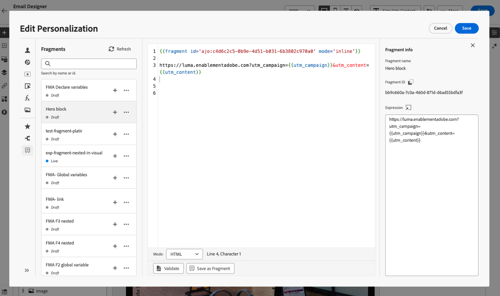

# 표현식 조각 활용 {#use-expression-fragments}

**개인화 편집기**&#x200B;를 사용하는 경우 현재 샌드박스에 만들거나 저장한 모든 표현식 조각을 활용할 수 있습니다.

조각은 [!DNL Journey Optimizer] 캠페인 및 여정에서 참조할 수 있는 재사용 가능한 구성 요소입니다. 이 기능을 사용하면 마케팅 사용자가 개선된 디자인 프로세스에서 콘텐츠를 빠르게 조합하는 데 사용할 수 있는 여러 사용자 지정 콘텐츠 블록을 미리 빌드할 수 있습니다. [조각에 대해 자세히 알아보기](../content-management/fragments.md)

➡️ [이 비디오에서 조각을 관리, 작성 및 사용하는 방법을 알아봅니다.](../content-management/fragments.md#video-fragments)

## 표현식 조각 사용 {#use-expression-fragment}

콘텐츠에 표현식 조각을 추가하려면 아래 단계를 수행합니다.

>[!NOTE]
>
>주어진 게재에서 최대 30개의 조각을 추가할 수 있습니다. 조각은 최대 1개 수준까지만 중첩할 수 있습니다.

1. [개인화 편집기](personalization-build-expressions.md)를 열고 왼쪽 창에서 **[!UICONTROL 조각]** 단추를 선택합니다.

   목록에는 현재 샌드박스에서 조각으로 생성되거나 저장된 모든 표현식 조각이 표시됩니다. [조각을 만드는 방법을 알아봅니다](../content-management/create-fragments.md)
만든 날짜별로 정렬됩니다. 최근에 추가된 표현식 조각이 목록에 먼저 표시됩니다.

   

   이 목록을 새로 고칠 수도 있습니다.

   >[!NOTE]
   >
   >콘텐츠를 편집하는 동안 일부 조각이 수정되거나 추가된 경우 목록이 최신 변경 내용으로 업데이트됩니다.

1. 표현식 조각 옆에 있는 + 아이콘을 클릭하여 해당 조각 ID를 편집기에 삽입합니다.

   

   >[!CAUTION]
   >
   >콘텐츠에 **초안** 또는 **라이브** 조각을 추가할 수 있습니다. 그러나 **초안** 상태의 조각을 사용 중인 경우에는 여정 또는 캠페인을 활성화할 수 없습니다. 여정 또는 캠페인 게시 시 초안 조각에 오류가 표시되며 이를 승인해야 게시할 수 있습니다.

1. 조각 ID가 추가되면 해당 식 조각을 열고 인터페이스에서 [편집](../content-management/manage-fragments.md#edit-fragments)하면 변경 내용이 동기화됩니다. 해당 조각 ID를 포함하는 모든 초안 또는 라이브 여정/캠페인에 자동으로 전파됩니다.

1. 조각 옆에 있는 **[!UICONTROL 추가 작업]** 단추를 클릭합니다. 화면에 표시되는 메뉴에서 **[!UICONTROL 조각 보기]**&#x200B;를 선택하여 해당 조각에 대한 자세한 정보를 확인합니다. **[!UICONTROL 조각 ID]**&#x200B;도 표시되며 여기에서 복사할 수 있습니다.

   

1. 상황별 메뉴에서 **[!UICONTROL 조각 열기]** 옵션을 사용하거나 **[!UICONTROL 조각 정보]** 창에서 해당 콘텐츠 및 속성을 편집할 수 있습니다. [조각을 편집하는 방법을 알아보세요](../content-management/manage-fragments.md#edit-fragments)

   

1. 그런 다음 [개인화 편집기](personalization-build-expressions.md)의 모든 개인화 및 작성 기능을 사용하여 평소와 같이 콘텐츠를 사용자 지정하고 유효성을 검사할 수 있습니다.

1. 일부 경우에는 변수만 계산하면 되므로 표현식 조각의 콘텐츠를 숨길 수 있습니다. 이렇게 하려면 `render` 특성을 사용하고 `false`(으)로 설정합니다. 예:

   ```
   Hi {{profile.person.name.firstName|fragment id='ajo:fragmentId/variantId' mode ='inline' render=false}}
   ```

>[!NOTE]
>
>여러 줄 바꿈이 포함된 식 조각을 만들어 [SMS](../sms/create-sms.md#sms-content) 또는 [푸시](../push/design-push.md) 콘텐츠에서 사용하면 줄 바꿈이 유지됩니다. 따라서 메시지를 보내기 전에 [SMS](../sms/send-sms.md) 또는 [푸시](../push/send-push.md) 메시지를 테스트하십시오.

## 암시적 변수 사용 {#implicit-variables}

암시적 변수는 기존 조각 기능을 향상시켜 콘텐츠 재사용 가능성 및 스크립팅 사용 사례의 효율성을 개선합니다. 조각은 입력 변수를 사용하고 캠페인 및 여정 콘텐츠에 사용할 수 있는 출력 변수를 만들 수 있습니다.

예를 들어 이 기능은 현재 캠페인 또는 여정을 기반으로 이메일의 추적 매개 변수를 초기화하고 이러한 매개 변수를 이메일 콘텐츠에 추가된 개인화된 링크에 사용하는 데 사용할 수 있습니다.

다음과 같은 사용 사례가 가능합니다.

1. **조각에 입력 변수를 사용합니다.**

   조각이 캠페인/여정 작업 컨텐츠에서 사용되는 경우 조각 외부에 선언된 변수를 활용할 수 있습니다. 아래는 한 예입니다.

   

   캠페인 콘텐츠에서 선언된 `utm_content` 변수 위에 있는 것을 볼 수 있습니다. **Hero 블록** 조각을 사용하면 `utm_content` 매개 변수 값을 추가할 링크가 표시됩니다. 최종 결과는 `https://luma.enablementadobe.com?utm_campaign= Product_launch&utm_content= start_shopping`입니다.

1. **조각의 출력 변수를 사용합니다.**

   조각 내에서 계산되거나 정의된 변수는 콘텐츠에서 사용할 수 있습니다. 다음 예에서 조각 **F1**&#x200B;은(는) 변수 집합을 선언합니다.

   

   이메일 콘텐츠에서 다음과 같은 개인화를 가질 수 있습니다.

   

   조각 F1은 `utm_campaign` 및 `utm_content` 변수를 초기화합니다. 그러면 메시지 콘텐츠의 링크에 이러한 매개 변수가 추가됩니다. 최종 결과는 `https://luma.enablementadobe.com?utm_campaign= Product_launch&utm_content= start_shopping`입니다.

>[!NOTE]
>
>런타임 시 시스템은 조각 내의 항목을 확장한 다음 개인화 코드를 위쪽에서 아래쪽으로 해석합니다. 이를 염두에 두면 보다 복잡한 사용 사례를 달성할 수 있습니다. 예를 들어 아래에 있는 다른 조각 F2에 변수를 전달하는 조각 F1이 있을 수 있습니다. 시각적 조각 F1이 중첩된 표현식 조각 F2에 변수를 전달할 수도 있습니다.

## 루프 내에서 표현식 조각 사용 {#fragments-in-loops}

`{{#each}}` 루프 내에서 식 조각을 사용할 때는 변수 범위 지정 작동 방식을 이해하는 것이 중요합니다. 표현식 조각은 메시지 콘텐츠에 정의된 전역 변수에 액세스할 수 있지만 루프별 변수를 매개 변수로 수신할 수는 없습니다.

### 지원되는 패턴: 전역 변수 사용 {#global-variables-in-loops}

표현식 조각은 루프 내에서 조각이 호출되는 경우에도 조각 외부에 정의된 전역 변수를 참조할 수 있습니다. 반복적인 컨텍스트에서 조각을 사용해야 할 때 권장되는 방법입니다.

**예: 루프 내에서 전역 변수가 있는 조각 사용**

메시지 콘텐츠에서 전역 변수를 정의하고 이를 참조하는 조각을 사용합니다.

```handlebars


{{#each context.journey.actions.GetProducts.items as |product|}}
  <div class="product">
    <h3>{{product.name}}</h3>
    <p>Price: ${{product.price}}</p>
    {{fragment id='ajo:fragment123/variant456' mode='inline'}}
  </div>
{{/each}}
```

표현식 조각(fragment123)에서 `globalDiscount` 변수를 참조할 수 있습니다.

```handlebars
<p class="discount-info">Save {{globalDiscount}}% on all items!</p>
```

이 패턴이 작동하는 이유는 루프 컨텍스트에 관계없이 조각 내를 포함하여 메시지 전체에서 전역 변수에 액세스할 수 있기 때문입니다.

### 지원되지 않음: 루프 변수를 조각 매개 변수로 전달 {#loop-variables-limitations}

현재 반복 항목(예: 위의 예에서 `product`)을 매개 변수로 식 조각에 전달할 수 없습니다. 조각은 주변 `{{#each}}` 블록에서 루프 범위 변수에 직접 액세스할 수 없습니다.

**예: 작동하지 않는 항목**

```handlebars
{{#each context.journey.actions.GetProducts.items as |product|}}
  <!-- This will NOT work as expected -->
  {{fragment id='ajo:fragment123/variant456' mode='inline' currentProduct=product}}
{{/each}}
```

현재 구현에서는 루프별 변수에 대한 매개 변수 전달이 지원되지 않으므로 조각이 `product`을(를) 매개 변수로 받아서 내부적으로 사용할 수 없습니다.

### 권장 해결 방법 {#fragments-in-loops-workarounds}

루프의 데이터와 함께 표현식 조각을 사용해야 하는 경우 다음 접근 방식을 고려하십시오.

1. **메시지에 직접 논리 포함**: 루프별 논리에 조각을 사용하는 대신 `{{#each}}` 블록 내에 바로 개인화 코드를 추가하십시오.

   ```handlebars
   {{#each context.journey.actions.GetProducts.items as |product|}}
     <div class="product">
       <h3>{{product.name}}</h3>
       <p>Price: ${{product.price}}</p>
       {{#if product.price > 100}}
         <span class="premium-badge">Premium Product</span>
       {{/if}}
     </div>
   {{/each}}
   ```

2. **루프 외부의 조각 사용**: 조각 콘텐츠가 루프에 종속되지 않으면 반복 블록 앞 또는 뒤에서 조각을 호출하십시오.

   ```handlebars
   {{fragment id='ajo:fragment123/variant456' mode='inline'}}
   
   {{#each context.journey.actions.GetProducts.items as |product|}}
     <div class="product">
       <h3>{{product.name}}</h3>
       <p>Price: ${{product.price}}</p>
     </div>
   {{/each}}
   ```

3. **여러 개의 전역 변수를 설정합니다**: 반복을 통해 조각에 다른 값을 전달해야 하는 경우 각 조각 호출 전에 전역 변수를 설정하십시오(유연성이 제한됨).

>[!NOTE]
>
>상황별 데이터를 반복하고 루프를 사용하여 작업하려면 모범 사례, 문제 해결 팁 및 고급 패턴을 포함하는 [상황별 데이터 반복](iterate-contextual-data.md)에 대한 포괄적인 안내서를 참조하십시오.

## 편집 가능한 필드 사용자 지정 {#customize-fields}

변수를 사용하여 표현식 조각의 특정 부분을 편집할 수 있게 만든 경우 특정 구문을 사용하여 해당 기본값을 무시할 수 있습니다. [조각을 사용자 지정할 수 있게 만드는 방법을 알아보세요](../content-management/customizable-fragments.md)

필드를 사용자 정의하려면 다음 단계를 수행합니다.

1. **[!UICONTROL 조각]** 메뉴에서 코드에 조각을 삽입합니다.

1. 변수의 기본값을 재정의하려면 구문 끝에 있는 `<fieldId>="<value>"` 코드를 사용하십시오.

   아래 예에서는 ID가 &quot;sports&quot;인 변수의 값을 &quot;yoga&quot; 값으로 재정의합니다. 스포츠 변수가 참조되는 모든 곳에서 조각 콘텐츠에 &quot;요가&quot;가 표시됩니다.

   

전자 메일을 만들 때 편집 가능한 필드를 표현식 조각에 추가하고 해당 값을 재정의하는 방법을 보여 주는 예는 [이 섹션](../content-management/customizable-fragments.md#example)에서 확인할 수 있습니다.

## 상속 중단 {#break-inheritance}

개인화 편집기에 조각 ID를 추가하면 원본 표현식 조각에 대한 변경 사항이 동기화됩니다.

그러나 표현식 조각의 콘텐츠를 편집기에 붙여넣을 수도 있습니다. 상황별 메뉴에서 **[!UICONTROL 조각 붙여넣기]**&#x200B;를 선택하여 해당 콘텐츠를 삽입합니다.


이 경우 원본 조각의 상속이 끊어집니다. 조각의 콘텐츠가 편집기에 복사되며, 변경 사항은 더 이상 동기화되지 않습니다.

이 요소는 더 이상 원본 조각에 연결되지 않는 독립 실행형 요소가 됩니다. 코드의 다른 요소로 편집할 수 있습니다.

