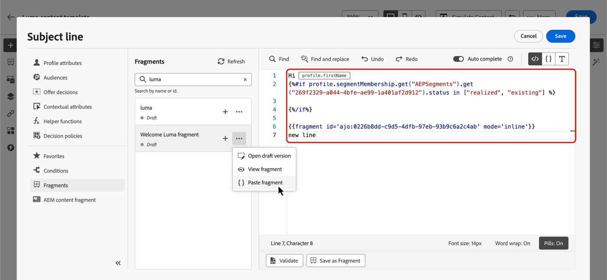

# 표현식 조각 활용 {#use-expression-fragments}

표현식 편집기를 사용할 때 현재 샌드박스에 생성되거나 저장된 모든 표현식 조각을 활용할 수 있습니다.

에서 조각을 만들고 관리하는 방법 알아보기 [이 섹션](../content-management/fragments.md).

➡️ [이 비디오에서 조각을 관리, 작성 및 사용하는 방법을 알아봅니다.](../content-management/fragments.md#video-fragments)

## 표현식 조각 사용 {#use-expression-fragment}

콘텐츠에 표현식 조각을 추가하려면 아래 단계를 수행합니다.

1. 를 엽니다. [표현식 편집기](personalization-build-expressions.md) 및 선택 **[!UICONTROL 조각]** 왼쪽 창의 단추.

   

   목록에는 현재 샌드박스에서 조각으로 생성되거나 저장된 모든 표현식 조각이 표시됩니다. [자세히 알아보기](../content-management/fragments.md#create-expression-fragment)

   >[!NOTE]
   >
   >조각은 생성 날짜별로 정렬됩니다. 최근에 추가된 표현식 조각이 목록에 먼저 표시됩니다.

1. 목록을 새로 고칠 수도 있습니다.

   >[!NOTE]
   >
   >콘텐츠를 편집하는 동안 일부 조각이 수정되거나 추가된 경우 목록이 최신 변경 내용으로 업데이트됩니다.

1. 표현식 조각 옆에 있는 + 아이콘을 클릭하여 해당 조각 ID를 편집기에 삽입합니다.

   

   조각 ID가 추가되면 해당 표현식 조각을 열고 [편집](../content-management/fragments.md#edit-fragments) 인터페이스에서 변경 사항이 동기화됩니다. 모든 사용자에게 자동으로 전파됩니다 **[!UICONTROL 초안]** 해당 조각 ID가 포함된 여정/캠페인

   >[!NOTE]
   >
   >변경 사항은에 사용된 콘텐츠에는 전파되지 않습니다. **[!UICONTROL 라이브]** 여정 또는 캠페인.

1. 다음을 클릭합니다. **[!UICONTROL 추가 작업]** 조각 옆에 있는 단추입니다.

1. 열려 있는 상황별 메뉴에서 다음을 선택합니다. **[!UICONTROL 조각 보기]** 를 클릭하여 해당 조각에 대한 자세한 정보를 얻습니다. 다음 **[!UICONTROL 조각 ID]** 또한 이 표시되며, 여기에서 복사할 수 있습니다.

   

1. 다른 창에서 표현식 조각을 열어 콘텐츠 및 속성을 편집할 수 있습니다. **[!UICONTROL 조각 열기]** 상황별 메뉴 또는 **[!UICONTROL 조각 정보]** 창. [조각 편집 방법 알아보기](../content-management/fragments.md#edit-fragments)

   

1. 그런 다음 의 모든 개인화 및 작성 기능을 사용하여 평소와 같이 콘텐츠를 맞춤화하고 유효성을 검사할 수 있습니다. [표현식 편집기](personalization-build-expressions.md).

>[!NOTE]
>
>여러 줄 바꿈이 포함된 표현식 조각을 만들어 [SMS](../sms/create-sms.md#sms-content) 또는 [푸시](../push/design-push.md) 내용, 줄 바꿈이 유지됩니다. 따라서 다음을 테스트하십시오. [SMS](../sms/send-sms.md) 또는 [푸시](../push/send-push.md) 메시지를 보내기 전에 메시지를 보냈습니다.

## 상속 중단 {#break-inheritance}

표현식 편집기에 조각 ID를 추가하면 원래 표현식 조각에 대한 변경 사항이 동기화됩니다.

그러나 표현식 조각의 콘텐츠를 편집기에 붙여넣을 수도 있습니다. 상황별 메뉴에서 **[!UICONTROL 조각 붙여넣기]** 을 클릭하여 해당 컨텐츠를 삽입합니다.

이 경우 원본 조각의 상속이 끊어집니다. 조각의 콘텐츠가 편집기에 복사되며, 변경 사항은 더 이상 동기화되지 않습니다.

이 요소는 더 이상 원본 조각에 연결되지 않는 독립 실행형 요소가 됩니다. 코드의 다른 요소로 편집할 수 있습니다.

