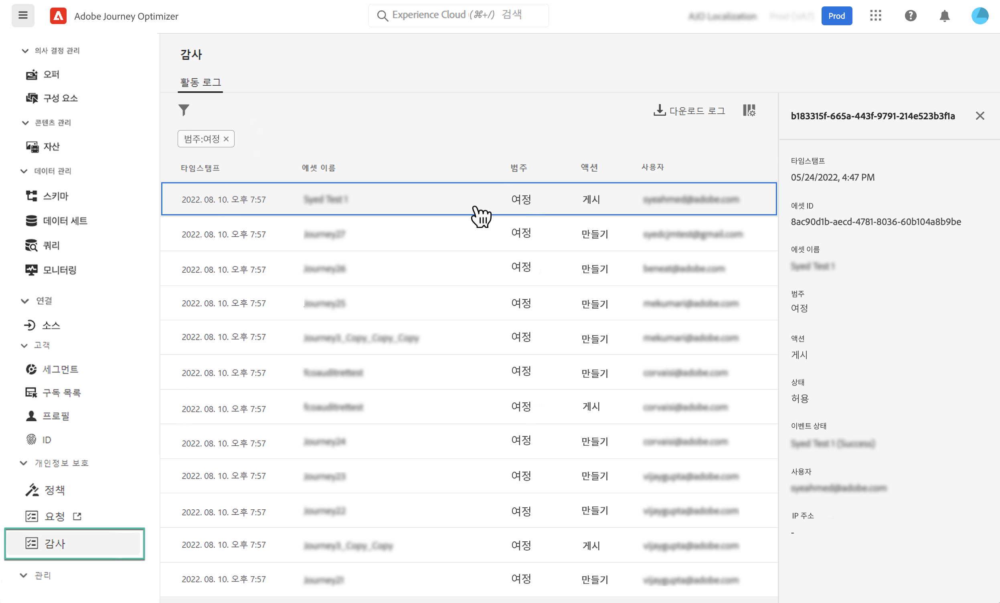

# Journey Optimizer 리소스에 대한 작업 감사 {#track-changes}

## 감사 로그 정보 {#audit-logs}

Journey Optimizer를 사용하면 시스템에서 여정, 메시지, 랜딩 페이지 등과 같은 다양한 서비스 및 기능에서 사용자가 수행한 작업을 식별할 수 있습니다.

이를 통해 시스템에서 수행되는 작업의 가시성을 높이고, 문제를 해결하며, 규정 및 기업 데이터 관리 정책을 준수할 수 있습니다.

각 작업은 Adobe Experience Platform에서 액세스할 수 있는 &quot;감사 로그&quot;에 메타데이터로 기록됩니다. UI 또는 API에서 감사 로그를 보고 관리하는 방법 등 감사 로그에 대한 자세한 내용은 [Adobe Experience Platform 설명서](https://experienceleague.adobe.com/docs/experience-platform/landing/governance-privacy-security/audit-logs/overview.html?lang=ko)를 참조하십시오.

## 감사 로그로 캡처된 이벤트 유형 {#events}

다음 표에서는 감사 로그에서 Journey Optimizer 리소스를 기록하는 작업을 설명합니다.

>[!NOTE]
>
>감사 로그에 캡처된 전체 작업 목록은 [Adobe Experience Platform 설명서](https://experienceleague.adobe.com/docs/experience-platform/landing/governance-privacy-security/audit-logs/overview.html?lang=ko#category)를 참조하십시오.

| 리소스 | 작업 |
|-----------|------------------|
| AJO 채널 일반 설정 | 만들기 / 삭제 / 업데이트 |
| AJO IP 풀 | 만들기 / 삭제 / 업데이트 |
| AJO 랜딩 페이지 | 만들기 / 삭제 / 업데이트 / 게시 / 게시 취소 |
| AJO 랜딩 페이지 HTML 템플릿 | 만들기 / 삭제 / 업데이트 |
| AJO 랜딩 페이지 사전 설정 | 만들기 / 삭제 / 업데이트 |
| AJO 랜딩 페이지 하위 도메인 | 만들기 / 삭제 / 업데이트 |
| AJO 메시지 | 만들기 / 삭제 / 업데이트 / 게시 |
| AJO 메시지 사전 설정 | 만들기 / 삭제 / 업데이트 |
| AJO PTR 레코드 | 만들기 / 삭제 / 업데이트 |
| AJO 저장된 표현식 템플릿 | 만들기 / 삭제 / 업데이트 |
| AJO SMS API 자격 증명 | 만들기 / 삭제 / 업데이트 |
| AJO 하위 도메인 | 만들기 / 삭제 / 업데이트 |
| AJO 제외 목록 | CSV 만들기 / 삭제 / 다운로드 |
| 필드 그룹 | 만들기 / 삭제 / 업데이트 |
| 여정 | 만들기 / 삭제 / 업데이트 / 중지 / 게시 |
| 여정 사용자 지정 작업 | 만들기 / 삭제 / 업데이트 |
| 여정 데이터 소스 | 만들기 / 삭제 / 업데이트 |
| 여정 이벤트 | 만들기 / 삭제 / 업데이트 |
| 메시지 빈도 규칙 | 만들기 / 삭제 / 업데이트 |
| 등급 전략 | 만들기 / 삭제 / 업데이트 |
