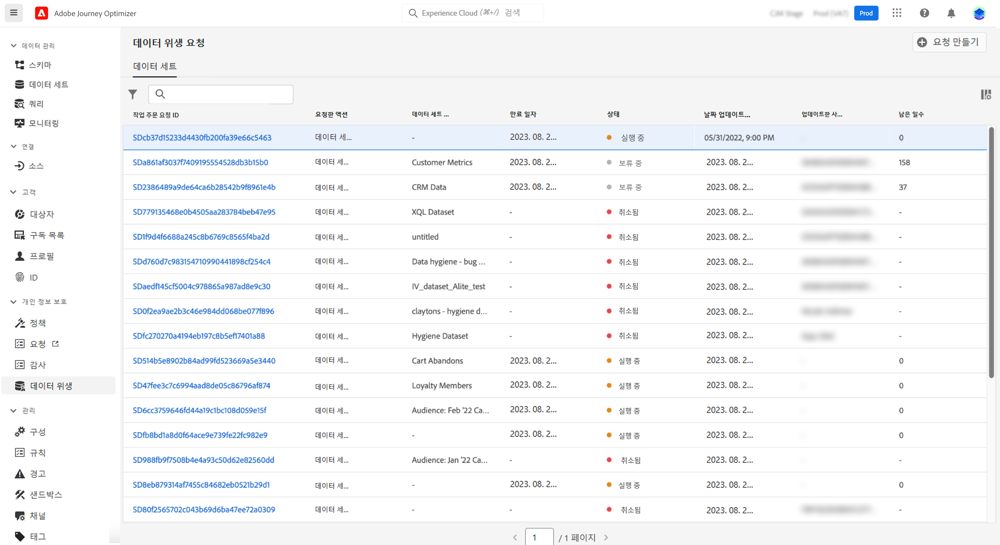

# 데이터 수명주기 작업 수행 {#data-hygiene}

>[!BEGINSHADEBOX]

**이 페이지에서 다루는 내용:** 데이터 수명주기 작업을 구성하고 예약하여 기록이 정확하게 유지되고, 의도된 용도로 사용되며, 조직 정책에 따라 삭제되도록 합니다.

>[!ENDSHADEBOX]

>[!AVAILABILITY]
>
>데이터 수명주기 기능은 현재 **Healthcare Shield**&#x200B;와 **Privacy and Security Shield** 추가 기능 서비스를 구매한 조직에만 제공됩니다.

Adobe Experience Platform에서는 데이터를 지속적으로 수집하므로 데이터를 의도한 대로 사용하고 필요할 때 업데이트하며 조직 정책에 따라 삭제하는 것이 더욱 중요합니다.

이 작업은 데이터 수명주기 작업을 구성하고 예약함으로써 기록을 적절하게 유지 관리하도록 도와주는 **[!UICONTROL 데이터 수명주기]** 메뉴를 사용하여 실행할 수 있습니다.

## 추천 {#data-hygiene-recommendations}

데이터 정리 작업(예: 신원 또는 데이터 세트 삭제)을 수행할 때는 삭제된 신원과 연결된 과거 게재 이벤트가 표준 보고 또는 데이터레이크 쿼리에 더 이상 표시되지 않게 된다는 점에 유의하십시오. 이로 인해 **전달됨**&#x200B;으로 보고되는 이메일 수와 수신자의 받은 편지함에서 **수신된** 이메일 수가 일치하지 않을 수 있습니다. 특히 오래된 여정의 경우 더 그럴 가능성이 높습니다.

대규모 삭제를 실행하기 전에 필요한 게재 또는 보고 데이터를 모두 확인하고 내보냅니다. 데이터 정리 작업 이후에 조정이 필요한 경우 Adobe 지원팀과 협력하여 아카이빙된 로그에 액세스하거나 최근 데이터에 [메시지 피드백 이벤트 데이터 세트] 쿼리를 사용하십시오.

## 자세히 알아보기 {#data-hygiene-learn-more}

Privacy Service 및 데이터 수명주기 작업을 수행하는 방법에 대한 자세한 내용은 Adobe Experience Platform 설명서를 참조하세요.

* [Privacy Service 개요](https://experienceleague.adobe.com/docs/experience-platform/privacy/home.html?lang=ko)
* [Adobe Experience Platform의 데이터 라이프사이클](https://experienceleague.adobe.com/docs/experience-platform/hygiene/home.html?lang=ko)
