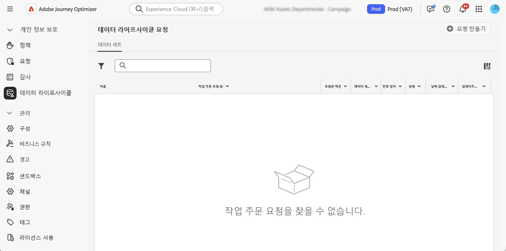

# 데이터 위생 작업 수행 {#data-hygiene}

>[!AVAILABILITY]
>
>주의 - 데이터 위생 기능은 현재 **Healthcare Shield**&#x200B;와 **Privacy and Security Shield** 추가 기능 서비스를 구매한 조직에만 제공됩니다.

Adobe Experience Platform에서는 데이터를 지속적으로 수집하므로 데이터를 의도한 대로 사용하고 필요할 때 업데이트하며 조직 정책에 따라 삭제하는 것이 더욱 중요합니다.

이 과제는 데이터 위생 작업을 구성하고 예약함으로써 기록을 적절하게 유지 관리하도록 도와주는 **[!UICONTROL 데이터 위생]** 메뉴를 사용하여 달성할 수 있습니다.

Privacy Service 및 데이터 위생 작업을 수행하는 방법에 대한 자세한 내용은 Adobe Experience Platform 설명서를 참조하십시오.

* [Privacy Service 개요](https://experienceleague.adobe.com/docs/experience-platform/privacy/home.html?lang=ko)
* [Adobe Experience Platform의 데이터 위생](https://experienceleague.adobe.com/docs/experience-platform/hygiene/home.html)
